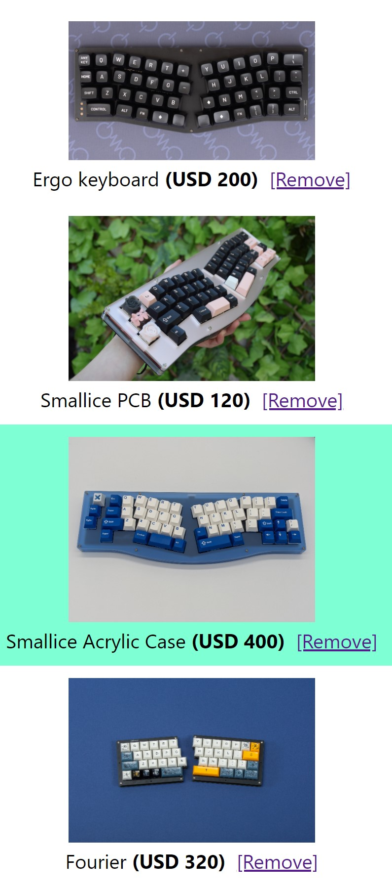

Хотя каждый, кто работал над проектом веб-разработки в прошлом, сталкивался с событием `onClick` (будь то использование React, Vue или даже Vanilla JS), выход за рамки базовой функциональности вызова простой функции для работы с объектом события не так уж тривиален.

В этой статье, основанной на примерах, я хочу быстро рассказать о различных способах отправки нескольких параметров в функцию обработки событий без необходимости продавать душу сатане.

## Пример использования

Давайте быстро рассмотрим пример использования, чтобы мы все были на одной странице. Представьте, что у вас есть список товаров в поддельной корзине, каждый товар имеет множество свойств, и при нажатии на одну из кнопок вам нужно удалить его из корзины. Однако проблема в том, что удалить его не так-то просто. Прежде чем удалить товар из списка, необходимо:

Убедиться, что товар находится в корзине не более часа. Если это произошло, клиент не сможет его удалить. Знаю, безумное правило, но это ненастоящий сценарий использования, так что давайте немного повеселимся, ладно? Обновите счетчик категорий, чтобы убедиться, что общая сумма верна.

Только после этого, если все в порядке, мы можем приступить к удалению товара из списка.

А вот и соответствующий код, с которым мы будем работать:

```js
import { useState } from "react";

const fakeItems = [
  {
    name: "Ergo keyboard",
    price: 200,
    pictureUrl:
      "https://images.squarespace-cdn.com/content/v1/5a8723cb7131a5121206d464/1625810188933-U8XTJAMWR8A0MJDJ32QA/lain_top.jpg?format=2500w",
    id: 1,
    category: 1,
    timeAdded: new Date(),
  },
  {
    name: "Smallice PCB",
    price: 120,
    pictureUrl:
      "https://images.squarespace-cdn.com/content/v1/5a8723cb7131a5121206d464/1617681008502-BJJPF8TRPN6LNTMUBROR/idi7pnppq0d61.jpg?format=2500w",
    id: 2,
    category: 2,
    timeAdded: new Date(),
  },
  {
    name: "Smallice Acrylic Case",
    price: 400,
    pictureUrl:
      "https://images.squarespace-cdn.com/content/v1/5a8723cb7131a5121206d464/1623041004115-JPO9UY3R357ZTPUAWM2D/PXL_20210601_203954893.PORTRAIT_2.jpg?format=2500w",
    id: 3,
    category: 3,
    timeAdded: new Date(),
  },
  {
    название: "Fourier",
    цена: 320,
    pictureUrl:
      "https://images.squarespace-cdn.com/content/v1/5a8723cb7131a5121206d464/1606189295901-T565PVE49OZXN9QK82LD/_RO_5289.jpg?format=2500w",
    id: 4,
    category: 4,
    timeAdded: new Date(),
  },
];

export default function ShoppingCart() {
  const [items, setItems] = useState(fakeItems);

  async function updateCategory() {
    // код, необходимый для проверки категории, находится здесь...
  }

  function checkTime() {
    // логика проверки времени находится здесь....
  }

  async function removeItem(id) {
    // прямо сейчас этой логике не хватает id категории
    // и времени вставки в корзину
    let categoryUpdate = await updateCategory();
    let timeCheck = checkTime();

    if (!categoryUpdate) {
      return console.log("Ошибка, категория не была обновлена");
    }

    if (!timeCheck) {
      return console.log(
        "Ошибка, товар находился в корзине слишком долго, теперь вы должны его купить"
      );
    }

    let newItems = items.filter((i) => i.id !== id);
    setItems(newItems);
  }

  return (
    <ul className="shopping-list">
      {items.map((i) => {
        return (
          <li key={i.id} className="shopping-list-item">
            
            <br />
            {i.name} <span className="price">(USD {i.price})</span> &nbsp;
            <a onClick={() => removeItem(i.id)} href="#">
              [Удалить]
            </a>
          </
```

Код, приведенный выше, будет выглядеть так, как показано на следующем изображении:



Конечно, это ни в коем случае не красивая корзина, но это список товаров, которые вы можете удалить на основе определенных условий. Этого вполне достаточно. Обратите внимание, что логика обновления категорий и проверки времени не реализована. Сейчас это не имеет значения, поэтому просто предположим, что она работает, а мы займемся окружающей логикой.

С учетом сказанного, первое, что следует отметить в коде, это то, что обработчик `onClick` в его нынешнем виде вызывает функцию `removeItem` с идентификатором элемента (`i.id`). Это очень распространенный способ передачи атрибута в функцию, однако одного атрибута недостаточно, нам нужно больше атрибутов, поэтому давайте посмотрим, какие у нас есть варианты.

# 1. Использование встроенной стрелочной функции

Следуя приведенному выше примеру, очень простой способ передачи нескольких атрибутов в обработчик - это вызов обработчика из встроенной стрелочной функции.

```js
async function removeItem(id, catId, timeAdded) {
	// прямо сейчас этой логике не хватает id категории
	// и времени вставки в корзину
	let categoryUpdate = await updateCategory(catId);
	let timeCheck = checkTime(timeAdded);

	if (!categoryUpdate) {
		return console.log('Ошибка, категория не была обновлена');
	}

	if (!timeCheck) {
		return console.log(
			'Ошибка, товар был в вашей корзине слишком долго, теперь вы должны его купить',
		);
	}

	let newItems = items.filter((i) => i.id != id);
	setItems(newItems);
}

return (
	<ul className="shopping-list">
		{items.map((i) => {
			return (
				<li key={i.id} className="shopping-list-item">
					
					<br /> {i.name} <span className="price">(USD {i.price})</span> &nbsp;
					<a
						onClick={() => {
							e.preventDefault();
							removeItem(i.id, i.category, i.timeAdded);
						}}
						href="#"
					>
						[Удалить]
					</a>{' '}
				</li>
			);
		})}
	</ul>
);
```

Код, добавленный в строке `onClick` на элементе `<a>`, определяет встроенную функцию-стрелку. Поскольку это определение функции, она не будет вызвана немедленно, но созданное закрытие позволяет вам получить доступ к деталям элемента, когда она будет вызвана. Этот метод работает, не поймите меня неправильно, однако он немного засоряет JSX-код бизнес-логикой для фронтенда, и если вам нужно передать много атрибутов, то эта строка может стать немного сложной для чтения. Вдобавок ко всему, нам также приходится вызывать метод `e.preventDefault`, чтобы событие клика не делало ничего, кроме того, что мы хотим. Это всего лишь мои придирки, но если вы спросите меня, я думаю, что есть менее ”грубые" способы сделать это. Иногда сокрытие логики может помочь сделать HTML более удобным. Итак, давайте вкратце рассмотрим альтернативные варианты.

# 2. Использование хука `useCallback`

Хук `useCallback` позволит нам немного очистить код и, кроме того, наша функция будет мемоизирована. Для целей данного примера второе преимущество не так важно, однако оно определенно является дополнительным бонусом. Код будет выглядеть следующим образом:

```js
export default function ShoppingCart() {
	// остальная логика компонента идет здесь...

	const removeHandler = useCallback(
		(id, catId, timeAdded) => {
			return async (e) => {
				e.preventDefault();

				// мы теперь можем все это делать прямо здесь!
				let categoryUpdate = await updateCategory(catId);
				let timeCheck = checkTime(timeAdded);

				if (!categoryUpdate) {
					return console.log('Ошибка, категория не была обновлена');
				}

				if (!timeCheck) {
					return console.log(
						'Ошибка, товар слишком долго находился в вашей корзине, теперь вы должны его купить',
					);
				}

				let newItems = items.filter((i) => i.id !== id);
				setItems(newItems);
			};
		},
		[items],
	);

	return (
		<ul className="shopping-list">
			{items.map((i) => {
				return (
					<li key={i.id} className="shopping-list-item">
						
						<br />
						{i.name}
						<span className="price">(USD {i.price})</span> &nbsp;
						<a onClick={removeHandler(i.id, i.category, i.timeAdded)} href="#">
							[Remove]
						</a>
					</li>
				);
			})}
		</ul>
	);
}
```

Код с этим хуком выглядит немного чище. Для начала, мы вызываем функцию непосредственно в обработчике `onClick`. Больше нет необходимости определять встроенную функцию стрелки, мы можем просто вызвать функцию и передать ей необходимые атрибуты. Эта новая функция вернет фактический обработчик, который, в свою очередь, получит объект Event, так что мы можем безопасно вызвать метод `e.preventDefault` из обработчика, а не прямо на HTML.

Это лучшая альтернатива уже потому, что мы абстрагируемся от создания функции-обработчика и того, как она должна взаимодействовать с событием. Однако мы можем еще немного очистить наш код, воспользовавшись атрибутами данных HTML. Так что давайте посмотрим.

# 3. Использование атрибутов данных

Атрибуты данных - это пользовательские атрибуты, которые вы можете добавить в HTML и которые по умолчанию будут полностью игнорироваться браузером, однако вы можете использовать их и получить к ним доступ через JavaScript. Суть в том, что вы можете ”встроить" атрибуты элемента корзины в HTML элемента вместо того, чтобы передавать их напрямую с помощью кода. Это отличный способ сохранить HTML как можно более "чистым". Вот как это будет выглядеть:

```js
export default function ShoppingCart() {
  //остальная логика компонента происходит здесь...
  const removeHandler = async (e) => { e.preventDefault()
  //захват атрибутов элемента
  let id = e.target.getAttribute("data-id") let catId = e.target.getAttribute("data-category") let timeAdded = e.target.getAttribute("data-timeadded") let categoryUpdate = await updateCategory(catId) let timeCheck = checkTime(timeAdded) if(!categoryUpdate) { return console.log("Ошибка, категория не была обновлена") } if(!timeCheck) { return console.log("Ошибка, товар находился в корзине слишком долго, теперь вы должны его купить") } let newItems = items.filter( i => i.id != id) setItems(newItems) } return ( <ul className="shopping-list"> {items.map( i => { return (<li key={i.id} className="shopping-list-item">  <br /> {i.name} <span className="price">(USD {i.price})</span> &nbsp; <a data-id={i.id} data-category={i.category} data-timeadded={i.timeAdded} onClick={ removeHandler } href="#"> [Remove] </a> </li>) })} </ul> ) }
```

Теперь посмотрите на HTML ссылки, вы можете увидеть 3 атрибута `data-`, содержащие значения, связанные с элементом. Обработчик `onClick` также выглядит намного чище, в него не нужно передавать никаких атрибутов, вам нужно только указать имя обработчика. Единственный атрибут, о котором вы заботитесь, это фактическийсобытие, которое React передаст вам. И через цель события вы можете увидеть, как мы используем метод `getAttribute` для получения нужной нам информации.

В результате мы получаем гораздо более чистый HTML, упрощенную логику и в целом код, который не только работает, но и гораздо легче читается и понимается.

В конце концов, то, как вы пишете код, имеет значение только для вас и вашей команды. В React нет единого способа передачи нескольких атрибутов обработчику `onClick`, и все возможные варианты выполняют свою работу, так что это вопрос понимания того, какие еще потребности у вас есть и чего вы пытаетесь достичь.

Если вам удалось решить эту проблему другим способом, следуйте за мной в Twitter по адресу @deleteman123 и поделитесь своим решением.
