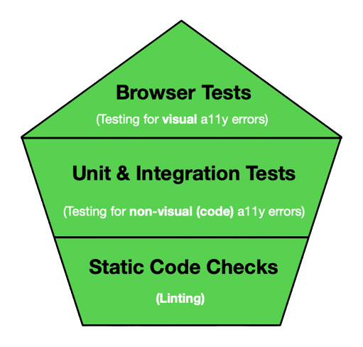
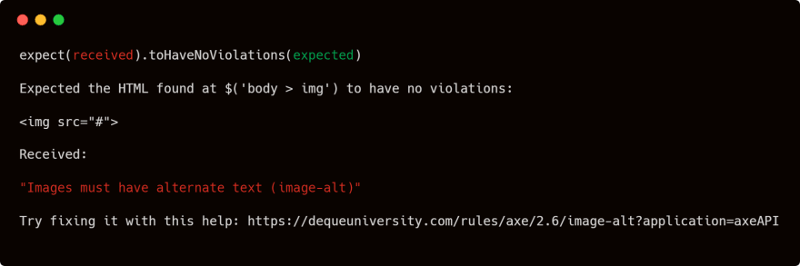
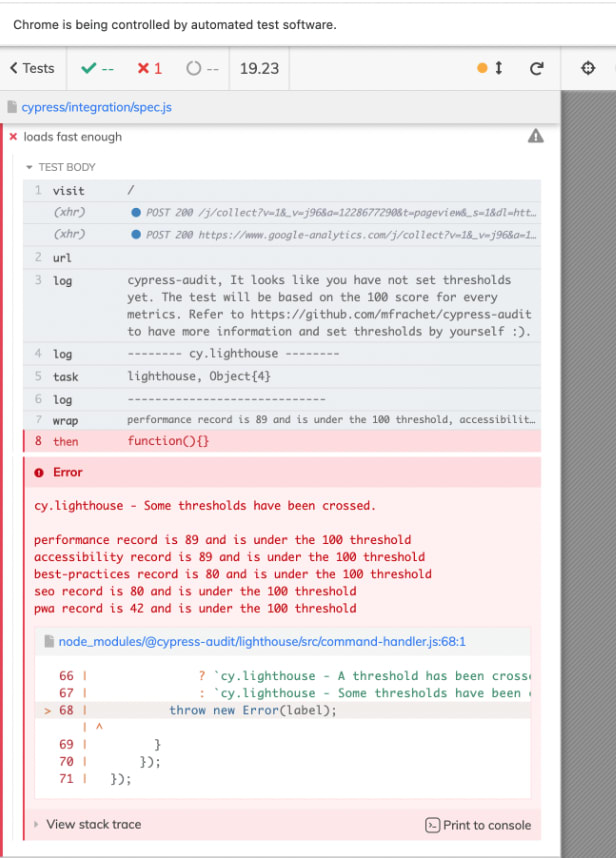
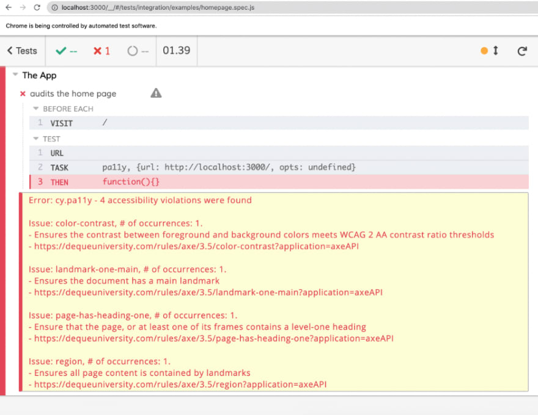

Прежде чем мы начнем, давайте пройдемся по некоторым определениям и вопросам:

## Что означает веб-доступность?

Веб-доступность означает, что веб-сайты, инструменты и технологии проектируются и разрабатываются таким образом, чтобы люди с ограниченными возможностями могли ими пользоваться. Точнее, люди могут понимать, ориентироваться и взаимодействовать с Интернетом.

## Почему “a11y”?

Это числительное, в котором “11” означает количество букв между “a” и “y”. Такую же концепцию можно встретить и в других словах из мира веб-разработок, например “i18n” (интернационализация).

Означает ли ”автоматизированное" тестирование доступности, что мне не нужно проводить ручное тестирование?

Нет. Были проведены исследования, которые показали, что, хотя оно и создает отличную базу, оно не покрывает всего того, что делает ручное тестирование. Разные исследования дают разные результаты по вопросу ”сколько всего покрывается?”. Deque пришел к выводу, что ~57 % проблем могут быть покрыты инструментами автоматизированного тестирования, такими как axe-core.

В этом посте мы расскажем о том, как автоматизировать тестирование доступности, объединив статические проверки кода, модульные и интеграционные тесты и браузерные тесты:



## Статические проверки кода

Подобно тому, как ”статичность" лежит в основе многих методологий тестирования, таких как Testing Trophy, то же самое можно сказать и об автоматизированной проверке доступности. Статический линтинг - это первая линия обороны, когда речь идет о выявлении распространенных нарушений доступности. Под линтингом понимается способ, с помощью которого программа анализирует код и отмечает потенциальные проблемы в соответствии с заранее определенными правилами.

Популярным отраслевым стандартом для решения этой задачи является плагин ESLint eslint-plugin-jsx-a11y.

Примечание: Если вы уже используете настройку Airbnb ESLint, то она включена по умолчанию. 🪄

Обратитесь к документации, чтобы настроить его, и вы будете получать предупреждения в вашей IDE, такие как:

У элементов img должен быть реквизит alt, либо с осмысленным текстом, либо с пустой строкой для декоративных изображений. eslint(jsx-a11y/alt-text)

Неплохое начало, но есть еще много интересного…

## Модульные и интеграционные тесты

Линтеры ищут стандартные HTML-элементы, такие как ``. Это означает, что если вы используете компонент `<Image />` из сторонней системы дизайна, такой как MaterialUI или Chakra, никаких проблем не будет отмечено. Сначала нам нужно отрендерить код в тестовый DOM, а затем просмотреть отрендеренный код.

Именно здесь на помощь приходит jest-axe. `jest-axe` - это пользовательский Jest matcher для Axe, который предоставляет функции для проверки рендеринга кода на соответствие стандартам Axe.

Вот пример ручного рендеринга изображения без тега alt:

```js
/**
 * @jest-environment jsdom
 */
const { axe, toHaveNoViolations } = require('jest-axe');
expect.extend(toHaveNoViolations);

it('должен продемонстрировать использование этого матчера', async () => {
	const render = () => '';
	const html = render();
	expect(await axe(html)).toHaveNoViolations();
});
```

…и как выглядит сообщение об ошибке, которое вы получите:



Используя эти знания, мы можем создать тест верхнего уровня для React `App` и использовать метод `toHaveNoViolations`:

```js
import { axe, toHaveNoViolations } from 'jest-axe';
import { render } from '@testing-library/react';
import App from '../App';

expect.extend(toHaveNoViolations);

it('не должно быть нарушений доступности, пойманных jest-axe', async () => {
	const { container } = render(<App />);
	const results = await axe(container);
	expect(results).toHaveNoViolations();
});
```

Примечание: это специфический пример для React, но есть также поддержка Vue с библиотекой Vue Testing Library, Angular с Nx и т.д.

Тест будет провален, если в отрисованном коде будут обнаружены нарушения, и наоборот, если он не обнаружит никаких проблем, тест будет пройден ✅.

## Браузерные тесты

Последний, но не менее важный способ автоматизации проверки доступности - это браузерные тесты с помощью таких решений, как cypress-audit. Используя `cypress-audit`, вы можете запускать аудит Lighthouse и Pa11y прямо в своих тестовых наборах E2E.

Инструкции по установке/настройке смотрите в документации, так как они зависят от вашей текущей настройки, но в целом базовая настройка `cypress.config.js` может выглядеть примерно так:

```js
const { lighthouse, prepareAudit } = require('@cypress-audit/lighthouse');
const { pa11y } = require('@cypress-audit/pa11y');

module.exports = {
	e2e: {
		baseUrl: 'http://localhost:3000',
		setupNodeEvents(on, config) {
			on('before:browser:launch', (browser = {}, launchOptions) => {
				prepareAudit(launchOptions);
			});

			on('task', {
				lighthouse: lighthouse(),
				pa11y: pa11y(),
			});
		},
	},
};
```

Этот пост основан на a11y, но стоит упомянуть, что для Lighthouse вы можете указать пороговые значения для других вещей, таких как производительность и SEO, подобным образом:

```js
it("следует проверять показатели маяка с пороговыми значениями", function () {
  /./ Для каждого из них вы можете указать любой порог, который вам нужен
  cy.lighthouse({
    performance: 100,
    accessibility: 100, // Это специфический для a11y параметр
    "best-practices": 100,
    seo: 100,
    pwa: 100,
  });
});
```

…в результате вы получите отчет примерно следующего вида:



Аналогично для Pa11y (вам нужно будет обновить `cypress.config.js` в соответствии с документацией), который также сгенерирует отчет для вас и отметит любые нарушения доступности:



Если вы не используете Cypress, то lighthouse-ci и pa11y-ci - отличные альтернативы, которые можно использовать для прямой автоматизации проверок доступности.

Вот и все! 🪄 Это 3 основных столпа при работе с автоматизированной a11y. Обязательно ознакомьтесь с документами, ссылки на которые приведены в статье, для получения дополнительной информации (слишком много всего, чтобы уместить в одной статье!). И помните, что доступность - это не просто приятная мелочь, а зачастую законность.
