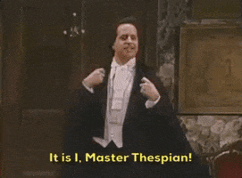
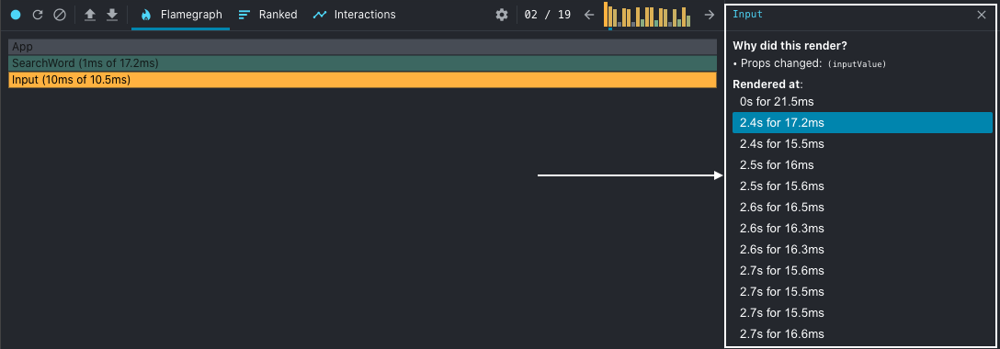

Нет ничего хуже, чем видеть пустую белую страницу или бесконечное вращающееся колесо при загрузке сайта или приложения. К счастью, большинство современных сайтов и приложений сегодня используют скелетные компоненты, чтобы уменьшить наше беспокойство и разочарование.

В этой статье мы поговорим о скелетных компонентах - что это такое, почему они важны и как их применять.

## Что такое скелетный компонент?

Когда экран или веб-страница загружается, скелетные компоненты - это элементы-заместители, которые пользователь видит до загрузки фактического содержимого.

Как правило, существует 2 типа скелетных компонентов:

Замещающие элементы содержимого Замещающие элементы цвета

Держатели содержимого - это обычно светло-серые квадратики и кружочки, которые можно увидеть на таких сайтах, как YouTube, Medium, Facebook и т. д. Этим плейсхолдерам не нужны никакие данные, и они служат только для имитации того, как выглядит страница. Например, ниже приведен пустой скелет контента placeholders в YouTube. 

С другой стороны, цветные плейсхолдеры имитируют не только размер и форму реального пользовательского интерфейса, но и цвет. Для создания таких держателей потребуется предварительная детализация пользовательского интерфейса, и их реализация может быть более сложной. А вот пример цветовых плейсхолдеров от Pinterest.


## Важность скелетных компонентов

Наличие скелетных компонентов часто считается хорошей практикой UI/UX, поскольку они дают пользователю информацию о том, как контент отображается на экране.

Кроме того, было доказано, что скелетные компоненты делают сайт более полным, быстрым и отзывчивым по сравнению с пустым экраном или экраном “Loading…”.

Анимированные скелетные компоненты также могут улучшить пользовательский опыт. Анимированные скелетные компоненты, напоминающие волны слева направо, могут загружаться быстрее, чем статичные. Ниже приведен пример анимированного скелетного компонента.


Теперь, когда мы узнали, почему внедрение скелетных компонентов может быть полезным для ваших сайтов, давайте рассмотрим 3 распространенных способа добавления скелетного пользовательского интерфейса в приложения React.

### 1. Материальный пользовательский интерфейс

В Material UI есть компоненты под названием Skeleton, которые используются непосредственно в вашем приложении. Типичный способ использования - условный рендеринг, при котором компонент Skeleton показывается, если данные еще не загружены.

```js
import Skeleton from '@mui/material/Skeleton'; export default function App() { const item =
//какая-нибудь функция выборки здесь
return ({ item ? (  ) : ( <Skeleton variant="rectangular"/> ); }) }
```

Что делает Material UI действительно удобным, так это то, что очень легко настроить размер, форму и цвет компонента Skeleton. Кроме того, он поддерживает 2 варианта анимации: импульс и волну, что также поможет улучшить скорость восприятия вашего приложения.

Пример импульсной анимации: 

### 2. Скелет загрузки React

Помимо Material UI Skeleton, есть и другие отличные альтернативы, например, пакет `react-loading-skeleton`.

Он начинается с простой установки:

```sh
yarn add react-loading-skeleton npm install react-loading-skeleton
```

Затем, после простого импорта, вы можете визуализировать SkeletonTheme для стилизации всех компонентов Skeleton под нее или добавить реквизиты в отдельные компоненты Skeleton для их стилизации.

```js
import Skeleton, { SkeletonTheme } from 'react-loading-skeleton' return ( <SkeletonTheme baseColor="#202020" highlightColor="#444">  <Skeleton count={3} />  </SkeletonTheme> )
```

Эта библиотека предлагает простой и минималистичный API с поддержкой анимации и тематического оформления. Ее легко освоить и внедрить новичкам.

Хотя она не предлагает большого количества настроек для более сложных приложений, ее более чем достаточно для приложений, которым нужны только простые формы, такие как прямоугольники и круги, в качестве пользовательского интерфейса.

### 3. React Content Loader

Если вы ищете библиотеку, которая может поддерживать сложные формы в качестве скелетных компонентов, то остановите свой выбор на `react-content-loader`.

Она предлагает множество способов стилизации, компоновки, анимации, придания формы и размера скелетных компонентов, необходимых для вашего приложения. Поскольку это API на основе SVG, он поддерживает любые SVG-фигуры для вашего скелета.

Кроме того, в нем есть игровая площадка для предварительного просмотра скелетного пользовательского интерфейса и копирования кода непосредственно в ваше приложение. Также есть предустановки, такие как facebook, instagram и т. д., если в вашем приложении реализован похожий макет.

Скриншот игровой площадки из <https://skeletonreact.com/>: 

Обратите внимание, что эта библиотека требует от вас создания скелетных компонентов для каждого компонента приложения в отдельности. Это может быть утомительно, а настройка компонентов с помощью SVG может оказаться довольно сложной задачей для начинающих разработчиков.

Например, ниже приведен простой скелетЭкран eton и его построение с помощью `react-content-loader`.


```js
import ContentLoader from "react-content-loader" export default const MyLoader = (props) => ( <ContentLoader speed={2} width={476} height={124} viewBox="0 0 476 124" backgroundColor="#f3f3f3" foregroundColor="#ecebeb" {...props} > <rect x="48" y="8" rx="3" ry="3" width="88" height="6" /> <rect x="48" y="26" rx="3" ry="3" width="52" height="6" /> <rect x="0" y="56" rx="3" ry="3" width="410" height="6" /> <rect x="0" y="72" rx="3" ry="3" width="380" height="6" /> <rect x="0" y="88" rx="3" ry="3" width="178" height="6" /> <circle cx="20" cy="20" r="20" /> </ContentLoader> )
```

Подводя итог, можно сказать, что скелетные компоненты являются неотъемлемой частью пользовательского опыта. Они создают иллюзию скорости загрузки данных и дают представление о том, как выглядит страница до ее загрузки.

Хотя в этой статье я показал только 3 простых способа реализации скелетных компонентов, существует еще множество вариантов со своими плюсами и минусами. Кроме того, вы можете создать свои собственные скелетные компоненты с помощью базового CSS. Важно изучить и найти тот вариант, который больше всего подходит для ваших нужд.

Спасибо за чтение, надеюсь, оно было полезным. Если вы уже пользовались этими библиотеками, опишите в комментариях ниже, какая из них вам понравилась больше. Будьте здоровы!
