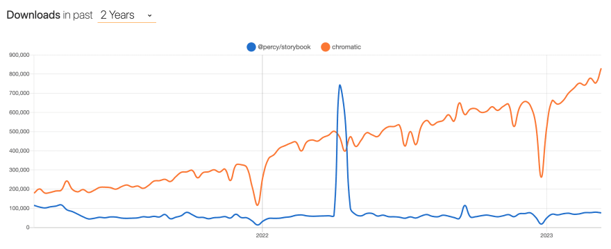

Прежде чем мы начнем, давайте обсудим несколько вопросов:

## Что означает визуальное регрессионное тестирование?

Визуальное регрессионное тестирование - это процесс сравнения внешнего вида пользовательского интерфейса приложения между двумя различными версиями, чтобы убедиться в отсутствии непреднамеренных визуальных изменений. Этот процесс включает в себя создание скриншотов различных элементов пользовательского интерфейса и сравнение их с ранее сделанными скриншотами для выявления любых изменений в визуальном виде. Визуальное регрессионное тестирование помогает убедиться в том, что пользовательский интерфейс приложения остается неизменным и визуально привлекательным на различных устройствах, в браузерах и операционных системах.

## Почему его следует автоматизировать?

Автоматизация визуального регрессионного тестирования помогает выявить проблемы пользовательского интерфейса на ранних этапах разработки, что позволяет сэкономить значительное количество времени и денег, которые в противном случае могли бы быть потрачены на исправление проблем на более поздних этапах. Подумайте о времени (и, соответственно, деньгах), которое тратится на исправление причуд пользовательского интерфейса, выявленных в Q/A, UAT или на производстве. Почему бы вам не автоматизировать отлов этих визуальных ошибок?

## А как насчет ручных визуальных проверок?

Хотя вы можете выполнять визуальные проверки вручную, не рекомендуется полагаться только на них, поскольку это занимает значительно больше времени по сравнению с использованием автоматизированного пакета. Выявить различия в пользовательском интерфейсе может быть непросто, даже если речь идет о малозаметных визуальных ошибках. Посмотрите на пример ниже - сможете ли вы заметить 8 отличий? Возможно. Но это займет у вас гораздо больше времени, чем использование автоматизированного пакета.

## Какой процент визуальных ошибок отлавливается автоматизированными визуальными регрессионными тестами?

Исследования из различных источников (BrowserStack, AppliTools и т. д.) показывают, что автоматизированное визуальное регрессионное тестирование способно выявить большинство визуальных ошибок, причем процент успеха составляет от 95 до 99 %, в зависимости от сложности приложения и используемого процесса тестирования.

В этой статье мы рассмотрим 4 популярные библиотеки для автоматизации визуального регрессионного тестирования: Chromatic, Percy, Jest Image Snapshot, BackstopJS.

## Chromatic

Chromatic - это инструмент визуального регрессионного тестирования, разработанный специально для Storybook. Chromatic представляет собой облачную платформу, которая позволяет пользователям тестировать и управлять компонентами пользовательского интерфейса проекта, гарантируя, что любые изменения не приведут к неожиданным визуальным изменениям.

### Кто использует Chromatic?

Adobe, Auth0, CircleCI, GOV.UK, BBC и др.

Плюсы Chromatic

- Простая интеграция: Созданный специально для Storybook (разработчиками Storybook!), он легко настраивается для вашей библиотеки компонентов или системы дизайна.

- Командная работа: Chromatic предоставляет платформу для совместной работы команды, позволяя делиться результатами тестирования с членами команды, оставлять комментарии и обсуждать любые проблемы.

- Анализ сборки: Chromatic предоставляет подробный анализ сборки, показывая, какие изменения были сделаны, кто их сделал и как они повлияли на ваши компоненты пользовательского интерфейса.

Минусы Chromatic

- Ограниченные возможности настройки: Хотя пользовательский интерфейс Chromatic разработан так, чтобы быть простым в использовании, он не может предложить такую же гибкость или настройку, как другие инструменты визуального регрессионного тестирования.

- Цена: Chromatic предлагает бесплатный тарифный план с неограниченным количеством сотрудников и сюжетных книг. Однако бесплатный уровень имеет ограничение в 5 000 снимков в месяц, поэтому стоит подумать, будет ли первый уровень (149 долларов в месяц) доступен для вашей команды, если вы думаете, что превысите этот лимит. Дополнительную информацию о ценах можно найти здесь.

- Отсутствие возможности локального тестирования: В настоящее время Chromatic не предлагает возможности тестирования визуальных изменений на локальной машине перед их развертыванием на сервере, что может стать ограничением для некоторых команд.

## Перси

Percy - это универсальная платформа для визуального обзора, которая предлагает широкий спектр функций и интеграций. Она была приобретена компанией BrowserStack, которая является лидером в области тестирования приложений и браузеров. Percy помогает разработчикам выявлять визуальные регрессии, упрощает процесс рецензирования и позволяет командам легко сотрудничать и отслеживать изменения.

### Кто использует Percy?

Google, Sentry, Shopify, Fastly, Basecamp и др.

Плюсы Percy

- Универсальность и гибкость: Percy можно использовать для визуального регрессионного тестирования в широком спектре приложений, помимо Storybook. Percy обладает расширенными возможностями, такими как кросс-браузерное тестирование, интеграция с популярными фреймворками для тестирования и мощный API, который позволяет более широко настраивать и контролировать процессы тестирования.

- Масштабируемость: Percy очень хорошо масштабируется, что позволяет легко управлять визуальными регрессионными тестами даже в самых крупных проектах.

- Сотрудничество: Percy предоставляет широкий спектр инструментов для совместной работы, включая функции комментирования и совместного использования, которые позволяют разработчикам работать вместе, чтобы быстро находить и решать проблемы.

Минусы Percy

- Ограниченная настройка: Некоторые пользователи могут обнаружить, что готовые настройки и функции Percy не отвечают их специфическим потребностям в тестировании, поскольку возможности настройки ограничены.

- Зависимость от внешнего сервиса: Поскольку Percy является облачным инструментом, разработчикам придется прибегать к услугам внешних провайдеров для размещенияи обслуживание платформы, что может привести к появлению дополнительных зависимостей и потенциальных точек отказа.

- Цены: Percy предлагает бесплатный тарифный план с неограниченным количеством участников и книг историй. Однако бесплатный уровень имеет ограничение в 5 000 снимков в месяц, поэтому стоит подумать о том, по карману ли вашей команде первый уровень, если вы считаете, что превысите этот лимит. Дополнительную информацию о ценах можно найти здесь.

## Какое облачное решение выбрать для Storybook?

На мой взгляд, я бы выбрал Percy, если бы уже использовал/планировал использовать его для других визуальных регрессионных тестов (например, в тестовых наборах Cypress E2E), чтобы ваши визуальные регрессионные тесты были объединены в единую платформу. С другой стороны, если бы мне нужно было выполнять визуальные регрессионные тесты только для Storybook, я бы выбрал Chromatic. Chromatic специально разработан для Storybook его сопровождающими, что делает его более совместимым и перспективным. Поскольку Chromatic оптимизирован исключительно для Storybook, он лучше интегрируется с платформой и обеспечивает более рациональный рабочий процесс.

Тенденции NPM в отношении `@percy/storybook` и `chromatic`, похоже, указывают на то, что большинство людей пришли к такому же выводу:

## Снимок шуточного изображения

Jest Image Snapshot - это инструмент визуального регрессионного тестирования, созданный для Jest. Он позволяет разработчикам делать снимки отрисованных компонентов или элементов и сравнивать их с ранее сохраненными изображениями, чтобы проверить наличие визуальных различий или изменений. Он работает путем рендеринга компонента или элемента и генерации изображения отрисованного результата с помощью безголового браузера. Сгенерированное изображение затем сравнивается с ранее сохраненным изображением с помощью сравнения пиксель в пиксель, и если обнаружены какие-либо различия, Jest сообщит о неудачном тесте.

### Кто использует Jest Image Snapshot?

American Express и др.

Плюсы Jest Image Snapshot

- Простота использования: Jest Image Snapshot прост в настройке и использовании, что делает его доступным для разработчиков с любым уровнем опыта. Он легко интегрируется с Jest, популярным фреймворком для тестирования, и не требует дополнительной настройки.

- Независимость: Jest Image Snapshot можно использовать локально, без привлечения внешнего сервиса, что делает его более удобным и экономичным решением для разработчиков, предпочитающих тестировать и отлаживать свои приложения локально.

- Ценообразование: Это проект с открытым исходным кодом, и он на 100% бесплатный.

Недостатки Jest Image Snapshot

- Накладные расходы на производительность: Локальное визуальное регрессионное тестирование может быть ресурсоемким, а запуск тестов может замедлить процесс разработки, особенно в масштабных проектах.

- Зависимость от Jest: Как следует из названия, Jest Image Snapshot тесно интегрирован с фреймворком тестирования Jest, что может не подойти для команд, использующих другие фреймворки тестирования.

- Ограниченные возможности настройки: Хотя Jest Image Snapshot прост в настройке и использовании, он предлагает не так много вариантов конфигурации, как другие инструменты визуального регрессионного тестирования. Это может быть ограничением для команд, которым требуется большая гибкость в тестировании.

## BackstopJS

BackstopJS - это инструмент визуального регрессионного тестирования веб-приложений с открытым исходным кодом, который автоматизирует процесс сравнения скриншотов текущего состояния веб-приложения с его предыдущей версией для выявления любых визуальных изменений. Он использует автоматизацию безголового браузера для имитации взаимодействия с пользователем и делает скриншоты веб-страниц. BackstopJS можно настроить для тестирования нескольких страниц и отзывчивого дизайна в нескольких видовых экранах. Он также поддерживает аутентификацию пользователей и может быть интегрирован с различными конвейерами CI/CD. BackstopJS использует конфигурационный файл для определения тестируемых URL, видовых экранов и других настроек.

Плюсы BackstopJS

- Гибкая конфигурация: BackstopJS обладает широкими возможностями настройки, что делает его подходящим для тестирования различных типов приложений с различными визуальными требованиями. Он позволяет определять пользовательские сценарии, устанавливать различные окружения и настраивать параметры для достижения желаемого уровня тестирования.

- Мощные сравнения: BackstopJS предоставляет мощный механизм сравнения изображений, который обнаруживает даже самые незначительные визуальные различия. Он использует попиксельное сравнение и пороговые значения, чтобы определить, является ли изменение достаточно значительным, чтобы считать его сбоем.

- Цена: Это проект с открытым исходным кодом, и он на 100% бесплатный.

Минусы BackstopJS

- Сложность: BackstopJS требует больше конфигураций и настроек по сравнению с другими инструментами визуальной регрессии, что может сделать его более сложным для внедрения.

- Медленное тестирование: BackstopJS может работать медленнее, чем другие инструменты визуальной регрессии, из-за того, как он генерирует и сравнивает скриншоты.

- Ограниченная поддержка: Хотя BackstopJS имеет документацию и поддержку сообщества, она может быть не такой надежной, как у других инструментов с более крупной базой пользователей и более развитой сетью поддержки (например, Percy).

В заключение следует отметить, что каждый инструмент предлагает уникальные возможности и преимущества, а также потенциальные недостатки. Выбор того или иного инструмента для визуального регрессионного тестирования зависит отзависит от различных факторов, таких как требования проекта, предпочтения команды и доступные ресурсы. При выборе каждого инструмента существуют компромиссы, и решение зависит от того, какие факторы наиболее важны для вашего проекта.

На мой взгляд, Percy предлагает наиболее полное и удобное решение, что делает его отличным вариантом для команд, которым нужен продвинутый инструмент. Chromatic - подходящий вариант для команд, которым нужно протестировать только библиотеку Storybook, в то время как BackstopJS лучше подходит для команд, которым нужны более широкие возможности тестирования. Jest Image Snapshot - хороший вариант для разработчиков, работающих над небольшими проектами, в которых используется Jest.

В конечном счете, включение автоматизированного визуального регрессионного тестирования в процесс разработки очень важно для раннего выявления дефектов пользовательского интерфейса и обеспечения высокого качества пользовательского опыта на вашем сайте или в приложении.
