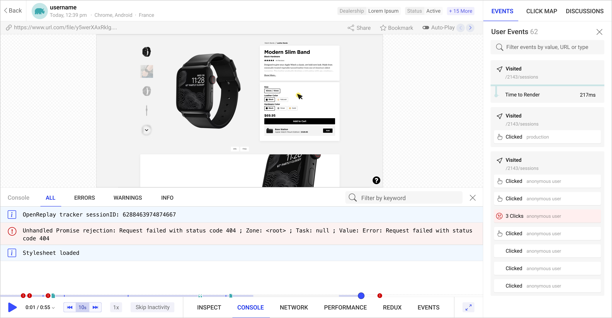

Open-Source работает, когда каждый вносит свой вклад, в противном случае это личный проект, который случайно стал достоянием общественности. Но как разработчики мы часто думаем, что единственный способ помочь проекту - это наш код, и это может быть пугающей мыслью, особенно если вы только начинаете. Именно поэтому многие начинающие разработчики не хотят идти в мир Open-Source, в конце концов, почему их код должен быть достаточно хорош, чтобы быть принятым в ряды таких проектов, как React.JS или Vue? Верно?

Не совсем так, на самом деле, как младший разработчик, ваш код не менее валиден, но я понимаю, что не каждый проект может быть адаптирован под ваш уровень мастерства. Тем не менее, кодинг - это не единственный способ, которым вы можете внести свой вклад в любимый Open-Source проект. И в этой статье я покажу вам 4 способа, как вы можете это сделать, не написав ни строчки кода.

## 1. Через сообщения об ошибках

Это может показаться не очень важным, но как пользователь проекта вы несете большую ответственность за то, чтобы сообщать его сопровождающим о проблемах. Почему? Потому что вы можете быть первым, кто столкнулся с этой проблемой или даже использовал продукт таким образом. Сообщая о своих находках, вы помогаете кодерам многое понять о том, как пользователи используют их продукт. И давайте посмотрим правде в глаза, это бесплатно и, вероятно, займет у вас меньше 5 минут, почему бы и нет?

При написании отчета об ошибке учитывайте следующее:

Поищите рекомендации в файле Readme.md. Обычно в документации проектов есть раздел, посвященный сообщениям об ошибках. Если там ничего нет, скорее всего, там есть шаблоны для типов тикетов, которые вы можете создать. Убедитесь, что вы заполнили их как можно более подробно. Потому что фраза ”У меня не работает библиотека" не является правильным сообщением об ошибке. Основной отчет должен содержать, по крайней мере, четкие шаги по воспроизведению, номер версии и соответствующие зависимости (с указанием их версий), ожидаемый результат и фактически полученный результат.

Не сообщайте об ошибке и не забывайте о ней. Иногда сопровождающим может потребоваться дополнительная информация или они могут попросить вас выполнить несколько команд и сообщить о результатах. Поскольку они не могут войти в ваш компьютер и провести тесты, им может потребоваться локальное устранение неполадок, так что, возможно, оставьте вкладку открытой на некоторое время, прежде чем совсем отказаться от нее.

Не требуйте устранения проблемы. Послушайте, я понимаю, вы используете их проект для своего собственного проекта и не можете продвигаться вперед с ошибкой в нем. Прекрасно, но это не дает вам права требовать что-либо от команды разработчиков, работающих бесплатно, чтобы вы могли заставить свой проект работать. Вместо этого, если это ваша ситуация, попробуйте форкнуть проект и найти собственное решение. Таким образом вы даже сможете попытаться отправить PR и внести свой вклад в код.

Предоставьте визуальную помощь, если это необходимо. Если ваша ошибка также влияет на презентацию приложения, вместо того чтобы говорить ”это выглядит неправильно", предоставьте скриншот, чтобы они могли увидеть, как именно проявляется проблема. Помните фразу "картинка стоит 1000 слов"? С таким же успехом это мог бы сказать сопровождающий открытого кода.

Если вы являетесь активным пользователем проекта, в который хотите внести свой вклад, сообщение об ошибках может стать одним из самых простых способов начать вносить в него свой вклад.

## 2. Написание технических статей об этом

Проекты с открытым исходным кодом во многом зависят от своего сообщества. Если их пользователи не будут активно рассказывать об этих проектах, то, скорее всего, они не будут развиваться.

Один из основных способов, с помощью которого вы можете внести свой вклад в развитие проекта с открытым исходным кодом, - это распространение информации о нем.

Как вы можете это сделать? Через написание статей! Написание статей в Интернете бесплатно, вы можете охватить множество других разработчиков одной статьей и рассказать им о своем любимом проекте с открытым исходным кодом, почему он такой классный и почему они должны с ним ознакомиться. Такие платформы, как Medium.com, DZone.com, Hashnode, Dev.to и многие другие, позволяют охватить тысячи людей с помощью одной статьи.

Разумеется, чем лучше статья, тем больше шансов, что она дойдет до большего числа разработчиков и убедит их проверить проект, о котором вы пишете. А это может быть непросто, если вы никогда раньше не писали в Интернете. Если вы хотите узнать структуру хорошей технической статьи, вы можете прочитать мой подробный обзор здесь, но, по сути, вы должны помнить следующее:

Напишите вступление, которое привлечет внимание ваших читателей. Например, начните с общей проблемы, которую можно решить с помощью проекта, о котором вы собираетесь рассказать. Убедитесь, что основная часть статьи, где вы переходите к деталям, не слишком длинная и не слишком скучная для чтения. Приводите примеры, старайтесь писать непринужденно и не используйте слишком сложные термины, если в этом нет необходимости. Помните, что это не научная работа, а статья, призванная распространить информацию о проекте с открытым исходным кодом. Не забудьте написать заключительный раздел, в котором вы подведете итог всему, что было сделано.и попросите читателя поделиться статьей в Интернете, надеясь, что это поможет и вам распространить информацию.

Писать может быть страшно, если вы никогда не занимались этим раньше, но это отличный способ помочь проектам органично расширить свой охват.

## 3. Обучение через проект с открытым исходным кодом

Написание статей - это один из способов, но есть много других, с помощью которых вы можете научить других пользоваться проектом, которому пытаетесь помочь.

Вам не нравится писать? Тогда, возможно, стоит подумать о создании онлайн-видео. Бесплатная и очень известная платформа для этого - Youtube. Вы можете начать с презентации Google (или PowerPoint PPT, если вы из тех людей) и программы для записи экрана, например OBS, которая не только позволяет записывать экран, но и может записывать вашу собственную камеру и захватывать звук в то же время. Вам не нужно знать, как сделать что-то особенное, просто выберите источники входного сигнала, которые вы хотите сделать активными (то есть камеру или экран), и нажмите ”начать запись".

Когда вы закончите, вы можете отредактировать видео с помощью бесплатного программного обеспечения, например LightWorks, а затем загрузить конечный файл на Youtube или предпочитаемую вами видеоплатформу.

Используйте видеоролики, чтобы рассказать о проекте, которому вы помогаете. Убедитесь, что их интересно смотреть, поэтому уделите некоторое время визуальному оформлению, используйте свой голос (не просто пишите текст под музыку) и подумайте о том, чтобы добавить свое лицо. Последнее может помочь зрителям установить с вами контакт и прийти еще.

Хотите поднять свое преподавание на новый уровень? Тогда рассмотрите возможность использования одной из крупных платформ онлайн-курсов, таких как Udemy.com, Educative.io, Coursera.org и другие. У каждой из них свои условия, и вы также сможете заработать на этом.

## 4. Предоставить переводы

Интернационализация - большая проблема для проектов с открытым исходным кодом, потому что для предоставления языковых файлов нужны люди, которые действительно говорят на этом языке. Вы не можете просто обратиться к Google Translate и на этом закончить, хотя сервис и замечательный, он не идеален, и в итоге ваш проект будет иметь очень смешные варианты меню и заголовков окон.

Если вы случайно знаете язык, который еще не был охвачен, подумайте о том, чтобы обеспечить его соответствующим переводом. Даже если для этого нет открытых тикетов, Pull Request, добавляющий возможность охватить совершенно новую аудиторию, - это PR, который понравится сопровождающим.

Даже если это, скорее всего, не Pull Request на кодирование, не забудьте как следует изучить их руководство по внесению вкладов (скорее всего, вы найдете ссылку на него в файле Readme.md в корне репозитория), прежде чем вносить какие-либо изменения. Там могут быть объяснения и некоторые соображения, которые могут быть применимы и к некодирующим вкладам.

## Заключение

Возможно, ни один из этих вариантов не кажется вам как разработчику привлекательным или интересным, но подумайте о том, что если ваша цель - помочь проекту с открытым исходным кодом, то вы, вероятно, делаете больше, чем может сделать любой кодовый PR. Вы помогаете распространять информацию о проекте, тем самым помогая ему охватить других и развивая сообщество вокруг него. Подобный вклад так же важен и ценится, как и время, потраченное на написание кода для новой функции или исправление ошибки, поэтому не стоит пренебрегать им как бесполезным только потому, что он не связан с кодом.

