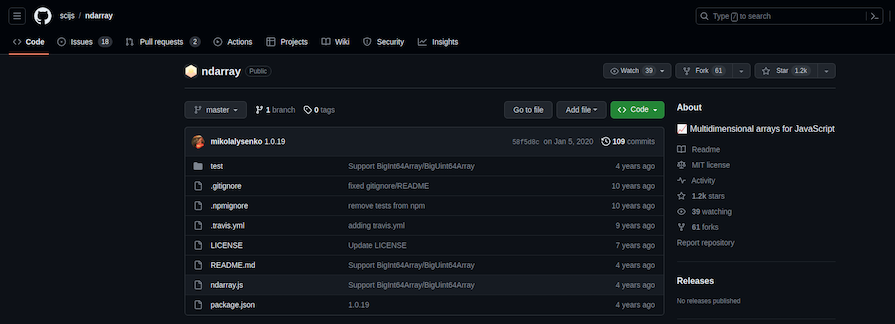
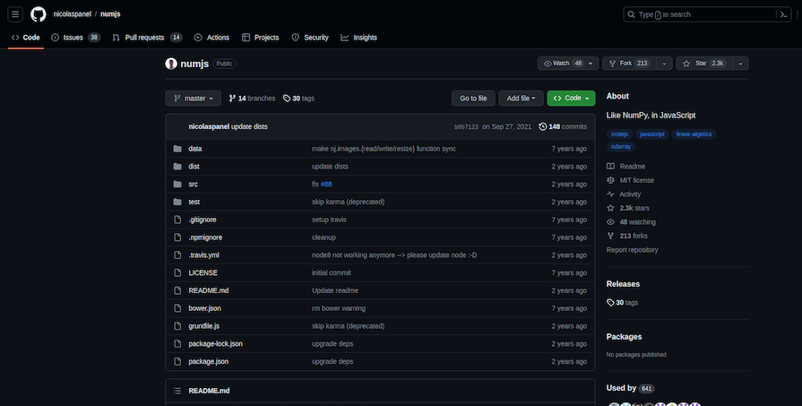

JavaScript, благодаря своей универсальности и широкому распространению, является языком, который можно применять для решения широкого круга задач. Когда дело доходит до работы с многомерными массивами, JavaScript не хватает встроенных возможностей, которые предоставляют другие языки программирования.


Однако благодаря активной экосистеме и растущему сообществу разработчиков существуют различные библиотеки, которые помогут вам эффективно управлять и манипулировать многомерными массивами. В этой статье мы рассмотрим пять лучших библиотек для работы с многомерными массивами на JavaScript. Давайте погрузимся в процесс.

## Что такое многомерный массив?

Многомерный массив - это структура данных в программировании, которая организует элементы в несколько строк и столбцов или измерений, образуя сетку или матрицу, подобную структуре. Многомерный массив позволяет эффективно хранить и обрабатывать данные в табличном или сетчатом формате.

Двумерный массив, например, похож на таблицу со строками и столбцами, а трехмерный - на куб со слоями. Многомерные массивы широко используются в различных приложениях, включая численные вычисления, обработку изображений и отображение структурированных данных, что делает их бесценным инструментом программирования.

## ndarray



ndarray - это надежная библиотека JavaScript, созданная исключительно для манипулирования n-мерными массивами. Эта библиотека - фантастический выбор, если ваш проект требует численных вычислений. Она полезна для научных и инженерных приложений, поскольку поддерживает широкий спектр манипуляций с массивами и математических операций.

ndarray позволяет легко создавать, изменять и выполнять операции над массивами любой размерности.

Вот пример кода, в котором используется ndarray:

```javascript
const ndarray = require('ndarray');

// Создание двумерного массива
const data = ndarray(new Float64Array([1, 2, 3, 4, 5, 6]), [2, 3]);

console.log(data.get(0, 1)); // Выходные данные: 2

// Выполняем операции
data.add(10); // Добавляем 10 ко всем элементам

// Выводим обновленный массив
console.log(data.data);

// Выходные данные:
Float64Array[(11, 12, 13, 14, 15, 16)];
```

Благодаря низкоуровневому манипулированию массивами, ndarray особенно эффективен при выполнении числовых операций. Он оптимизирован для математических вычислений, что делает его оптимальным выбором для научных вычислений.

### Примеры использования ndarray

Численное моделирование, научные вычисления и анализ данных Проекты, в которых необходимы эффективные поэлементные операции над многомерными данными

### Когда/почему он подходит

Используйте ndarray, когда вам нужно выполнить обширные математические операции над большими многомерными наборами данных Карты и наборы больше подходят для ассоциативных структур данных, но ndarray лучше подходит для числовых операций, таких как обработка изображений и научное моделирование

## math.js


math.js - это комплексная библиотека JavaScript, поддерживающая работу с матрицами и многомерными массивами. Она содержит огромный набор математических функций в дополнение к операциям с массивами, что делает ее подходящей для широкого круга математических задач.

Одним из преимуществ math.js является его простота. Эта библиотека позволит вам выполнять как фундаментальные операции с массивами, так и сложные математические вычисления. Она широко используется в таких областях, как физика, инженерия и анализ данных.

### Вот пример кода с использованием math.js:

```javascript
const math = require('mathjs');

// Создаем матрицу 2x2
const matrix = math.matrix([
	[1, 2],
	[3, 4],
]);

// Операции с матрицей
const result = math.multiply(matrix, 2); // Умножение на 2

// Выводим результат
console.log(result.toArray());
// Выводим: [ [ 2, 4 ], [ 6, 8 ] ]
```

math.js предоставляет широкий спектр математических функций, но его производительность может не соответствовать низкоуровневым библиотекам вроде ndarray. И хотя он подходит для решения обычных математических задач, math.js может оказаться не самым быстрым вариантом для работы с огромными массивами данных.

### Варианты использования math.js

Математика общего назначения, символьные вычисления и приложения, не требующие высокой производительности, такие как уроки математики и викторины Случаи, в которых удобство использования и большое разнообразие математических операций важнее, чем высокая производительность, такие как панели бизнес-аналитики

### Когда/почему подходит

Выбирайте math.js в качестве всеобъемлющей математической библиотеки, когда производительность не является приоритетом Это хороший выбор, если вам нужна простая в использовании библиотека для различных математических операций

## NumJs



NumJs - это библиотека JavaScript, вдохновленная питоновской NumPy. NumJs, хотя и не такая обширная, как некоторые другие библиотеки в этом списке, поддерживает многомерные массивы и содержит фундаментальные математические операции и функции.

Если вы уже знакомы с NumPy, переход на NumJs долженбыть довольно простым. Это хороший выбор для приложений, которым нужны только простые операции с массивами и числовые вычисления:

```javascript
const nj = require('numjs');

// Создаем массив 3x3
const arr = nj.array([
	[1, 2, 3],
	[4, 5, 6],
	[7, 8, 9],
]);

// Операции с массивом
const sum = arr.sum(); // Сумма всех элементов

// Выводим результат
console.log(sum); // Выходные данные: 45
```

NumJs подходит для простых операций с массивами и работы с числами. И хотя она не так хорошо оптимизирована, как некоторые другие библиотеки, она предлагает легкое решение для основных случаев использования.

### Области применения NumJs

Проекты, в которых требуются базовые операции с числовыми массивами и где простота является приоритетом Образовательные причины и ситуации, в которых предпочтительны легковесные библиотеки

### Когда/почему она подходит

Рассмотрите NumJs для небольших и средних проектов, требующих простой обработки числовых данных, таких как фитнес-трекинг или калькулятор оценок.

## Lodash

Lodash - это популярная библиотека, которая предоставляет широкий спектр методов работы с массивами, коллекциями и объектами. Lodash, хотя и не предназначен специально для работы с многомерными массивами, может быть полезным инструментом для фундаментальных операций с массивами.

Lodash может быть достойным вариантом, если ваш проект включает простые операции с массивами и вы ищете легкое решение. Он хорошо известен своей скоростью и эффективностью:

```javascript
const _ = require('lodash');

// Создаем двумерный массив
const matrix = [
	[1, 2],
	[3, 4],
	[5, 6],
];

// Сплющивание массива
const flatArray = _.flatten(matrix);

// Выводим сплющенный массив
console.log(flatArray); // Выводим: [ 1, 2, 3, 4, 5, 6 ]
```

Хотя Lodash не предназначен для численных нагрузок, он чрезвычайно быстр для общих операций с массивами и объектами.

### Примеры использования Lodash

Служебные функции общего назначения, массивы и манипуляции с объектами Случаи, в которых базовые операции со структурами данных важнее математических или количественных задач, например, система управления запасами

### Когда/почему он подходит

Если вам нужна библиотека утилит для различных действий с массивами, объектами и коллекциями. Благодаря своей скорости Lodash является хорошим выбором для нематематических операций, таких как обработка текста и манипулирование данными.

## TensorFlow.js


TensorFlow.js - это обязательная библиотека для тех, кто интересуется машинным обучением и глубоким обучением. Хотя она в первую очередь ориентирована на нейронные сети, ей свойственно работать с многомерными массивами, часто называемыми тензорами, для обучения и выводов.

TensorFlow.js - хорошее решение для веб-приложений ИИ, поскольку позволяет разрабатывать и обучать модели машинного обучения на JavaScript:

```javascript
const tf = require('@tensorflow/tfjs-node');

// Создаем тензор 2x2
const tensor = tf.tensor([[[1, 2], [3, 4]]);

// Операции с тензором
const multiplied = tensor.mul(2); // Умножение на 2

// Вывод результата
multiplied.print();
```

TensorFlow.js хорошо справляется с задачами нейронных сетей, но может оказаться излишним для других приложений.

### Примеры использования TensorFlow.js

Проекты, в которых стоит рассмотреть возможность использования TensorFlow.js, включают глубокое обучение, обучение и вывод нейронных сетей, а также приложения машинного обучения. Используйте, когда вам нужно использовать JavaScript для задач искусственного интеллекта и глубокого обучения, например, для распознавания речи в голосовых помощниках

### Когда/почему это подходит

TensorFlow.js - лучший выбор для разработки и обучения моделей машинного обучения, в частности глубоких нейронных сетей Для структур данных общего назначения или задач, не связанных с ИИ, таких как приложения для управления задачами и системы аутентификации пользователей, могут больше подойти другие библиотеки или структуры данных, такие как Maps и Sets

## Заключение

При работе с многомерными массивами в JavaScript используемая библиотека определяется сложностью проекта и вашими индивидуальными потребностями. Существует библиотека JavaScript, которая удовлетворит ваши требования, будь то сложные численные вычисления, базовые операции с массивами или даже возможности глубокого обучения.

Эти пять библиотек охватывают широкий спектр случаев использования и предлагают инструменты, необходимые для успешной работы с многомерными массивами на JavaScript. В зависимости от сложности вашего проекта выберите ту, которая лучше всего отвечает вашим потребностям, и начните работать с многомерными массивами в JavaScript как профессионал.
