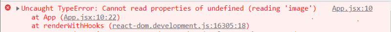
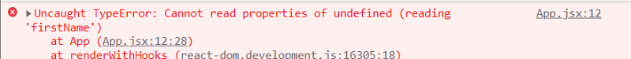
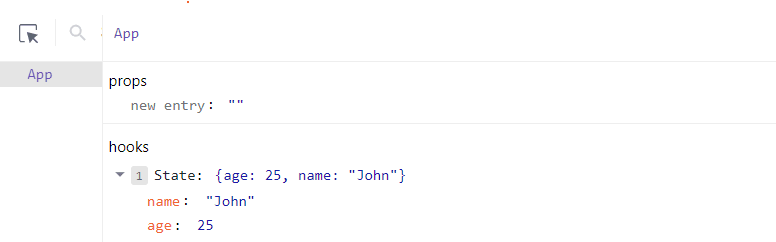
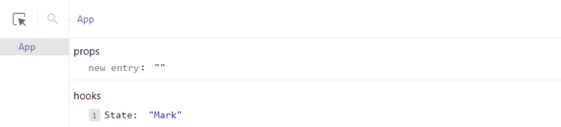
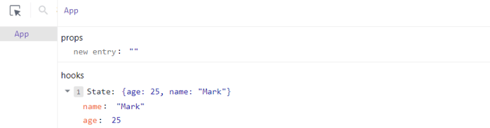

Самым сложным аспектом разработки любого приложения часто является управление его состоянием. Однако часто нам приходится управлять несколькими частями состояния в нашем приложении, например, когда данные извлекаются с внешнего сервера или обновляются в приложении.

Сложность управления состоянием является причиной того, что сегодня существует так много библиотек управления состоянием - и еще больше библиотек продолжают разрабатываться. К счастью, в React есть несколько встроенных решений в виде хуков для управления состояниями, что делает управление состояниями в React проще.

Не секрет, что хуки становятся все более важными при разработке компонентов React, особенно функциональных компонентов, поскольку они полностью заменили необходимость в компонентах на основе классов, которые были традиционным способом управления компонентами с состояниями. Хук `useState` - один из многих хуков, представленных в React, но, несмотря на то, что хук `useState` существует уже несколько лет, разработчики все еще склонны совершать распространенные ошибки из-за недостаточного понимания.

Хук `useState` может быть сложным для понимания, особенно для начинающих разработчиков React или тех, кто переходит от компонентов на основе классов к функциональным компонентам. В этом руководстве мы рассмотрим 5 самых распространенных ошибок с `useState`, которые часто допускают разработчики React, и расскажем, как их можно избежать.

Шаги, которые мы рассмотрим:

## Неправильная инициализация useState

Неправильная инициализация хука useState - одна из самых распространенных ошибок, которые допускают разработчики при его использовании. Что значит инициализировать useState? Инициализировать что-либо - значит установить его начальное значение.

Проблема в том, что useState позволяет вам определить начальное состояние, используя все, что вы хотите. Однако никто не говорит вам прямо, что в зависимости от того, что ваш компонент ожидает увидеть в этом состоянии, использование неправильного значения типа даты для инициализации useState может привести к неожиданному поведению вашего приложения, например, к отказу от отображения пользовательского интерфейса, что приведет к ошибке пустого экрана.

Например, у нас есть компонент, ожидающий состояние объекта пользователя, содержащее его имя, изображение и биографию, и в этом компоненте мы отображаем свойства пользователя.

Инициализация useState другим типом данных, например пустым состоянием или нулевым значением, приведет к ошибке пустой страницы, как показано ниже.

```js
import React, { useState } from 'react';

function App() {
	const [userInfo, setUserInfo] = useState({});

	return (
		<div className="App">
			
			User: {userInfo.name}
			About: {userInfo.bio}
		</div>
	);
}

export default App;
```

Выход:


Просмотр консоли выдаст аналогичную ошибку, как показано ниже:



Начинающие разработчики часто допускают эту ошибку при инициализации состояния, особенно при получении данных с сервера или из базы данных, поскольку ожидается, что полученные данные обновят состояние с реальным пользовательским объектом. Однако это плохая практика, которая может привести к ожидаемому поведению, как показано выше.

Предпочтительным способом инициализации `useState` является передача ему ожидаемого типа данных, чтобы избежать потенциальных ошибок пустой страницы. Например, можно передать состоянию пустой объект, как показано ниже:

```js
import { useState } from 'react';

function App() {
	const [userData, setUserData] = useState({});

	return (
		<div className="App">
			
			User: {userData.name}
			About: {userData.bio}
		</div>
	);
}

export default App;
```

Выход:


Мы можем пойти еще дальше, определив ожидаемые свойства пользовательского объекта при инициализации состояния.

```js
import { useState } from 'react';

function App() {
	const [userData, setUserData] = useState({
		image: '',
		name: '',
		bio: '',
	});

	return (
		<div className="App">
			
			User: {userData.name}
			About: {userData.bio}
		</div>
	);
}

export default App;
```

## Отказ от использования дополнительной цепочки

Иногда просто инициализировать useState ожидаемым типом данных недостаточно, чтобы предотвратить неожиданную ошибку пустой страницы. Это особенно верно при попытке получить доступ к свойству глубоко вложенного объекта, находящегося в цепочке связанных объектов.

Обычно вы пытаетесь получить доступ к этому объекту, перебирая связанные объекты с помощью оператора цепочки с точкой (.), например, `user.names.firstName`. Однако если какие-либо объекты или свойства цепочки отсутствуют, возникает проблема. Страница оборвется, и пользователь получит ошибку пустой страницы.

Например:

```js
import { useState } from 'react';

function App() {
	const [userInfo, setUserInfo] = useState({});

	return (
		<div className="App">
			
			User: {userInfo.names.firstName}
			About: {userInfo.bio}
		</div>
	);
}

export default App;
```

Ошибка вывода:



Типичным решением этой ошибки и отсутствия рендеринга UI является использование условных проверок для подтверждения существования состояния, чтобы проверить, доступно ли оно перед рендерингом компонента, например, `user.names && user.names.firstName`, которое оценивает правое выражение только в том случае, если левое выражение истинно (если `user.names` существует). Однако такое решение является муторным, поскольку потребует нескольких проверок для каждой цепочки объектов.

Используя необязательный оператор цепочки `(?)`, вы можете прочитать значение свойства, которое находится глубоко внутри связанной цепочки объектов, без необходимости проверять, что каждый ссылающийся объект является действительным. Необязательный оператор цепочки `(?.)` аналогичен точечному оператору цепочки `(.)`, за исключением того, что если ссылающийся объект или свойство отсутствует (т. е. null или undefined), выражение замыкается и возвращает значение undefined. Проще говоря, если какой-либо объект в цепочке отсутствует, то цепочка не продолжается (замыкается).

Например, `user?.names?.firstName` не вызовет ошибки и не сломает страницу, поскольку, обнаружив отсутствие объекта user или names, сразу же завершает операцию.

```js
import { useState } from 'react';

function App() {
	// Initialize state with the expected data type
	const [user, setUser] = useState({});

	// Render UI
	return (
		<div className="App">
			
			User: {user?.names?.firstName}
			About: {user.bio}
		</div>
	);
}

export default App;
```

Использование опционального оператора цепочки позволяет упростить и сократить выражения при обращении к цепочке свойств в состоянии, что может быть очень полезно при изучении содержимого объектов, ссылка на которые может быть заранее неизвестна.

## Обновление useState напрямую

Отсутствие правильного понимания того, как React планирует и обновляет состояние, может легко привести к ошибкам в обновлении состояния приложения. При использовании `useState` мы обычно определяем состояние и напрямую обновляем его с помощью функции set state.

Например, мы создаем состояние count и функцию-обработчик, прикрепленную к кнопке, которая добавляет единицу (+1) к состоянию при нажатии:

```js
import { useState } from 'react';

function App() {
	const [count, setCount] = useState(0);

	const increaseCount = () => {
		setCount(count + 1);
	};

	return (
		<div className="App">
			<span>Count: {count}</span>
			<button onClick={increaseCount}>Add +1</button>
		</div>
	);
}

export default App;
```

Выход:


Это работает, как и ожидалось. Однако прямое обновление состояния - плохая практика, которая может привести к потенциальным ошибкам при работе с живым приложением, которое используют несколько пользователей. Почему? Потому что, вопреки вашему мнению, React не обновляет состояние сразу после нажатия на кнопку, как показано в демонстрационном примере. Вместо этого React делает снимок текущего состояния и планирует это обновление (+1) на более позднее время для повышения производительности - это происходит за миллисекунды, поэтому незаметно для человеческого глаза. Однако пока запланированное обновление находится в ожидании перехода, текущее состояние может быть изменено чем-то другим (например, делами нескольких пользователей). Запланированное обновление никак не сможет узнать об этом новом событии, потому что у него есть только запись снимка состояния, который оно сделало, когда была нажата кнопка.

Это может привести к серьезным ошибкам и странному поведению вашего приложения. Давайте посмотрим на это в действии, добавив еще одну кнопку, которая асинхронно обновляет состояние счетчика с задержкой в 2 секунды.

```js
function App() {
	const [count, setCount] = useState(0);

	const handleUpdate = () => {
		setCount(count + 1);
	};

	return (
		<div className="App">
			<span>Count: {count}</span>
			<button onClick={handleUpdate}>Add +1</button>
		</div>
	);
}
```

Обратите внимание на ошибку в выводе:


Заметили ошибку? Мы начинаем с того, что дважды нажимаем на первую кнопку ”Добавить +1” (что обновляет состояние до 1 + 1 = 2). После этого мы нажимаем на кнопку ”Добавить +1 позже” - это делает снимок текущего состояния (2) и планирует обновление, чтобы добавить 1 к этому состоянию через две секунды. Но пока это запланированное обновление находится на стадии перехода, мы трижды нажимаем на кнопку "Добавить +1”, обновляя текущее состояние до 5 (т. е. 2 + 1 + 1 + 1 = 5). Однако асинхронное запланированное обновление пытается обновить состояние через две секунды, используя снимок (2), хранящийся в памяти (т. е. 2 + 1 = 3), не понимая, что текущее состояние было обновлено до 5. В результате состояние обновляется до 3 вместо 6.

Эта непреднамеренная ошибка часто поражает приложения, состояния которых обновляются напрямую с помощью функции setState(newValue). Предлагаемый способ обновления useState - функциональное обновление, при котором `setState()` передается функции обратного вызова, а в эту функцию обратного вызова передается текущее состояние на данный момент, например, `setState(currentState => currentState + newValue)`. Таким образом, в функцию обратного вызова передается текущее состояние на запланированное время обновления, что позволяет узнать текущее состояние до попытки обновления.

Итак, давайте модифицируем демонстрационный пример, чтобы использовать функциональное обновление вместо прямого.

```js
import React, { useState } from 'react';

function App() {
	const [count, setCount] = useState(0);

	const handleUpdate = () => {
		setCount((prevCount) => prevCount + 1);
	};

	const handleAsyncUpdate = () => {
		setTimeout(() => {
			setCount((prevCount) => prevCount + 1);
		}, 2000);
	};

	return (
		<div className="App">
			<span>Count: {count}</span>
			<button onClick={handleUpdate}>Add +1</button>
			<button onClick={handleAsyncUpdate}>Add +1 later</button>
		</div>
	);
}

export default App;
```

Выход:  


При функциональном обновлении функция `setState()` знает, что состояние было обновлено до 5, поэтому она обновляет состояние до 6.

## Обновление конкретного свойства объекта

Еще одна распространенная ошибка - изменение только свойства объекта или массива, а не самой ссылки.

Например, мы инициализируем объект пользователя с определенными свойствами ”имя” и ”возраст". Однако в нашем компоненте есть кнопка, которая пытается обновить только имя пользователя, как показано ниже.

```js
import { useState } from 'react';

export default function App() {
	const [userInfo, setUserInfo] = useState({ name: 'John', age: 25 });

	const changeName = () => {
		setUserInfo((prevUserInfo) => ({ ...prevUserInfo, name: 'Mark' }));
	};

	return (
		<div className="App">
			User: {userInfo.name}
			Age: {userInfo.age}
			<button onClick={changeName}>Change name</button>
		</div>
	);
}
```

Исходное состояние перед нажатием кнопки:



Обновленное состояние после нажатия кнопки:



Как видите, вместо того, чтобы изменить конкретное свойство, пользователь больше не является объектом, а был перезаписан в строку “Mark”. Почему? Потому что setState() назначает новым состоянием то значение, которое было возвращено или передано ей. Эта ошибка часто встречается у разработчиков React, переходящих от компонентов на основе классов к функциональным компонентам, поскольку они привыкли обновлять состояние с помощью `this.state.user.property = newValue` в компонентах на основе классов.

Один из типичных старых способов сделать это - создать новую ссылку на объект и присвоить ей предыдущий объект user, непосредственно изменив имя пользователя.

```js
import { useState } from 'react';

export default function App() {
	const [user, setUser] = useState({ name: 'John', age: 25 });

	const changeName = () => {
		setUser((user) => ({ ...user, name: 'Mark' }));
	};

	return (
		<div className="App">
			User: {user.name}
			Age: {user.age}
			<button onClick={changeName}>Change name</button>
		</div>
	);
}
```

Обновленное состояние после нажатия кнопки:



Обратите внимание, что изменено только имя пользователя, а остальные свойства остались прежними.

Однако идеальным и современным способом обновления конкретного свойства, объекта или массива является использование оператора разброса ES6 (…). Это идеальный способ обновления конкретного свойства объекта или массива при работе с состоянием в функциональных компонентах. С помощью оператора spread вы можете легко распаковать свойства существующего элемента в новый элемент и одновременно изменить или добавить новые свойства в распакованный элемент.

```js
import { useState } from 'react';

export default function App() {
	const [user, setUser] = useState({ name: 'John', age: 25 });

	const changeName = () => {
		setUser((prevUser) => ({ ...prevUser, name: 'Mark' }));
	};

	return (
		<div className="App">
			User: {user.name}
			Age: {user.age}
			<button onClick={changeName}>Change name</button>
		</div>
	);
}
```

Результат будет таким же, как и в предыдущем состоянии. После нажатия на кнопку обновляется свойство name, а остальные пользовательские свойства остаются прежними.

## Управление несколькими полями ввода в формах

Управление несколькими управляемыми полями ввода в форме обычно осуществляется вручную с помощью creсоздание нескольких функций `useState()` для каждого поля ввода и привязка каждой из них к соответствующему полю ввода. Например:

```js
import React, { useState } from 'react';

export default function App() {
	const [firstName, setFirstName] = useState('');

	// Render UI
	return (
		<form>
			<label htmlFor="firstName">First Name</label>
			<input type="text" id="firstName" placeholder="First Name" />

			<label htmlFor="lastName">Last Name</label>
			<input type="text" id="lastName" placeholder="Last Name" />

			<label htmlFor="age">Age</label>
			<input type="number" id="age" placeholder="Age" />

			<label htmlFor="username">Username</label>
			<input type="text" id="username" placeholder="Username" />

			<label htmlFor="password">Password</label>
			<input type="password" id="password" placeholder="Password" />

			<label htmlFor="email">Email</label>
			<input type="email" id="email" placeholder="Email" />
		</form>
	);
}
```

Кроме того, вам придется создать функцию-обработчик для каждого из этих входов, чтобы создать двунаправленный поток данных, обновляющий каждое состояние при вводе значения. Это может быть довольно избыточным и отнимать много времени, поскольку требует написания большого количества кода, что снижает читабельность кодовой базы.

Однако можно управлять несколькими полями ввода в форме, используя только один хук useState. Для этого нужно сначала присвоить каждому полю ввода уникальное имя, а затем создать одну функцию `useState()`, которая инициализируется свойствами, идентичными именам полей ввода.

```js
import React, { useState } from 'react';

export default function App() {
	const [user, setUser] = useState({
		firstName: '',
		lastName: '',
		age: '',
		username: '',
		password: '',
		email: '',
	});

	return (
		<div className="App">
			<form>
				<input type="text" name="firstName" placeholder="First Name" />
				<input type="text" name="lastName" placeholder="Last Name" />
				<input type="number" name="age" placeholder="Age" />
				<input type="text" name="username" placeholder="Username" />
				<input type="password" name="password" placeholder="Password" />
				<input type="email" name="email" placeholder="Email" />
			</form>
		</div>
	);
}
```

После этого мы создаем функцию события-обработчика, которая обновляет определенное свойство объекта user, чтобы отразить изменения в форме всякий раз, когда пользователь что-то вводит. Это можно сделать с помощью оператора spread и динамического доступа к имени конкретного элемента ввода, который вызвал функцию-обработчик, используя `event.target.elementsName = event.target.value`.

Другими словами, мы проверяем объект события, который обычно передается функции события, на наличие имени целевого элемента (которое совпадает с именем свойства в пользовательском состоянии) и обновляем его с помощью связанного значения в этом целевом элементе, как показано ниже:

```js
import React, { useState } from 'react';

export default function UserForm() {
	// Initial state with default values
	const [user, setUser] = useState({
		firstName: '',
		lastName: '',
		age: '',
		username: '',
		password: '',
		email: '',
	});

	// Update the specific input field
	const handleChange = (e) => {
		const { name, value } = e.target;
		setUser((prevState) => ({ ...prevState, [name]: value }));
	};

	// Render UI
	return (
		<div className="App">
			<form>
				<input type="text" onChange={handleChange} name="firstName" placeholder="First Name" />
				<input type="text" onChange={handleChange} name="lastName" placeholder="Last Name" />
				<input type="number" onChange={handleChange} name="age" placeholder="Age" />
				<input type="text" onChange={handleChange} name="username" placeholder="Username" />
				<input type="password" onChange={handleChange} name="password" placeholder="Password" />
				<input type="email" onChange={handleChange} name="email" placeholder="Email" />
			</form>
		</div>
	);
}
```

В этой реализации функция обработчика событий запускается для каждого пользовательского ввода. В этой функции события у нас есть функция состояния `setUser()`, которая принимает предыдущее/текущее состояние пользователя и распаковывает это состояние пользователя с помощью оператора spread. Затем мы проверяем объект события на наличие имени целевого элемента, вызвавшего функцию (которое соотносится с именем свойства в состоянии). Получив имя этого свойства, мы изменяем его, чтобы отразить введенное пользователем значение в форме.

## Заключение

Будучи разработчиком React, создающим высокоинтерактивные пользовательские интерфейсы, вы наверняка совершали некоторые из вышеперечисленных ошибок. Надеемся, что эти полезные практики использования UseState помогут вам избежать некоторых из этих потенциальных ошибок при использовании хука `useState` в дальнейшем при создании ваших приложений на базе React.
