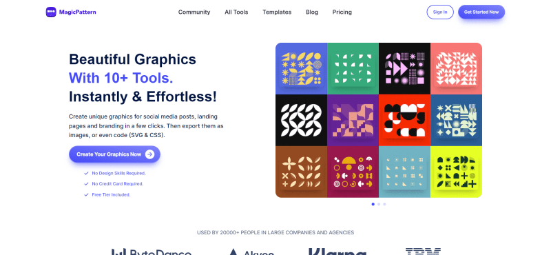
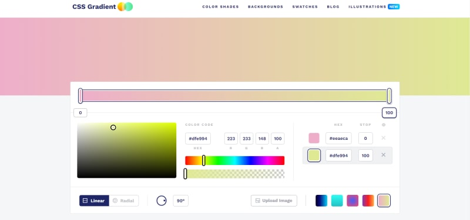
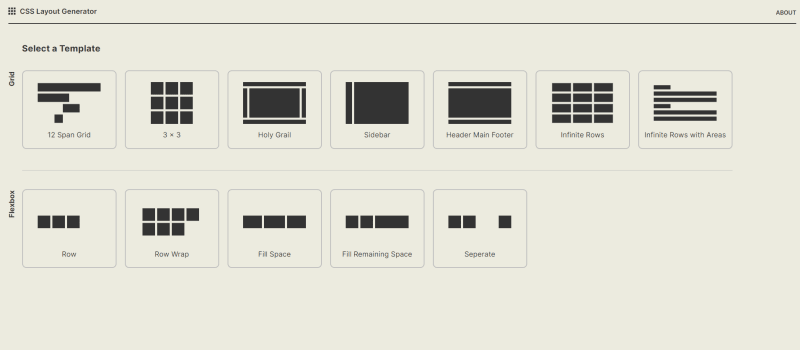
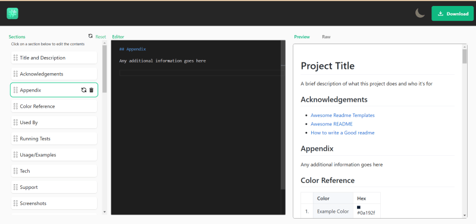
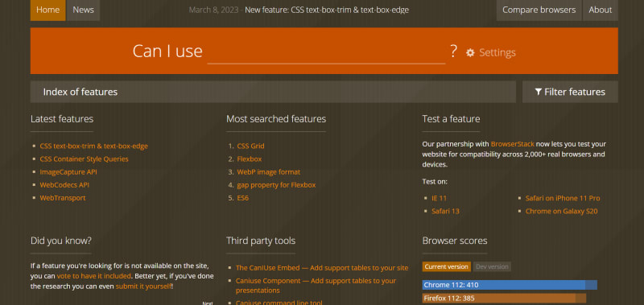

Это необходимые инструменты, которые помогут вам работать быстрее и качественнее для CSS

## 1. MagicPattern

Создавайте профессиональные визуальные эффекты с помощью MagicPattern. Создавайте SVG/CSS-шаблоны, градиенты и органические формы для брендирования ваших продуктов и постов в социальных сетях.

## 2.CSS-градиент

Этот сайт - бесплатный инструмент для создания градиента css - позволит вам создать красочный градиентный фон для вашего сайта, блога или профиля в социальных сетях.

## 3. Генератор макетов CSS

Если вы хотите понять, как использовать сетку и гибкие слова в CSS, он предоставит вам шаблоны в реальном времени, которые вы всегда сможете использовать

## 4. README.SO

Используйте редактор и шаблоны readme.so, чтобы легко создавать ReadMe для ваших проектов на Github.

## 5. Могу ли я использовать

В разделе ”Можно ли использовать" представлены актуальные таблицы поддержки браузеров для поддержки фронтенд-веб-технологий в настольных и мобильных веб-браузерах.

