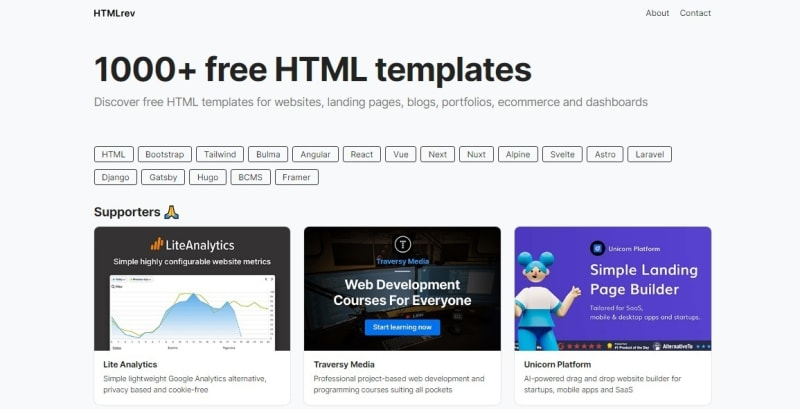
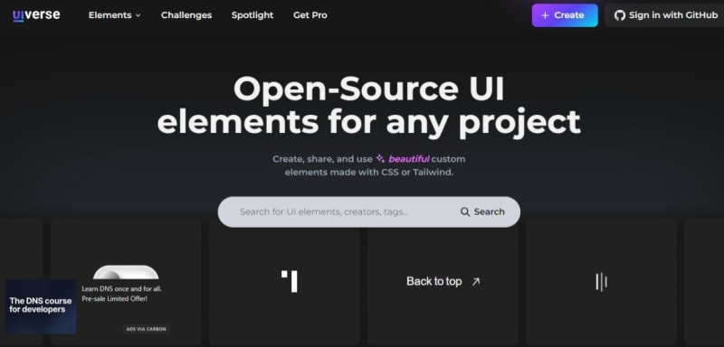
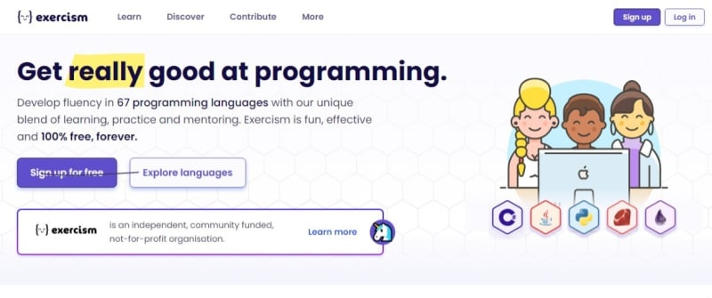
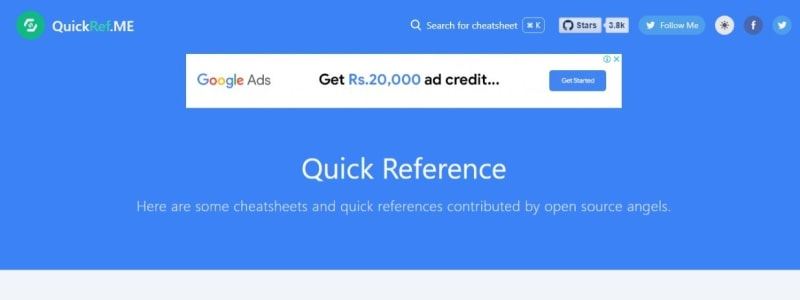
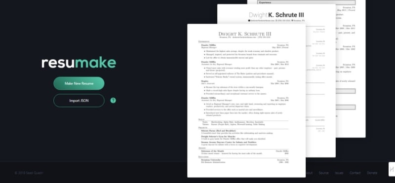

Привет, кодеры! Я хочу поделиться с вами некоторыми из самых крутых сайтов, которые я нашел, которые могут реально сэкономить ваше время и помочь в улучшении ваших навыков кодинга.

На каждом из них есть что-то уникальное и БЕСПЛАТНОЕ.

Итак, начнем с 👇.

Этот сайт действительно 🔥, у них есть отличная коллекция из 1000+ бесплатных HTML шаблонов на все категории, такие как целевые страницы, блоги, портфолио, электронная коммерция и приборные панели с кучей современных и креативных шаблонов, сделанных с помощью HTML, CSS, TailwindCSS и JavaScript и т.д.

Обязательно проверьте один раз 🤓.

UIverse содержит более 3000+ бесплатных CSS и Tailwind элементов, которые вы можете использовать в своих проектах, таких как кнопки, формы, загрузчики и т.д.

Их создавали другие разработчики, так что качество отличное ⭐. У них даже есть фрагменты кода для копирования.

Такая огромная библиотека бесплатно!

Этот сайт очень хорош для отработки конкретных задач по кодингу. В ней более 3500 коротких упражнений, разбитых на разные языки.

После написания решения вы можете отправить его, чтобы получить автоматическую обратную связь и поработать в паре с наставником.

Это забавный 😅 способ освоить новые навыки и стать лучше в отладке.

Вам нужен быстрый справочник по синтаксису нового для вас языка? Этот ☝ сайт - идеальное решение.

Здесь есть шпаргалки по всем языкам - от Python и JavaScript до Vim и Markdown.

Вы можете искать их в любое время, когда застрянете на чем-то. Очень удобно!

Когда вы будете готовы создать свое портфолио кодера, этот сайт поможет вам составить профессиональные резюме и CV.😎

У них есть красивые шаблоны для разработчиков, дизайнеров и многих других. Вы просто вводите свои данные, и он генерирует высококачественный PDF-файл.

Отличный вариант для стажировки или трудоустройства!

До скорой встречи 👋

Спасибо, что читаете этот блог🙏, надеюсь, это даст вам несколько новых мест для поиска друзей-кодеров!

Оставляйте комментарии 📩 если вы найдете еще какие-нибудь полезные сайты.

И не забудьте оставить ”💖🦄🔥"

Счастливого кодинга😊
