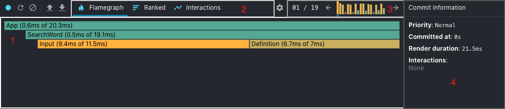
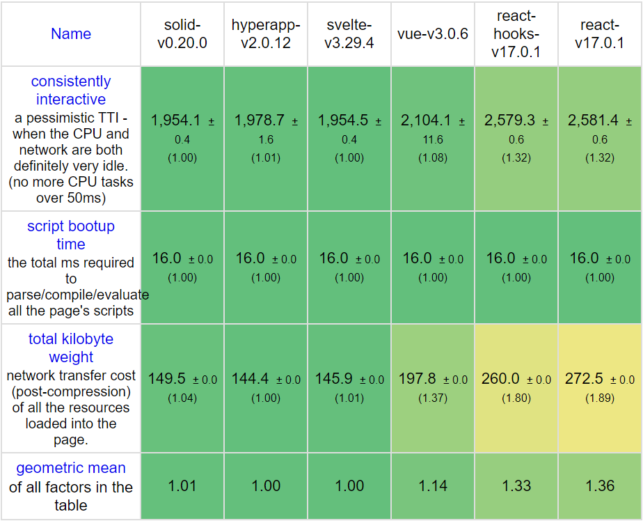
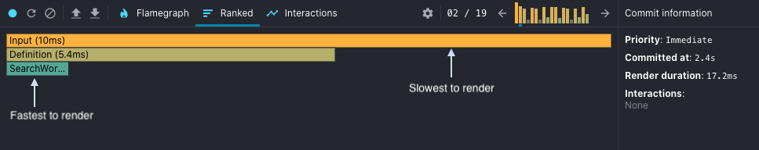
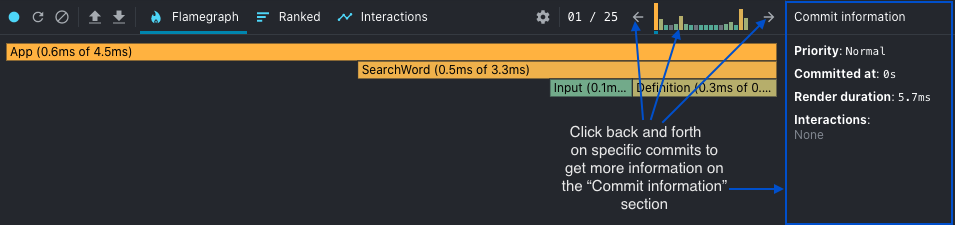
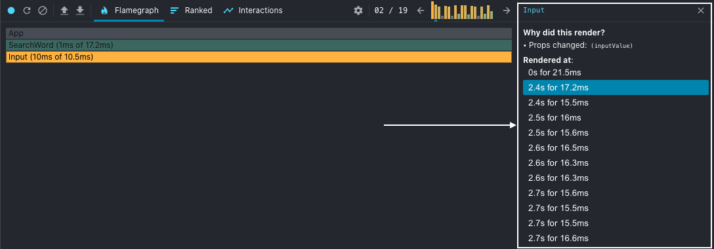
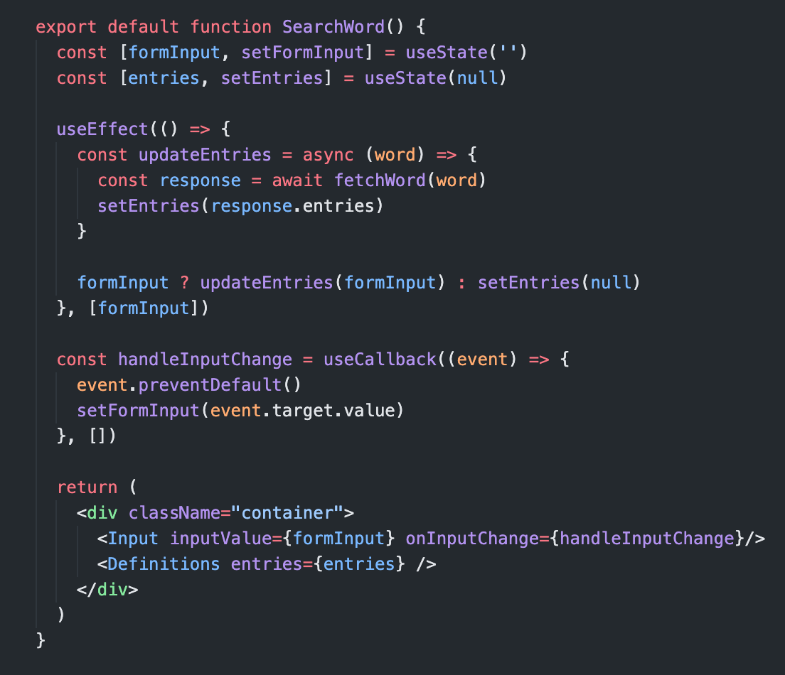
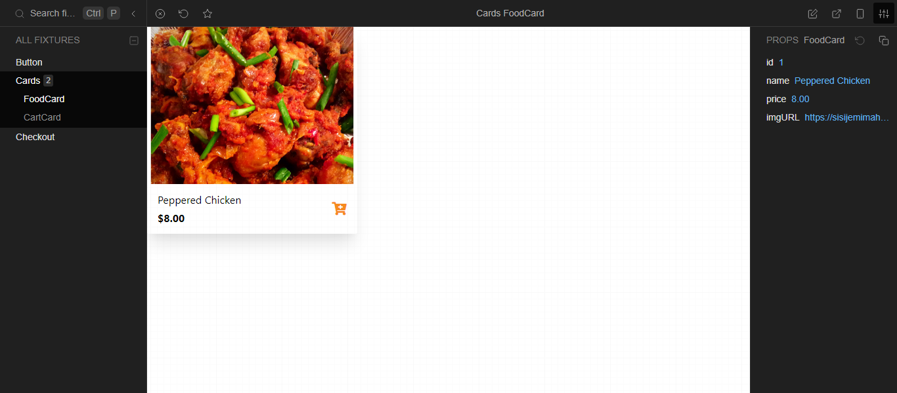
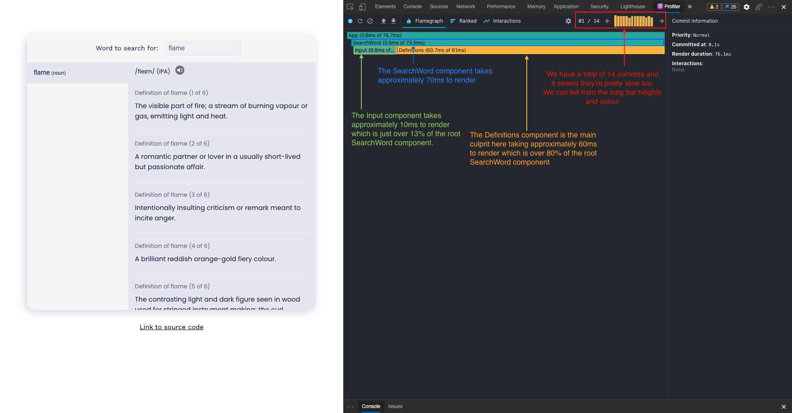
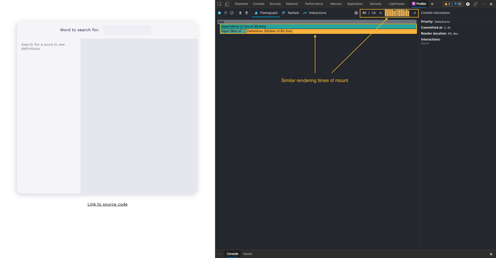
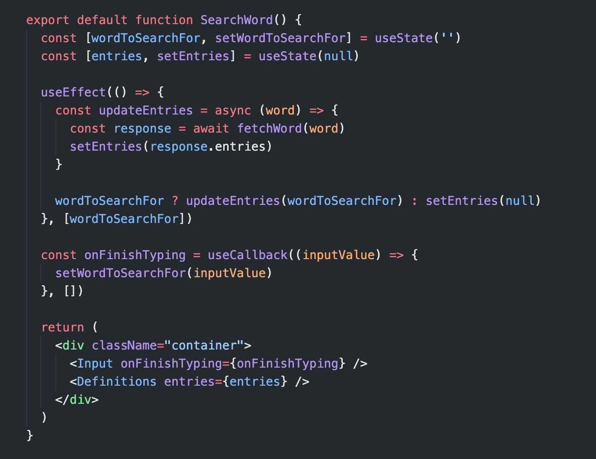

Продуктивная команда разработчиков начинается с продуктивной IDE. Сегодня Visual Studio Code (или VS Code) является одним из самых популярных редакторов кода по многим причинам.

Несмотря на то, что он обладает множеством полезных функций и возможностей уже из коробки, в VS Code Marketplace можно бесплатно приобрести расширения, которые помогут повысить продуктивность вашей команды.

В этой статье мы рассмотрим некоторые из этих расширений VS Code.

## Prettier

 Вероятно, это один из лучших форматировщиков кода в сообществе VS Code. У каждого в вашей команде, скорее всего, есть разные мнения о том, что делает код читабельным. Prettier обеспечивает единый стиль, чтобы код всегда выглядел единообразно среди членов вашей команды.

Он легко настраивается и хорошо работает с этими языками/фреймворками:

JavaScript/TypeScript Flow JSX JSON CSS SCSS Less HTML Vue Angular HANDLEBARS Ember Glimmer GraphQL Markdown YAML

Использование комментариев может быть очень полезным как в команде, так и в одиночку.

Но по умолчанию комментарии не так заметны в VS Code, поскольку они выделены серым цветом. Поэтому, работая в команде с большой кодовой базой, очень легко не заметить комментарии, особенно сделанные другими членами команды.

Better Comments позволяет настраивать категории комментариев и выделять их цветом, чтобы их нельзя было пропустить. Теперь вы и ваша команда никогда не сможете оправдываться, почему вы не заметили этот "TODO" или этот комментарий во время проверки кода.

## JS snippet

Писать меньше кода - это эффективно, и сниппеты кода позволяют сделать именно это. Лично я использую сниппеты для JavaScript и React/Redux, но существуют расширения сниппетов практически для любого языка или фреймворка.

Если вы никогда раньше не пользовались сниппетами, вам может потребоваться некоторое время, чтобы выучить ярлыки и не забывать использовать их при любой возможности. Но как только вы освоите их, вы никогда не захотите возвращаться к набору текста вручную. Например, вот некоторые из них на JavaScript.

## Live Server

Имея более 18 миллионов установок на момент написания этой статьи, это расширение всегда было моим основным для быстрого локального тестирования разработки.

Его функция живой перезагрузки очень полезна для легкой отладки, а само расширение очень просто в использовании. Настоятельно рекомендую и считаю необходимым расширением для веб-разработчиков.

## Bracket Pair Colorizer

Каждый разработчик наверняка сталкивался с проблемой скобок. Иногда просто трудно найти и расставить скобки в коде. И эти маленькие красные линии, говорящие о том, что что-то не так, через некоторое время начнут вас доставать.

К счастью, было выпущено расширение Bracket Pair Colorizer. С его помощью можно легко определить, отсутствует ли скобка и где именно.

Легкое исправление. Вот это производительность.

В настоящее время расширение все еще доступно в Marketplace, но оно стало настолько популярным, что теперь это встроенная функция VS Code, которую вы можете включить в настройках. Я настоятельно рекомендую включить ее. Это сэкономит вам массу времени и головной боли.

## GitLens

Если вы и ваша команда используете Git для контроля версий, то GitLens просто необходим. Это расширение, по сути, представляет собой Git на стероидах.

GitLens - это более 12 миллионов установок с идеальным 5-звездочным рейтингом и множество функций для улучшения работы с Git. Например, вы можете легко проверить, кто внес последние изменения в определенную строку кода.

Или вы можете легко увидеть все прошлые коммиты и их историю на боковой панели.

## Заключение

Спасибо за прочтение. Я надеюсь, что с помощью этих расширений ваша среда разработки станет более эффективной. Некоторым из них может потребоваться некоторое время, чтобы привыкнуть к ним и внедрить в свои привычки кодирования. Это будет постепенный переход, и вскоре вы поймете, что ваша производительность возросла.

Очевидно, что в VS Code есть еще много полезных и мощных расширений, которые стоит изучить. А какие у вас любимые расширения VS Code? Поделитесь ими в комментариях ниже! Будьте здоровы!
