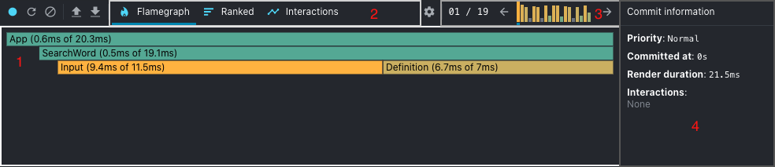
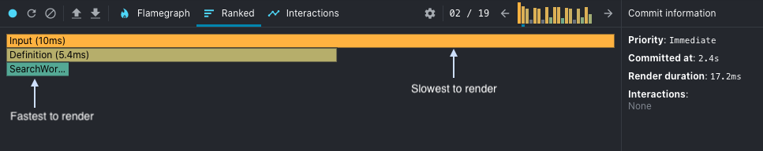

На извечный вопрос "Как начать работать с X?" не так-то просто ответить. Не потому, что нет информации, а потому, что она есть, вернее, ее слишком много. Так как же понять, какая из них полезна начинающему разработчику, желающему освоить новый фреймворк, а какая - нет?

Сложно, не правда ли? И вдобавок к этому у вас есть учебники, видео, курсы и проекты, над которыми нужно работать. В таких ситуациях на ум приходит термин "паралич анализа", и я уверен, что вы тоже бывали в подобной ситуации.

Секрет избавления от этого паралича заключается в том, чтобы начать что-то делать, неважно что, и здесь вы найдете список из 5 интересных проектов, которые вы можете создать и чему-то научиться в процессе.

## 1. Создайте клон боковой панели Twitter

Я всегда говорю, что лучшие проекты для сборки - это те, которые уже были сделаны. Так вы забудете о необходимости придумывать что-то новое и оригинальное, вместо этого вы будете думать о том, как скопировать то, что уже было сделано (таким образом, вы знаете, что это можно сделать).

В этом конкретном уроке вы создадите клон боковой панели Twitter. Это всего лишь тестовый проект, поскольку вы не сможете ничего сделать с ним самостоятельно, однако вы сможете изучить основы React, не беспокоясь о таких задачах, как получение данных. Это будет сделано позже.

Это отличный первый учебник, если вы сделали всего один или два проекта с React, потому что в нем будут рассмотрены такие темы, как:

Создание нового проекта React с помощью `create-react-app` Стилизация ваших компонентов с помощью MaterialUI Вы узнаете о хуках и о том, как их использовать. Вы также узнаете, что такое компоненты высшего порядка и что можно с ними делать.

Ознакомьтесь с ним сначала или пропустите, если эти темы вы уже изучали.

## 2. Создайте блог

Это одна из классик, рядом с приложением To-Do, блог немного сложнее, да, но он также охватывает некоторые другие интересные действия, такие как наличие нескольких разделов и необходимость навигации между ними.

В этом уроке вы не только попрактикуетесь в этом, но и воспользуетесь знаниями, полученными в предыдущем проекте о хуках, чтобы понять, как можно использовать пользовательские хуки из сторонних библиотек.

На самом деле, здесь есть целый раздел о react-router-dom - библиотеке, которая помогает привязать модуль React Router внутри веб-приложений.

В рамках этого урока вы будете работать над:

Клонирование и работа с существующим проектом. React Router и его использование для добавления навигации в ваше приложение. Использование пользовательских хуков из сторонних библиотек. Настройка страницы 404 и ее значение.

Это отличный второй учебник, потому что он не слишком сложный и постепенно добавляет новые концепции, показывая вам несколько практических примеров.

## 3. Начните взаимодействовать с API сторонних разработчиков

Одна из важных тем, с которой вам придется научиться работать, - это запрос данных из сторонних библиотек. Со временем это станет обычным делом, которое вы будете выполнять как нечто второстепенное, но чтобы достичь этого, нужно с чего-то начать, верно? В этом уроке мы покажем вам, как взаимодействовать с публичным REST API Википедии и построить на его основе поисковую систему.

В рамках концепции вы будете работать со всем тем, что вы уже сделали в предыдущих двух уроках, плюс вы начнете изучать fetch, который станет одним из основных инструментов в вашем арсенале React.

Концепции, которые вы узнаете и отработаете, следуя этому уроку, следующие:

Выполнение API-запросов с помощью Fetch. Работа с внешними результатами и их отображение в вашем приложении.

Это не так много концепций, но они немного продвинутые, поэтому на данном этапе лучше сбавить обороты и сосредоточиться на менее сложных, но более сложных вещах.

Однако будьте осторожны, не пытайтесь бежать, пока не научились ползать. Если вы раньше мало работали с React, обязательно попробуйте #1 и #2 перед этим уроком, так как в этом уроке предполагается определенный уровень знаний.

## 4. Работа с собственным состоянием приложения

Продолжая линию "не беги, пока не научился ползать", состояние приложения - одна из главных тем для разработчиков React. Знать, как хранить состояние компонента - это одно, но вот начать делиться этим состоянием между несколькими компонентами или даже передавать его от родительских компонентов к дочерним - это не так уж и просто, и потенциально может привести к некоторым плохим практикам.

Поэтому в этом уроке вы узнаете о нескольких способах работы с состоянием приложения, прежде чем переходить к использованию такой крупной библиотеки, как Redux.

Почему вы спросите? Потому что эти библиотеки имеют тенденцию скрывать некоторые концепции от пользователей, чтобы "упростить" им жизнь. Это хорошая мысль, но если вы не знаете о том, что от вас скрывают, вы никогда не сможете этому научиться. В этом и заключается ключ. Изучите этот учебник и попробуйте использовать его в своем следующем проекте. После этого вы можете попробовать почитать о Redux, Recoil или любой другой альтернативе.

Когда вы дочитаете этот учебник до конца, вы уже прочитаете о:

Memoizing (и вы можете прочитать дальше оэта тема здесь) Редукторы для управления состоянием. Использование контекста

Это определенно учебник высокого уровня, и после его прочтения у вас возникнет множество вопросов. Но в этом-то и весь смысл! Он откроет вам несколько дверей, а дальше дело за вами - узнать о них больше.

## 5. Бросаем Next.js в микс

Последним шагом здесь будет собрать все вместе и включить один из основных фреймворков, используемых для создания React-приложений: Next.js.

Этот фреймворк предоставит вам инструменты, необходимые для создания приложения как для фронт-энда, так и для бэк-энда. В этом уроке вы будете создавать приложение для музыкальных развлечений. Вы будете использовать такие вещи, как:

Вы также рассмотрите такие темы, как взаимодействие с внешними службами и стилизация CSS. В качестве заключительного 5-го урока я настоятельно рекомендую вам ознакомиться с этой статьей, в которой вы найдете все необходимое для начала работы.

К концу этого списка у вас должно быть очень хорошее базовое понимание того, как создавать веб-приложения с помощью ReactJS. И не только это, но и другие темы, которые не являются специфическими для ReactJS, что, по моему мнению, является большим плюсом. В качестве следующего шага попробуйте вспомнить, каких функций не хватает в приложениях, описанных в вышеприведенных учебниках, и реализовать их самостоятельно!
