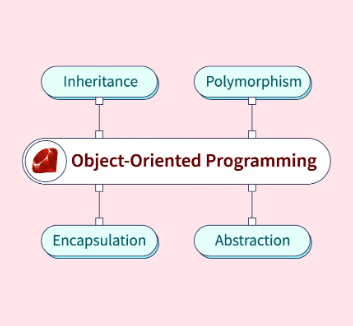
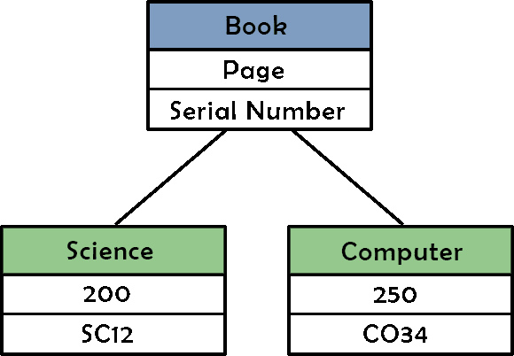

В этом руководстве мы рассмотрим ключевые принципы объектно-ориентированного программирования в Ruby, изучим классы, объекты, наследование, инкапсуляцию и полиморфизм в Ruby.

## Что такое объектно-ориентированное программирование в Ruby


Объектно-ориентированное программирование (ООП) - это организация вашего кода с помощью строительных блоков, называемых ”объектами”. Эти объекты обладают особыми возможностями - они могут хранить информацию и выполнять действия. В Ruby, языке программирования, известном своей простотой, ООП является ключевой особенностью.

## Понимание классов и объектов в Ruby



### Классы в Ruby: чертежи для объектов

В ООП класс выступает в роли чертежа или шаблона для создания объектов. Он определяет структуру и поведение, которыми будут обладать объекты, созданные на его основе. Эти объекты называются экземплярами класса. Представьте себе класс как рецепт приготовления макарон, а экземпляры - как различные блюда из макарон.

### Понимание классов в Ruby

Класс обычно включает в себя следующие компоненты:

Декларация класса: Начинается с ключевого слова `class`, за которым следует имя класса. Имена классов в Ruby обычно пишутся в CamelCase.

:code[class Dog]{syntax=rb}

Метод конструктора (`initialize`): Метод `initialize` - это специальный метод, который вызывается при создании нового объекта из класса. Он используется для установки начального состояния объекта.

:code[def initialize(name, age) @name = name @age = age end]{syntax=rb}

В этом примере `name` и `age` являются параметрами, передаваемыми при создании нового объекта `Dog`.

Переменные экземпляра (`@name`, `@age`): Эти переменные хранят состояние объекта. Перед их именами стоит символ `@`, указывающий на то, что они принадлежат экземпляру класса.

`@name = name @age = age`

Методы: Это функции, определенные внутри класса. Они представляют собой поведение или действия, которые могут выполнять объекты, созданные на основе класса.

`def bark puts "Woof, woof!" end def details puts "Name: #{@name}, Age: #{@age}" end`

Здесь `bark` и `details` - это методы, которые объект `Dog` может вызывать для выполнения определенных действий.

## Создание экземпляров из класса

После того как класс определен, вы можете создавать экземпляры или объекты на его основе. Объекты - это экземпляры класса, и каждый объект имеет свое собственное состояние и поведение.

:code[dog1 = Dog.new(“Buddy”, 3) dog2 = Dog.new(“Max”, 5)]{syntax=rb}

Здесь `dog1` и `dog2` являются экземплярами класса `Dog`. Метод `initialize` вызывается автоматически при создании этих объектов, устанавливая их начальное состояние.

## Использование методов объектов

Объекты, созданные на основе класса, могут вызывать его методы:

:code[dog1.bark; dog2.details]{syntax=rb}

В этом примере `dog1` лает, а `dog2` сообщает подробности. Каждый объект может использовать методы, определенные в классе, но конкретные детали могут отличаться в зависимости от состояния объекта.

Наследование в Ruby: Совместное использование признаков

Наследование - это передача признаков от родителей к детям. В Ruby класс может наследовать черты от другого класса. Давайте посмотрим, как это делается:

```ruby
class Animal
  def initialize(name)
    @name = name
  end

  def speak
    puts "Some generic sound"
  end
end

class Cat < Animal
  def speak
    puts "Meow!"
  end
end
```

Здесь Кот похож на ребенка, унаследовавшего черты своего родителя (Животного). Он может делать все то же самое, что и животное, но у него своя уникальная манера речи.

```ruby
generic_animal = Animal.new("Общее животное") generic_animal.speak my_cat = Cat.new("Усы") my_cat.speak
```

Подобно тому, как кошка наследует черты животного, наш `my_cat` разговаривает по-кошачьи.

## Инкапсуляция в Ruby: Храним секреты

Инкапсуляция - это как хранение кода в секретной коробке. Она позволяет сохранить порядок и не дать другим людям испортить ваш код. Давайте посмотрим, как это работает:

```ruby
class Book
  attr_accessor :title, :author

  # Initialize book with title and author
  def initialize(title, author)
    @title = title
    @author = author
  end

  # Return book details in a string
  def details
    "Title: #{@title}, Author: #{@author}"
  end
end
```

Здесь книга похожа на секретный ящик. У нее есть методы (подробности), которые позволяют увидеть, что находится внутри, но вы не можете напрямую изменить название или автора, если не используете предоставленные методы.

```rb
# Initialize a book with title and author
my_book = Book.new("Ruby Programming", "John Doe")

# Print book details
puts my_book.details

# Change the title
my_book.title = "Mastering Ruby"

# Print new book details
puts my_book.details

```

Вы можете увидеть, что находится внутри поля `my_book`, используя метод `details`. Вы также можете изменить заголовок, но только с помощью указанного метода.

## Полиморфизм в Ruby: Многоликий

Полиморфизм - это интересный аспект ООП (объектно-ориентированного программирования), который позволяет рассматривать объекты как экземпляры их родительского класса, даже если они являются экземплярами дочернего класса. Это все равно что использовать разные вещи взаимозаменяемо. В Ruby полиморфизм - эточасто можно увидеть через переопределение методов.

### Переопределение методов в Ruby

Переопределение метода происходит, когда дочерний класс предоставляет конкретную реализацию метода, который уже определен в его родительском классе. Это позволяет использовать объекты дочернего класса так, чтобы они были взаимозаменяемы с объектами родительского класса.

Давайте проиллюстрируем это на примере:

```ruby
class Animal
  def speak
    puts "Some generic sound"
  end
end

class Cat < Animal
  def speak
    puts "Meow!"
  end
end
```

Здесь `Cat` является дочерним классом `Animal`. Метод `speak` переопределяется в классе `Cat`, чтобы обеспечить специфический для кошки звук. Теперь объекты `Animal` и `Cat` можно использовать как взаимозаменяемые.

```ruby
generic_animal = Animal.new generic_animal.speak # Выходные данные: Некоторый общий звук my_cat = Cat.new my_cat.speak # Выходные данные: "Мяу!"
```

Несмотря на то, что `generic_animal` и `my_cat` являются экземплярами разных классов, они оба реагируют на метод `speak`. Это и есть полиморфизм в действии.

Полиморфизм в Ruby позволяет рассматривать объекты как экземпляры их родительского класса, обеспечивая гибкость и взаимозаменяемость в использовании объектов. Это мощная концепция, которая повышает адаптивность и расширяемость вашего кода.

## Абстракция в Ruby

В Ruby абстракция - это упрощение сложного кода путем сосредоточения внимания на том, что делают объекты, а не на том, как они это делают. Это достигается с помощью абстрактных классов или интерфейсов.

### Абстрактные классы:

Используйте гем `abstract_class` или соглашение. Определите абстрактные методы без реализаций. Подклассы должны предоставлять реализации.

```ruby

require 'abstract_class'

class Animal
  abstract_class

  def speak
    raise NotImplementedError, 'Subclasses must implement speak'
  end
end

class Dog < Animal
  def speak
    puts 'Woof!'
  end
end

class Cat < Animal
  def speak
    puts 'Meow!'
  end

```

## Интерфейсы в Ruby:

Используйте модули для создания интерфейсов. Модули определяют методы, которые должны реализовывать классы.

```ruby
module Speakable
  def speak
    raise NotImplementedError, 'Classes must implement speak'
  end
end

class Dog
  include Speakable

  def speak
    puts 'Woof!'
  end
end

class Cat
  include Speakable

  def speak
    puts 'Meow!'
  end
```

Абстракция упрощает код, делая его более модульным и легким в сопровождении, поскольку фокусируется на основных функциях, а не на деталях реализации.

## Заключение

В нашем исследовании объектно-ориентированного программирования (ООП) в Ruby мы прошли через ландшафты классов, объектов, наследования, инкапсуляции, полиморфизма и динамического царства переменных класса. Завершая это обширное путешествие, давайте поразмышляем о сути нашей одиссеи кодирования.

Раскрытие возможностей классов и объектов

Классы как архитекторы: В Ruby классы выходят за рамки своей роли чертежей; они являются архитекторами, проектирующими живые, дышащие сущности. С помощью каждого класса мы создаем не просто структуры, а динамические царства, наполненные уникальными и захватывающими объектами.

Объекты как динамические сущности: Каждый объект, рожденный в классе, - это динамическая сущность со своей собственной историей, обладающая отличительными атрибутами и насыщенными действиями методами. Подобно героям романа, эти объекты придают глубину и богатство нашему коду, делая его не только функциональным, но и выразительным.

Использование динамической силы полиморфизма

Полиморфизм как симфония: Полиморфизм выступает в роли дирижера симфонии, оркеструющего гармоничное взаимодействие методов. Благодаря переопределению методов наш код адаптируется, эволюционирует и совершает динамические подвиги, подобно завораживающей симфонии, где каждый инструмент играет свою уникальную партию.

Продолжающаяся одиссея кодирования

Завершая это исследование, помните, что кодирование - это непрерывная одиссея. Знания, полученные здесь, - это не просто набор инструментов, это компас, который ведет вас по огромному и постоянно расширяющемуся ландшафту ООП Ruby. С каждой строчкой кода у вас есть возможность создавать замысловатые повествования, строить взаимосвязанные вселенные и по-настоящему овладевать искусством объектно-ориентированного программирования.

Счастливого кодинга!
