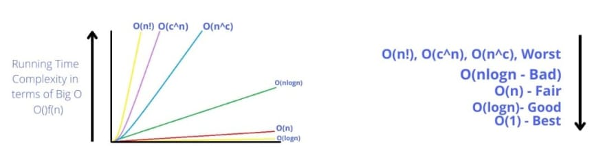
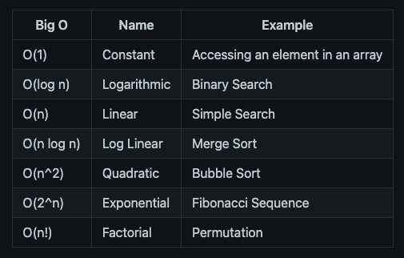
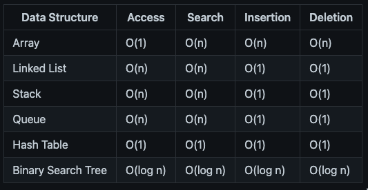

## Что такое Big O?

Big O - это способ измерения эффективности алгоритма. Это способ описать производительность или сложность алгоритма. Это способ сравнить эффективность различных алгоритмов.

Проще говоря, Big O - это способ измерить, насколько быстр алгоритм, и насколько быстро растет время работы алгоритма.

Нотация Big O выражается с помощью математической формулы, в которой используется буква “O” и функция “n”, представляющая собой размер входных данных.

Эта нотация представляет собой скорость роста времени работы алгоритма в зависимости от размера входных данных.

## Как рассчитать Big O?

Самый простой трюк, чтобы узнать Big O функции, - это поиск циклов в функции.

1. Если есть цикл, то Big O будет O(n).

2. Если циклов два, то Big O будет O(n^2).

3. Если петель три, то Big O - O(n^3).

И так далее. (n - количество элементов в цикле)

Для примера рассмотрим следующие функции на языках C, Python и Java.

Пример

1. C :

`int sum(int n) { int total = 0; for (int i = 0; i < n; i++) { total += i; } return total; }`.

2. Python :

`def sum(n): total = 0 for i in range(n): total += i return total`.

3. Java :

`public int sum(int n) { int total = 0; for (int i = 0; i < n; i++) { total += i; } return total; }`.

В этом коде есть цикл, который итерируется n раз, поэтому в нотации Big O для этого кода будет O(n).

## Некоторые распространенные обозначения Big O:

1. O(1) : Постоянное время - без циклов

Примеры O(1):

`// Код на C int print_first_element(int[] lst) { printf("%d", lst[0]); }`.

`# Код Python def print_first_element(lst): print(lst[0])`.

`// Код Java public void print_first_element(int[] lst) { System.out.println(lst[0]); }`

2. O(n) : Линейное время - 1 цикл

Примеры O(n):

`// Код на C int sum(int n) { int total = 0; for (int i = 0; i < n; i++) { total += i; } return total; }`.

`# Код Python def sum(n): total = 0 for i in range(n): total += i return total`

`// Код Java public int sum(int n) { int total = 0; for (int i = 0; i < n; i++) { total += i; } return total; }`

3. O(n^2) : Квадратичное время - 2 цикла

Примеры O(n^2):

`// Код на C int sum_of_pairs(int n) { int total = 0; for (int i = 0; i < n; i++) { for (int j = 0; j < n; j++) { total += i + j; } } return total; }`

`# Код Python def sum_of_pairs(n): total = 0 for i in range(n): for j in range(n): total += i + j return total`

`// Код Java public int sum_of_pairs(int n) { int total = 0; for (int i = 0; i < n; i++) { for (int j = 0; j < n; j++) { total += i + j; } } return total; }`

4. O(log n) : Логарифмическое время - Обычно алгоритмы поиска имеют log n, если они отсортированы (бинарный поиск).

Примеры O(log n):

`// Код на C int binary_search(int[] lst, int target) { int low = 0; int high = lst.length - 1; while (low <= high) { int mid = (low + high) / 2; int guess = lst[mid]; if (guess == target) { return mid; } if (guess > target) { high = mid - 1; } else { low = mid + 1; } } return -1; }`

`# Код Python def binary_search(lst, target): low = 0 high = len(lst) - 1 while low <= high: mid = (low + high) // 2 guess = lst[mid] if guess == target: return mid if guess > target: high = mid - 1 else: low = mid + 1 return -1`.

`// Код Java public int binary_search(int[] lst, int target) { int low = 0; int high = lst.length - 1; while (low <= high) { int mid = (low + high) / 2; int guess = lst[mid]; if (guess == target) { return mid; } if (guess > target) { high = mid - 1; } else { low = mid + 1; } } return -1; }`

5. O(n log n) : Лог-линейное время - Обычно операции сортировки

Примеры O(n log n):

`// Код на C void merge_sort(int[] lst) { if (lst.length < 2) { return; } int mid = lst.length / 2; int[] left = new int[mid]; int[] right = new int[lst.length - mid]; for (int i = 0; i < mid; i++) { left[i] = lst[i]; } for (int i = mid; i < lst.length; i++) { right[i - mid] = lst[i]; } merge_sort(left); merge_sort(right); merge(left, right, lst); }`.

`# Код Python def merge_sort(lst): if len(lst) < 2: return mid = len(lst) // 2 left = lst[:mid] right = lst[mid:] merge_sort(left) merge_sort(right) merge(left, right, lst)`

`// Код Java public void merge_sort(int[] lst) { if (lst.length < 2) { return; } int mid = lst.length / 2; int[] left = new int[mid]; int[] right = new int[lst.length - mid]; for (int i = 0; i < mid; i++) { left[i] = lst[i]; } for (int i = mid; i < lst.length; i++) { right[i - mid] = lst[i]; } merge_sort(left); merge_sort(right); merge(left, right, lst); }`.

6. O(2^n) : Экспоненциальное время - Обычно рекурсивные алгоритмы, решающие задачу размера N

Примеры O(2^n):

`// Код C int fibonacci(int n) { if (n == 0) { return 0; } else if (n == 1) { return 1; } else { return fibonacci(n - 1) + fibonacci(n - 2); } }`

`# Код Python def fibonacci(n): if n == 0: return 0 elif n == 1: return 1 else: return fibonacci(n - 1) + fibonacci(n - 2)`.

`// Java Code public int fibonacci(int n) { if (n == 0) { return 0; } else if (n == 1) { return 1; } else { return fibonacci(n - 1) + fibonacci(n - 2); } }`

7. O(n!) : Факториальное время - Обычно рекурсивные алгоритмы, решающие задачу размера N

Примеры O(n!):

`// Код C int permutation(int[] lst, int k) { if (k == 1) { return 1; } else { return k * permutation(lst, k - 1); } }`

`# Код Python def permutation(lst, k): if k == 1: return 1 else: return k * permutation(lst, k - 1)`.

`// Java Code public int permutation(int[] lst, int k) { if (k == 1) { return 1; } else { return k * permutation(lst, k - 1); } }`

## Big O Graph:

На графике видно, что временная сложность алгоритма растет с увеличением размера входных данных, за исключением O(1) и O(log n), которые являются постоянной и логарифмической временной сложностью соответственно.

Шпаргалка по Big O: (Временная сложность) :

Примечание: Шпаргалка Big O представляет собой краткое описание наиболее распространенных временных сложностей алгоритмов. Это не полный список всех временных сложностей всех алгоритмов.

Большой список общих структур данных: (доступ, поиск, вставка, удаление) :

## Шпаргалка для продвинутых

Вычисление сложности времени:

Примечание: Ниже описаны шаги по вычислению временной сложности алгоритма.

1. Отбрасывание констант: Отбросьте константы во временной сложности. Например, O(2n) - это то же самое, что O(n).

2. Опуская недоминанты: Отбросьте недоминанты во временной сложности. Например, O(n + n^2) - то же самое, что O(n^2).

Например, временная сложность следующего алгоритма равна O(n^2):

`// C Code int sum = 0; // O(1) for (int i = 0; i < n; i++) { // O(n) for (int j = 0; j < n; j++) { // O(n) sum += 1; // O(1) } }`

`# Код Python sum = 0 # O(1) for i in range(n): # O(n) for j in range(n): # O(n) sum += 1 # O(1)`

`// Код Java int sum = 0; // O(1) for (int i = 0; i < n; i++) { // O(n) for (int j = 0; j < n; j++) { // O(n) sum += 1; // O(1) } }`

Расчет временной сложности: O(1) + O(n) + O(n) + O(1) = O(2n) = O(n)

## Заключение

В этой статье мы узнали о нотации Big O и о том, как вычислить временную сложность алгоритма. Мы также узнали о шпаргалке Big O и о Big O распространенных структур данных.

Мой Github: https://github.com/BinayakJha

[Источник](https://dev.to/binayakjha/big-o-a-beginners-guide-175c)
