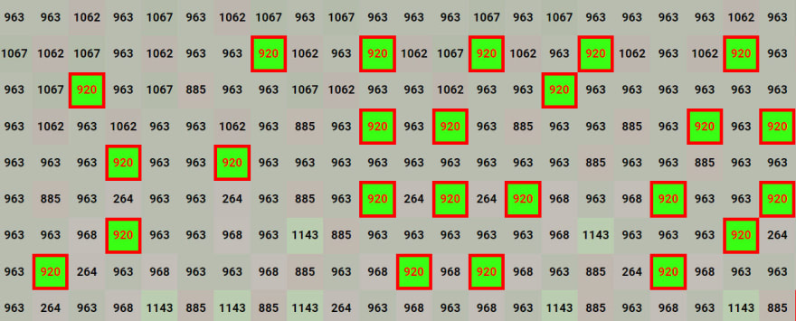

Несколько недель назад я работал над некоторыми функциями для своего сайта цветовых карт (https://paintmap.studio) и столкнулся с некоторыми очень странными ошибками. Я обнаружил, что при использовании функции масштабирования в Chrome (которая есть и в любом другом современном браузере) мой, казалось бы, идеальный код ломался. В частности, свойства CSS и обработчики событий React/JavaScript просто исчезали, когда я просматривал приложение на разных уровнях масштабирования.

Вот точный сценарий (вместе с соответствующим исправлением):

Сначала пользователь выбирает изображение, а также ряд различных параметров, определяющих, как именно оно будет преобразовано. В результате вы получаете пикселизированное изображение, цвета которого соответствуют известному набору цветов из палитры красок. Результат выглядит следующим образом:


Теоретически приложение может обрабатывать изображения любого размера. Это могут быть небольшие изображения, которые легко просматриваются на экране. Но на практике почти все изображения, которые я прогоняю через приложение, довольно большие. Чаще всего они имеют размер 1440x1440 пикселей.

Это означает, что сгенерированное изображение может быть трудно рассмотреть целиком. Поэтому, когда я использую приложение, я обычно устанавливаю функцию масштабирования в браузере на 75 %. На моих 4k-мониторах это позволяет просматривать все изображение размером 1440x1440 на экране без необходимости прокрутки по горизонтали или вертикали.

Еще одна особенность приложения заключается в том, что оно преобразует преобразованное изображение в огромную "карту цветов". Это массивная HTML-таблица, каждая ячейка которой соответствует одному из пиксельных блоков преобразованного изображения. Но на карте каждая из этих ячеек содержит номер, и каждый номер соответствует определенному цвету краски.

(Если вам интересно, смысл этой функции в том, что я могу скопировать и вставить всю HTML-таблицу в электронную таблицу. После того как она окажется в электронной таблице, я смогу использовать ее в качестве шаблона в стиле "рисование по номерам").

К сожалению, преобразование изображения в массивную HTML-таблицу делает экранный вывод еще больше. Это необходимо, потому что если я попытаюсь придерживаться размера исходного изображения, вы никогда не сможете увидеть все числа в каждой отдельной ячейке.

Даже если в браузере установлен 75-процентный масштаб, результирующее изображение выглядит следующим образом:


Это может показаться несколько громоздким, потому что мне все равно придется прокручивать изображение по горизонтали и вертикали, чтобы увидеть его целиком. Но это не так важно, потому что все равно все это будет просто скопировано и вставлено в электронную таблицу. Кроме того, когда вы просматриваете изображение в таком формате, имеющее 144x144 ячейки таблицы, вы можете сделать очень многое, чтобы сделать его "презентабельным" на одном экране.


## Добавление кликабельных элементов

Вот функция, которую мне нужно было добавить. Когда я смотрел на большую "карту цветов", я задавался вопросом: "Сколько еще мест на карте используют тот же цвет, что и в этой конкретной ячейке?".

Например, если посмотреть на следующий участок карты:


Я вижу, что есть определенные блоки, в которых используется цвет #920. Но я хотел иметь возможность быстро увидеть, где во всей цветовой карте встречается цвет #920. Поэтому я добавил немного новой логики в код, который рендерит ячейки таблицы. Это выглядело следующим образом:

```js
const getTableCells = (cells = [rgbModel], rowIndex = -1) => {
	allow.anArrayOfInstances(cells, rgbModel).anInteger(rowIndex, is.not.negative);
	const { highlightedColor } = uiState;

	return cells.map((cell, cellIndex) => {
		const paintIndex = colors.findIndex((color) => color.name === cell.name);
		const darkness = (cell.red + cell.green + cell.blue) / 3;
		let color;
		let backgroundColor;

		if (highlightedColor === cell.name) {
			backgroundColor = '#39ff14';
			color = 'red';
		} else {
			backgroundColor = `rgb(${cell.red}, ${cell.green}, ${cell.blue})`;
			color = darkness < 128 ? 'white' : 'black';
		}

		return (
			<td
				className={'cell'}
				id={cell.name}
				key={`cell-${rowIndex}-${cellIndex}`}
				onClick={handleCellClick}
				style={{
					backgroundColor,
					borderWidth: highlightedColor === cell.name ? 5 : 0,
					color,
				}}
			>
				{paintIndex}
			</td>
		);
	});
};
```

Вот что происходит в этой функции:

Мы берем `highlightedColor` из `uiState`.

Затем для каждой ячейки, если она представляет собой `highlightedColor`, мы устанавливаем стиль, чтобы фон был неоново-зеленым, с красным номером и шириной границы 5. Если это не `highlightedColor`, то мы устанавливаем для ячейки "обычный" цвет фона, с черным номером и шириной границы 0.

Мы установили обработчик `onClick` для каждой ячейки, который будет обновлять `highlightedColor`.

Мы также установили `className` для каждой ячейки в `cell`.

CSS-класс `cell` выглядел следующим образом:

```css
.cell {
	border-color: red;
	border-style: solid;
	cursor: pointer;
	font-weight: bold;
	height: 50px;
	min-height: 50px;
	min-width: 50px;
	text-align: center;
	transform-origin: 0 0;
	vertical-align: middle;
	width: 50px;
}
```

Обратите внимание, что я установил атрибут `cursor` в значение `pointer`, чтобы дать дополнительную визуальную подсказку, что каждая отдельная ячейка таблицы действительно является кликабельной.

А обработчик события `handleCellClick()` выглядел следующим образом:

```js
const handleCellClick = (event = {}) => {
	allow.anObject(event, is.not.empty);
	uiState.toggleHighlightedColor(event.target.id);
};
```

В результате, если я щелкну на любой ячейке, содержащей #920, предыдущий подраздел будет выглядеть следующим образом:



А если я сильно уменьшу масштаб, то получу нечто похожее на это:


Это позволило мне быстро увидеть все остальные места на изображении, где использовался тот же цвет.


## Проблема масштабирования

Сначала я был очень доволен новой функцией выделения цветом. Но потом я заметил кое-что странное.

Когда я просматривал карту цветов без применения масштабирования в браузере, все работало отлично. Но просмотр без масштабирования означал, что я мог видеть только крошечную часть на экране. Но когда я вернулся к своим "нормальным" настройкам - браузерный зум = 75 % - произошло нечто очень странное.

Большинство обработчиков `onClick` работали просто отлично. Но в некоторых частях карты они вообще ничего не делали. Кроме того, для большинства ячеек таблицы был применен CSS-атрибут `cursor: pointer`. Но во всех ячейках, где обработчик `onClick` не срабатывал, курсор также возвращался к своему значению по умолчанию `pointer`.

Я не смог найти никакой причины, по которой значения событий/CSS не срабатывали в одних ячейках, но прекрасно работали в других. Более того, конкретные ячейки, которые не работали или работали, менялись в зависимости от конкретной настройки масштаба, которую я выбрал в браузере.

При 75% масштабировании определенная область ячеек потеряет свои настройки событий/CSS. Но при масштабировании 66 % совершенно разные области теряли настройки. Я также заметил, что при 50-процентном масштабировании все работало просто отлично. Это был критический ключ к разгадке происходящего.


## Опасности субпиксельного рендеринга

Вы могли заметить, что в большинстве современных IDE, если вы попытаетесь вручную задать свойству CSS субпиксельное значение (например, `height: 50.33px`), вы получите какое-то предупреждение. Это происходит потому, что браузеры могут неадекватно реагировать, когда вы задаете значения пикселей, которые не являются целыми числами.

Конечно, в моем примере я не устанавливал вручную атрибуты стиля на субпиксельные значения. Все было настроено на красивые, чистые, целые числа. Но вот в чем загвоздка:

Когда пользователь вручную изменяет изображение с помощью функции масштабирования браузера, это заставляет все на экране перерисовываться. И эти повторные рендеринги часто превращают ваши красивые, чистые, целые числа в субпиксельные вычисления.

Например, я устанавливал для каждой ячейки таблицы `высоту: 50px` и `ширину: 50px`. В этом нет ничего плохого. Но если пользователь устанавливает коэффициент масштабирования 66%, то теперь высота и ширина каждой ячейки становится равной `33,33px`.

Буду честен. Я не до конца понимаю, что происходит в кишках самого браузера, из-за чего ячейка таблицы с `высотой: 33.33px` и `шириной: 33.33px` вдруг теряет свои CSS-свойства или обработчики событий. Но опытным путем мне удалось доказать, что эти субпиксельные вычисления действительно были источником моей проблемы.

Это объясняет, почему при разных уровнях масштабирования одни области карты цветов работают отлично, а другие - нет. Потому что, когда вы выстраиваете последовательные ячейки таблицы на экране при масштабе, скажем, 66 %, первая ячейка будет "выбиваться" из нормальной пиксельной сетки экрана (из-за этого надоедливого модификатора `.33px`). И вторая ячейка также будет "выключена" из пиксельной сетки (потому что теперь эта ячейка по сути смещена на `.66px`). Но третья ячейка сможет "вклиниться" в нормальную пиксельную сетку экрана. Потому что к моменту рендеринга третьей ячейки ее "смещение" составляет `1/3 + 1/3 + 1/3 = 1` - это означает, что она может "вклиниться" в "нормальное" отображение монитора.

Это также объясняет, почему мой код отлично работал при 100% масштабировании и 50% масштабировании, но не работал при масштабировании 66% или 75%. Потому что при 50-процентном масштабировании все мои ячейки `height: 50px; width: 50px;` становились... `высота: 25px; ширина: 25px;` ячейки - это означает, что при 50% масштабировании все по-прежнему отображалось с хорошими, чистыми, целыми числами пикселей.


## Исправление

К счастью, когда я понял, что происходит, и немного погуглил по CSS, я смог решить всю проблему с помощью одной строчки CSS. Я изменил свой CSS-класс `cell`, добавив следующее:

`transform: scaleX(1) scaleY(1);`

По сути, это означает, что каждая ячейка должна масштабироваться, чтобы занять 100% своих границ. Это, в свою очередь, похоже, устраняет проблему, которую CSS- и event-обработчики имели с элементами, стилизованными под субпиксели.


Но... кого это волнует?

Вполне разумно посмотреть на этот странный баг и задуматься, стоит ли вообще о нем беспокоиться. Поначалу я просто отбросил его как странный крайний случай, с которым я никогда раньше не сталкивался, и, вероятно, мне никогда больше не придется о нем беспокоиться.

Но... На самом деле я уверен, что уже сталкивался с этой проблемой. В прошлом бывали случаи, когда я работал над сайтом, и мне надоедало прокручивать экран, чтобы проверить функциональность. Поэтому я уменьшал экран, чтобы видеть все в одном кадре. Но потом, после нескольких дней или даже недель использования сайта таким образом, я обнаруживал странный сбой в приложении.

После дальнейшего расследования и осознания того, что никто из моих коллег не смог воспроизвести ошибку, я понял, что проблема возникла только у меня, потому что я был единственным, кто использовал сайт на уровне масштабирования не 100 %. Что же я сделал? Я просто вернул масштаб на 100 % и пошел по своим делам.

В конце концов, никто больше не сообщал об этой ошибке и никак не жаловался на нее. Поэтому я не хотел тратить циклы разработчиков на устранение проблемы, которая больше никого не волновала.

Единственная причина, по которой я чувствовал необходимость исправить ошибку в данном конкретном случае, заключалась в том, что она была важна для меня. В частности, это "важно" потому, что трудно просматривать большие цветные карты на экране, если я не уменьшаю их до приемлемого размера.

Кроме того, даже если бы кто-то в прошлом пожаловался на неработающие функции в форматах без 100-процентного увеличения, я уверен, что отнесся бы к этому довольно пренебрежительно. Не то чтобы я не заботился о пользовательском опыте. Но мои рассуждения были бы такими:

Мы тратим много времени на то, чтобы обеспечить оптимальную работу сайта в разрешении по умолчанию. Если вы считаете необходимым изменить это разрешение (по какой-то странной причине), я не могу беспокоиться о том, чтобы тестировать и устранять все крайние случаи, которые возникают из-за того, что люди используют сайт не по назначению.

Возможно, это звучит легкомысленно. Но в браузере можно сделать/использовать множество вещей, которые противоречат первоначальному замыслу разработчиков. И вряд ли можно ожидать, что мы будем уделять много времени устранению неполадок, связанных с вашим нестандартным способом использования приложения.

Например: Я получал заявки на "ошибку" от пользователей, которые говорили, что на сайте что-то сломалось. Когда я разбирался с этим, я не мог воссоздать ошибку. Не смогли и другие члены нашей команды. Когда я связался с пользователем напрямую, я понял, что "ошибка" была вызвана тем, что он использовал какой-то сторонний плагин для браузера. И он мешает нормальной работе сайта.

В таких случаях я всегда отвечал одно и то же: "Прекратите использовать этот сторонний плагин для браузера на нашем сайте". Конечно, некоторые люди ныли по поводу такого ответа. Но я всегда получал поддержку в этом вопросе от своего руководства. Потому что пытаться обеспечить правильную работу приложения независимо от того, какой сторонний плагин кто-то решит использовать, - это ужасная кроличья нора, которая не приносит почти никакой ощутимой пользы.

Наконец, проблемы, вызванные функцией масштабирования в браузере, кажутся крайними случаями. Я имею в виду, что 99,99 % времени, когда я просматриваю/использую любой сайт, я просматриваю/использую его на стандартном уровне масштабирования 100 %. Для подавляющего большинства пользователей, вероятно, большинство/все сайты также используются при 100%-ном масштабировании.


## Проблема доступности

Но чем больше я думал об этом, тем больше понимал, что это проблема доступности. И я не думаю, что многие команды разработчиков задумываются об этом.

Я работал над приложениями, где доступность никого не волновала. У нас была ограниченная база пользователей, и руководство не придавало значения стандартам доступности. Поэтому мы с радостью создавали код, не заботясь о таких вещах, как соответствие A11Y.

Я также работал в командах, где доступность была критически важна. Там мы постоянно запускали инструменты аудита и проповедовали важность стандартов доступности во всем, что мы создавали.

Даже в тех "проснувшихся" средах я не помню, чтобы кто-то говорил, что нам нужно проверять возможности сайта при разных уровнях масштабирования. Но какая часть вашей пользовательской базы с наибольшей вероятностью будет использовать ваш сайт/приложение при разных уровнях масштабирования? Правильно. Люди с ослабленным зрением. И если ключевые функции вашего сайта просто ломаются, скажем, при 125%-ном увеличении, вы можете оттолкнуть этих пользователей.

Для ясности, я даже не уверен, как именно вы тестируете это. Например, если вы пишете модульные тесты Jest, вы не сможете проверить функциональность на разных уровнях масштабирования. Вам придется использовать решение для безголового браузера. И я не уверен, что инструменты быстрого аудита (например, Axe) вообще проверяют такие вещи? Мне придется изучить этот вопрос подробнее.

Во всяком случае, я не пытаюсь перечеркнуть ваши текущие методы обеспечения доступности. И если честно, возможно, в вашей мастерской это даже не стоит на повестке дня. Но я просто подчеркиваю, что это одна из потенциальных проблем, о которой вам, возможно, стоит помнить в будущем.

Будьте здоровы! И счастливого кодинга.
