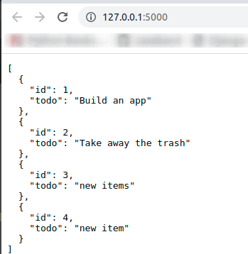
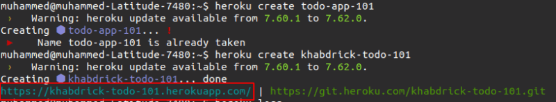
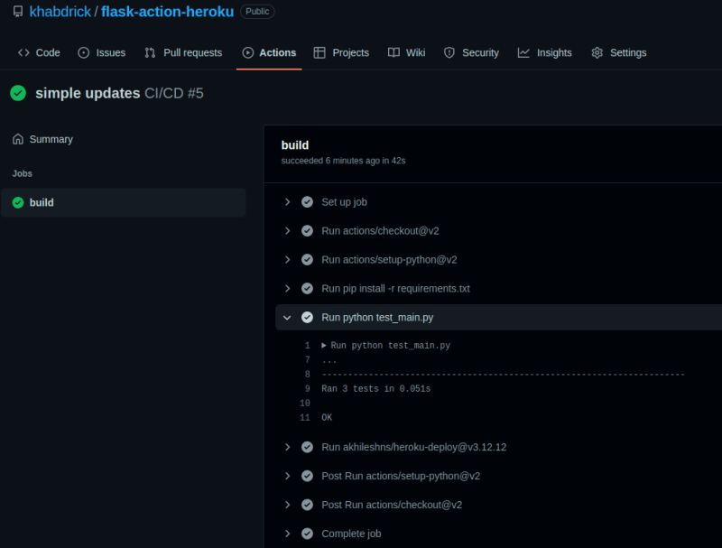
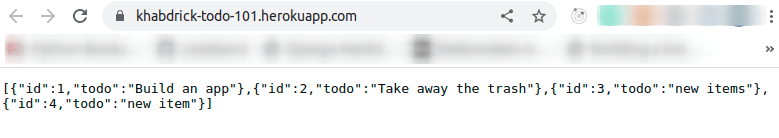

Эта статья была первоначально написана Мухаммедом Али в блоге разработчиков Honeybadger.

Практика непрерывной интеграции (CI) и непрерывного развертывания (CD) подразумевает создание автоматизированного потока, который регулирует, как изменения будут интегрированы в основной проект и как эти новые изменения будут развернуты.

GitHub Actions - это функция на GitHub, которая позволяет реализовать CI/CD в репозитории вашего проекта. Как правило, использование GitHub Actions является разумной идеей, поскольку позволяет автоматизировать такие задачи, как тестирование и развертывание проекта, непосредственно в вашем репозитории GitHub.

В этой статье вы узнаете, как создать Flask API, написать несколько модульных тестов для конечных точек API, а затем разработать конвейер, который будет тестировать Flask API и развертывать его на Heroku, если все тесты пройдут.  
Код для этого руководства вы можете найти на GitHub.

## Создание базового Flask API

В этом разделе вы создадите API для списка дел, который станет приложением, которое будет развернуто на Heroku. Мы создадим базовую CRUD-функциональность для списка дел.

Во-первых, давайте начнем с начального импорта. Создайте папку, в которой будут храниться все файлы вашего приложения, а затем в этой папке создайте файл с именем `main.py` и вставьте в него следующий код. Здесь мы просто импортируем `Flask` и `SQLAlchemy` (необходимые для работы соединения с базой данных), а также инициализируем приложение `Flask` и базу данных.

`from flask import Flask, jsonify, request, json from flask_sqlalchemy import SQLAlchemy # инстанцируем функциональность Flask app = Flask(__name__) # устанавливаем URI sqlalchemy в конфигурации приложения app.config["SQLALCHEMY_DATABASE_URI"] = "sqlite:///test.db" app.config["SQLALCHEMY_TRACK_MODIFICATIONS"] = False db = SQLAlchemy(app) # экземпляр SQL`.

Далее нам нужно создать модели для базы данных. Они будут указывать на поля в базе данных. Для этого вставьте приведенный ниже код прямо под секцией кода выше.

`# ... class TodoList(db.Model): id = db.Column(db.Integer, primary_key=True) todo = db.Column(db.Text, nullable=False) def __str__(self): return f"{self.id} {self.todo}"`.

Далее мы можем создать функцию, которая будет считывать все пункты списка дел. JSON - это обобщенный формат, в котором данные могут быть приняты от клиента, поэтому нам также понадобится функция, которая преобразует все элементы, полученные из базы данных, в JSON. Это можно сделать, вставив следующий код.

`# ... def todo_serializer(todo): # конвертирует данные из TodoList в JSON return {"id": todo.id, "todo": todo.todo}  @app.route("https://dev.to/", methods=["GET"]) def home(): return jsonify([*map(todo_serializer, TodoList.query.all())]) #получить все элементы в TodoList`.

Теперь мы разработаем функцию `todo_create()`, которая будет создавать новый пункт дел. Функция преобразует данные JSON, полученные от клиента, в формат, понятный Python, а затем сохранит их в базе данных. Вы можете сделать это, вставив следующий код.

`# ... @app.route("/todo-create", methods=["POST"]) def todo_create(): # добавляем todo в базу данных request_data = json.loads(request.data) todo = TodoList(todo=request_data["todo"]) db.session.add(todo) db.session.commit() return {"201": "todo создан успешно"}`

Теперь перейдем к функциональности обновления. Сначала вы извлечете каждое дело на основе введенного `id`, а затем сможете обновить его. Вставьте следующий код, чтобы реализовать эту функциональность.

`# ... @app.route("/update/<int:id>", methods=["PUT"]) def update_todo(id): # редактируем элемент todo на основе ID item = TodoList.query.get(id) request.get_json(force=True) todo = request.json["todo"] item.todo = todo db.session.commit() return {"200": "Обновлено успешно"}`

Наконец, мы создадим функцию удаления. Мы получим список дел на основе введенного `id`, а затем удалим его оттуда. В конце мы также добавим строку, которая запустит сервер Flask.

`# ... @app.route("/<int:id>", methods=["POST"]) def delete_todo(id): # удаляем элемент todo из списка request.get_json(force=True) request_data = json.loads(request.data) TodoList.query.filter_by(id=request_data["id"]).delete() db.session.commit() return {"204": "Удаление прошло успешно"} if __name__ == "__main__": app.run(debug=True)`.

Теперь выполните следующую команду, чтобы запустить сервер приложений Flask:

`python main.py`

Откройте другое окно терминала и выполните следующую команду, чтобы создать новый пункт дел. Замените `<add new to-do item>` в приведенной ниже команде на пункт дел, который вы хотите добавить в список.

`curl -d '{"todo":"<add new to-do item>"}' -H "Content-Type: application/json" -X POST [http://127.0.0.1:5000/todo-create](http://127.0.0.1:5000/todo-create)`

Когда вы откроете API в браузере с помощью http://127.0.0.1:5000, вы увидите список дел в формате JSON.

## Написать модульные тесты для приложения

Поскольку мы закончили с созданием API, мы можем написать модульные тесты для конечных точек, чем мы и займемся в этом разделе. Для начала создайте новый файл с именем `test_main.py` и вставьте в него следующий код. Следующий код создает некоторые начальные данные в тестовой базе данных, которая будет использоваться для тестирования конечных точек API.

`from main import db, app, TodoList import json import unittest TEST_DB = "app_test.db" class RecipesApiTests(unittest.TestCase):  # выполняется перед каждым запуском теста def setUp(self): app.config["TESTING"] = True app.config["WTF_CSRF_ENABLED"] = False app.config["DEBUG"] = False app.config["SQLALCHEMY_DATABASE_URI"] = "sqlite:///app_test.db" self.app = app.test_client() db.drop_all() # удаляем таблицы из предыдущих тестов db.create_all() # таблицы в базе данных self.create_todo() self.assertEqual(app.debug, False) def create_todo(self): # создаем пункты дел, которые будут использоваться для тестирования item1 = TodoList(todo="Пойти в школу") item2 = TodoList(todo="Приготовить средиземноморскую курицу") db.session.add(item1) db.session.add(item2) db.session.commit()`

Чтобы протестировать конечную точку API list, мы должны убедиться, что элементы, которые мы получаем от этой конечной точки, совпадают с теми, что были сохранены в тестовой базе данных, и что код состояния, приходящий в качестве вывода, равен `200`. Это можно сделать, вставив следующий код:

`# ... class RecipesApiTests(unittest.TestCase):  # ... def test_todo_list_endpoint(self): response = self.app.get("https://dev.to/") # print (response.data) self.assertEqual( response.data, b'[{"id":1, "todo": "Go to school"},{"id":2, "todo": "Make Mediterranean Chicken"}]\n', ) self.assertEqual(response.status_code, 200)`

Для конечных точек создания и обновления мы будем утверждать, что код `статуса` в основном приложении одинаков при выполнении тестов. Это можно сделать, вставив следующий код:

`# ... def test_todo_creation_endpoint(self): json_data = {"todo": "Пойти в школу"} response = self.app.post("/todo-create", data=json.dumps(json_data)) # print(response.data) self.assertEqual(response.data, b'{"201": "todo created successfully"}\n') def test_update_todo_endpoint(self): json_data = {"todo": "просто обновление"} response = self.app.put( "/update/1", data=json.dumps(json_data), # follow_redirects=True ) self.assertEqual(response.data, b'{"200": "Updated successfully"}\n') if __name__ == "__main__": unittest.main()`

Вы можете запустить тест, выполнив следующую команду:

`python test_main.py`.

## Подготовьте приложение Flask для Heroku

Сначала мы создадим WSGI-файл интерфейса шлюза веб-сервера, который будет использоваться Heroku для запуска нашего приложения на их сервере. Это можно сделать, создав файл с именем `[wsgi.py](http://wsgi.py)` и вставив в него следующий код:

`from main import app if __name__ == "__main__": app.run()`.

Теперь мы можем создать `Procfile` для Heroku. В `Procfile` содержится команда, которая будет выполняться после развертывания приложения на Heroku. Вы можете сделать это, создав новый файл с именем `Procfile` и вставив в него следующую команду. Мы будем использовать Gunicorn для запуска приложения вместо стандартного сервера Flask.

`web: gunicorn wsgi:app`

Теперь укажите список зависимостей, необходимых для этого приложения, создав новый файл с именем `requirements.txt` и вставив в него следующий текст. Он будет использоваться в вашем конвейере и на Heroku.

`Flask==2.1.0 Flask-SQLAlchemy==2.5.0 gunicorn`.

## Настройка Heroku

Прежде чем продолжить, необходимо создать учетную запись Heroku, если у вас ее еще нет, а затем установить Heroku CLI.

Теперь вы можете войти в Heroku CLI, выполнив следующую команду:

`heroku login`.

Далее создайте приложение Heroku, выполнив следующую команду. Замените `todo-app-101` в команде ниже на любое имя, которое подходит для вашего приложения.

`heroku create todo-app-101`

После создания приложения вам будет предоставлен URL-адрес, который вы сможете использовать для доступа к приложению после его развертывания. Вы также сможете увидеть его на приборной панели Heroku.

Теперь нам нужно получить API-ключ для нашего аккаунта Heroku. Это необходимо для того, чтобы GitHub Action знал, на какой аккаунт разворачивать приложение. Получить его можно, зайдя в настройки аккаунта. Находясь на странице настроек аккаунта, прокрутите страницу вниз, и вы увидите пункт "API Key"; запишите его, так как он понадобится позже в этой статье.

## Создайте CI/CКонвейер D с помощью действий GitHub

Создайте папку с именем `.github` в корне вашего проекта, а в ней создайте `workflows/main.yml`; путь должен быть `.github/workflows/main.yml`, чтобы GitHub Actions заработали в вашем проекте.

У GitHub Actions есть три уровня:

`workflows` - файл, содержащий процесс автоматизации. Рабочий процесс может обрабатывать несколько заданий.

`Задания` - это набор шагов или инструкций, которые выполняются на одном и том же бегуне. Запускающее устройство - это операционная система, на которой должно выполняться ваше задание.

Шаги" представляют собой последовательность задач, которые будут выполняться в рамках задания.

Теперь мы можем приступить к разработке `заданий` и `шагов`. Это можно сделать, вставив следующие конфигурации в только что созданный файл. Конфигурация ниже установит зависимости, а затем запустит тесты. Если все тесты пройдут, она перейдет к следующим шагам, которые занимаются развертыванием приложения.

`Имя: CI/CD # Управляет тем, когда рабочий процесс будет запущен: # Активирует рабочий процесс; затем происходит толчок в главную или master ветку push: branches: [main, master] # позволяет вручную запустить этот конвейер на вкладке Actions. workflow_dispatch:  # Запуск рабочего процесса состоит из одного или нескольких заданий, которые могут выполняться как последовательно, так и параллельно. jobs: # Этот рабочий процесс содержит одно задание под названием "build" build: # Тип runner, на котором будет выполняться задание runs-on: ubuntu-latest # steps: - uses: actions/checkout@v2 - uses: actions/setup-python@v2 - run: pip install -r requirements.txt # установить требования для включения GitHub run tests - run: python test_main.py - uses: akhileshns/heroku-deploy@v3.12.12 # with: heroku_api_key: put-the-api-key-you-copied-ealier heroku_app_name: khabdrick-todo-101 heroku_email: yoursignupemail@gmail.com`

## Активируйте трубопровод

Вы можете активировать этот конвейер, создав репозиторий на GitHub и разместив в нем свой код, а GitHub выполнит всю остальную работу. После того как ваш код будет размещен, перейдите в репозиторий на GitHub, щелкните на вкладке "Действия". Затем нажмите на коммит, который вы только что сделали, и вы увидите, что рабочий процесс прошел успешно.

Это означает, что ваше приложение теперь развернуто на Heroku. Вы можете получить к нему доступ, открыв в браузере URL, который вы получили ранее. Вы можете продолжить тестирование других конечных точек.

## Заключение

В этом посте вы узнали, как создать список дел с помощью Flask API. Вы также узнали, как создавать модульные тесты для конечных точек API и создавать конвейер, который будет тестировать Flask API и развертывать его на Heroku, если все тесты пройдут.

Более того, вы можете развить эти знания, создав конвейер, который можно развернуть на голом Linux-сервере или на платформе, подобной DigitalOcean.
