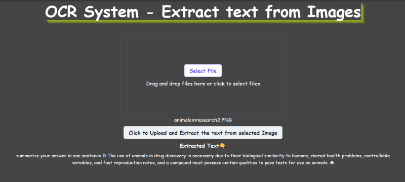
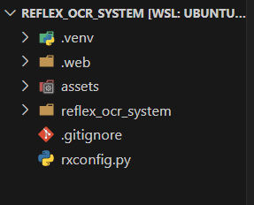
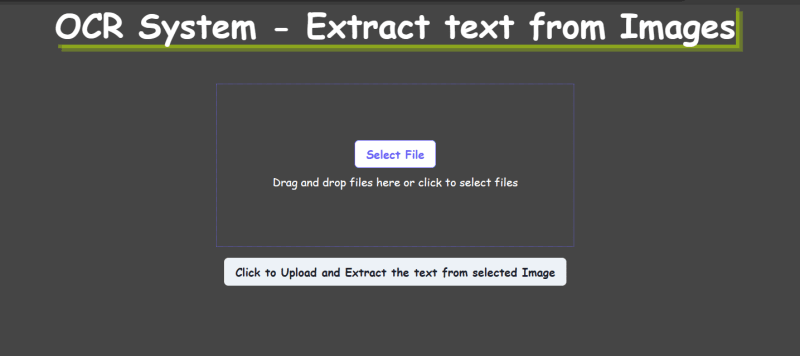

Иногда вам может понадобиться извлечь текст из изображения, не набирая его вручную. Но что делать, если вы не можете легко скопировать текст с изображения?

В этой статье я покажу вам, как с помощью Reflex создать приложение, способное извлекать текст из изображений.

На выходе приложение будет выдавать следующее:  

## Контур

Создайте новую папку, откройте ее в редакторе кода Создайте виртуальную среду и активируйте Установите требования reflex setup reflex_ocr_system.py state.py style.py .gitignore run app conclusion

Создайте новую папку, откройте ее в редакторе кода

Создайте новую папку и назовите ее `reflex_ocr_system`, затем откройте ее с помощью редактора кода, например VS Code.

Создайте виртуальную среду и активируйте

Откройте терминал. С помощью следующей команды создайте виртуальную среду `.venv` и активируйте ее:

`python3 -m venv .venv`.

`source .venv/bin/activate`

## Требования к установке

Нам потребуется установить `reflex` для сборки приложения, а также `tesseract-ocr` `pytesseract` `Pillow` для обработки изображения и извлечения из него текста.  
Выполните следующую команду в терминале:

`sudo apt-get install tesseract-ocr`.

`pip install reflex==0.2.9 pip install pytesseract==0.3.10 pip install Pillow==10.1.0`.

## настройка рефлектора

Теперь нам нужно создать проект с помощью reflex. Выполните следующую команду для инициализации шаблонного приложения в директории `reflex_ocr_system`.

`reflex init`

Приведенная выше команда создаст следующую структуру файлов в директории `reflex_ocr_system`:

Вы можете запустить приложение, используя следующую команду в терминале, чтобы увидеть приветственную страницу при переходе на http://localhost:3000/ в браузере.

`reflex run`

reflex_ocr_system.py

Нам нужно создать структуру и интерфейс приложения. Перейдите в подкаталог `reflex_ocr_system` и откройте файл `reflex_ocr_system.py`. Здесь мы будем добавлять компоненты для создания структуры и интерфейса приложения. Добавьте в него следующий код:

`import reflex as rx # import State and style from reflex_ocr_system.state import State from reflex_ocr_system import style # color for the upload component color = "rgb(107,99,246)" def index(): """Главное представление.""" return rx.vstack( rx.heading("Система OCR - извлечение текста из изображений",style=style.topic_style), rx.upload( rx.vstack( rx.button("Select File", color=color, bg="white", border=f "1px solid {color}", ), rx.text("Перетащите файлы сюда или нажмите для выбора файлов", color="white", ), ), multiple=False, accept={"image/png": [".png"], "image/jpeg": [".jpg", ".jpeg"], "image/gif": [".gif"], "image/webp": [".webp"], }, max_files=1, disabled=False, on_keyboard=True, border=f "1px dotted {color}", padding="5em", ), rx.hstack(rx.foreach(rx.selected_files, rx.text,), color="white",), rx.button("Нажмите, чтобы загрузить и извлечь текст из выбранного изображения", on_click=lambda: State.handle_upload( rx.upload_files() ), is_loading=State.is_loading, loading_text=State.loading_text, spinner_placement="start", ), rx.text(State.extracted_text_heading, text_align="center", font_weight="bold", color="white",), rx.text(State.extracted_text, text_align="center",style=style.extracted_text_style), )  # Добавляем состояние и страницу в приложение. app = rx.App(style=style.style) app.add_page(index) app.compile()`

Приведенный выше код отобразит текст, компонент загрузки файла, имя выбранного файла, кнопку, текст и извлеченный текст.

## state.py

Создайте новый файл `state.py` в подкаталоге `reflex_ocr_system` и добавьте в него следующий код:

`import reflex as rx import pytesseract from PIL import Image class State(rx.State): """Состояние приложения.""" extracted_text_heading: str extracted_text: str is_loading: bool = False loading_text: str = "" async def handle_upload( self, files: list[rx.UploadFile] ): """Обработка загрузки файлов и извлечения текста.  Args: files: Загруженные файлы. """  # устанавливаем следующие значения, чтобы крутить кнопку и # показывать текст self.is_loading = True self.loading_text = "uploading and extracting text...." yield for file in files: upload_data = await file.read() outfile = rx.get_asset_path(file.filename) # Сохраняем файл. with open(outfile, "wb") as file_object: file_object.write(upload_data) # Открываем изображение с помощью Pillow (PIL) image = Image.open(outfile) # Используем Tesseract для извлечения текста из изображения text = pytesseract.image_to_string(image) text = text.encode("ascii", "ignore") self.extracted_text = text.decode() self.extracted_text_heading = "Extracted Text👇"  # снова сбрасываем переменную состояния self.is_loading = False self.loading_text = "" yield`

Приведенный выше кодe получит загруженный файл, сохранит его и с помощью Tesseract извлечет текст из изображения. Переменная `is_loading` управляет вращением кнопки, а переменная `loading_text` показывает текст, когда кнопка вращается.

## style.py

Создайте новый файл `style.py` в подкаталоге `reflex_ocr_system` и добавьте в него следующий код. Это добавит стили к странице и компонентам:

`style = { "background-color": "#454545", "font_family": "Comic Sans MS", "font_size": "16px", } topic_style = { "color": "white", "font_family": "Comic Sans MS", "font_size": "3em", "font_weight": "bold", "box_shadow": "rgba(190, 236, 0, 0.4) 5px 5px, rgba(190, 236, 0, 0.3) 10px 10px", "margin-bottom": "3rem", } extracted_text_style = { "color": "white", "text-align": "center", "font_size": "0.9rem", "width": "80%", "display": "inline-block", "display": "inline-block", }`

## .gitignore

Вы можете добавить каталог `.venv` в файл `.gitignore`, чтобы получить следующее:

`*.db *.py[cod] .web __pycache__/ .venv/`

## Запустить приложение

Чтобы запустить приложение, выполните следующие действия в терминале:

`reflex run`.

При переходе на сайт http://localhost:3000/ вы должны увидеть следующий интерфейс.

Вы можете загрузить изображение, а затем нажать кнопку, чтобы извлечь текст изображения.

## Заключение

Обратите внимание, что точность OCR может варьироваться в зависимости от качества изображения, шрифтов и языков, используемых в нем.

Вы можете получить код: https://github.com/emmakodes/reflex_ocr_system.git

Чтобы узнать больше о Reflex, вы можете прочитать здесь: https://reflex.dev/.

Чтобы установить `tesseract-ocr` на другие платформы, вы можете посмотреть это решение: решения для установки tesseract-ocr
