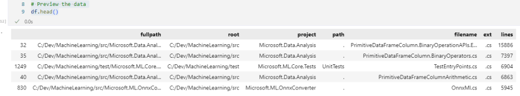

В прошлом году я придумал несколько способов визуального анализа истории и структуры кода, но не задокументировал большую часть этой работы, чтобы поделиться с сообществом. В этой статье рассматривается процесс, который я использовал для создания CSV-файла, содержащего путь, расширение, проект и количество строк кода во всех исходных файлах проекта.

Примечание: если идея получения данных из git-репозитория вас заинтересовала, ознакомьтесь с моей статьей об использовании PyDriller для извлечения git-информации.

Этот код эффективен, если вы хотите быстро проанализировать файлы кода, хранящиеся на вашем жестком диске, и собрать набор данных для дальнейшего анализа и визуализации данных.

Большая часть кода на Python, которым я делюсь, в значительной степени заимствована из различных ответов на StackOverflow с моими собственными изменениями и доработками. Я постарался указать все источники, которые я использовал, но этот код был создан год назад, и я мог забыть пару полезных источников.

## Зависимости

Я написал этот код, используя Python 3.8, запущенный на Jupyter Notebook под управлением Python 3.8. Однако для работы этого кода Jupyter Notebook не обязателен.

Код опирается на стандартную для Python библиотеку `os`, а также на библиотеку `pandas` для анализа табличных данных.

`import pandas as pd import os`

Код

Далее следует последовательная разбивка функций, необходимых для выполнения задачи извлечения данных из кода.

## Идентификация файлов

Анализ файлов невозможен без определения того, какие файлы нужно анализировать.

Для этого я использую метод `listdir` библиотеки `os`, а также несколько других методов путей и каталогов для рекурсивного обхода дерева каталогов, начиная с заданного каталога.

Я также намеренно игнорирую каталоги, которые, как известно, содержат большое количество нежелательных файлов, такие как каталоги отчетов, каталог .git и каталоги, используемые средой разработки.

`# Некоторые каталоги следует игнорировать, так как их вывод не приносит пользы ignored_directories = ['.git', '.vs', 'obj', 'ndependout', 'bin', 'debug'] def get_file_list(dir_path, paths=None): """ Получает список файлов в этом каталоге и всех содержащихся в нем директориях """" files = list() contents = os.listdir(dir_path) for entry in contents: path = os.path.join(dir_path, entry) if os.path.isdir(path): # Игнорируем каталоги сборки и отчетов if entry.lower() in ignored_directories: continue # Сохраняем точный, но отдельный массив иерархии if paths is None: p = [entry] else: p = paths[:] p.append(entry) files = files + get_file_list(path, p) else: files.append((path, paths)) return files`

## Определение того, содержит ли файл исходный код

Для того чтобы определить, является ли файл исходным кодом и должен ли он быть включен в результаты, я выбрал наивный подход, при котором я обращаю внимание только на файлы с определенными расширениями.

Этот код мог бы выиграть от более полного списка или даже, возможно, от расширенного анализа содержимого файлов. Однако для моих целей достаточно было просто посмотреть на расширение, что должно удовлетворить большинство читателей.

`# Общие расширения исходных файлов. Этот список очень неполный. Намеренно не включает JSON / XML source_extensions = [ '.cs', '.vb', '.java', '.r', '.agc', '.fs', '.js', '.cpp', '.go', '.aspx', '.jsp', '.do', '.php', '.ipynb', '.sh', '.html', '.lua', '.css' ] def is_source_file(file_label): """ Определяет, что такое исходный файл. """ file, _ = file_label _, ext = os.path.splitext(file) return ext.lower() in source_extensions`

## Подсчет строк кода

После этого мне нужно было быстро определить длину файла.

Я воспользовался ответом Stack Overflow, чтобы определить, как эффективно считать количество строк в файле, используя следующий код:

`def count_lines(path): """ Читает файл по указанному пути и возвращает количество строк в этом файле """ def _make_gen(reader): b = reader(2 ** 16) while b: yield b = reader(2 ** 16) with open(path, "rb") as f: count = sum(buf.count(b"\n") for buf in _make_gen(f.raw.read)) return count`

Этот код использует буферизированный считыватель для быстрого чтения через буфер файла и возврата общего количества.

Для интересующихся Geeks for Geeks предлагает более медленную, но более понятную реализацию:

`def count_lines_simple(path): with open(path, 'r') as fp: return sum(1 for line in fp)`.

## Получение метрик файлов

После этого я создал функцию, которая могла принимать несколько файлов и генерировать список детальных объектов для всех файлов в списке.

Каждый объект детализации файла содержал:

Корневой каталог, в котором начался анализ Полный путь к файлу Проект, в котором находится файл (базовый каталог в проекте, в котором находится файл) Путь к файлу относительно имени файла Расширение файла Количество строк в файле

Это достигается путем перебора всех файлов и папок во входящем параметре files, затем подсчета строк в файлах с помощью функции `count_lines`, перечисления всех папок и построения информации о пути к каждому файлу.

Когда вся информация известна, создается объект file details, который добавляется в файлрезультирующий список, который возвращается после анализа всех файлов.

`def get_file_metrics(files, root): """ Эта функция получает все метрики для файлов и возвращает их в виде списка объектов детализации файлов """" results = [] for file, folders in files: lines = count_lines(file) # Медленно, так как фактически читает файл _, filename = os.path.split(file) _, ext = os.path.splitext(filename) fullpath = '' if folders != None and len(folders) > 0: project = folders[0] for folder in folders[1:]: if len(fullpath) > 0: fullpath += "https://dev.to/" fullpath += folder else: project = '' if len(fullpath) <= 0: fullpath = '.' id = root + "https://dev.to/" + project + "https://dev.to/" + fullpath + "https://dev.to/" + filename file_details = { 'fullpath': id, 'root': root, 'project': project, 'path': fullpath, 'filename': filename, 'ext': ext, 'lines': lines, } results.append(file_details) return results`

## Собираем все вместе

Наконец, я создал центральную функцию для запуска анализа исходных текстов по заданному пути:

`def get_source_file_metrics(path): """ Эта функция получает все исходные файлы и метрики, связанные с ними, из заданного пути """ source_files = filter(is_source_file, get_file_list(path)) return get_file_metrics(list(source_files), path)`

Эта функция обращается к другим функциям для построения результирующего списка сведений о файлах.

Я могу вызвать этот метод, объявив список интересующих меня каталогов, а затем вызвать его на этих каталогах.

`# Пути должны быть одной или несколькими интересующими директориями paths = ['C:/Dev/MachineLearning/src', 'C:/Dev/MachineLearning/test'] # Извлечение метрик исходных файлов files = [] for path in paths: files.extend(get_source_file_metrics(path))`

Здесь я анализирую все проекты в директориях `src` и `test` репозитория ML.NET. Я решил включить их в качестве отдельных путей, потому что они представляют две разные группы проектов в этом репозитории.

## Сохранение результатов

После того как список `files` заполнен, его можно легко использовать для создания Pandas DataFrame для табличного анализа. DataFrame также предлагает простой метод сериализации данных в CSV-файл, как показано ниже:

`# Получаем метрики файлов-источников и помещаем их в фрейм данных df = pd.DataFrame(files) df = df.sort_values('lines', ascending=False) # Записываем в файл для других аналитических процессов df.to_csv('filesizes.csv')`

Наконец, мы можем просмотреть первые 5 строк этого набора данных с помощью метода `df.head()`.

В моем примере набора данных это дает следующие результаты:

## Следующие шаги

Теперь, когда у вас есть иерархические данные, сохраненные в CSV-файле, и я проиллюстрировал отдельный способ получения информации из git-репозитория, следующие шаги будут связаны с объединением этих данных для анализа и визуализации.

Следите за будущими обновлениями в этой серии статей о визуализации кода.

[Источник](https://dev.to/integerman/building-a-file-analysis-dataset-with-python-4p77)
