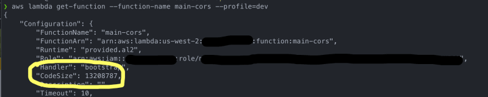
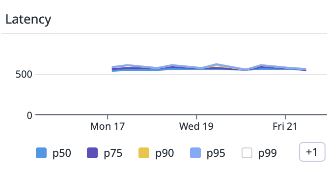

Итак, вы решили создать свою первую или 500-ю функцию Lambda с помощью AWS. Поздравляем! Это само по себе отличное решение, которое заложит прочный фундамент для операционной эффективности, простоты обслуживания, гибкости расширения и множества других положительных моментов, связанных с Serverless. Итак, на каком языке вы собираетесь разрабатывать эту новую Lambda? Я был большим сторонником выбора Go при создании лямбд, и я хотел бы рассказать вам, почему.

## Выбор времени выполнения Lambda

Когда вы начинаете создавать свою первую Lambda, решение о времени выполнения должно быть одним из первых. В настоящее время AWS поддерживает множество различных вариантов, которые можно изучить на странице AWS Runtimes Lambda. Один из лучших моментов в создании Lambda - это то, что поскольку масштаб проблемы изолирован почти до ”нано" уровня, вы можете освободить себя от привязки к одному набору технологий.

Я имею в виду, что определенные языки и фреймворки лучше подходят для решения определенных задач, и вы можете изучить эти решения с помощью данного набора возможностей, продолжая строить другую функциональность на другом, совершенно ином наборе технологий и фреймворков. И если вы обнаружите, что, скажем, эта Lambda по каким-то причинам работает не так, как вы ожидали, затраты времени и энергии должны быть настолько малы, что перенос на что-то другое не станет концом света. Я видел, как это происходило несколько раз за время моего создания Serverless.

Каждый язык и фреймворк влияют на профиль вашей функции. Такие вещи, как:

## Холодный запуск

Холодный старт - время развертывания и первоначального запуска Lambda Стоимость - цена за ГБ сек. По сути, это выделенная память и временной компонент Память - сколько памяти нужно выделить вашей функции, чтобы она работала хорошо Размер пакета

Размер упаковки - чем больше пакет, тем дольше его развертывать и запускать

## Выбор Go при построении Lambdas

Во-первых, это чисто список причин, основанный на моем опыте и мнении. Я развертывал ламбды в Go, Node, .NET Core, Java, Python и Rust, и, честно говоря, вы можете добиться успеха с любым языком, который вы выберете. Но ниже перечислены причины, по которым я в первую очередь обращаюсь к суслику при создании своих функций.

Я понимаю, что это субъективно, но, опять же, это мнение. Для меня достаточно встроенных инструментов Go и широты стандартной библиотеки. О многих мелочах уже позаботились.

## Тестирование

Мне не нужно выбирать Mocha, Jest, jUnit, nUnit или какую-то другую внешнюю библиотеку для запуска моих юнит-тестов на Go. Она встроена в стек

```go
package sample

import "testing"

func Test_Should_Do_Something(t *testing.T) {
    if someCondition {
        t.Fail()
    }
}
```

Затем можно запустить `go test` и все.

## Стандартная библиотека

Нравится вам это или нет, но мир API работает на JSON. И в Go есть встроенная библиотека для работы с JSON. Ее пакет `encoding` является всеобъемлющим, и все `маршаллинг` и `унмаршаллинг` объектов на проводе и вне его, похоже, работают одинаково

```go
package sample

import "encoding/json"

// unmarshal
i := SomeStruct{}
err := json.Unmarshal(bytes, &i)

// marshal
i := SomeStruct{}
out, err := json.Marshal(&i)
```

Эта нативная функциональность пригодится вам при разборе входных данных и форматировании выходных при работе с SQS, Step Functions, DynamoDB и другими сервисами в экосистеме AWS.

## Строительство го

Процесс сборки в Go очень быстрый. Почему это важно при разработке функций? Обратная связь. Конечно, IDE и VSCode отлично справляются с выявлением проблем, но если у вас нет проблем с компиляцией и вы просто хотите запустить свой код, скорость имеет значение. Собирайте и тестируйте несколько десятков раз в день, и полученная экономия позволит вам сделать на несколько циклов больше, чем вы могли бы сделать в противном случае.

На мой взгляд, в современных языках это недооценивается, а Go с самого начала был нацелен на создание языка, который быстро компилируется. Это также играет роль в локальной разработке, сборке и развертывании при использовании CDK или SAM, если у вас есть, скажем, 10 или 15 функций в API. Быстрая компиляция перед локальным запуском API для тестирования позволяет сэкономить драгоценное время, которое вы могли бы потратить на работу над кодом.

## Форматирование кода

Go fmt Я мог бы почти оставить эту тему в покое, сказав это. Но если немного пояснить, то я видел, как форматирование кодовых баз было либо чем-то, о чем яростно спорили, либо чем-то, что просто оставляли на усмотрение кого угодно, так что кодовая база никогда не форматировалась. С Go fmt у вас есть поддерживаемый сообществом способ форматирования кода, чтобы он всегда выглядел одинаково, независимо от того, откуда он взят. В вашей IDE есть поддержка, а в командной строке есть инструмент для этого, так что вам не нужно думать об этом. Это гораздо важнее, чем вы думаете.

## Чистый, но многословный синтаксис

Синтаксис Go выглядит очень знакомо. Вы заметите такие вещи, как `{}`, `()`, в дополнение ко всем обычным конструкциям циклов и управления. Комментарии похожи на C и C++. Временами язык может быть немного многословным, но как только вы привыкнете к нему, в нем появится много смысла. В частности, когда речь заходит об управлении ошибками.  
В Go отсутствует наследование, но это компенсируется надежным дизайном интерфейсов, а также предпочтением использовать композицию для структур, что, опять же, как только вы освоитесь с паттернами, сделает код чистым и мощным.

В Go отсутствует наследование, но это компенсируется надежным дизайном интерфейсов, а также предпочтением использовать композицию для структур, что, опять же, как только вы освоитесь с паттернами, сделает код чистым и мощным.

Возможность возвращать несколько значений. Поначалу это может показаться странным, но мне кажется более очевидным, что делает `func`, вместо того чтобы создавать класс, содержащий мой возвращаемый объект. Возьмем этот код:

```go
public class SomeClass {
    public String theString;
    public Integer theInteger;
}

public SomeClass SomeFunction() {
    return new SomeClass() {
        theString: "ABC",
        theInteger: 123
    };
}
```

На мой взгляд, это не так удобно для чтения, как этот код

`func SomeFunction() (string, int) { return "ABC", 123 }`.

Это явно показывает, что возвращает функция, и избавляет меня от необходимости создавать отдельный ”носитель данных" для возврата выходных данных. Или, что еще хуже, нужно иметь некий “ref”, который изменяет входящее значение и мутирует некоторое состояние, скрытое от клиента.

## Поддержка CDK

Если вы не знакомы с CDK, вот хорошая вводная статья, которая поможет вам начать.

Создание инфраструктуры как кода имеет столько преимуществ, а использование CDK делает это почти приятным. К счастью, поддержка CDK в Go реализована уже сейчас. Вы можете объявить функцию, которая будет построена для правильной архитектуры Lambda, используя конструкцию GoFunction.

```go
new GoFunction(this, "TheFunc", {
  entry: path.join(__dirname, "some-path"),
  functionName: "func-name",
});
```

Посмотрите документацию, чтобы узнать о других возможностях CDK.

Выше перечислены лишь некоторые причины, по которым я люблю работать с Go даже за пределами Lambdas.

## Размер пакета

Давайте вернемся к размеру пакета. Это важно по нескольким причинам.

Время развертывания. Чем меньше пакет, тем быстрее он собирается и развертывается. Если ваш пакет составляет 540 МБ против, скажем, 13 МБ, то это гораздо меньше времени, чтобы поднять архив в среду Lambda Cold Start. Опять же, меньший размер пакета и меньшее количество зависимостей значительно ускорят запуск вашей среды выполнения. Go запускается очень быстро, когда все скомпилировано в бинарном файле, поэтому вы получаете хорошие и быстрые холодные запуски.

Ниже представлен экземпляр Lambda, в котором есть несколько вещей, включая зависимости от AWS SDK для работы с DynamoDB и Parameter store, но размер пакета составляет всего 13 МБ. Мне это нравится!



Это очень актуальная тема в мире Serverless. Я развертываю Lambdas в продакшене уже 6 лет и могу сказать, что в начале, используя .NET Core, я получал 2-4-секундные холодные старты. Для операций типа async это не конец света. Но если ваше событие привязано к API-шлюзу, захотят ли пользователи так долго ждать вашего первого ответа? Скорее всего, нет.

Прошли годы, и, честно говоря, в каждом языке произошли улучшения, а с появлением SnapStart Java стала более удобной для таких случаев использования. Однако я по-прежнему предпочитаю использовать Go, поскольку на приведенном ниже графике показаны задержки холодного старта на конечной точке API за 4 дня. Среднее значение составляет чуть более 500 мс, что для меня на 100 % приемлемо, поскольку полный жизненный цикл с API Gateway составляет менее 1 секунды, что соответствует моей личной цели - возвращать данные с конечной точки API менее чем за 1 секунду.



Я объясняю это природой Go: пакет небольшой, зависимости скомпилированы, и запуск приложения происходит просто ”моментально". Я буду одним из первых, кто пересядет на поезд SnapStart, когда появится поддержка Go, но пока я доволен и этим.

## Сложность выполнения

Это очень субъективно, и я сомневался, стоит ли его включать, но еще одна вещь, которую я люблю в Lambdas, но не люблю, - это слои. Слои - это отличный способ разделить логику между функциями, которые имеют схожую цель. Но с другой стороны, я нахожу, что они могут скрывать от меня некоторые вещи и могут быть немного сложными для тестирования.

Используя Go, я скомпилировал свои зависимости, поэтому я обнаружил, что многократно используемый код передается через зависимость от пакета, который я могу протестировать локально, когда делаю сборку. Опять же, это не самая большая вещь в мире, но я чувствую себя более знакомым при создании функций.

## Наблюдаемость

Это не уникально для Go, но вот статья, которую я написал об использовании Go с Datadog, которая показывает, как чисто и просто можно встроить наблюдаемость прямо в ваши функции

## Подведение итогов

Кодирование и развертывание Lambdas - это приятное путешествие, позволяющее не концентрироваться на вещах, которые не приносят пользы вашим клиентам и конечным пользователям. Сосредоточившись на главном, вы сможете внедрять инновации и итерации и не тратить время на работу с такими вещами, как операционная инфраструктура или попытки понять, как построить функции в, возможно, не самом идеальном техническом стеке.

Лямбды и функции обеспечивают наименьший уровень изоляции, чтобы вы могли сосредоточиться на проблеме и выбрать лучшую технологию для реализации набора функций. По умолчанию я выбираю Go по причинам, которые я описал выше. Я знаю, что это не самая популярная среда исполнения при выборе способа развертывания лямбды, но я надеюсь, что эта статья даст вам повод задуматься, когда вы в следующий раз будете создавать новую функцию.
