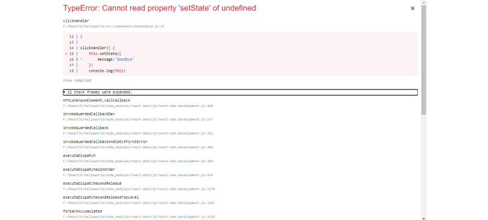
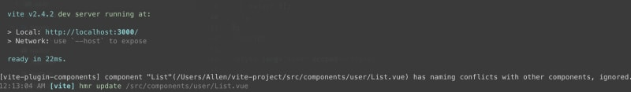

## 1.Вопросы рендеринга компонентов

### Ошибка: Компоненты не отображаются так, как ожидалось, не обновляются при изменении состояния.

Причины: Это может произойти из-за неправильного управления состоянием, неправильного использования методов жизненного цикла или неправильного использования хуков.

Исправления: Пересмотрите управление состояниями, убедитесь в правильном использовании методов/крючков жизненного цикла (useEffect, useState) и перепроверьте условия повторного рендеринга компонентов.

## Обновление штата отражается не сразу:

### Ошибка: Изменения переменных состояния не сразу отражаются в компоненте.

Причины: Обновления состояния могут быть асинхронными, что приводит к неожиданному поведению при ожидании немедленных изменений.

Исправления: Используйте функцию обратного вызова в `setState` или используйте функциональные обновления, чтобы гарантировать, что наиболее обновленное состояние будет использоваться для последующих операций.

## ”Невозможно прочитать свойство ‘X’ из неопределенного":

### Ошибка: Доступ к свойствам неопределенных/нулевых объектов.

Причины: Обычно возникает при попытке получить доступ к свойствам объекта, который не существует или является null.

Исправления: Используйте условный рендеринг или необязательную цепочку (?.) для обработки случаев, когда свойство может быть неопределенным/нулевым.

## Бесконечные циклы с помощью UseEffect:

### Ошибка: useEffect вызывает бесконечные повторные рендеры.

Причины: Неправильный массив зависимостей или отсутствие зависимостей в хуке useEffect может привести к бесконечному циклу.

Исправления: Проверьте массив зависимостей и убедитесь в правильном включении зависимостей, чтобы избежать ненужных повторных рендеров.

## Проблемы с обработкой событий:

### Ошибка: Обработчики событий не работают или не получают ожидаемых данных.

Причины: Неправильное связывание обработчиков событий, некорректная передача данных или неправильное использование событий.

Исправления: Использование стрелочных функций в обработчиках событий для корректного связывания ‘this’, корректной передачи данных в обработчики событий и обеспечения правильного использования событий.

## Ключевые предупреждения:

### Ошибка: Отсутствие реквизита ‘key’ в списках вызывает предупреждения или неожиданное поведение.

Причины: Списки в React нуждаются в уникальном свойстве ”ключ" для эффективного рендеринга и обновления.

Исправления: Убедитесь, что при рендеринге списков с помощью map() для каждого рендерируемого элемента задается уникальный параметр ‘key’, чтобы React мог правильно идентифицировать каждый элемент.

## Проблемы с условным рендерингом:

### Ошибка: Условный рендеринг не работает так, как ожидалось.

Причины: Логические ошибки в условных операторах или неправильное использование тернарных операторов.

Исправления: Двойная проверка условий для рендеринга элементов, использование правильной логики булевых операций и проверка троичных условий.

## Конфликты в именовании компонентов:

### Ошибка: Несколько компонентов с одинаковыми именами вызывают конфликты.

Причины: Коллизии имен в компонентах или импорт неправильного компонента.

Исправления: Обеспечьте уникальные и описательные имена компонентов и дважды проверьте корректность операторов импорта.

Устранение таких ошибок часто требует глубокого понимания жизненного цикла React, управления состояниями, хуков и синтаксиса JSX. Подробные сообщения об ошибках и инструменты отладки, предоставляемые React и инструментами разработчика браузера, также полезны для диагностики и устранения проблем.
