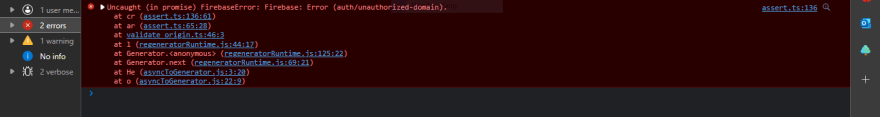
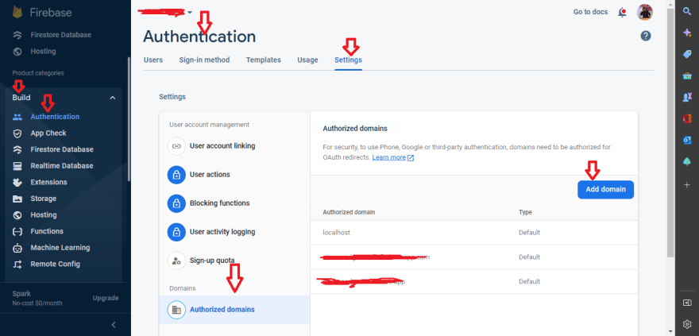
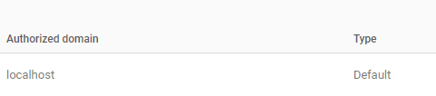

Всем привет! В этой статье мы рассмотрим ошибку “FirebaseError: Firebase: ошибка auth/unauthorized-domain”. Мы обсудим, что означает эта ошибка, почему она отображается и как ее решить.

## Что такое Firebase?

Firebase - популярная бэкэнд-платформа, используемая для разработки веб- и мобильных приложений. Она предоставляет различные возможности, такие как база данных в реальном времени, аутентификация, хостинг и многое другое. Однако иногда пользователи могут столкнуться с ошибками при развертывании, и одной из распространенных ошибок является “auth/unauthorized Domain”. Эта ошибка возникает, когда домен, используемый для хостинга сайта, не авторизован в консоли Firebase.

## Вот как можно решить эту проблему:

Перейдите в консоль Firebase Console и выберите свой проект. Перейдите в раздел ”Сборка" и нажмите на меню "Аутентификация". Перейдите на панель "Настройки", нажмите на "Авторизованные домены" и добавьте ссылку на свой домен с помощью кнопки "Добавить домен". После того как домен будет проверен, обновите сайт еще раз.

Возможно, вы задавались вопросом, почему аутентификация Firebase отлично работает на локальном хосте, но не работает на развернутом сайте. Это происходит потому, что по умолчанию Firebase разрешает доступ к вашему сайту через локальный хост (т.е. localhost:3000), что делает его удобным для целей разработки и тестирования.

В общем, если вы хотите развернуть свой сайт на пользовательском домене, вам нужно добавить этот домен в список авторизованных доменов в Firebase Console. Добавив пользовательский домен в белый список, вы сможете обеспечить доступ к своему сайту только через авторизованные домены и повысить безопасность своих данных.

Спасибо, что прочитали эту статью!
