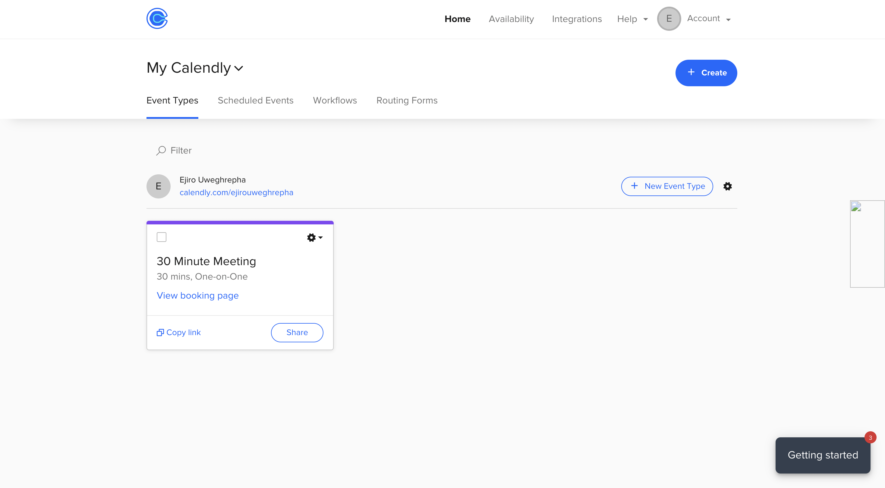

Как человек, который регулярно проводит встречи за встречами, или как разработчик, которому приходится проводить множество конференций с менеджерами по продуктам и маркетологами, вы обнаружите, что чаще всего человек зацикливается на том, во сколько назначена встреча, как не забыть о предстоящей конференции, пришло ли письмо по электронной почте или нет, и кто уведомит меня о том, что пришло время для выполнения каждой задачи. И в конце концов разработчики придумали платформу под названием Calendly.

Calendly - это платформа для организации мероприятий, например встреч. По сути, она позволяет отслеживать, с кем вам нужно встретиться или где вам нужно быть. Calendly предлагает такие функции, как автоматические уведомления о событиях по электронной почте и в календаре, возможность настройки повторяющихся встреч и совещаний, а также интеграцию с несколькими календарными и почтовыми службами, включая Google Calendar, Outlook и Office 365.

## Особенности Calendly

Давайте рассмотрим интересные возможности Calendly:

API: Функция API позволяет интегрироваться с другими инструментами и приложениями, делая процесс составления расписания еще более упорядоченным. Ограничения и разрешения доступа: Функция Access Limits and Permissions позволяет администраторам контролировать, кто и к чему имеет доступ, обеспечивая конфиденциальность важной информации. Мониторинг активности: Функция мониторинга активности позволяет в режиме реального времени получать информацию о том, кто назначил встречу, что обеспечивает более эффективное управление и контроль. Система оповещений и уведомлений: Система оповещений и уведомлений информирует пользователей о любых изменениях или обновлениях в их расписании Управление расписаниями: Функция "Управление назначениями" позволяет пользователям просматривать и редактировать свои назначения в одном удобном месте. Назначение встреч: Интуитивно понятный интерфейс Calendly позволяет легко назначать встречи. Автоматизированное планирование: Функция автоматического планирования избавляет от необходимости гадать о расписании, предлагая лучшие из доступных временных интервалов. Отзывчивость: приложение можно использовать на любом устройстве, оно адаптируется к размеру экрана и обеспечивает удобство работы независимо от того, где вы находитесь.

Существует два метода интеграции Calendly в ваш сайт или любую другую платформу. Первый - это решение Embedded, о котором мы расскажем, а второй - пакетное решение NPM, то есть React-Calendly, которому мы сегодня уделим основное внимание.

## Решение для встраиваемого кода

Прежде чем приступить к этому методу, нам нужно перейти на страницу Calendly и зарегистрироваться, если у нас еще нет аккаунта на этой платформе.

Все, что вам нужно сделать, - это ввести свою электронную почту и пароль, следовать подсказкам, после чего вам будет предложено создать URL-адрес и связать с ним календарь стороннего производителя, например, Google Calendar.

После того как все готово, мы попали на главную страницу, и вы увидите типы событий ниже.

## Встраивание в проект React

С правой стороны вы увидите значок в виде шестеренки рядом с кнопкой добавления новых типов событий, нажмите на него и выберите Добавить на сайт.

После этого вам нужно выбрать вывод, который будет отображать Calendly, будь то всплывающий виджет Inline Embed или всплывающий текст.

Мы выберем Inline Embed, поскольку это наш первый вариант.

Мы должны скопировать приведенный ниже код, вставить его в наш проект и запустить его.

`<!-- Calendly inline widget begin --> 

  <!-- Calendly inline widget end -->`

После выполнения команды npm у вас должно получиться следующее.

Если мы посмотрим на весь процесс, то поймем, что он был простым и быстрым. Тем не менее, если мы углубимся, то поймем, что этот процесс может показаться сложным для начинающих разработчиков, которые не понимают встроенного кодирования, или для опытных разработчиков, которые хотят получить больше контроля над своим блоком кода.

Если мы перейдем к API Calendly, то увидим больше возможностей, таких как персональные маркеры доступа, OAuth и многое другое. Поэтому мы расскажем о методе использования пакета NPM для интеграции Calendly с React.

## Решение React-Calendly

React-Calendly был создан той же командой, что и Calendly, так что это просто еще один способ интеграции.

Кроме того, вам нужно зарегистрироваться, и это, похоже, единственный процесс, который здесь повторяется. После этого мы собираемся установить NPM-пакет React-Calendly.

`npm install --save react-calendly`

После установки пакета мы переходим к редактору кода. С помощью пакета NPM можно реализовать три варианта, а именно:

`InlineWidget` `PopupWidget` `useCalendlyEventListener`

Мы рассмотрим каждую из них.

## InlineWidget

Скопируйте приведенный ниже код в свой проект React.

`import React from "react"; import { InlineWidget } from "react-calendly"; const App = () => { return ( 
 <InlineWidget url="https://calendly.com/your_scheduling_page" /> 
 ); }; export default App;`

И если мы заглянем на нашу веб-страницу, то увидим здесь нечто подобное.

`import React from "react"; import { PopupWidget } from "react-calendly";  const App = () => { return ( 
 <PopupWidget url="https://calendly.com/your_scheduling_page" /* * react-calendly uses React's Portal feature (https://reactjs.org/docs/portals.html) to render the popup modal. As a result, you'll need to * specify the rootElement property to ensure the modal is inserted into the correct domNode. */ rootElement={document.getElementById("root")} text="Click here to schedule!" textColor="#ffffff" color="#00a2ff" /> 
 ); };  export default App;`

## useCalendlyEventListener

Здесь мы используем `Eventlistener`, чтобы обнаружить, когда наш профиль Calendly просматривается.

`import React from "react"; import { useCalendlyEventListener, InlineWidget } from "react-calendly";  const App = () => { useCalendlyEventListener({ onProfilePageViewed: () => console.log("onProfilePageViewed"), onDateAndTimeSelected: () => console.log("onDateAndTimeSelected"), onEventTypeViewed: () => console.log("onEventTypeViewed"), onEventScheduled: (e) => console.log(e.data.payload), });  return ( 
 <InlineWidget url="https://calendly.com/your_scheduling_page" /> 
 ); };  export default App;`

Таким образом, каждый раз, когда мы нажимаем на любое событие в календаре, мы получаем `console.log` о каждом событии на веб-странице.

В результате мы можем дополнительно настроить компонент и включить в него дополнительные свойства или элементы, например:

## Embed Height

Высоту встраивания можно настроить таким образом, чтобы пользователю была видна вся страница планирования, включая все доступные типы событий и параметры планирования. Установив соответствующую высоту встраивания, вы сможете создать для своих посетителей беспрепятственный опыт планирования при изменении компонента.

`styles={{ height: '100px' }}` Настройки страницы

Настройки страницы - это доступные опции для настройки внешнего вида и поведения страницы планирования. Например, с помощью настроек страницы можно выбрать пользовательскую цветовую схему, добавить цвет фона и изменить текст, который отображается на странице планирования.

`pageSettings={{ backgroundColor: 'ffffff', hideEventTypeDetails: false, hideLandingPageDetails: false, primaryColor: '00a2ff', textColor: '4d5055' }}` Prefill Values

В таких инструментах планирования, как Calendly, значения предварительного заполнения также могут использоваться для автоматического планирования событий с указанием конкретных данных, таких как адрес электронной почты и имя. Использование значений предварительного заполнения позволяет упростить заполнение форм и планирование мероприятий, а также точно фиксировать важную информацию, что повышает эффективность, улучшает качество данных и повышает качество обслуживания клиентов.

`prefill={{ email: 'test@test.com', firstName: 'Jon', lastName: 'Snow', name: 'Jon Snow', guests: [ 'janedoe@example.com', ], customAnswers: { a1: 'a1', a2: 'a2', a3: 'a3', a4: 'a4', a5: 'a5' }, date: new Date(Date.now() + 86400000) }}` Параметры UTM

UTM-параметры - это дополнительные фрагменты информации, которые можно добавить к URL-адресу для отслеживания и анализа полученных кликов. Добавив UTM-параметры в код страниц планирования Calendly, вы сможете отслеживать дату и время посещения страницы планирования.

`utm={{ utmCampaign: 'Spring Sale 2019', utmContent: 'Shoe and Shirts', utmMedium: 'Ad', utmSource: 'Facebook', utmTerm: 'Spring' }}`

Мы также можем включить вышеупомянутые компоненты и реквизит вместе ниже.

`<InlineWidget url="https://calendly.com/your_scheduling_page" pageSettings={this.props.pageSettings} utm={this.props.utm} prefill={this.props.prefill} />;`

Выявить разочарование, понять ошибки и устранить замедления как никогда раньше поможет OpenReplay - набор для воспроизведения сессий с открытым исходным кодом для разработчиков. Его можно самостоятельно разместить за считанные минуты, обеспечив полный контроль над данными клиентов

Некоторые разработчики, читающие эту статью, могут застрять между тем, какой метод лучше, подходит для их рабочей среды и имеет наименьшую сложность в плане интеграции. Для начала вам нужно определиться, что именно вы хотите использовать, например, используете ли вы Calendly только для уведомлений, писем и других задач или ищете, что добавить в свой рабочий процесс.

Несмотря на схожесть, оба метода имеют существенные различия, влияющие на наше использование. Предположим, вы ищете что-то более удобное для пользователя и менее сложное. В этом случае вам подойдет встроенное решение, но если вы, как разработчик, хотите чего-то большего, допустим, у вас есть несколько интеграций, которые вы хотели бы сделать в своей рабочей среде, то вам подойдет пакет NPM.

## Заключение

Вот и все, что вам нужно сделать, это использовать react-calendly, чтобы добавить Calendly в ваш ReactJS-проект. Библиотека react-calendly позволяет отображать форму Calendly во всплывающем окне, непосредственно на странице или с помощью настраиваемой кнопки. Хук `useCalendlyEventListener` также может отслеживать события и реагировать на них соответствующим образом.
