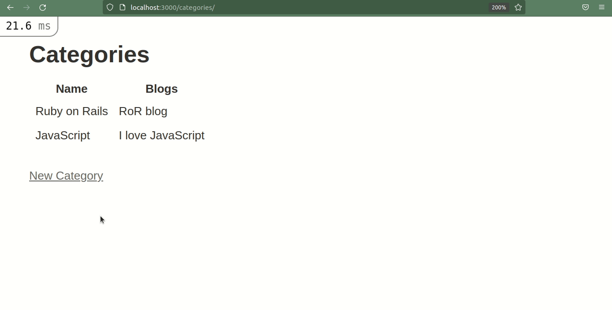
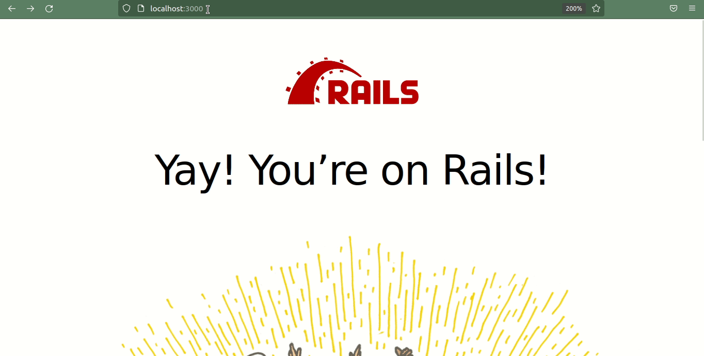

Создание страницы категории необходимо для большинства веб-приложений в наши дни. Различные виды приложений, такие как блоги, сайты электронной коммерции, платформы для просмотра фильмов и многие другие, имеют функции категорий.

В этой статье мы расскажем, как добавить категории в приложения Ruby on Rails.

Это руководство для начинающих, поэтому вы сможете следовать ему, даже если у вас есть базовые знания Ruby on Rails.

## Как сгенерировать подмостки для блога

Сначала создадим новый проект Rails. Здесь мы будем использовать Rails версии 6.1.7 и Ruby версии 3.0. Вы можете создать новый проект Rails с помощью команды ниже:

`rails new blog_categories`

Теперь давайте создадим новый блог с помощью следующей команды:

`rails g scaffold blogs title:string description:text`.

Эта команда создаст все необходимые файлы для работы с операциями `CRUD` блога с двумя полями базы данных `title` и `description`. Здесь `title` - это поле `string`, а `description` - поле `text`.

Теперь вам нужно запустить миграцию с помощью команды `rails db:migrate`.

Теперь подойдите к терминалу, запустите сервер и зайдите на страницу `/blogs`. В браузере вы увидите следующий результат.

## Как сгенерировать эшафот категорий

Теперь мы подошли к основной части руководства, которая заключается в добавлении категорий к статьям нашего блога.

Для этого давайте создадим скаффолд категорий с помощью следующей команды:

`rails g scaffold categories name:string`.

Эта команда создаст `CRUD` для `категорий`.

Также вам нужно будет запустить `rails db:migrate` для обновления схемы.

## Как добавить ассоциацию между моделями блога и категории

Далее вам нужно добавить ассоциацию между моделями `blog` и `category`.

В файле `Blog.rb`:

`class Blog < ApplicationRecord belongs_to :category end`.

И в `Category.rb`:

`class Category < ApplicationRecord has_many :blogs end`.

Теперь вам нужно добавить `category_id` в таблицу `blogs`, поскольку каждый блог связан с категорией. Вы можете перейти в терминал и добавить следующий переход:

`rails g migration add_category_id_to_blogs`.

Это создаст новую миграцию. Вам нужно добавить следующий код в этот файл миграции:

`add_column :blogs, :category_id, :integer`.

Rails имеет свой собственный набор соглашений и правил. И он достаточно умен, чтобы понять, что эта миграция должна добавить новый столбец базы данных с именем `category_id` в таблицу `blogs`.

Теперь вам нужно передать `category_id` в качестве сильного параметра в контроллере `blogs`.

`def blog_params params.require(:blog).permit(:title, :content, :category_id) end `

Теперь давайте создадим несколько категорий в браузере.

Вы также можете добавить некоторую валидацию при создании категории. Для этого вы можете обновить файл `category.rb` следующим кодом:

`class Category < ApplicationRecord validates :name, presence: true, uniqueness: true has_many :blogs end`.

Это добавит несколько валидаций, как показано в GIF ниже:



добавление валидаций при создании категорий Как отобразить категории в виде выпадающего списка на странице новых блогов

Теперь, когда вы можете создавать как блоги, так и категории, вам нужно отображать все категории в виде выпадающего списка, когда кто-то посещает страницу нового блога.

Код для этого показан ниже:

`<div> <%= form.label :category %> <%= form.select :category_id, options_for_select(Category.all.map { |category| [category.name, category.id]})%> </div>`

Тег `select` создает выпадающее поле выбора. Опция `options_for_select` принимает несколько аргументов.

Во-первых, он перебирает все категории и возвращает массив `[c.category, c.id]`. Название категории отображается в виде выпадающего списка, а идентификатор категории, который выбирает пользователь, передается в контроллер. Затем контроллер выполняет вставку в базу данных для блогов.

Вы можете перейти по URL-адресу новых блогов и создать блоги с категориями.

В следующей части этого руководства мы покажем вам, как вывести список всех категорий и всех блогов, связанных с каждой категорией. Мы будем отображать это на странице индекса категорий.

Для этого вам нужно добавить некоторый код в представление индекса категорий.

```rb
<p id="notice"><%= notice %>
<h1>Категории</h1>
<table>
  <thead>
    <tr>
      <th>Название</th>
      <th>Блоги</th>
      <th colspan="3"></th>
    </tr>
  </thead>
  <tbody>
    <% @categories.each do |category| %>
    <tr>
      <td><%= category.name %></td>
      <% category.blogs.each do |blog| %>
      <td><%= blog.title %></td>
      <% end %>
    </tr>
    <% end %>
  </tbody>
</table>

<%= link_to 'New Category', new_category_path %>
```

Здесь происходит итерация по всем категориям для отображения названия каждой категории. После того как мы закончим с отображением названия категории, следующей частью будет отображение всех блогов, связанных с каждой категорией. Таким образом, вы можете выполнить итерацию по `category.blogs`, из которой вы получите записи о блогах.

Если вы Посетив маршрут `/category`, вы увидите все категории с их блогами, как показано в GIF ниже.

список категорий с блогами

## Заключение

В этом уроке вы узнали, как можно добавлять категории в приложения Ruby on Rails, используя ассоциации ”один-ко-многим".

Если вам понравилась эта статья, пожалуйста, угостите меня кофе ☕.

Вы можете найти меня в Twitter для получения различных материалов, связанных с веб-разработкой.

Спасибо за чтение.

Счастливого кодинга.

[Источник](https://www.freecodecamp.org/news/how-to-add-categories-to-ruby-on-rails-apps/)
