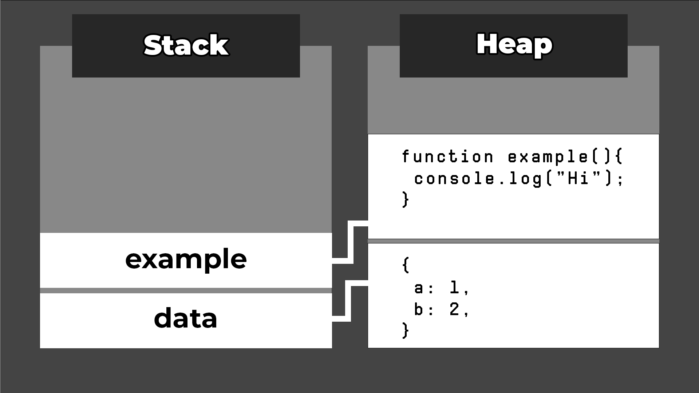

Хук `useEffect` в React

React стал распространенным инструментом для управления побочными эффектами в функциональных компонентах. Однако при его использовании часто возникают подводные камни: возможность создания бесконечных циклов. Это может привести к проблемам с производительностью и нарушить запланированное поведение компонентов.

В этом уроке мы рассмотрим, как предотвратить бесконечные циклы при использовании `useEffect` в React.

Хук `useEffect` используется в функциональных компонентах React для управления побочными эффектами, такими как получение данных из API, обновление DOM или подписка на события, которые являются внешними по отношению к React.

## Отсутствующие зависимости

Одна из распространенных ошибок, которая может привести к бесконечному циклу, - это неуказание массива зависимостей. `useEffect` проверяет, изменились ли зависимости после каждого рендера компонента.

Таким образом, если зависимости не указаны, эффект будет запускаться после каждого рендера, что может привести к непрерывному циклу обновлений, если состояние обновляется.

Например, рассмотрим следующий код:

`function ExampleComponent(){ const [count, setCount] = useState(0);  useEffect(() => { setCount((count) => count+1); }); }`

В этом примере происходит следующее:

При первоначальном рендеринге компонента запускается эффект. Когда эффект выполняется, он обновляет состояние count, в результате чего компонент перерендеривается. Поскольку компонент перерендеривается, это заставляет `useEffect` запускаться снова. Это заставляет состояние `count` обновляться снова, и так продолжается до бесконечности

Анимация, показывающая процесс бесконечного цикла, вызванного useEffect

Это произошло потому, что не был указан массив зависимостей, указывающий на то, что эффект должен запускаться каждый раз после рендеринга компонента.

Чтобы избежать этого, добавьте пустой массив зависимостей:

```ts
function ExampleComponent() {
	const [count, setCount] = useState(0);

	useEffect(() => {
		setCount((count) => count + 1);
	}, []);
}
```

Это гарантирует, что эффект будет выполнен только после первоначального рендеринга компонента.

Кроме того, если ваш эффект зависит от определенного состояния, не забудьте добавить его в качестве зависимости:

```ts
function ExampleComponent() {
	const [isLoggedIn, setIsLoggedIn] = useState(false);

	useEffect(() => {
		// logic
	}, [isLoggedIn]);
}
```

Таким образом, эффект запускается только изначально и при изменении зависимости после повторного рендеринга компонента.

## Использование ссылок в качестве зависимостей

В JavaScript типы данных можно разделить на ссылочные и примитивные.

Примитивные значения - это базовые типы данных, такие как строки, булевы, числа, нулевые и неопределенные.

С другой стороны, ссылочные значения - это более сложные типы данных, такие как массивы и объекты.

Типы примитивных и ссылочных значений в JavaScript

Когда переменной присваивается значение ссылки, сохраняется значение и местоположение этого значения, и переменная будет указывать только на это место.

В то время как при использовании примитива значение переменной присваивается непосредственно значению примитива. Значение хранится в стеке - структуре данных, используемой для хранения статических данных.

Ссылочные значения, такие как функции и объекты, хранятся в куче - структуре данных, используемой для динамического выделения памяти, что полезно при хранении сложных типов данных.

Затем переменной присваивается место в стеке, которое указывает на ссылочное значение в куче.

Куча - это структура данных, используемая для хранения ссылочных значений.

Это помогает сделать наши приложения более эффективными. Представьте себе, что приходится создавать дубликат сложного объекта каждый раз, когда он переназначается новой переменной! Вместо этого новая переменная может просто указывать на то же место в куче.

Несмотря на свою полезность, использование ссылочных значений в качестве зависимостей может быть проблематичным. Это связано с тем, что React будет сравнивать местоположение ссылочного значения, если оно используется в качестве зависимости, а не его содержимое.

Например, рассмотрим компонент:

```ts
function ExampleComponent(props) {
	const [count, setCount] = useState(1);
	let data = { a: 1, b: 2 };

	useEffect(() => {
		setCount((count) => count + 1);
		// other logic
	}, [data]);
}
```

В этом случае происходит следующее:

При первоначальном рендеринге компонента запускается эффектПри запуске эффекта обновляется состояние. Это приводит к повторному рендерингу компонентаПри повторном рендеринге компонента создается новый объект `data`, поэтому его местоположение ссылки отличается от предыдущегоЭто приводит к повторному запуску эффекта, поскольку зависимый объект `data` изменилсяЦикл повторяется, вызывая бесконечный цикл

Чтобы этого не произошло, мы можем использовать хук `useRef`. Он позволяет нам повторно использовать одно и то же значение между повторными рендерами.

Этот хук позволяет нам хранить значения, которые будут сохраняться между рендерами, так что местоположение ссылки объекта будет одинаковым во всех циклах рендеринга.

```ts
function ExampleComponent(props) {
	const [count, setCount] = useState(1);
	const data = useRef({ a: 1, b: 2 });

	useEffect(() => {
		setCount((count) => count + 1);
		// logic
	}, [data.current]);

	// rest of component
}
```

Хук `useRef` принимает начальное значение и возвращает один объект со свойством `current`.

Свойство `current` будет значением, переданным в хук `useRef`, и будет одинаковым во всех рендерах компонента.

Это гарантирует, что эффект не будет работать в бесконечном цикле, поскольку зависимость в хуке `useEffect` больше не будет меняться при каждом рендере компонента.

Обратите внимание, что вы также можете изменить значение свойства `data.current`. Например:

`data.current = {c: 3, d: 4}`

Изменение значения `data.current` не вызовет повторного рендеринга компонента, и React не будет знать об этом изменении.

## Использование функций в качестве зависимостей

Еще одна причина, по которой `useEffect` может вызывать бесконечный цикл, - это использование функции в качестве зависимости.

Поскольку в JavaScript функция является ссылочным значением, мы сталкиваемся с той же проблемой при использовании объектов в качестве зависимостей.

Например, если в нашем компоненте есть функция, то она будет создаваться заново каждый раз, когда компонент будет перерисовываться:

```ts
function ExampleComponent(props) {
	const [count, setCount] = useState(1);
	const submitForm = (event) => {
		// logic
	};
	useEffect(() => {
		setCount((count) => count + 1);
		// logic
	}, [submitForm]);
	// rest of component
}
```

Поэтому при первоначальном отображении компонента:

Эффект запускается первоначально, что приводит к обновлению состояния `count`После обновления состояния компонент рендерится, вызывая повторное создание функции `submitFormЭффект запускается снова, поскольку зависимость `submitForm от хука `useEffect` измениласьКогда эффект запускается снова, состояние `count` обновляется, и цикл продолжается

Чтобы не создавать функцию заново каждый раз, когда компонент перерисовывается, мы можем использовать хук `useCallback`:

```ts
function ExampleComponent(props) {
	const [count, setCount] = useState(1);
	const submitForm = useCallback((event) => {
		// logic
	}, []);
	useEffect(() => {
		setCount((count) => count++);
		// logic
	}, [submitForm]);
	// rest of component
}
```

Хук `useCallback` также принимает два аргумента, первый из которых - функция, которую нужно кэшировать и хранить без изменений между рендерами, а второй - массив зависимостей. Если зависимости в хуке `useCallback` изменяются, функция создается заново.

Таким образом, аналогично использованию `useEffect`, мы можем использовать пустой массив зависимостей, чтобы гарантировать, что функция не будет повторно создаваться между рендерами.

Это предотвращает бесконечное зацикливание эффекта при использовании функции в качестве зависимости.

## Резюме

Хук `useEffect` в React необходим при работе с побочными эффектами в ваших компонентах React. Но даже при наличии опыта распространенные ошибки могут привести к бесконечным циклам в ваших компонентах. Следите за отсутствием зависимостей и используйте ссылки или функции в качестве зависимостей, когда это происходит.

Мы также рассмотрели, как использовать хуки `useRef` и `useCallback` для предотвращения повторного создания объектов между рендерами.

Если вам нравятся мои статьи, загляните на мой канал на YouTube, чтобы узнать больше.

Счастливого кодирования!

React
