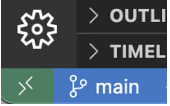

Использование Docker и Docker compose при создании среды разработки на машине разработчика стало обычной практикой. В теории для тестирования и проверки работы необходимо выполнить команду docker compose из терминала, но мы предлагаем удобный способ разработки с помощью расширения Dev Containers в VS Code.

В этой статье мы покажем вам, как настроить Dev Containers на примере проекта Rails.

Чтобы сделать Rails более удобным, используйте VS Code и Docker (где ниже упоминаются контейнеры, это относится к контейнерам Docker и группе контейнеров, запущенных с помощью Docker Compose).

Вы можете запустить терминал в контейнере, как если бы вы обращались к удаленному серверу по SSH, поэтому вам не придется набирать команды docker, такие как docker compose exec xxxx, чтобы облегчить работу над проектом.  
Возможность указать расширения VS Code для запуска в контейнере стандартизирует среду разработки, избавляя разработчиков от необходимости устанавливать и настраивать такие расширения, как Rubcop и Solargraph, по отдельности.

## Необходимые условия

Мы протестировали следующее окружение

- Mac с процессором M2
- Docker desktop для mac: 4.16.2
- Ruby: 3.2.1
- Rails: 7.0.4
- MySQL: 8

  Подробную информацию о версии можно найти в Dockerfile и docker-compose.yml.

### Создайте соответствующий проект Rails с помощью команды `rails new` и создайте модели Post и Comment с помощью scaffold.

### Создайте базовый Dockerfile для запуска Rails

`FROM ruby:3.2.1 ENV ROOT="/app" ENV LANG=C.UTF-8 ENV TZ=Asia/Tokyo WORKDIR ${ROOT}  COPY Gemfile ${ROOT} COPY Gemfile.lock ${ROOT}  RUN gem install bundler RUN bundle install --jobs 4`

### Создайте файл docker-compose.yml для определения промежуточного ПО.

`version: '3' services: web: build: . command: /bin/sh -c "rm -f tmp/pids/server.pid && bundle exec rails s -p 3000 -b '0.0.0.0'" volumes: - .:/app:cached - bundle-volume:/usr/local/bundle ports: - 3000:3000 depends_on: - db tty: true stdin_open: true db: image: mysql:8 volumes: - mysql-volume:/var/lib/mysql environment: MYSQL_ROOT_PASSWORD: password TZ: "Asia/Tokyo" ports: - "3306:3306" тома: bundle-volume: mysql-volume:`

`docker compose up`

### Создать базу данных

`docker compose run --rm web rails db:prepare`.

Зайдите на сайт http://localhost:3000
и убедитесь, что отображается верхняя страница.

### Настройте параметры контейнера для удаленного доступа

Установите расширение VS Code Remote Development.

Добавьте его по следующей ссылке

https://marketplace.visualstudio.com/items?itemName=ms-vscode-remote.vscode-remote-extensionpack

Поскольку это пакет функций для следующих четырех периодов расширения, вы можете устанавливать Dev Containers только для этого использования

Remote - SSH - работа с исходным кодом в любом месте путем открытия папок на удаленной машине/VM с помощью SSH. Поддерживаются SSH-хосты x86_64, ARMv7l (AArch32) и ARMv8l (AArch64) на базе glibc в Linux, Windows 10/Server (1803+) и macOS 10.14+ (Mojave).

Удаленные туннели - работа с исходным кодом в любом месте, открывая папки на удаленной машине/VM с помощью туннеля VS Code Tunnel (а не SSH).

Dev Containers - работа с отдельным инструментарием или приложением на основе контейнера путем открытия любой папки, установленной в контейнере или внутри него.

WSL - работайте с Linux, не выходя из Windows, открывая любую папку в подсистеме Windows для Linux.

Добавьте файл конфигурации, чтобы рекомендовать (но не принуждать) установку этого расширения для других участников.

.vscode/extensions.json

`{ "recommendations": ["ms-vscode-remote.vscode-remote-extensionpack", // Удаленная разработка ] }`.

### Создайте файл конфигурации для контейнеров Dev Containers.

.devcontainer/devcontainer.json

`{ "name": "Existing Docker Compose", "dockerComposeFile": [ //Определите первую конфигурацию со второй docker-compose.yml "../docker-compose.yml", "docker-compose.yml" ], "service": "web",//Укажите имя сервиса и Rails-сервис для запуска, как описано в docker-compse.yml "workspaceFolder": "/app"//Каталог для подключения при запуске }`

Создайте docker-compose.yml для переопределения, чтобы Rails не запускался командой startup.

.devcontainer/docker-compose.yml

`version: '3' services: web: # Запретить запуск Rails при запуске docker command: /bin/sh -c "while sleep 1000; do :; done"`.

Откройте контейнер из VS Code.

Нажмите на зеленую область в левом нижнем углу VS Code или выберите Ropen in Container в палитре команд. Укажите расширения, которые будут использоваться в контейнере

Укажите расширения для использования внутри контайнер

Удлинители, установленные вне контейнера, нельзя использовать внутри контейнера. Они должны быть установлены заново. На первый взгляд это может показаться неудобным, но расширения, которые будут использоваться в контейнере, можно указать в конфигурационном файле, чтобы упростить настройку.

В этом случае будут установлены следующие расширения

solargraph
rubocop
расширение Ruby
rdbg \* для отладки

Добавьте файл `.devcontainer/devcontainer.json`.

`{ // опущено // Расширения для использования в контейнерах "customizations": { "vscode": { "extensions": ["castwide.solargraph", // solargraph "rebornix.Ruby", // Ruby syntax highlighting, etc. "misogi.ruby-rubocop", // Rubocop "KoichiSasada.vscode-rdbg", // Ruby Debug см. ниже ] } } }`

### Настройте VS Code для вашего проекта.

Настройте параметры для конкретного проекта. Здесь мы установили отступ для Ruby на 2 пробела.

.vscode/settings.json

`{ "[ruby]": { "editor.tabSize": 2 } }`

Добавьте gem для Solergraph и Rubocop в Gemfile

Укажите гем, который будет установлен для использования в расширениях.

`group :development do gem 'solargraph' gem 'rubocop', require: false gem 'rubocop-rails', require: false gem 'rubocop-performance', require: false end`.

Подтверждение работы плагина

Убедитесь, что Rubocp и Solargraph работают, запустив контейнер из VS Code.

#### Rubocop.

Знакомый Linter для Ruby можно найти в панели Problems.

#### Solargraph

Это полезный инструмент для автозаполнения и перехода к определениям методов и классов. Если вы еще не используете его, пожалуйста, попробуйте.

Сочетание Solargraph и VS Code сложно настроить, если пытаться запустить его извне контейнера, но использование Dev Containers упрощает настройку.

Solargraph: Сервер языка Ruby

Ритм разработки Rails с помощью контейнеров Dev Containers

Используя Dev Containers для разработки, вы можете открыть терминал в контейнере Rails, чтобы разрабатывать так же, как если бы вы разрабатывали локально, без использования Docker.

При выполнении команд из контейнера в Rails внутри контейнера вам нужно учитывать как команды Docker, так и команды Rails, что может быть немного трудоемко.

Если настроить Docker Compose на запуск Rails при старте, удобно сравнить команды для Rails извне контейнера и команды для Rails изнутри контейнера, как показано в таблице ниже.

Команды для Rails извне контейнера
Команды для Rails изнутри контейнера

docker compose run --rm web bundle install
установка пакета

docker compose run --rm web bin/rails db:migrate
bin/rails db:migrate

docker compose exec web bin/rails c
bin/rails c

docker compose exec web bundle exec rspec
bundle exec rspec

docker compose run -e EDITOR=emacs web bin/rails credentials:edit
bin/rails credentials:edit

Вы также можете запустить сервер rails из панели Terminal и запустить rspec из терминала, чтобы можно было останавливаться на точках останова для проверки работы.

## Советы

Если вы хотите выбраться из контейнера

Выполните команду `Открыть папку локально` из командной палитры.

Если вы считаете, что ваша конфигурация не отражается.

Эту проблему легко решить, перестроив контейнер. Вы можете попробовать выполнить одно из следующих действий из командной палитры

Плюсы

- Расширения VS Code могут быть стандартизированы среди участников разработки
- Легче настраивать расширения, использующие Ruby в контейнерах
- Терминал VS Code может работать в контейнере, что позволяет отказаться от команд Docker (Docker Component) при разработке
- Легче отлаживать с помощью точек останова при запуске Rails в среде разработки
- Легче проверять работу и выявлять ошибки, поскольку команда docker attach не требуется

Минусы

- Не применимо для редакторов, отличных от VS Code
- Расширение Dev Containers немного странное
- Невозможно использовать настройки оболочки в контейнере с обычной средой разработки
- Следует ли включить Zsh, инкрементный поиск, псевдонимы и т. д.

Я показал, как использовать Docker и Docker compose, а также расширение VS Code Dev Containers при разработке в VS Code, и привел пример из проекта Rails.

Лично мне больше всего нравится простота настройки Solargraph и отсутствие необходимости использовать команду `docker attach`.

[Источник](https://dev.to/konyu/how-to-use-docker-containers-for-ruby-on-rails-development-in-visual-studio-code-23np)
