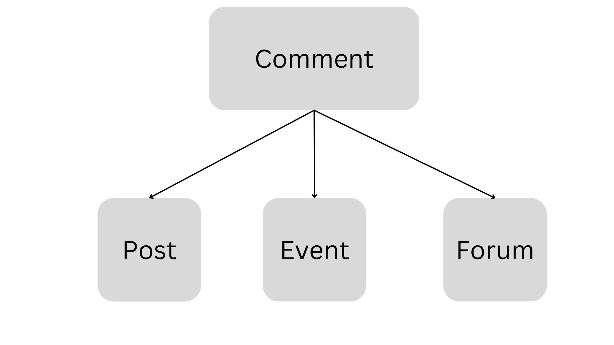
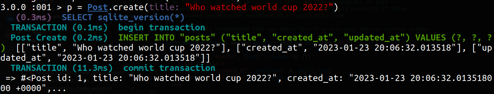
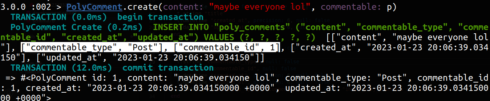

Полиморфная ассоциация в Ruby on Rails относится к типу активной ассоциации записей. Согласно руководству Rails Guide, она позволяет одной модели принадлежать более чем одной другой модели в рамках одной ассоциации.

В этом руководстве предполагается, что вы знаете несколько ассоциаций в Rails, таких как `belongs_to`, `has_one` и `has_many`.

Это немного более сложный тип ассоциаций, но он идеально подходит, когда вы хотите связать модель с несколькими другими моделями.

## Проблема неиспользования полиморфных ассоциаций

Предположим, вы хотите создать приложение с такими функциями, как сообщения, форум и функции событий.

На начальном этапе создания приложения вы, возможно, планируете добавить функцию комментариев только в модель сообщений. Но по мере развития приложения вы, возможно, захотите добавить аналогичную функцию комментариев также в модели форума и событий (возможно, и в другие модели).

Давайте посмотрим, как это будет выглядеть на рисунке ниже:

Передача комментариев в модели сообщений, событий и форумов

Каждый раз, когда вы хотите добавить в приложение что-то, имеющее комментарии, вам придется добавлять внешний ключ к таблице комментариев. В итоге вам придется написать много повторяющегося кода.

Для небольших приложений это, возможно, и не проблема, но по мере роста вашего приложения это может стать серьезной проблемой. И вот тут-то полиморфные ассоциации придутся как нельзя кстати.

## Как полиморфные ассоциации помогают решить эту проблему

Решение описанной выше проблемы заключается в использовании полиморфных ассоциаций в Rails. Это позволяет вам определить одну модель, которая может принадлежать другим различным моделям без необходимости писать повторный код.

Рассматривая приведенный выше пример, вам не придется добавлять внешний ключ к таблице комментариев каждый раз, когда нужно будет добавить комментарии в другие модели.

С помощью полиморфных ассоциаций вы можете добавить всего два столбца в таблицу комментариев, что очень просто. Давайте посмотрим, как это работает, в следующем разделе этой статьи.

## Как реализовать полиморфные ассоциации

Чтобы создать новую модель `PolyComment`, мы используем следующую команду:

`rails g model PolyComment content:text commentable:references{polymorphic}`.

Теперь проверим модель `PolyComment`:

`class PolyComment < ApplicationRecord belongs_to :commentable, polymorphic: true end`.

Файл миграции будет выглядеть следующим образом:

`class CreatePolyComments < ActiveRecord::Migration[6.1] def change create_table :poly_comments do |t| t.text :content t.references :commentable, polymorphic: true, null: false t.timestamps end end end`.

Теперь запустим миграцию с помощью команды `rails db:migrate` для обновления `схемы`, в которой появятся два дополнительных интересных столбца.

`create_table "poly_comments", force: :cascade do |t| t.text "content" t.string "commentable_type", null: false t.integer "commentable_id", null: false t.datetime "created_at", precision: 6, null: false t.datetime "updated_at", precision: 6, null: false t.index ["commentable_type", "commentable_id"], name: "index_poly_comments_on_commentable" end`.

Столбцы `commentable_type` и `commentable_id` помогают настроить полиморфные ассоциации.

`commentable_type` хранит название моделей, таких как `Event`, `Post` или `Forum` в данном случае. А `commentable_id` хранит `id`, который соответствует этой модели.

Теперь давайте сгенерируем три модели с помощью следующих команд:

`rails g model Post title`

`rails g model Event title`

`rails g model Forum title`

Теперь нам нужно добавить отношения `has_many` в эти три модели:

Post.rb

`class Post < ApplicationRecord has_many :poly_comments, as: :commentable end`.

Event.rb

`класс Event < ApplicationRecord has_many :poly_comments, as: :commentable end`

Forum.rb

`class Forum < ApplicationRecord has_many :poly_comments, as: :commentable end`

Вы можете добавить комментарии к любому количеству моделей, основываясь на приведенной выше логике.

## Как проверить это в консоли

Теперь давайте поиграем с консолью, чтобы проверить результаты:

Creating new post

Здесь мы создали новый пост.

Adding Comment to Post

Здесь видно, что значение `commentable_type` - `Post` (в виде строки), поскольку оно связано с моделью `Post`. Также значение `commentable_id` равно `1`, так как оно совпадает с `id` соответствующего объекта.

Таким образом, вы можете добавлять комментарии для любых моделей.

## Заключение

Полиморфные ассоциации сделают ваш код DRY (не повторяйтесь) и свободным от ошибок. Если вы хотите связать модель с несколькими другими моделями, то полиморфные ассоциации станут отличным выбором. Используя этот подход, вам не придется определять отдельную ассоциацию для каждой модели.

Если вам понравилась эта статья, пожалуйста, угостите меня кофе ☕.

Вы можете найти меня в Twitter для получения различных материалов, связанных с веб-разработкой.

Счастливого кодинга!

[Источник](https://www.freecodecamp.org/news/polymorphic-association-ruby-on-rails/)
