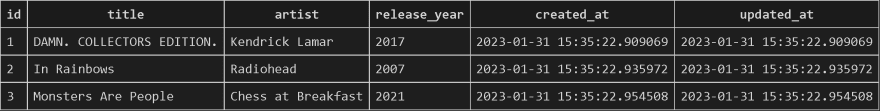

Итак, вы хотите стать бэк-энд инженером Ruby on Rails, да? Тогда вы пришли в нужное место. 👊🙂

На момент публикации этой статьи я завершаю четвертый этап буткемпа Flatiron School по полнофункциональной разработке программного обеспечения. Четвертая фаза была посвящена теме этой статьи: Ruby on Rails. Являясь абстракцией Ruby, Rails ускоряет многие задачи, необходимые для создания базы данных на Ruby. Как лучше всего это сделать, спросите вы? Что ж, давайте узнаем! Но сначала позвольте мне вкратце рассказать о примерах данных, чтобы лучше проиллюстрировать, как устроен наш бэк-энд.

Я большой поклонник музыки, причем слушатель всех альбомов, поэтому я хотел бы использовать пример, когда поклонники музыки выставляют оценки определенным альбомам. Каждый любитель музыки может оценивать множество разных альбомов, и каждый альбом может быть оценен множеством разных любителей музыки. Логично, что каждый поклонник музыки может оценить каждый альбом только один раз, потому что иначе все запутается. И наконец, каждый рейтинг будет принадлежать одному поклоннику музыки и одному альбому, поэтому рейтинги будут выступать в качестве нашей объединяющей таблицы с внешним ключом для каждой из других таблиц с названиями ”поклонники музыки" и "альбомы".

Таким образом, каждая из наших таблиц будет иметь такие атрибуты/столбцы:

Music Fans - :name

Альбомы - :название, :исполнитель, :год_выпуска

Рейтинги - :оценка, :music_fan_id, :album_id

Создание ассоциаций будет рассмотрено позже, а сейчас, когда мы знаем, с какими данными будем работать, давайте рассмотрим наши ресурсы Rails…

В приложении Ruby on Rails есть несколько важных вещей, за которыми нужно следить на самом верхнем уровне файловой иерархии:

Gemfile (список гемов для установки)

db/ (папка с базой данных)

config/ (папка с конфигурациями)

app/ (папка с приложениями)

Если у вас есть привычка обращать внимание на эти файлы и папки, то вас не застанут врасплох ни одна из основных проблем, связанных с созданием бэкэнда Rails!

У нас есть единственная команда терминала, которая создаст все вышеупомянутые ресурсы для нас, в виде:

`rails g resource class_name attribute_name:attribute_type`.

…Но очень важно понимать все, что делает эта команда, и как правильно написать команду, основываясь на вашем конкретном наборе данных. Итак, давайте начнем с самого начала.

Давайте разделим ее по каждому ресурсу…

## Гемфайл

Как уже говорилось выше, здесь мы указываем список наших гемов, которые необходимо установить - это наши инструменты Ruby, которые облегчают нам жизнь при создании кода. Для наших целей мы хотим убедиться, что наш gemfile включает:

`gem "active_model_serializers", "~> 0.10.12"`.

…А чтобы установить эти самоцветы для использования в разработке и тестировании, вводим в терминале следующее:

`bundle install`

ПРИМЕЧАНИЕ: Все остальные необходимые гемы должны быть включены, если вы правильно создали ваше приложение на рельсах:

`rails my_music_app`.

После создания файловой структуры приложения и установки гемов мы можем приступить к созданию структуры данных.

## Папка с базой данных - db/

Теперь начинается самое интересное. Наша папка с базой данных будет содержать ЧЕТЫРЕ важные вещи:

db/migrate (папка миграций)

schema.rb (файл структуры базы данных, основанный на миграциях)

seeds.rb (посевные данные, отформатированные для schema.rb)

development.sqlite3 (окончательный файл базы данных с рендерингом)

Давайте разделим это на части…

1. db/migrate - (миграции)

С этой папки все и начинается. Наши файлы миграции устанавливают структуру данных для каждой из наших таблиц, включая название самой таблицы и метки для каждого атрибута столбца. Для каждой таблицы будут свои миграции. Для нашей таблицы Ratings (таблица join с внешними ключами) вот как выглядел бы наш начальный файл миграции, если бы мы создавали его вручную (но отложим это на минуту):

`class CreateRatings < ActiveRecord::Migration[6.1] def change create_table :ratings do |t| t.integer :score t.integer :music_fan_id t.integer :album_id end end end`.

2. schema.rb - (структура базы данных)

Наш файл schema будет представлять собой структуру данных, полученную в результате миграций для всех наших таблиц, выступая в качестве фильтра для входящих данных. Этот файл будет выглядеть так же, как и наши миграции, но будет включать все таблицы. Чтобы создать наш файл схемы вручную (опять же, воздержитесь от этого, если не хотите попрактиковаться), нам нужно выполнить следующее в терминале:

`rails db:migrate`

Наш результирующий файл должен выглядеть примерно так, включая все три структуры миграции таблиц:

`ActiveRecord::Schema.define(version: 2023_01_20_164246) do create_table "albums", force: :cascade do |t| t.string "title" t.string "artist" t.integer "release_year" t.datetime "created_at", precision: 6, null: false t.datetime "updated_at", precision: 6, null: false end create_table "music_fans", force: :cascade do |t| t.string "name" t.datetime "created_at", precision: 6, null: false t.datetime "updated_at", precision: 6, null: false end create_table "ratings", force: :cascade do |t| t.integer "score" t.integer "music_fan_id", null: false t.integer "album_id", null: false t.datetime "created_at", precision: 6, null: false t.datetime "updated_at", precision: 6, null: false end end`

Всегда полезно дважды проверить файл схемы после выполнения rails db:migrate, чтобы убедиться, что все выглядит точно. Итак, теперь наша структура данных на месте, и мы можем засеять ею наши таблицы данных. Но мы не можем засеять наши данные без…

## 3. seeds.rb (наши посевные данные)

Это файл, в котором мы устанавливаем фактические значения данных для заполнения нашей таблицы. Без файла seed мы не сможем использовать нашу схему, потому что ей не с чем будет работать. По сути, без работающего файла семян наша результирующая база данных будет состоять из пустых таблиц. Мы этого не хотим, поэтому давайте посмотрим, что нам нужно сделать, чтобы создать наши посевные данные.

Существует множество методов Ruby, которые мы можем использовать для создания файла посевного материала, но в этот раз мы будем придерживаться простого подхода. Если мы хотим создать посевной файл, содержащий по 3 экземпляра music_fan и album, а также 6 уникальных экземпляров рейтинга, вот как это может выглядеть:

`puts "🎵 Seeding music fans..." MusicFan.create(name: "Vizmund Cygnus") MusicFan.create(name: "Cassandra Gemini") MusicFan.create(name: "Cerpin Taxt") puts "🎵 Посевная альбомов..." Album.create( title: "DAMN. COLLECTORS EDITION.", artist: "Kendrick Lamar", release_year: 2017 ) Album.create( название: "In Rainbows", исполнитель: "Radiohead", год_выпуска: 2007 ) Album.create( название: "Monsters Are People", артист: "Chess at Breakfast", release_year: 2021 ) puts "🎵 Посевные рейтинги..." Rating.create(score: 10, music_fan_id: 1, album_id: 2) Rating.create(score: 9, music_fan_id: 3, album_id: 1) Rating.create(score: 8, music_fan_id: 2, album_id: 3) Rating.create(score: 7, music_fan_id: 3, album_id: 3) Rating.create(score: 6, music_fan_id: 2, album_id: 2) Rating.create(score: 5, music_fan_id: 1, album_id: 1) puts "Done seeding!"`.

_PRO TIP: Если вы хотите попрактиковаться в использовании Faker Gem для автоматизации некоторых деталей вашего файла семян, _

Как вы можете видеть, наши данные семян построены с использованием довольно базового формата объектов Ruby, с ключами, соответствующими атрибутам нашей таблицы, и уникальными значениями для этих ключей при каждом новом создании экземпляра. И, к счастью, нам не нужно задерживаться с созданием этого файла семян, поскольку нам всегда придется создавать его вручную.

ПРИМЕЧАНИЕ: При каждом создании экземпляру присваивается id в соответствии с порядком его создания, поэтому первый MusicFan (Vizmund Cygnus) будет иметь id 1, а второй (Cassandra Gemini) - id 2 и так далее…

Теперь, когда мы создали подробные исходные данные, можно приступать к посеву и рендерингу нашей базы данных.

## 4. db.sqlite3 - (отрендеренная база данных)

Предполагая, что наши посевные данные и миграции отформатированы правильно, мы можем запустить эту команду в терминале:

`rails db:seed`

После запуска у нас должен появиться файл development.sqlite3 в папке db/. Щелкните на нем правой кнопкой мыши и выберите ”Открыть базу данных". Это откроет проводник SQLite Explorer в левом нижнем углу окна VS Code. ПРИМЕЧАНИЕ: Убедитесь, что вы установили SQLite как расширение в VS Code, иначе это не сработает!

Если вы все сделали правильно до этого момента, у вас должно быть три таблицы. Например, таблица альбомов должна выглядеть следующим образом:

Если в процессе разработки возникнут какие-либо странные проблемы с базой данных, вы всегда можете попробовать выполнить эту команду:

`rails db:reset`.

…что приведет к сбросу базы данных (убедитесь, что вы действительно хотите сбросить ее, прежде чем делать это!) и повторной загрузке.

Теперь, когда у нас есть отрендеренная база данных, мы можем перейти к использованию наших данных!

## Папка конфигураций - config/

В нашей папке config, к счастью, есть только один файл, за которым нам нужно внимательно следить: routes.rb

В этом файле мы можем определить, какие CRUD-действия должны быть разрешены для наших различных контроллеров, а также настроить пользовательские маршруты для таких вещей, как аутентификация пользователей. Мы не будем рассматривать это очень подробно, но вот как будет выглядеть наш базовый файл routes, если у нас будет полный CRUD для альбомов и музыкальных фанатов, но только индексирование, показ, создание и уничтожение (за исключением обновления) для наших рейтингов:

`Rails.application.routes.draw do resources :ratings, only: [:index, :show, :create, :destroy] resources :music_fans resources :albums end`.

Это гарантирует, что у нас не будет неиспользуемых маршрутов на заднеundefinedute_name:attribute_type --no-test-framework`.

ПРИМЕЧАНИЕ: Включите --no-test-framework, если у вас уже есть testing файлов и хотите избежать их перезаписи.

А теперь наши конкретные примеры классов:

Рейтинг

`rails g resource rating score:integer music_fan:belongs_to`

MusicFan

`rails g resource music_fan name`

Альбом

`rails g resource album title artist`

ПРИМЕЧАНИЕ: По умолчанию тип_атрибута - строка, поэтому, если атрибут не является чем-то другим, например, целым числом, вам не нужно включать тип в генератор ресурсов.

ДРУГОЕ ПРИМЕЧАНИЕ: Что касается ассоциаций, мы можем включить belongs_to только в генератор ресурсов, а ассоциации has_many нам придется создавать вручную в отдельных моделях.

Как вы увидите после выполнения в терминале, эта команда создает ВСЕ ресурсы, которые мы рассмотрели в этой статье. Очень круто! Если вы выполнили эту команду правильно, то вы уже на пути к кастомизации вашего бэкэнда.

Надеюсь, эта статья была полезной, и как всегда…

Счастливого кодинга!

[Источник](https://dev.to/mikedavissoftware/intro-to-building-a-ruby-on-rails-back-end-3nlk)
