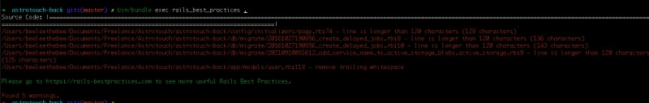

Как разработчики, мы все имеем разное образование, и у каждого из нас свой собственный стиль кодирования. При работе над личными проектами мы можем выражать себя как угодно - использовать функции с приблизительными названиями, методы с 40 строками кода… Однако при совместной работе над коллективным проектом часто возникают конфликты из-за различий в стилях кодирования. Именно здесь мы вводим соглашения по кодированию, и наш лучший друг для соблюдения этих соглашений - линтер.

В этой статье мы погрузимся в мир линтеров и объясним их важную роль в каждом проекте разработки. Мы также рассмотрим мощный инструмент под названием Lefthook, предназначенный для упрощения управления линерами и другими задачами, связанными с качеством кода, в наших рабочих процессах. Наконец, я представлю подборку лайнеров, которые я использую ежедневно и которые оказывают значительное влияние на качество нашего кода.

## Что такое линтер?

Линтер - это инструмент, призванный помочь разработчикам поддерживать чистоту и последовательность кода. Для этого он статически анализирует исходный код проекта, чтобы выявить проблемы. Эти проблемы могут варьироваться от простых синтаксических ошибок до тонких логических ошибок. Кроме того, линтеры проверяют, соответствует ли код установленным стандартам проекта.

Сила линтеров заключается в их настраиваемости. Если какое-то правило не соответствует вашим потребностям, вы можете отменить его.

Линтеры - это универсальные инструменты, способные обнаружить широкий спектр мелких ошибок. Примерами распространенных проблем с форматированием являются лишние пробелы, слишком длинные строки, неиспользуемые переменные и неизвестные ссылки.

В результате линтеры обеспечивают спокойствие разработчиков, помогая им избежать распространенных ошибок. Вам больше не придется тратить три часа на поиск недостающей точки с запятой!

## Мой список линтеров для Rails-проектов

Во всех своих Rails-проектах я стремлюсь к единообразию в форматировании кода. Давайте посмотрим, какие литеры я использую ежедневно!

### Rubocop

`Rubocop` - это инструмент для Ruby. Он фокусируется на соблюдении соглашений, установленных сообществом Ruby. Он проверяет такие элементы, как отступы, длина строки, использование неопределенных переменных и многое другое. Его цель - сделать код Ruby максимально читаемым и последовательным.

Использовать его в своем проекте очень просто:

`bin/bundle exec rubocop .`.

`Rubocop` силен тем, что он также действует как форматировщик кода. Используя опцию `-A`, он автоматически исправляет такие простые проблемы, как излишние переносы строк.

### i18n-задачи

В проектах, использующих I18n, я внедряю `i18n-tasks`. Он определяет непереведенные строки в файлах переводов и неиспользуемые переводы.

Этот инструмент позволяет мне выявлять пробелы в переводах в моих приложениях, что делает его невероятно полезным при управлении несколькими языками в приложениях.

Использовать его очень просто:

`bin/bundle i18n-tasks health`.

Но `i18n-tasks` делает гораздо больше:

`i18n-tasks find` помогает найти все случаи использования ключа перевода в вашем коде.

`i18n-tasks add-missing` заполняет отсутствующие ключи перевода в ваших файлах переводов с помощью заполнителя.

`i18n-tasks translate-missing` делает шаг вперед, создавая и переводя все отсутствующие ключи, с возможностью использования Deepl, Google Translate и других.

`i18n-tasks` предлагает множество функций для упрощения управления ключами перевода. Это жемчужина, которую стоит изучить!

### Reek

`Reek` - ваш лучший друг для обнаружения того, что мы называем ”запахами кода". Запахи кода - это набор признаков, которые показывают, что ваш код тесно связан. Я напишу об этом более подробную статью, но основной вывод заключается в том, что тесно связанный код сложно поддерживать и развивать.

Установив программу, вы можете использовать ее следующим образом:

`bin/bundle exec reek app`.

Давайте рассмотрим несколько примеров ошибок, которые может обнаружить `reek`:

Дублированный вызов метода: Когда вы вызываете один и тот же метод несколько раз с одними и теми же аргументами.

Булевский параметр: Когда вы передаете булевский аргумент, подразумевая, что в методе есть два пути выполнения. Это сильный индикатор сцепления.

Отсутствие безопасного метода: Каждый ”опасный" метод (заканчивающийся на `!`) должен иметь соответствующий ”безопасный" метод.

### Brakeman

`brakeman` - это линтер безопасности, специально разработанный для Ruby on Rails. Он ищет в коде потенциальные уязвимости безопасности, такие как межсайтовый скриптинг (XSS) или SQL-инъекции. Использование Brakeman необходимо для поддержки Rails-приложений, которые менее уязвимы к проблемам безопасности.

После установки вы можете запустить `brakeman` с помощью:

`bin/bundle exec brakeman -z -q`.

Вот некоторые ошибки, которые может выявить `brakeman`:

Межсайтовый скриптинг: Когда вы выполняете код, которым может манипулировать пользователь, напримернапример, через нефильтрованные параметры.

Опасная отправка: Использование `.send` может быть опасным, если вы не проверяете данные, передаваемые в качестве параметра.

Unscoped Find: поиск записи непосредственно через модель, а не через объект, которому она принадлежит.

### Лучшие практики Rails

`Rails Best Practices` - это инструмент, ориентированный на проекты на Ruby on Rails. Он выявляет нарушения лучших практик, характерных для Rails, способствуя согласованности проекта и помогая избежать распространенных ошибок.

Для использования:

`bin/bundle exec rails_best_practices .`

Все правила этого линтера доступны на сайте https://rails-bestpractices.com. Хотя многие из этих правил устарели и датируются 2013 годом, большинство из них по-прежнему применимы и актуальны сегодня.

Вот примеры правил, которые проверяет `rails_best_practices`:

default_scope is Evil: Избегайте использования `default_scope`, так как его нельзя переопределить.

Рассказывай, не спрашивай: Этот известный принцип программирования поощряет предоставление инструкций или выражение действий напрямую, а не запрос объекта о его состоянии для принятия решений.

Ограничение автоматически генерируемых маршрутов: Когда вы используете `resources` для своих маршрутов, Rails генерирует все CRUD-маршруты по умолчанию. Однако часто не все из этих сгенерированных маршрутов используются.

### Haml-lint / Erb-lint / Slim-lint

Ваши представления также должны быть последовательными! Очень важно иметь линтер для любого синтаксиса шаблона. Здесь мы остановимся на `haml-lint`.

Давайте посмотрим, как работает `haml-lint`:

`bin/bundle exec haml-lint app/views`.

Правила, применяемые этим линтером, гарантируют, что ваши представления будут последовательными и единообразными.

Вот примеры правил, которые проверяет `haml-lint`:

Неявные div: Избегайте создания лишних элементов div.

Alt Text: Все изображения должны иметь тег `alt`.

Повторяющиеся идентификаторы: Убедитесь, что идентификатор не используется несколько раз в представлении.

### Scss-lint / Css-lint

Scss-lint разработан специально для языка Sass/SCSS. Она выявляет проблемы с синтаксисом, отступами и стилями в ваших таблицах стилей, помогая поддерживать чистоту и организованность CSS-кода.

После установки вы можете запустить ее с помощью:

`bin/bundle exec scss-lint app/../../assets/stylesheets/`.

Вот примеры правил, выполняемых `scss-lint`:

Нулевая единица: Не используйте единицы после 0.

Глубина BEM: Обеспечьте соответствие соглашению об именовании BEM (Block Element Modifier).

Единицы измерения свойств: Убедитесь в использовании правильных единиц измерения для атрибутов.

### Настройка Git-хуков с помощью Lefthook

Наличие всех этих линтеров - это здорово, но на разработчиков ложится значительная умственная нагрузка, связанная с необходимостью каждый раз запускать их вручную. К счастью, существуют git-хуки!

На практике git hook - это действие, которое выполняется при использовании команд Git. Например, вы можете сказать: ”Запустить этот линтер перед коммитом". Это невероятно мощно!

Проблема? Синтаксис Git hook не очень удобен для разработчиков. Однако для каждой проблемы есть решение, и позвольте мне представить вам Lefthook.

Lefthook - это инструмент, который управляет вашими Git-хуками, раскрывая YAML-файл для оркестровки ваших Git-хуков. Он доступен как гем для Ruby и как пакет NPM.

Давайте посмотрим, как легко настроить Lefthook в вашем Rails-проекте.

Установив гем с помощью `bundle add lefthook`, вы создадите файл `lefthook.yml` в корне вашего проекта. В этом файле вы укажете все лайнеры, которые вы хотите запускать при каждом действии Git.

Вот простой пример файла `lefthook.yml`, который устанавливает `rubocop`:

`pre-commit: commands: rubocop-linter: glob: "{*.rb,*.rake,*.jbuilder,*.builder,*.ru,Capfile,Gemfile,Rakefile}" files: git diff --name-only master run: bundle exec rubocop --force-exclusion {files} | grep "no offenses" skip: - merge - rebase`

Список инструкций, которые я даю `lefthook`, очень прост. Перед каждым коммитом я запускаю `rubocop` для всех файлов, которые я редактировал в своей локальной ветке. Если с `rubocop` возникнут проблемы, коммит будет провален.

Чтобы включить Git hook, просто установите его на свою машину с помощью следующей команды:

`bin/bundle exec lefthook install`.

И вот, пожалуйста! Git-хуки установлены на вашей машине!

Помните, что рассмотренный нами пример является простым. В больших проектах вы захотите запустить все линтеры, о которых мы говорили ранее.

## Заключение

Линтеры - это не просто инструменты статического анализа кода. Они являются молчаливыми хранителями качества кода, способствуя созданию более стабильных, читаемых и эффективных проектов. Объединив линтеры с Lefthook, вы сможете автоматизировать мониторинг качества кода в вашем проекте, сократив при этом количество человеческих ошибок.

Чистый код - это не роскошь, а необходимость. Линтеры и инструменты автоматизации, такие как Lefthook, являются неотъемлемой частью работы современного разработчика.olkit. Поэтому не стесняйтесь интегрировать эти инструменты в свой рабочий процесс разработки и воспользоваться преимуществами, которые они дают для качества кода и надежности проекта.
