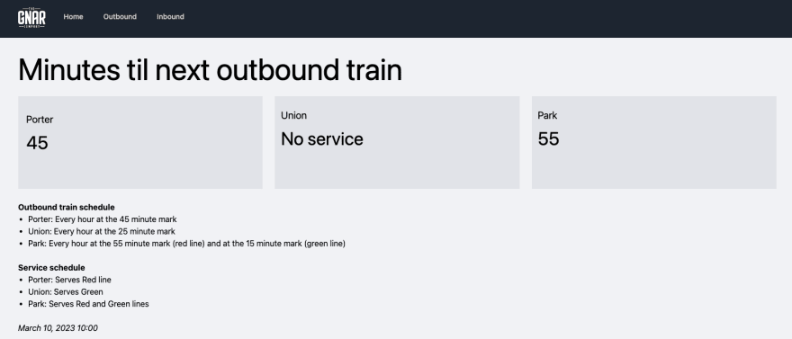
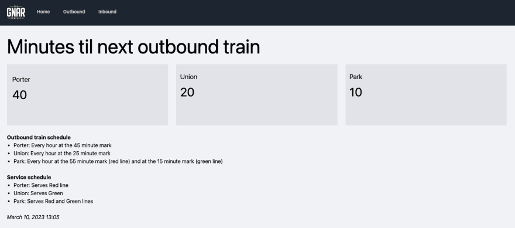

Этот пост - второй в серии, посвященной применению метапрограммирования в Ruby. Если вы только начинаете изучать метапрограммирование, то статья ”Метапрограммирование в Ruby: уровень для начинающих" - отличное место для начала. В этой статье мы рассмотрим практическое применение метапрограммирования в Ruby. Если вы хотите узнать еще больше, следите за публикацией "продвинутого" поста!

Поскольку мы уже рассмотрели многие основы метапрограммирования в нашей статье для начинающих, в этом эпизоде ”Метапрограммирование в Ruby” мы погрузимся непосредственно в код. Мы начнем с изложения нашей конкретной проблемы, а затем перейдем к ее решению. Но сначала отказ от ответственности:

## Метапрограммирование в Ruby - не единственное решение

Очень редко бывает так, что метапрограммирование - это единственный ответ на ту или иную проблему. Заметным исключением из этого будет случай, когда вы хотите написать язык, специфичный для конкретной области (DSL) или фреймворк, такой как Rails. В этом случае, да, вы, вероятно, будете жить и дышать метапрограммированием.

Для остальных же, простых смертных, наши повседневные проблемы программирования могут быть решены бесчисленным множеством способов. Здесь действует та же логика. Мы представляем сценарий, в котором вы можете захотеть использовать подход метапрограммирования. Конечно, вы можете выбрать другую тактику, если она лучше соответствует вашим целям или ограничениям.

### Определение проблемы

У нас есть станция метро с входящими и выходящими поездами. В системе может быть более сотни станций, каждая из которых имеет свое собственное время прибытия/отправления, которое зависит от линии поезда и станции. Для простоты предположим, что каждый поезд прибывает на свои станции раз в час. Некоторые станции будут обслуживать несколько линий поездов, и у каждой станции будут свои часы работы.

Как рассчитать для данной станции минуты до прибытия следующего входящего или исходящего поезда?

### Упрощение параметров

Чтобы упростить задачу и код примера, мы применим несколько параметров. Предположим следующее:

Есть две железнодорожные линии - красная и зеленая Есть три железнодорожные станции - Porter, Union и Park Станция Porter будет обслуживать только красную линию Станция Union будет обслуживать только зеленую линию Станция Park будет обслуживать обе линии Красная линия работает с 6:00 утра до 8:00 вечера по будням Зеленая линия работает с 12:00 вечера до 8:00 вечера каждый день

### Вот время прибытия

Портер: каждый час на отметке 40 минут Юнион: Каждый час на отметке 20 минут Парк: Каждый час на отметке 50 минут (красная линия) и на отметке 10 минут (зеленая линия)

### А вот время прибытия поездов в обратном направлении

Портер: каждый час на отметке 45 минут Юнион: Каждый час на отметке 25 минут Парк: Каждый час на отметке 55 минут (красная линия) и на отметке 15 минут (зеленая линия)

## Практический пример метапрограммирования на Ruby

С этим покончено, давайте рассмотрим наше решение! Здесь мы рассмотрим наиболее важные аспекты кода; более подробную информацию можно найти в репозитории GitHub. Обратите внимание, что в этом примере используется Ruby 3.0.0 и Rails 7.0.4.

## Создание конструктора с помощью `define_method` в Ruby

В основе нашего решения лежит концерн, который мы назовем `MinutesTilBuilder`. Он будет создавать наши методы `[название_станции]_minutes_til_next`, которые будут предоставлять нам минуты до прибытия следующего входящего или исходящего поезда.

`module MinutesTilBuilder extend ActiveSupport::Concern included do def self.build_minutes_til_methods(station_name:, train_lines:, arrival_times:) define_method("#{station_name}_minutes_til_next") do |direction, current_time| return nil if no_service(current_time) minutes = minutes_til(station_name, direction, train_lines, arrival_times, current_time) minutes&.ceil ||= nil end end end # ...вычисления здесь end`.

Таким образом, учитывая наши параметры, `build_minutes_til_methods` может сгенерировать следующие методы:

`porter_minutes_til_next` `union_minutes_til_next` `park_minutes_til_next`.

Мы не будем подробно останавливаться на вычислениях, связанных с методом `minutes_til`, поскольку они не имеют решающего значения для понимания концепций метапрограммирования. Вкратце, он определяет ближайший поезд (входящий или исходящий, в зависимости от аргумента `direction`) для данной станции, заданной аргументом `station_name`. Обратите внимание, что метод возвращает минуты до прибытия поезда, независимо от того, на какой линии он находится.

Вызов `build_minutes_til_methods`

Чтобы построить наши методы, мы включаем концерн `MinutesTilBuilder` в модуль `HasMinutesTil`. В нашем примере расписание определяется константой `ARRIVAL_TIMES`.

`module HasMinutesTil extend ActiveSupport::Concern include MinutesTilBuilder PORTER_ARRIVAL_TIMES = { red: { outbound: 45, inbound: 40 } }.freeze UNION_ARRIVAL_TIMES = { green: { исходящий: 25, входящий: 20 } }.freeze PARK_ARRIVAL_TIMES = { red: { outbound: 55, inbound: 50 }, green: { исходящий: 15, входящий: 10 } }.freeze ARRIVAL_TIMES = { porter: PORTER_ARRIVAL_TIMES, union: UNION_ARRIVAL_TIMES, park: PARK_ARRIVAL_TIMES }.freeze included do build_minutes_til_methods(название_станции: 'портер', линии_поездов: %w[красный], время_прибытия: ARRIVAL_TIMES) build_minutes_til_methods(название_станции: 'профсоюзная', линии_поездов: %w[зеленый], время_прибытия: ARRIVAL_TIMES) build_minutes_til_methods(название_станции: 'парковая', линии_поездов: %w[красный-зеленый], arrival_times: ARRIVAL_TIMES) end end`

## Методы вызова пользовательских станций

У каждого конкретного пользователя есть набор станций, которые он хочет отслеживать. Поэтому мы создадим класс `User`, который включает `HasMinutesTil` и вызывает методы конструктора, созданные в `MinutesTilBuilder` для станций, которые они хотят отслеживать. В этом примере указанные пользователем станции определяются константой `USER_TRAIN_STATIONS`; на практике вам придется получать эти данные из любого места, где они хранятся.

`class User include HasMinutesTil USER_TRAIN_STATIONS = %i[porter, union, park].freeze def incoming_trains(stations:, direction:, current_time:) stations.each_with_object({}) do |station_name, hash| hash[station_name] = send("#{station_name}_minutes_til_next", direction, current_time) || "No service" end end`.

## Загрузка данных в наш контроллер

Из нашего контроллера мы можем вызвать `user.incoming_trains`, чтобы получить информацию о ближайших прибывающих поездах для указанных пользователем станций.

Класс OutboundController < ApplicationController def index user = User.new # Это здесь исключительно для того, чтобы мы могли легко # указать разное время для этого примера. @current_time = Time.current @minutes_til_next = user.incoming_trains( stations: User::USER_TRAIN_STATIONS, direction: “outbound”, current_time: @current_time ) end end`

## Отображение данных в нашем представлении

Затем мы можем добавить данные в наше представление с помощью частичного файла, который я назову `_stations.html.erb`. Здесь я использую tailwindcss, но для данного примера стилизация несущественна.

`
 
 <h2 class="text-xl pb-3">Портер</h2> 
 
<%= @minutes_til_next[:porter] %>
 
 
 
 <h2 class="text-xl pb-3">Union</h2> 
 
<%= @minutes_til_next[:union] %>
 
 
 
 <h2 class="text-xl pb-3">Park</h2> 
 
<%= @minutes_til_next[:park] %>
 
 
 
`.

## Проверка результатов

Изменив `@current_time` в нашем `OutboundController`, мы можем увидеть, как наши методы станции вычисляют минуты до прибытия поезда. Например, если мы укажем время 3/10/23 10:00 AM с помощью `Time.new(2023, 3, 10, 10)`, мы получим такой результат на маршруте `/outbound`:

Станции ”Портер" и "Парк" обслуживают Красную линию, поэтому время их прибытия вполне логично. На станции "Юнион" обслуживания нет, так как она открывается только в полдень. Что произойдет, если мы установим время 3/10/23 1:05 PM с помощью `Time.new(2023, 3, 10, 13, 5)`?

Станция Union теперь открыта! Мы также видим, что станция Park street показывает 10 минут, так как она обслуживает и красную, и зеленую линии, а следующий поезд зеленой линии прибудет в 13:15.

## Завершаем наш промежуточный пример метапрограммирования на Ruby

Вот и все! Очевидно, что здесь есть вещи, которые можно улучшить (например, создать родительский контроллер, от которого будут наследоваться входящие и исходящие контроллеры, вычистить частичный `_stations.html.erb` и т. д.), но я никогда не утверждал, что это идеальный пример. Если вы хотите посмотреть на код более подробно, пожалуйста, обратитесь к репозиторию GitHub. А если вы хотите пойти еще дальше, следите за следующей частью нашей серии ”Метапрограммирование в Ruby”!

Узнайте больше о том, как The Gnar создает приложения на Ruby on Rails.

[Источник](https://dev.to/thegnarco/metaprogramming-in-ruby-intermediate-level-4jjc)
