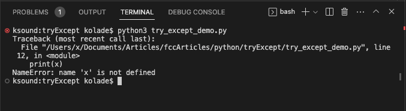
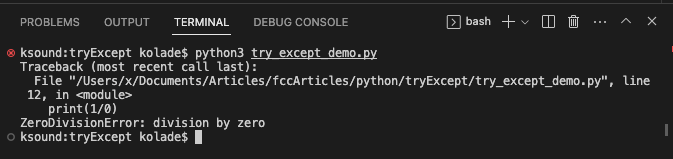

Каждый язык программирования имеет свой способ обработки исключений и ошибок, и Python не является исключением.

В Python встроен синтаксис `try...except`, с помощью которого вы можете обрабатывать ошибки и не давать им прерывать выполнение вашей программы.

В этой статье вы узнаете, как использовать синтаксис `try...except` для обработки исключений в вашем коде, чтобы они не останавливали выполнение программы.

О чем мы будем рассказывать

## Что такое исключение?

В Python исключение - это объект ошибки. Это ошибка, которая возникает во время выполнения вашей программы и останавливает ее работу - с последующим выводом сообщения об ошибке.

Когда возникает исключение, Python создает объект исключения, который содержит тип ошибки и строку, которую она затрагивает.

В Python есть множество встроенных исключений, таких как `IndexError`, `NameError`, `TypeError`, `ValueError`, `ZeroDivisionError` `KeyError` и многие другие.

## Синтаксис `try...except`.

Вместо того чтобы позволить этим исключениям остановить выполнение вашей программы, вы можете поместить код, который вы хотите запустить, в блок `try` и обработать исключение в блоке `except`.

Основной синтаксис `try...except` выглядит следующим образом:

`try: # code to run except: # handle error` How to Handle Exceptions with `try…except`

Вы можете обработать каждое из исключений, упомянутых в этой статье, с помощью `try...except`. Фактически, вы можете обрабатывать все исключения в Python с помощью `try...except`.

Например, если у вас большая программа и вы не знаете, существует ли идентификатор или нет, вы можете выполнить то, что хотите сделать с идентификатором, в блоке `try` и обработать возможную ошибку в блоке `except`:

`try: print("Here's variable x:", x) except: print("An error occured") # An error occured`

Вы видите, что `except` выполнился, потому что в коде нет переменной с именем `x`.

Продолжайте читать. Потому что я покажу вам, как сделать так, чтобы эти ошибки выглядели лучше, показав, как изящно обрабатывать исключения.

## Как вывести исключение с помощью `try...except`.

Но что, если вы хотите вывести именно то исключение, которое произошло? Вы можете сделать это, присвоив `Exception` переменной прямо перед ключевым словом `except`.

Когда вы делаете это и выводите исключение на терминал, вы получаете значение `Exception`.

Вот как я вывел исключение `ZeroDivisionError` в терминал:

`try: res = 190 / 0 except Exception as error: # handle the exception print("An exception occurred:", error) # An exception occurred: division by zero`

И именно так я вывел исключение `NameError`:

`try: print("Here's variable x:", x) except Exception as error: print("An error occurred:", error) # An error occurred: name 'x' is not defined`

Следуя этому шаблону, вы можете вывести на терминал любое исключение.

## Как напечатать имя исключения

А если вы хотите получить точное имя исключения и вывести его на терминал? Это тоже возможно. Для этого достаточно воспользоваться функцией `type()`, чтобы получить тип исключения, а затем использовать атрибут `__name__`, чтобы получить имя исключения.

Вот как я модифицировал пример `ZeroDivisionError`, чтобы вывести точное исключение:

`try: res = 190 / 0 except Exception as error: # handle the exception print("An exception occurred:", type(error).__name__) # An exception occurred: ZeroDivisionError`

А вот как я модифицировал другой пример, чтобы вывести пример `NameError`:

`try: print("Here's variable x:", x) except Exception as error: print("An error occurred:", type(error).__name__) # An error occurred: NameError`

Обычно, когда вы сталкиваетесь с исключениями, такими как `NameError` и `ZeroDivisionError`, например, вы получаете ошибку в терминале таким образом:





Вы можете объединить функцию `type()` и переменную error, чтобы исключение выглядело лучше:

```python
try:
    print("Here's variable x:", x)
except Exception as error:
    print("An error occurred:", type(error).__name__, "–", error)  # An error occurred: NameError – name 'x' is not defined

try:
    res = 190 / 0
except Exception as error:
    # handle the exception
    print("An exception occurred:", type(error).__name__, "–", error)  # An exception occurred: ZeroDivisionError – division by zero
```

## Заключение

Как показано в этой статье, синтаксис `try...except` - это отличный способ обработки ошибок и предотвращения остановки программы во время выполнения.

Вы даже можете вывести это `Exception` на терминал, присвоив ошибку переменной, и получить точный тип `Exception` с помощью функции `type()`.

Счастливого кодирования!
