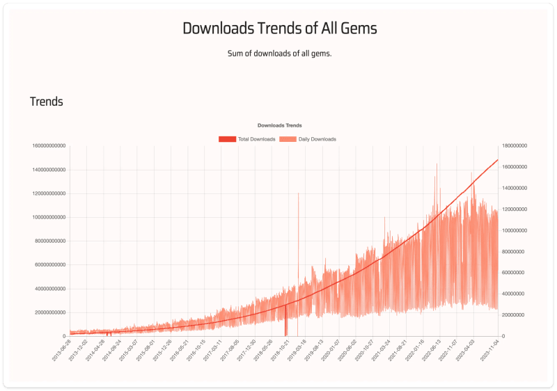
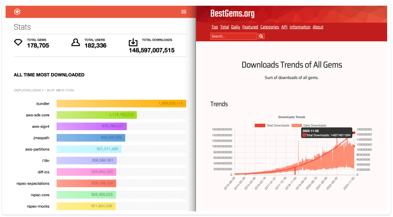
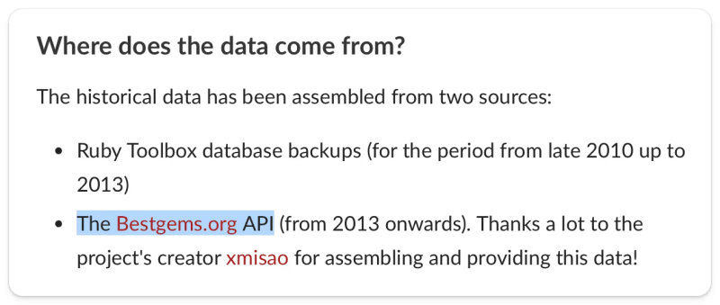

В процессе создания Short Ruby Newsletter я обнаружил сайт bestgems.org, на котором есть интересный график, и хотел бы немного обсудить его.

Динамика загрузок всех драгоценных камней

## Точки данных

Вот как я это понял: сначала есть два набора данных: общее количество загрузок и ежедневные загрузки

Общее количество загрузок

Это сумма загрузок всех гемов -> поэтому, конечно, она всегда будет расти.

Но что мне кажется интересным, так это то, как быстро растет общее количество загрузок. Думаю, невооруженным глазом видно, что начиная, скажем, с 2019/2020 года общее количество загрузок сильно увеличивается:

## Как мне добраться до этих различий:

Вывод: За последние 4 года общее количество скачиваний увеличилось на два порядка по сравнению с предыдущими 5 годами.

Ежедневные загрузки

Если общее количество скачиваний увеличивается, то, конечно, увеличивается и количество ежедневных скачиваний.

5,75 млн ежедневных загрузок в 2013 году (данные взяты на 2013-07-03)

50M ежедневных загрузок в 2019 году (данные взяты на 2019-07-03)

127M ежедневных загрузок в 2023 году (данные взяты на 2023-07-11)

Вывод: количество скачиваний в день увеличивается более чем в два раза, причем в некоторые периоды с 2019 по 2023 год количество скачиваний в день будет выше (например, 160М или 154М).

## Что это значит?

Наверняка это означает, что с 2019 года количество скачиваемых гемов ускорилось.

Одним из объяснений может быть запуск тестов с помощью CI-конвейеров и контейнеров, так что при каждом запуске происходит загрузка гемов.

Некоторые данные:

GitHub запустил свои Github Actions в 2018 году

Gitlab запустил свою первую версию CI в 2012 году

Jenkins запущен в 2011 году

Circle CI запущен в 2011 году

Travis CI запущен в 2011 году

Почти 30 % компаний уже использовали CI/CD в 2013-2014 годах (источник)

Я предположу, что эти функции появились в следующем году, так что для Github это будет 2019 год, для Gitlab - 2013, а для других основных CI - 2012.

Трудно сказать, является ли это объяснение единственным. Мне кажется, что оно не объясняет весь быстрый рост с 2019 года. Единственная точка данных, которая совпадает с этим, - запуск Github своих Actions в 2019 году, но только этим нельзя объяснить рост на два порядка с тех пор.

Другим объяснением может быть то, что Ruby растет, и темпы роста увеличиваются. Это может быть связано с двумя причинами:

И опять же, трудно точно сказать, какая из них является реальностью. Но я добавляю это объяснение, что Ruby растет, потому что я вижу признаки этого и в других местах (больше конференций, больше разговоров в социальных сетях, больше статей, больше релизов, больше рабочих мест, больше контактов в Linkedin о работе ...).

Могут быть и другие причины такого роста, который мы наблюдаем с 2019 года - возможно, изменился способ сбора данных, они стали более детализированными или лучше фиксируются.

Я думаю, что это комбинация обоих объяснений - внедрение CI в больших масштабах и одновременно более быстрый рост числа проектов в последние 3-4 года.

## Валидация данных

bestgems.org - это не rubygems.org, и я пока не смог найти, как они берут свои данные.

Тем не менее, если посмотреть на общее количество загрузок (см. сравнительную картинку ниже), кажется, что данные совпадают, поэтому я написал эту статью, исходя из предположения, что данные bestgems.org достоверны.

(слева) https://rubygems.org/stats vs (справа) https://bestgems.org/stat/downloads

С другой стороны, сайт ruby-toolbox.com использует сайт bestgems.org в качестве источника данных:

## Возможно, вывод

Быстрый рост загрузок гемов Ruby с 2019 года можно объяснить широким распространением конвейеров CI/CD (с небольшим примечанием, что многие инструменты CI/CD были запущены за несколько лет до этого), а также растущей популярностью Ruby в новых проектах.

Эта тенденция отражает растущую важность Ruby в экосистеме разработки программного обеспечения.

## Понравилась статья?

Присоединяйтесь к моей рассылке Short Ruby News, чтобы получать еженедельные новости о Ruby от сообщества. Другие ресурсы для изучения Ruby можно найти на сайте rubyandrails.info. Вы также можете найти меня на Ruby.social, Linkedin или Twitter, где я пишу в основном о Ruby.
