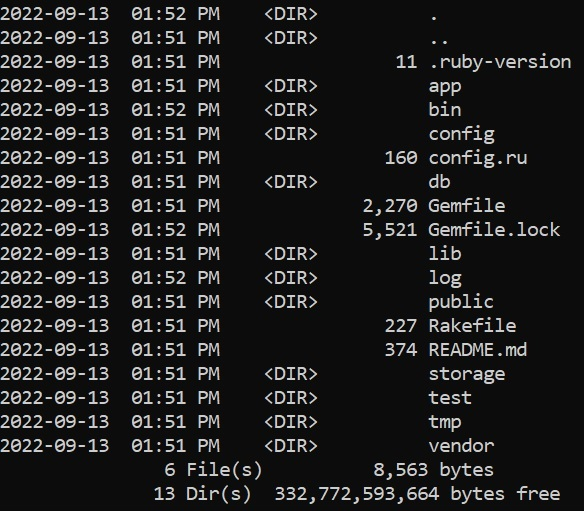

Многие люди путают Ruby и Ruby on Rails. В результате, несмотря на ряд принципиальных различий, их похожие названия и общее происхождение продолжают сбивать с толку - особенно начинающих разработчиков.

В этой статье мы проясним эту путаницу, рассмотрим их связанную историю и расскажем о том, в каких случаях можно писать на Ruby или сразу переходить к созданию на Ruby on Rails.

## От Ruby к Rails

Итак, чем отличается Ruby от Ruby on Rails?

Ruby - это широко используемый с открытым исходным кодом объектно-ориентированный язык сценариев общего назначения, построенный на основе языка программирования C. Это кроссплатформенный язык, поддерживаемый в Windows, macOS и Linux. Ruby был разработан с учетом простоты и удобства для разработчиков и популярен в разработке веб-приложений.

Ruby on Rails, иногда называемый просто “Rails”, - это фреймворк для веб-разработки с открытым исходным кодом, основанный на архитектурном паттерне ”модель-вид-контроллер" (MVC). Rails используется для разработки веб-приложений, управляемых базами данных, и использует язык Ruby.

Давайте немного углубимся в оба этих понятия.

## Что такое Ruby?

Ruby был создан в 1993 году японским программистом Юкихиро Мацумото, также известным как Matz. Первая версия Ruby, Ruby 0.95, была выпущена 21 декабря 1995 года.

Ruby, как и Perl и Python, является интерпретируемым языком программирования высокого уровня, предназначенным для повышения производительности труда программистов. Мац создал Ruby как объектно-ориентированный язык, подобно Ada, поэтому в нем достигнут идеальный баланс между производительностью и простотой.

По словам Матца, при создании Ruby он руководствовался следующими принципами: создать язык программирования, на котором ему нравилось бы кодировать, который было бы интересно использовать другим разработчикам, и который ограничивал бы количество усилий, необходимых для программирования.

В течение последнего десятилетия Ruby неизменно входит в число самых популярных языков программирования. Многих разработчиков привлекает в Ruby его простота и низкий барьер для начинающих.

Давайте обсудим некоторые из основных особенностей Ruby.

### Универсальный язык программирования

Ruby считается чистым объектно-ориентированным языком. Все в Ruby является объектом. Даже примитивные типы данных, такие как целые числа, имеют методы, переменные экземпляра и поддерживают цепочку методов.

Например, вы можете использовать два разных метода для целого числа, используя точечную нотацию, чтобы найти абсолютное значение и возвести его в степень трех, и все это в одной строке. Взгляните на приведенный ниже код. Здесь `abs` используется для нахождения абсолютного значения -3, а `pow(3)` возводит абсолютное значение -3 в степень 3.

:code[value = -3.abs.pow(3)]{syntax=ruby}

Ruby - это язык программирования общего назначения, который разработчики могут использовать для создания различных типов приложений. Он также поддерживает подход функционального программирования, при котором программы представляют собой набор инструкций, сгруппированных в процедуры, эквивалентные функциям.

### Библиотеки

Ruby предоставляет широкий спектр встроенных библиотек для разработчиков. Он также предоставляет менеджер пакетов RubyGems с коллекцией пакетов, называемых gems, созданных другими разработчиками в сообществе Ruby. Эти пакеты могут расширять или изменять возможности и функциональность существующих приложений Ruby.

Каждый gem содержит код и соответствующие инструменты тестирования, документацию и gemspec - файл, содержащий информацию о gem. В gemspec содержится название, описание и все необходимые зависимости.

Например, рассмотрим популярный гем k8s-client. Разработчики Ruby могут добавить этот гем в свое приложение, чтобы получить доступ к клиентской библиотеке Kubernetes.

Существуют также гемы для конкретных случаев использования, например nytimes_top_stories. Как следует из названия, вы можете включить этот гем в свое приложение, чтобы получать последние заголовки из New York Times.

### Применение Ruby

Одними из наиболее распространенных областей применения Ruby являются веб-разработка, генераторы статических сайтов (фронтенд-разработка), серверные приложения, DevOps, автоматизация, инструменты командной строки и приложения для обработки данных.

Некоторые примеры включают:

## Преимущества и недостатки Ruby

Ruby обладает множеством преимуществ по сравнению с другими языками программирования. Он также имеет несколько недостатков. В приведенном ниже списке перечислены некоторые преимущества (и недостатки) Ruby. Учитывайте эти моменты, когда будете решать, подходит ли Ruby для вашего случая или лучше использовать какой-нибудь язык вроде Python или C#.

Плюсы

Прост в использовании и предлагает готовые функции для разработки. Множество библиотек сторонних разработчиков, созданных дружным сообществом разработчиков Ruby. Создан для повышения производительности и минимизации трудозатрат - поэтому может похвастаться более быстрым временем разработки, чем другие языки.

Минусы

Производительность может быть низкой из-за большого потребления памяти и неэффективной сборки мусора. Язык общего назначения, но больше подходит для веб-разработки - в других областях, таких как разработка настольных компьютеров, он показывает себя не с лучшей стороны. По-прежнему считается нишевым языком, несмотря на то что с момента своего появления получил большое развитие. Из-за этого он привлекает не так много разработчиков, как его аналоги, например Python.

## Что такое Ruby on Rails?

Ruby on Rails - это один из самых популярныхlar фреймворк для разработки веб-приложений на Ruby и доступен под лицензией MIT. Это также одна из самых распространенных причин, по которой разработчики изучают Ruby. Как фреймворк, Ruby on Rails упрощает создание веб-приложений, предоставляя готовую структуру и все компоненты, необходимые для создания веб-приложения, так что разработчикам не нужно создавать все с нуля.

Готовая структура проекта Ruby on Rails.

Используя архитектуру MVC, вы можете применять Ruby on Rails для создания полнофункциональных приложений, которые охватывают фронт- и бэк-энд.

Дэвид Хайнемайер Ханссон выпустил Ruby on Rails в качестве проекта с открытым исходным кодом в 2004 году. Ханссон создал Ruby on Rails во время работы над инструментом управления проектами Basecamp компании 37Signals. В Ruby on Rails большое внимание уделяется парадигме ”конвенция над конфигурацией" (CoC) и принципу "не повторяйся" (DRY). CoC означает, что разработчики пишут меньше кода и выполняют меньше конфигураций, если они следуют заранее определенным соглашениям. DRY позволяет избежать избыточности и уменьшить количество повторений программных паттернов.

Как и Ruby, Ruby on Rails был более распространен в первые годы своего существования и с появлением новых фреймворков отошел на второй план. Несмотря на это, с годами он стал более зрелым и приобрел значительную популярность. Разработчики по-прежнему выбирают Rails, потому что он следует соглашениям, которые привносят структуру в разработку, делая код легким для чтения и написания, ускоряя процесс разработки и время выхода на рынок.

## Области применения Ruby on Rails

Хотя у Ruby есть множество вариантов использования, Ruby on Rails гораздо более сфокусирован. Это фреймворк, ориентированный исключительно на разработку веб-приложений. Несмотря на то, что он имеет узкую направленность, то, что он делает, он делает хорошо. Ruby on Rails использовался для создания некоторых из самых популярных веб-приложений, таких как GitHub, Twitch, Soundcloud, Shopify, Hulu, Airbnb и BaseCamp.

## Преимущества и недостатки Ruby on Rails

Будучи фреймворком с открытым исходным кодом, Ruby on Rails предлагает ряд преимуществ, которые могут оценить разработчики с разным опытом. Однако этот фреймворк не лишен компромиссов. Поскольку выбор фреймворка так же важен, как и выбор языка программирования, примите во внимание следующее, чтобы убедиться, что вы сделали правильный выбор.

Плюсы

Фреймворк с открытым исходным кодом - его можно использовать бесплатно. Пользуется преимуществами высокоразвитой экосистемы Ruby. Имеет встроенные и включенные по умолчанию меры безопасности, в том числе встроенную защиту от XSS, CSRF и атак SQL-инъекций. Огромное количество библиотек, или гемов, делает Ruby on Rails очень производительным фреймворком. Позволяет быстрее создавать прототипы и является хорошим вариантом для MVP.

Минусы

Большое количество зависимостей от гемов приводит к замедлению загрузки, что негативно сказывается на производительности разработчиков. Предопределенная структура и готовые компоненты позволяют легко создавать обычные веб-приложения на Ruby on Rails. Однако это приводит к недостатку гибкости, что затрудняет кастомизацию. Более быстрая разработка сопровождается более низкой производительностью, что часто связано с проблемами архитектуры сервера и базы данных. Эти проблемы становятся более очевидными при масштабировании приложения.

## Ruby vs Ruby on Rails: Ключевые различия

Итак, мы рассмотрели отдельные детали Ruby и Ruby on Rails. Теперь давайте посмотрим на их фундаментальные различия.

### Характеристика Ruby Ruby on Rails

Язык vs фреймворк Язык программирования, написанный на C. Фреймворк для веб-разработки, написанный на Ruby. Ruby on Rails не имеет собственного синтаксиса, поскольку использует Ruby в качестве языка программирования. Ruby on Rails используется для расширения возможностей Ruby при создании веб-приложений.

Безопасность В Ruby все является объектом. Это означает, что все данные могут быть инкапсулированы, что делает язык более безопасным. Ruby on Rails повышает уровень безопасности, защищая от межсайтового скриптинга (XSS), предотвращая SQL-инъекции, защищая от подделки межсайтовых запросов (CSRF) и предотвращая уязвимости в логах.

Принципы В основе Ruby лежит принцип проектирования пользовательского интерфейса, направленный на повышение производительности разработчиков. В Ruby on Rails особое внимание уделяется использованию принципов CoC и DRY для повышения производительности разработчиков и сокращения объема работы.

Использование Ruby - это язык программирования общего назначения, который разработчики могут использовать на различных платформах, таких как веб, десктоп и другие программные инструменты. Ruby on Rails используется исключительно для веб-разработки.

### Ruby vs Ruby on Rails: Что изучать в первую очередь

Теперь, когда мы обсудили различия между Ruby и Ruby on Rails, вы, возможно, задаетесь вопросом, что изучать в первую очередь: язык или фреймворк. Выбирайте сначала язык. Итак, если вы хотите освоить Ruby on Rails, сначала изучите сам Ruby. Изучение Ruby сначала не является обязательным условием для изучения Ruby on Rails.

Однако это лучший способ обучения, и в конечном итоге вам придется изучать Ruby. Всегда лучше изучить основы языка программирования, на котором основан фреймворк, прежде чем приступать к работе.к каркасу.

Это справедливо и для других фреймворков. Например, Laravel написан на PHP, а Nest.js - на Typescript. Поэтому будет полезнее выучить PHP, прежде чем переходить на Laravel, или выучить Typescript, прежде чем переходить на Nest.js.

## Резюме

В этой статье мы рассмотрели понятную путаницу, возникающую из-за схожего названия Ruby и Ruby on Rails. Теперь, когда мы рассмотрели историю и популярность Ruby и Ruby on Rails и объяснили существенные и значимые различия между ними, стало ясно, что это не одно и то же.

Различия стали очевидны после того, как мы перечислили и объяснили некоторые из наиболее распространенных вариантов использования Ruby и Ruby on Rails, их преимущества и недостатки, а также перечислили некоторые популярные сайты, приложения и инструменты, написанные на Ruby или использующие фреймворк Ruby on Rails.

Они оба были созданы для того, чтобы сделать программирование приятным и повысить производительность. Однако главное различие заключается в том, что Ruby - это язык программирования, который можно использовать для создания настольных и веб-приложений. В отличие от него, Ruby on Rails - это фреймворк для веб-приложений, который значительно расширяет замечательные возможности Ruby.

Вы не можете использовать Ruby on Rails, не используя Ruby. Ruby on Rails использует преимущества безопасности, уже имеющиеся в Ruby, и добавляет дополнительные функции безопасности, что делает его очень безопасным фреймворком. Кроме того, Ruby основан на принципе проектирования пользовательского интерфейса, в то время как Ruby on Rails был разработан по принципу DRY и CoC.

Вы можете развернуть свой проект на Ruby или Rails на платформе хостинга приложений Kinsta. Для начала ознакомьтесь с некоторыми примерами быстрого запуска, чтобы начать работу над своим приложением.

Разместите все свои приложения, базы данных и сайты WordPress под одной крышей. Наша многофункциональная и высокопроизводительная облачная платформа включает в себя:

Простая настройка и управление на панели MyKinsta Круглосуточная поддержка экспертов Лучшее оборудование и сеть Google Cloud Platform на базе Kubernetes для максимальной масштабируемости Интеграция Cloudflare корпоративного уровня для скорости и безопасности Глобальный охват аудитории с 35 центрами обработки данных и 260 опорными точками по всему миру

Начните с бесплатной пробной версии нашего хостинга приложений или хостинга баз данных. Изучите наши тарифные планы или обратитесь в отдел продаж, чтобы подобрать оптимальный вариант.

 Steve Bonisteel

Стив Бонистил - технический редактор Kinsta, который начал свою писательскую карьеру в качестве печатного журналиста, гоняясь за машинами скорой помощи и пожарными машинами. Он освещает связанные с Интернетом технологии с конца 1990-х годов.
