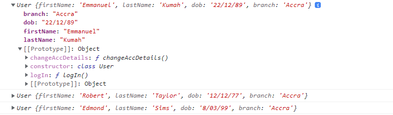
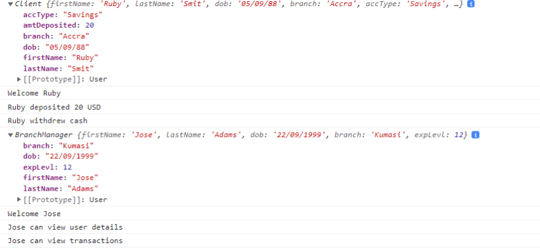

Основная идея объектно-ориентированного программирования заключается в том, чтобы разделить программу на более мелкие части и сделать каждую часть ответственной за управление своими собственными данными.

В этой статье представлен комплексный, но простой для понимания подход к изучению ООП. Цель состоит в том, чтобы понять основные концепции объектно-ориентированного программирования на основе классов

В конце статьи вы узнаете следующие понятия:

- Объекты
- Классы
- Абстракция
- Наследование
- Полиморфизм
- Инкапсуляция

Давайте начнем!

## Что такое объектно-ориентированное программирование?

Объектно-ориентированное программирование (ООП) - это методология программирования, в которой все программные единицы организованы вокруг объектов, а не функций и логики.

Подобно тому, как клетки образуют основную единицу жизни, объекты образуют основные единицы объектно-ориентированного программирования.

ООП дает возможность создавать и управлять различными аспектами приложения в отрыве от объектов и соединять их независимо друг от друга. Это также облегчает повторное использование кода, обеспечивает более чистый и удобный код и устраняет избыточность.

### ООП состоит из четырех столпов

Инкапсуляция

Абстракция

Наследование

Полиморфизм

Эти понятия будут подробно рассмотрены в наших следующих разделах, а пока давайте изучим важность ООП

### Важность ООП

Объектно-ориентированная программа была введена, чтобы устранить недостатки, встречающиеся в процедурном программировании.

Процедурный стиль программирования использует последовательный подход и рассматривает данные и процедуры (функции) как две разные сущности. Когда вы пишете приложение, используя процедурное программирование, вы обнаружите, что функции разбросаны по всей программе по мере ее разработки.

### Недостатки процедурного подхода перечислены ниже:

Процедурный код часто не является многоразовым, поскольку вам придется копировать и вставлять строки кода (воссоздавать код), если он потребуется в каком-либо аспекте приложения.

Поскольку приоритет отдается процедурам, а не данным, данные открыты всему приложению, что создает проблемы в некоторых случаях, связанных с чувствительностью к данным.

С внедрением ООП данные и функциональность объединяются в единое целое, называемое объектом.

Это позволяет создавать и управлять различными аспектами приложения изолированно и подключать их независимо друг от друга.

Поскольку наше приложение построено на единицах (объектах), наш код хорошо организован, более гибок и его легче поддерживать (избегая ”спагетти-кода”).

## Понимание объектов в ООП

Объекты - это основа объектно-ориентированного программирования. Объект может представлять собой реальную сущность с некоторыми данными и поведением. Он представляет собой набор связанных данных (свойств) и функциональных возможностей (методов).

Рассмотрим обычный объект реальной жизни - собаку. У собаки есть определенные характеристики: цвет, имя, вес и т. д. Она также может выполнять некоторые действия: лаять, спать, есть и т. д.

В терминах ООП эти характеристики собаки называются `свойствами`, а действия - `методами`.

При создании веб-приложения каждая единица будет представлена объектом.

Рассмотрим сценарий, в котором вы разрабатываете веб-приложение для цифрового банкинга. Примером реального объекта приложения будет человек.

Человек” представляет собой `объект`, состоящий из `свойств` и `методов`.

Примерами таких свойств могут быть имя, фамилия, дата рождения, возраст, реквизиты счета и отделение банка.

У `Person` могут быть такие методы, как: вход в систему, изменение реквизитов счета, проверка баланса счета, снятие и внесение средств и т. д.

Ниже приведено представление объекта `Person`:

```javascript
const Person = {
	// properties
	firstName: 'Emmanuel',
	lastName: 'Kumah',
	dob: '22/12/99',
	branch: 'Accra',
	// methods
	logIn() {
		console.log(`Welcome ${this.firstName}`);
	},
	changeAccDetails() {
		console.log('Account details changed');
	},
	checkAccBalance() {
		console.log('Checking balance...');
	},
	withdrawFunds() {
		console.log('Cash withdrawn');
	},
	depositFunds() {
		console.log('Cash deposited');
	},
};
```

Когда используются `объекты`, другим частям приложения не нужно беспокоиться о том, что происходит внутри объекта. Потому что он предоставляет интерфейс для другого кода, который хочет его использовать, но при этом сохраняет свое собственное, внутреннее состояние.

В нашем приложении для цифрового банка, если предположить, что в приложении работает более 25 тысяч человек, нам, возможно, придется объявить 25 тысяч объектов, каждый со своими уникальными `свойствами` и `методами`.

Чтобы решить эту утомительную задачу создания 25K уникальных объектов, JS вводит концепцию `классов`.

## Классы и экземпляры

Классы позволяют группировать похожие объекты под одним зонтиком.

Например, более 25 тысяч человек в приложении можно разделить на пользователей

Поскольку каждый пользователь представляет собой объект и имеет общие свойства и методы, мы обычно создаем концептуальное определение, представляющее типы объектов, которые могут быть в приложении.

Когда мы имеем дело с большим количеством объектов в нашем приложении, мы можем избежать повторения написания свойств и методов для каждого объекта и ускорить разработку, определив шаблон или чертеж (который является высокоуровневым планом) для создания этих объектов. предметы.

Этот шаблон называется `классом`.

## Что такое класс?

Классы задают макет для создания объектов с предопределенными свойствами и методами.

Это можно сравнить с архитектором, который разработал чертеж для создания домов. На основе чертежа мы можем создать как можно больше зданий, каждое из которых будет обладать общими свойствами, определенными в чертеже.

В классе перечислены данные и методы, которые будут включены при создании нового объекта.

Основной синтаксис `класса` приведен ниже:

`class MyClass { constructor() { ... } // методы класса method1() { ... } method2() { ... } method3() { ... } ... }`

Теперь, вместо того чтобы определять каждый объект `Person`, в результате чего получается более 25K объектов, мы используем `класс` для разработки макета, который поможет нам легко создавать эти объекты.

Мы дадим нашему классу имя `User`, поскольку каждый `Person` является пользователем приложения, и определим все `свойства` и `методы`, общие для каждого пользователя

Ниже показано, как определяется класс `User`.

Класс User{ // инициализируем свойства firstName, lastName, dob, branch, // конструктор function constructor(firstName, lastName, dob, branch){ this.firstName = firstName; this.lastName = lastName; this.dob = dob; this.branch = branch; } //действие, выполняемое всеми пользователями logIn(){ console.log(`Welcome ${this.firstName}`) } }``

Вышеописанное определяет класс `User` с

Четыре `проперита`: имя, фамилия, дата рождения, филиал

Функция `constructor`: полезна для создания объектов

Методы `login()`, доступные всем пользователям.

## Экземпляры

Класс сам по себе ничего не делает, он служит проводником для создания конкретных объектов. Каждый объект, который мы создаем, становится экземпляром класса.

Экземпляр - это объект, содержащий данные и поведение, определенные классом.

## Конструктор

При создании экземпляра мы используем специальный метод в теле класса, называемый конструктором.

Как правило, конструктор записывается как часть определения класса. Он позволяет присваивать значения свойствам, которые мы хотим указать в новом экземпляре.

Ниже приведен фрагмент конструктора в классе `User`:

```javascript
class User {
	constructor(firstName, lastName, dob, branch) {
		this.firstName = firstName;
		this.lastName = lastName;
		this.dob = dob;
		this.branch = branch;
	}
}
```

Конструктор в приведенном выше коде принимает четыре параметра, поэтому мы можем присвоить значения свойствам `firstName`, `lastName`, `dob` и `branch` при создании нового объекта `User`.

В следующем разделе мы узнаем, как создавать объекты из класса.

## Создание новых объектов из класса

С помощью оператора `new` мы создаем новый объект (экземпляр класса) со всеми перечисленными методами и свойствами.

Синтаксис приведен ниже:

`new constructor(arg1, arg2,...)`.

Давайте создадим экземпляр класса `User` из нашего предыдущего примера, используя оператор `new`.

`//Создание нового объекта из класса User const cus1 = new User (arg1, arg2,...)`.

Когда вызывается `new User(arg1, ag2, ...)`:

Ниже показано, как мы создаем три различных объекта из класса `User` в нашем приложении.

```javascript
class User {
  // инициализация свойств firstName lastName dob branch
  // конструктор
  function constructor(firstName, lastName, dob, branch) {
    this.firstName = firstName;
    this.lastName = lastName;
    this.dob = dob;
    this.branch = branch;
  }
  //действия, выполняемые пользователем
  logIn() {
    console.log(`Welcome ${this.firstName}`);
  };
}

//создаем объект пользователя из класса User
const firstUser = new User('Emmanuel', 'Kumah', '22/12/89', 'Accra');
const secondUser = new User('Robert', 'Taylor', '12/12/77', 'Accra');
const thirdUser = new User('Edmond', 'Sims', '8/03/99', 'Accra');

//регистрируем данные
console.log(firstUser);
console.log(secondUser);
console.log(thirdUser);
```

Вышеописанное создает три объекта User в нашем приложении.

Эти три объекта были получены из определенного чертежа `User`. Поскольку мы использовали чертеж `User`, нам не нужно было писать весь код (свойства и методы) для каждого созданного пользователя.

Результат работы приведенного выше кода выглядит следующим образом:



`//доступ к методам, определенным в классе User firstUser.logIn()`

`"Добро пожаловать, Эммануил"`.

В следующем разделе мы рассмотрим наследование, один из основных столпов ООП.

## Наследование

Нашему цифровому банковскому приложению обязательно понадобятся клиенты, которые смогут входить в систему и выполнять операции (вносить и снимать наличные).

Также нам нужны менеджеры, которые будут следить за деятельностью банка.

Клиент и BranchManager будут иметь следующие общие свойства и методы:

Свойства: имя, фамилия, дата рождения и филиал

Метод: logIn()

Помимо входа в приложение, менеджер филиала может просматривать данные всех пользователей и историю их операций. Клиент также может вносить и снимать наличные

Представим `BranchManager` и `Client` следующим образом:

```javascript
class BranchManager {
	// инициализируем свойства firstName lastName dob branch
	// constructor function
	constructor(firstName, lastName, dob, branch) {
		this.firstName = firstName;
		this.lastName = lastName;
		this.dob = dob;
		this.branch = branch;
	}

	// действия, выполняемые менеджером филиала
	logIn() {
		console.log(`Welcome ${this.firstName}`);
	}

	// дополнительные действия
	viewTransactions() {
		console.log(`${this.firstName} can view transactions`);
	}

	viewUserDetails() {
		console.log(`${this.firstName} can view user details`);
	}
}

// Класс клиента
class Client {
	// инициализация свойств firstName lastName dob branch
	// конструктор function
	constructor(firstName, lastName, dob, branch) {
		this.firstName = firstName;
		this.lastName = lastName;
		this.dob = dob;
		this.branch = branch;
	}

	// действия, выполняемые менеджером филиала
	logIn() {
		console.log(`Welcome ${this.firstName}`);
	}

	depositCash() {
		console.log('Cash deposited');
	}

	withdrawCash() {
		console.log('Cash withdrawn');
	}
}
```

Мы заметили, что класс User, который мы определили ранее, и классы Branch Manager и Client, описанные выше, имеют некоторые общие свойства и методы.

Они оба имеют имя, фамилию, филиал и дату рождения

У обоих есть метод `logIn()`.

Поскольку у них есть общие свойства и методы, обычно рекомендуется определить класс `User`, который обладает всеми общими свойствами и методами для всех остальных сущностей, которые понадобятся в нашем приложении. Это помогает сократить избыточность

Класс `User` определяется следующим образом:

```javascript
class User {
	constructor(firstName, lastName, dob, branch) {
		this.firstName = firstName;
		this.lastName = lastName;
		this.dob = dob;
		this.branch = branch;
	}

	logIn() {
		console.log(`Welcome ${this.firstName}`);
	}
}
```

Класс `User`, определенный выше, называется суперклассом или родительским классом

Всякий раз, когда мы объявляем родительский класс, мы можем объявить дочерние классы, которые получат все свойства и методы родительского класса. Это явление называется наследованием

Наследование - это способность класса получать свойства и характеристики от другого класса, обладая при этом собственными свойствами.

В реальной жизни наследование - это то, как дети получают от своих родителей определенные черты, такие как рост, цвет волос, форма носа, интеллект и т. д.

Точно так же в программировании дочерние классы могут приобретать все свойства и методы родительского.

Цель наследования - повторное использование общей логики

Наследование с помощью ключевых слов extend и super

Ключевое слово `extend` используется для того, чтобы показать наследование между классами и объявить родительский класс, от которого мы хотим наследовать.

Синтаксис выглядит следующим образом:

`childClassName extends parentClassName{ //определение дочернего класса }`.

Используя ключевое слово extends, мы можем указать классам `BranchManager` и `Client` наследовать все свойства и методы родительского класса `User`. Классы `BranchManager` и `Client` могут добавлять в свой класс дополнительные свойства и методы.

В приведенном ниже коде мы расширяем класс `User`, чтобы включить в него классы `BranchManager` и `Client`.

```js
class User {
  constructor(firstName, lastName, dob, branch) {
    this.firstName = firstName;
    this.lastName = lastName;
    this.dob = dob;
    this.branch = branch;
  }
  logIn() {
    console.log(`Welcome ${this.firstName}`);
  }
}

class Client extends User {
  constructor(firstName, lastName, dob, branch, accType, amtDeposited) {
    super(firstName, lastName, dob, branch);
    this.accType = accType;
    this.amtDeposited = amtDeposited;
  }
  depositCash() {
    console.log(`${this.firstName} deposited ${this.amtDeposited} USD`);
  }
  withdrawCash() {
    console.log(`${this.firstName} withdrew cash`);
  }
}

class BranchManager extends User {
  constructor(firstName, lastName, dob, branch, expLevel) {
    super(firstName, lastName, dob, branch);
    this.expLevel = expLevel;
  }
  viewTransactions() {
    console.log(`${this.firstName} can view transactions`);
  }
  viewUserDetails() {
    console.log(`${this.firstName} can view user details`);
  }
}

const client1 = new Client('Ruby', 'Smit', '05/09/88', 'Accra', 'Savings', 20);
console.log(client1);
client1.logIn();
client1.depositCash();
client1.withdrawCash();

const firstManager = new BranchManager('Jose', 'Adams', '22/09/1999', 'Kumasi', 12);
console.log(firstManager);
firstManager.logIn();
firstManager.viewTransactions();iewUserDetails() firstManager.viewTransactions()
```

Родительский класс - это `User`, а `BranchManager` и `Client` - дочерние классы.

Используя ключевое слово `extend`, `BranchManager` и `Client` наследуют все свойства и методы класса `User`.

Ключ `super` используется для вызова конструктора родительского класса, чтобы получить доступ к свойствам и методам родительского класса.

Классы `this.expLevl = expLevel`, `this.accType = accType` и `this.amtDeposited = amtDeposited` позволяет нам добавлять дополнительные свойства в классы `BranchManager` и `Client` соответственно.

Мы также добавили два дополнительных метода `viewTransactions` и `viewUserDetails` в `BranchManager`.

В класс `Cleint` мы добавили методы `depositCash` и `withdrawCash`.

Поскольку классы `BranchManager` и `Client` наследуют от класса `User`, метод `logIn()` был добавлен автоматически, и к нему могут обращаться экземпляры класса.

Концепция наследования теперь позволяет любому экземпляру классов `BranchManager` и `Client` наследовать все свойства и методы, определенные в классе `User`.

Даже если функция `logIn()` не была определена в классах `BranchManager` и `Client`, мы все равно можем получить к ней доступ.

Результат выполнения приведенного выше кода выглядит следующим образом:



Важность наследования:

Наследование позволяет нам определить класс, который берет всю функциональность от родительского класса и позволяет добавить больше

Это помогает в повторном использовании кода, обеспечивает более чистый и удобный код и устраняет избыточность

## Полиморфизм

Полиморфизм позволяет методу с одним и тем же именем иметь разную реализацию в разных классах.

При полиморфизме дочерний класс может перезаписать метод, унаследованный от родительского класса. Цель - обеспечить большую гибкость и сделать код многократно используемым.

Например, метод `logIn()` в классе `User` может быть перезаписан в классе `BranchManager`.

Смотрите код ниже:

```javascript
class BranchManager extends User {
	logIn() {
		console.log(`Howdy ${this.firstName}`);
	}
}

const manager = new BranchManager('Simon', 'Tagoe', '13/02/2000', 'Accra', 14);
manager.logIn(); // Output will be "Howdy Simon"
```

## Инкапсуляция

Инкапсуляция - это процесс оборачивания данных и методов, которые с ними работают, в один компонент (класс). Концепция инкапсуляции заключается в том, чтобы предоставить доступ к данным состояния только объекту. Она используется для сокрытия значений или состояния объектов внутри класса, чтобы предотвратить их модификацию неавторизованным кодом.

Ее смысл заключается в том, чтобы сохранить данные приватными для объекта и избежать прямого доступа к ним за пределами объекта.

Инкапсуляция способствует сокрытию информации и снижению сложности за счет удаления деталей реализации

Представьте, что вы пользуетесь пультом дистанционного управления телевизором, у вас есть несколько интерфейсов для работы с ним, таких как кнопка включения и кнопка с цифрами. Вы можете использовать эти интерфейсы для выполнения некоторых действий, таких как включение или выключение телевизора, изменение текущего телеканала, сохранение избранного канала и т. д.

Вы используете эти интерфейсы, не задумываясь о том, как они работают. Другими словами, фактическая реализация интерфейса скрыта от вас.

Аналогично, в ООП вы можете использовать объект, вызывая его методы. Неважно, написали ли вы эти объекты сами или воспользовались сторонней библиотекой, ваш код не обращает внимания на то, как эти методы работают внутри.

Доступ к данным, содержащимся в объекте, возможен только через публичный интерфейс (то есть собственный метод объекта). Когда вы хотите использовать данные, содержащиеся в объекте, вы определяете метод внутри этого объекта для обработки этого действия.

Считается плохой практикой получать данные внутри объекта и писать отдельный код для выполнения действий с этими данными вне объекта.

Например, если вы хотите повысить в должности менеджера филиала с опытом работы более 5 лет, мы можем реализовать это следующим образом:

```javascript
// создаем экземпляр класса BranchManager
const branchManager = new BranchManager('firstName', 'lastName', '04/1/80', 7);

// фрагмент кода для повышения менеджера
if (branchManager.expLevl >= 5) {
	console.log('Вы будете повышены до следующего ранга');
} else {
	console.log('удачи в следующий раз');
}
```

Код для повышения менеджера может быть использован в любом нужном месте нашей системы.

При такой реализации, если мы решим изменить критерии продвижения менеджера, нам нужно будет найти все места, где этот код реализован в нашем приложении, и обновить его.

Однако идея инкапсуляции требует, чтобы доступ к данным внутри объекта осуществлялся только через его собственный метод.

Было бы лучше иметь метод `promoteManager()` в классе `BranchManager`, который обрабатывает логику в одном месте. Таким образом, когда логика обновляется, она обновляется только в одном месте.

Ниже приведена рекомендуемая процедура:

```javascript
// Class BranchManager inherits from User
class BranchManager extends User {
	constructor(firstName, lastName, dob, branch, expLevel) {
		// Call super before adding options
		super(firstName, lastName, dob, branch);
		this.expLevel = expLevel; // Add new attribute
	}

	// Additional actions
	viewTransactions() {
		console.log(`${this.firstName} can view transactions`);
	}

	viewUserDetails() {
		console.log(`${this.firstName} can view user details`);
	}

	// Manager promotion method
	promoteManager() {
		if (this.expLevel >= 5) {
			console.log('You will be promoted to the next rank');
		} else {
			console.log('Better luck next time');
		}
	}
}
```

Теперь мы можем получить доступ к `promoteManager()` из экземпляра класса

`//доступ к методу из экземпляра класса branchManager.promoteManager()`

### Инкапсуляция: Приватные свойства и метод

Внутренние данные объекта могут быть приватными, что делает их доступными только для собственного метода объекта, но не для других объектов.

Например, если мы не сделаем свойство `expLevel` приватным, кто-то может получить к нему доступ и изменить его значение на `this.expLevel = 10`.

Чтобы сделать свойство приватным, мы ставим знак подчеркивания ( `_` ) рядом с именем свойства. Например (`this._propertyName`)

Давайте сделаем свойство `expLevl` приватным в классе `BranchManager`.

```javascript
class BranchManager extends User {
	constructor(firstName, lastName, dob, branch, expLevel) {
		super(firstName, lastName, dob, branch);
		this._expLevel = expLevel;
	}

	promoteManager() {
		if (this._expLevel >= 5) {
			console.log('You will be promoted to the next rank');
		} else {
			console.log('Better luck next time');
		}
	}
}

const firstManager = new BranchManager('Jose', 'Adams', '22/09/1999', 'Kumasi', 12);
console.log(firstManager._expLevel);
```

Эта реализация не делает свойство действительно приватным, поэтому оно называется защищенным.

Чтобы сделать свойство действительно приватным, мы добавляем к нему символ `#`, и оно должно быть определено вне любого метода. Например, `#firstName`.

Мы также можем защитить метод, чтобы предотвратить доступ к нему за пределами класса.

Ниже показано, как защитить метод `promoteManager`:

```javascript
//защитить метод promoteManager
promoteManager() {
  if (this.expLevl >= 5) {
    console.log('Вы будете повышены до следующего ранга');
  } else {
    console.log('лучше повезет в следующий раз');
  }
}
//попробуйте обратиться к методу manager.promoteManager()
```

На выходе код будет выглядеть так: :

`Uncaught TypeError: manager.promoteManager is not a function`.

Преимущества инкапсуляции описаны ниже:

Данные внутри объекта не могут быть неожиданно изменены внешним кодом в совершенно другой части приложения

Когда мы используем метод, нам нужно знать только результат и не заботиться о внутренней реализации.

Функциональность определяется в логическом месте: это место, где хранятся данные, поэтому становится легко изменить функциональность вашего приложения.

## Абстракция

Абстракция - это скрытие или игнорирование деталей, которые не имеют значения, что позволяет нам получить общее представление о том, что мы реализуем.

Цель абстракции - справиться со сложностью, скрыв от пользователя все несущественные детали, что приводит к упрощению конструкции, которую легче понять и поддерживать.

Обычно это достигается путем указания методов взаимодействия с объектами через интерфейсы. Детали реализации этих методов скрыты за этими интерфейсами

Это позволяет программистам работать с объектами на более высоком уровне абстракции, не заботясь о низкоуровневых деталях их реализации.

Например, когда вы покупаете смартфон, вас может интересовать только следующее

Как включить или выключить телефон

Как набрать номер для совершения звонка

Как получить доступ к информации через Интернет

Низкоуровневые детали, такие как

Как телефон подключается к Интернету, чтобы получить указанную информацию

Что происходит под капотом, когда вы включаете или выключаете телефон

Как работает датчик гироскопа, позволяющий поворачивать телефон

Работа датчиков вибрации, температуры окружающей среды, магнитного поля и т. д. не имеет для вас никакого значения, поэтому эти детали можно скрыть, сделав телефон простым в использовании

Абстракция занимается упрощением. Например, объект `Array` в JavaScript позволяет хранить коллекцию из нескольких элементов под одним именем переменной.

Он имеет такие методы, как:

Когда вы используете эти методы, вам не нужно знать обо всех тонкостях, которые были при определении объекта `Array`. Эти низкоуровневые детали были абстрагированы (удалены), чтобы упростить использование метода. Цель состоит в том, чтобы просто использовать открытые вам методы для выполнения конкретных задач.

Одно из главных преимуществ абстракции заключается в том, что она уменьшает влияние изменений. Разработчики объекта `Array` могут изменить внутреннюю реализацию, например, чтобы повысить его производительность. Однако до тех пор, пока существуют методы `array.push()` и `array.length`, вы можете продолжать использовать методы `Array`, как и раньше, без негативного влияния изменений.

## Резюме

Основная идея объектно-ориентированного программирования заключается в том, чтобы разделить программу на более мелкие части и сделать каждую часть ответственной за управление своим собственным состоянием.

Классы задают схему создания объектов с предопределенными свойствами и методами.

Наследование - это способность класса получать свойства и характеристики от другого класса, при этом он можети собственная недвижимость.

Полиморфизм позволяет методу с одним и тем же именем иметь разную реализацию в разных классах.

Инкапсуляция - это процесс оборачивания данных и методов, которые с ними работают, в один компонент (класс).

Абстракция - это сокрытие или игнорирование деталей, которые не имеют значения, что позволяет нам получить общее представление о том, что мы реализуем.

Если вы нашли полезное в этой статье или увидели области для улучшения, пожалуйста, оставляйте комментарии. Также любезно поделитесь статьей в своих социальных сетях, возможно, она будет полезна кому-то еще.

[Источник](https://dev.to/efkumah/the-easy-approach-to-learning-object-oriented-programming-in-javascript-5e24)
