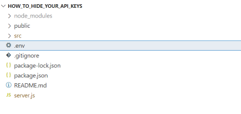
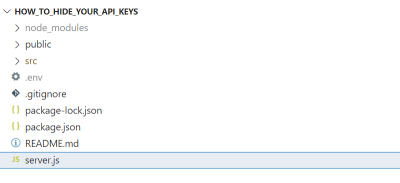
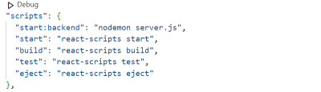

Хотите убедиться, что ваши API-ключи в целости и сохранности при работе с React? Джессика Джозеф поможет вам! Она покажет вам лучшие способы скрыть ваши API-ключи, начиная с использования переменных окружения и заканчивая созданием собственного внутреннего прокси-сервера.

Когда-то разработчикам приходилось писать всевозможный код, чтобы заставить разные приложения взаимодействовать друг с другом. Но в наши дни интерфейсы прикладного программирования (API) делают это намного проще. API предоставляют вам все необходимое для плавного и эффективного взаимодействия с различными приложениями, чаще всего когда одно приложение запрашивает данные у другого приложения.

Хотя API предоставляют множество преимуществ, они также представляют значительный риск для безопасности вашего приложения. Поэтому очень важно знать об их уязвимостях и способах защиты. В этой статье мы погрузимся в удивительный мир API-ключей, обсудим, почему вы должны защищать свои API-ключи, и рассмотрим лучшие способы сделать это при использовании React.

## Что такое ключи API?

Если вы недавно подписались на API, вы получите API-ключ. Считайте API-ключи секретными паролями, которые доказывают провайдеру, что именно вы или ваше приложение пытаетесь получить доступ к API. В то время как некоторые API бесплатны, другие платят за доступ, и поскольку большинство API-ключей имеют нулевой срок действия, страшно не беспокоиться о безопасности ваших ключей.

## Почему ключи API необходимо защищать?

Защита ключей API очень важна для обеспечения безопасности и целостности вашего приложения. Вот несколько причин, по которым вы должны защищать свои API-ключи:

### Для предотвращения несанкционированных запросов API.

Если кто-то получит ваш ключ API, он сможет использовать его для несанкционированных запросов, что может иметь серьезные последствия, особенно если ваш API содержит конфиденциальные данные.

### Финансовая небезопасность.

Некоторые API требуют финансовых затрат. Если кто-то получит доступ к вашему API-ключу и превысит ваши бюджетные запросы, вы можете столкнуться с огромным счетом, который обойдется вам в кругленькую сумму и поставит под угрозу вашу финансовую стабильность.

### Кража, манипуляция или удаление данных.

Если злоумышленник получит доступ к вашему API-ключу, он может украсть, манипулировать, удалить или использовать ваши данные в своих целях.

Теперь, когда вы понимаете, почему API-ключи должны быть защищены, давайте рассмотрим некоторые методы скрытия API-ключей и способы их интеграции в ваше React-приложение.

## Переменные окружения

Переменные окружения (`env`) используются для хранения информации об окружении, в котором работает программа. Это позволяет скрывать от кода приложения конфиденциальные данные, такие как ключи API, токены, пароли и любые другие данные, которые вы хотели бы сохранить в тайне от общественности.

Один из самых популярных пакетов `env`, который вы можете использовать в своем React-приложении для скрытия конфиденциальных данных, - это пакет `dotenv`. Чтобы начать:

Перейдите в каталог вашего приложения react и выполните команду ниже.`npm install dotenv --save` Вне папки `src в корневом каталоге проекта создайте новый файл с именем `.env`.

(Большой просмотр)

В файл `.env` добавьте ключ API и соответствующее ему значение в следующем формате:`// для CRA-приложений REACT_APP_API_KEY = A1234567890B0987654321C ------ correct // для Vite-приложений VITE_SOME_KEY = 12345GATGAT34562CDRSCEEG3T ------ correct` Сохраните файл `.env`, не публикуйте его и не отправляйте на контроль версий.Теперь вы можете использовать объект `env` для доступа к переменным окружения в вашем React-приложении.`// для CRA-приложений 'X-RapidAPI-Key':process.env.REACT_APP_API_KEY // для Vite-приложений 'X-RapidAPI-Key':import.meta.env.VITE_SOME_KEY` Перезапустите ваше приложение, чтобы изменения вступили в силу.

Однако запуск проекта на локальном компьютере - это только начало. В какой-то момент вам может понадобиться загрузить свой код на GitHub, что может привести к раскрытию файла `.env`. Что же делать в таком случае? Вы можете использовать файл `.gitignore`, чтобы скрыть его.

Файл `.gitignore`

Файл `.gitignore` - это текстовый файл, который указывает Git'у игнорировать файлы, которые еще не были добавлены в репозиторий, когда они будут выложены в репозиторий. Для этого добавьте `.env` в файл `.gitignore`, прежде чем переходить к постановке коммитов и размещению кода на GitHub.

`// .gitignore # dependencies /node_modules /.pnp .pnp.js  # api keys .env`

Помните, что в любой момент, когда вы решите разместить свои проекты на любой хостинговой платформе, например Vercel или Netlify, вы должны указать переменные окружения в настройках проекта и вскоре после этого переразвернуть свое приложение, чтобы увидеть изменения.

## Внутренний прокси-сервер

Хотя переменные окружения могут быть отличным способом защиты ключей API, помните, что они все равно могут быть скомпрометированы. Ваши ключи все равно могут быть украдены, если злоумышленник просмотрит ваш код в браузере. Итак, что же вы можете сделать? Использовать внутренний прокси-сервер.

Внутренний прокси-сервер выступает в роли посредника между вашим клиентским приложением и серверным приложением. Вместо прямого доступа к API с фронт-энда фронт-энд отправляет запрос на внутренний прокси-сервер; затем прокси-сервер получает ключ API и делает запрос к API. После получения ответа он удаляет ключ API, а затем возвращает ответ на внешний сервер. Таким образом, ваш API-ключ никогда не появится в вашем внешнем коде, и никто не сможет украсть ваш API-ключ, изучив ваш код. Отлично! Теперь давайте посмотрим, как мы можем это сделать:

## Установите необходимые пакеты.

Чтобы начать работу, вам нужно установить некоторые пакеты, такие как Express, CORS, Axios и Nodemon. Для этого перейдите в директорию, содержащую ваш проект React, и выполните следующую команду:

`npm install express cors axios nodemon`

## Создайте файл внутреннего сервера.

В корневом каталоге проекта, за пределами папки `src, создайте JavaScript-файл, который будет содержать все ваши запросы к API.

(Большой просмотр)

Инициализируйте зависимости и установите конечную точку.  
В файле бэкенд-сервера инициализируйте установленные зависимости и настройте конечную точку, которая будет выполнять `GET`-запрос к стороннему API и возвращать ответные данные на прослушанный порт. Вот пример фрагмента кода:

```ts
// определение порта сервера
const port = 5000;

// инициализация установленных зависимостей
const express = require('express');
require('dotenv').config();
const axios = require('axios');
const app = express();
const cors = require('cors');
app.use(cors());

// прослушивание порта 5000
app.listen(5000, () => console.log(`Server is running on ${port}`));

// запрос API
app.get('/', (req, res) => {
	const options = {
		method: 'GET',
		url: 'https://wft-geo-db.p.rapidapi.com/v1/geo/adminDivisions',
		headers: {
			'X-RapidAPI-Key': process.env.REACT_APP_API_KEY,
			'X-RapidAPI-Host': 'wft-geo-db.p.rapidapi.com',
		},
	};

	axios
		.request(options)
		.then(function (response) {
			res.json(response.data);
		})
		.catch(function (error) {
			console.error(error);
		});
});
```

Добавьте в файл `package.json` тег script, который будет запускать внутренний прокси-сервер.

(Большой просмотр)

Запустите внутренний сервер, выполнив команду ниже, а затем, в данном случае, перейдите на `localhost:5000`.
`npm run start:backend`
Сделайте запрос к внутреннему серверу (`http://localhost:5000/`) с фронт-энда, а не напрямую к конечной точке API.

```ts
import axios from "axios";
import { useState, useEffect } from "react";

function App() {
  const [data, setData] = useState(null);

  useEffect(() => {
    const options = {
      method: 'GET',
      url: "http://localhost:5000",
    };

    axios.request(options)
      .then(function (response) {
        setData(response.data.data);
      })
      .catch(function (error) {
        console.error(error);
      });
  }, []);

  console.log(data);

  return (
    <main className="App">
      <h1>Как создать внутренний прокси-сервер для ваших API-ключей</h1>
      {data && data.map((result) => (
        <section key={result.id}>
          <h4>Name: {result.name}</h4>
          Population: {result.population}
          Region: {result.region}
          Latitude: {result.latitude}
          Longitude: {result.longitude}
        </section>
      ))}
    </main>
  );
}

export default App;
```

Ну вот и все! Выполнив эти шаги, вы сможете скрыть ключи API с помощью внутреннего прокси-сервера в своем приложении React.

## Служба управления ключами

Даже если переменные окружения и внутренний прокси-сервер позволяют надежно скрывать ключи API в сети, вы все равно не в полной безопасности. В вашем окружении могут быть друзья или недоброжелатели, которые могут получить доступ к вашему компьютеру и украсть API-ключ. Именно поэтому шифрование данных имеет большое значение.

С помощью службы управления ключами вы можете шифровать, использовать и управлять своими API-ключами. Существует множество сервисов управления ключами, которые вы можете интегрировать в свое React-приложение, но для простоты я упомяну лишь некоторые из них:

- AWS Secrets Manager - это служба управления секретами, предоставляемая Amazon Web Services. Он позволяет хранить и извлекать секреты, такие как учетные данные баз данных, ключи API и другую конфиденциальную информацию, программным способом через вызовы API к сервису AWS Secret Manager. Здесь есть множество ресурсов, которые помогут вам быстро начать работу.
- Google Cloud Secret Manager - это служба управления ключами, предоставляемая и полностью управляемая Google Cloud Platform. Он позволяет хранить, управлять и получать доступ к конфиденциальным данным, таким как ключи API, пароли и сертификаты. Самое приятное, что он легко интегрируется с функциями Google back-end-as-a-service, что делает его отличным выбором для любого разработчика, ищущего простое решение.
- Azure Key Vault - это облачный сервис, предоставляемый Microsoft Azure, который позволяет легко хранить и управлять различными секретами, включая пароли, ключи API, строки подключения к базам данных и другие конфиденциальные данные, которые вы не хотите раскрывать непосредственно в коде своего приложения.

Существует множество сервисов управления ключами, и вы можете выбрать любой из вышеперечисленных. Но если вы хотите воспользоваться сервисом, который не был упомянут, это тоже вполне нормально.

## Советы по обеспечению безопасности ключей API

У вас есть все необходимое для обеспечения безопасности API-ключей и данных. Поэтому, если у вас есть проекты, в которых вы случайно раскрыли свои API-ключи, не волнуйтесь: я собрал несколько удобных советов, которые помогут вам выявить и исправить недостатки в кодовой базе вашего React-приложения:

Просмотрите существующую кодовую базу и определите все жестко закодированные API-ключи, которые необходимо скрыть. Используйте переменные окружения с `.gitignore` для безопасного хранения API-ключей. Это поможет предотвратить случайное раскрытие ключей и упростит управление ими в различных средах.Чтобы добавить дополнительный уровень безопасности, рассмотрите возможность использования внутреннего прокси-сервера для защиты API-ключей, а для более сложных задач безопасности подойдет инструмент управления ключами.Заключение

Потрясающе! Теперь вы можете защищать свои API-ключи в React как профессионал и быть уверенным, что данные вашего приложения в безопасности. Используете ли вы переменные окружения, внутренний прокси-сервер или инструмент управления ключами, они сохранят ваши API-ключи от посторонних глаз.
