Cookies были единственным способом хранения временной и локальной информации, но теперь у нас есть localStorage. LocalStorage широко обсуждается и используется в различных Javascript-приложениях. В этой статье мы рассмотрим все, что вам нужно знать о localStorage в Javascript.

## Что такое localStorage?

Представьте, что вы заполняете форму в Интернете, и ваше устройство отключается от интернет-соединения. Вы заполнили свое имя и возраст, осталось заполнить название страны и пол. Вы заполняете их, все еще отключившись от Wi-Fi. Как только вы снова подключитесь к Wi-Fi, вы отправите заполненную форму.

Когда вы вводили название страны и пол, не будучи подключенным к Интернету, заметили ли вы, что можете снова войти в систему без потери информации? Это и есть localStorage.

`Window.localStorage` - это свойство, доступное только для чтения, которое хранит данные в веб-браузере без использования языка на стороне сервера. Используется только Javascript. Эти данные хранятся в явном виде в используемом домене и протоколе. Также информация хранится в виде пар ключ-значение в файле SQLite, расположенном в подпапке профиля пользователя.

В частности, она используется для запоминания содержимого корзины, входа на сайт и отслеживания того, включил ли пользователь темный режим. Это связано с тем, что срок хранения данных в localStorage не истекает. Кроме того, он продолжает хранить данные после закрытия браузера.

Рекомендуется использовать localStorage только для нечувствительной информации, поскольку он подвержен атакам межсайтового скриптинга (XSS) и другим атакам на основе Javascript. Кроме того, данные localStorage для документа, загруженного в сеансе ”приватного просмотра” или "инкогнито", очищаются при закрытии последней вкладки "приватного просмотра".

## Преимущества localStorage

Использование localStorage имеет множество преимуществ. На первом месте среди них - способность хранить данные даже после закрытия браузера. Ниже перечислены некоторые из его преимуществ:

Данные хранятся с помощью пар ключ-значение. Срок хранения данных не истекает. Информация хранится на стороне клиента. Данные не удаляются автоматически, если не используется код Javascript. Даже после закрытия браузера данные сохраняются. При каждом HTTP-запросе пересылка данных туда и обратно не требуется. Он может хранить до 5 МБ данных.

## Недостатки localStorage

Использование localStorage имеет ряд преимуществ, но у него есть и недостатки. Вот несколько из них:

Его не следует использовать для хранения приватной и важной информации, поскольку он подвержен атакам межсайтового скриптинга (XSS). Он не имеет защиты данных, что делает его доступным для любого кода. Он может содержать только строки, но может быть сериализован с помощью JSON.stringify(). К нему нельзя получить доступ с разных доменов или поддоменов.

Различия между Cookies и localStorage

Cookies - это просто данные, хранящиеся в небольших текстовых файлах на вашем устройстве. Они поддерживают состояние пользователя и запоминают его информацию на всех веб-страницах. Cookies и localStorage имеют общие характеристики, но что отличает их друг от друга? Вот различия между Cookies и localStorage:

CookieslocalStorageУ них есть срок действия.У них нет срока действия.Cookies считываются сервером.Они считываются только браузером.Максимальный объем памяти составляет 4 КБ.Максимальный объем памяти составляет 5 МБ.Достаточно восприимчивы к межсайтовому скриптингу (XSS) и другим атакам на основе Javascript.Очень восприимчивы к XSS-атакам на основе Javascript и другим атакам на основе Javscript. Это связано с тем, что localStorage никогда не был задуман как безопасный. Он не имеет защиты данных. Он достаточно безопасен. Он вообще не безопасен. Синтаксис localStorage

Это синтаксис localStorage в Javascript:

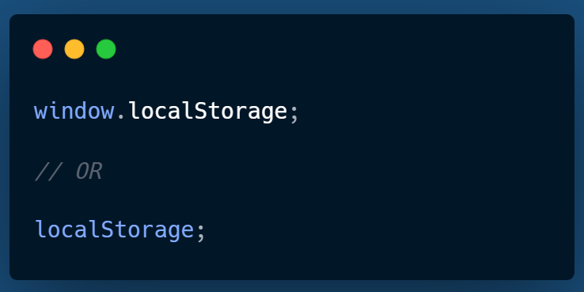

## Методы localStorage

Существует четыре метода, которые мы используем для работы с localStorage. К ним относятся

`setItem()`: Этот метод сохраняет данные в localStorage. Он принимает пару ключ-значение и добавляет ее в localStorage.

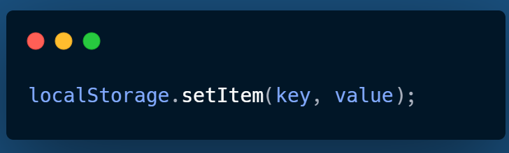

`getItem()`: Этот метод считывает данные из localStorage. Он принимает ключ и возвращает соответствующее значение.

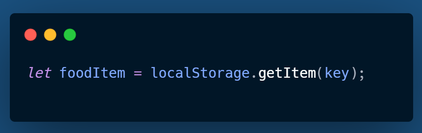

`removeItem()`: Этот метод удаляет данные из localStorage. Он делает это, беря ключ и удаляя соответствующую пару ключ-значение.

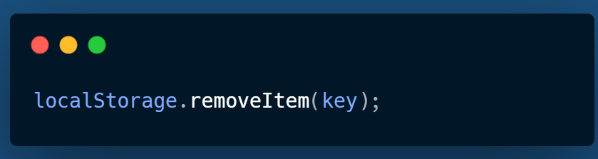

`clear()`: Этот метод очищает localStorage от домена.

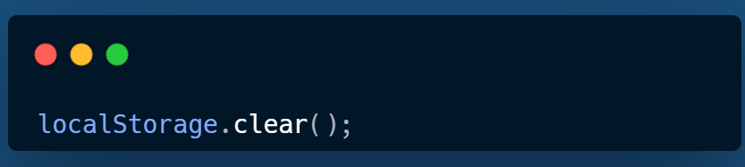

Лучший способ учиться - это кодить и видеть, как все работает. Мы будем использовать четыре метода, чтобы понять, как они работают. Откройте консоль браузера и откройте Инструменты разработчика.

Введите `localStorage`, и вам будут возвращены данные, хранящиеся в данный момент (предполагается, что изначально они пустые):

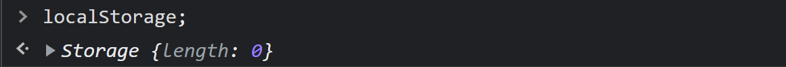

Введите `localStorage.setItem('myKey', 'testValue')`. Строковое значение будет сохранено в ключе `myKey`:

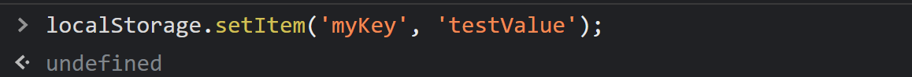

`undefined` означает, что значение не было возвращено. Введите `localStorage` еще раз, чтобы просмотреть сохраненные данные.

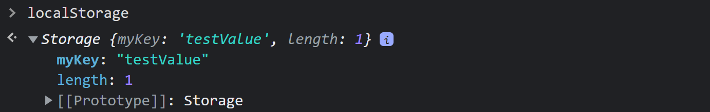

Введите `localStorage.getItem('myKey')`, и будет возвращена соответствующая строка:

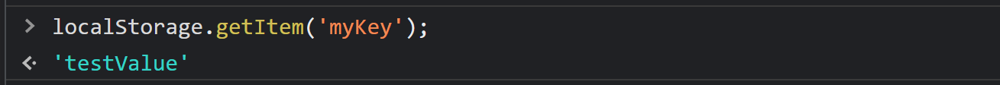

Введите `localStorage.removeItem('myKey')`, чтобы очистить соответствующую пару ключ-значение:

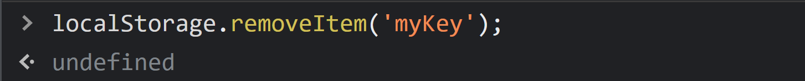

`undefined` означает, что значение не возвращается, показывая, что пара ключ-значение была очищена. Для подтверждения введите `localStorage`. Возвращаемая длина равна `0`.

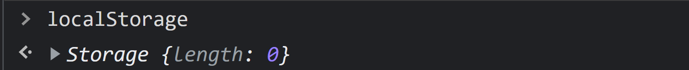

Введите `localStorage.clear()`, чтобы очистить `localStorage` от домена:

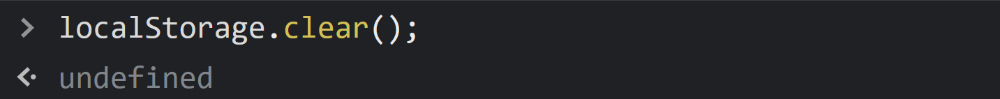

## Заключение

В этой статье мы рассмотрели localStorage и способы его использования. Подумайте о том, чтобы добавить этот инструмент в свой кодинг!

## Глоссарий

Атаки межсайтового скриптинга (XSS). Атаки межсайтового скриптинга (XSS) возникают, когда в браузер жертвы внедряется вредоносный Javascript-код. Домен. Домен - это эквивалент физического адреса вашего сайта. HTTP-запрос. Запрос протокола передачи гипертекста (HTTP) происходит, когда браузер отправляет ”запрос” на сервер веб-сайта для получения информации на веб-странице. Пара ключ-значение. Это набор связанных элементов: уникальный идентификатор (ключ) и значение (величина). Сериализация. Эта процедура превращает объект данных в поток байтов, чтобы его можно было передавать или хранить в памяти. Язык серверной части. Это язык программирования, который выполняет задачи на стороне сервера, прежде чем страница будет отправлена в браузер для рендеринга. Примеры: Python, Golang, PHP, Ruby, Java и т. д. Синхронный. Это означает, что процесс запускается только после завершения или передачи других задач.

СОВЕТ ОТ РЕДАКТОРА: Чтобы узнать больше о localStorage, не пропустите наши статьи A Guide To Using LocalStorage In JavaScript Apps и The Ultimate Guide To Browser-Side Storage.

[Источник](https://blog.openreplay.com/the-ultimate-guide-to-localstorage-in-javascript/)
