Многим брендам сложно создавать достаточное количество контента. Это бесконечный процесс, требующий привлечения нескольких членов команды и внештатных авторов. Кроме того, существует огромная конкуренция за одни и те же ключевые слова, что затрудняет ранжирование в поисковых системах и привлечение качественного трафика.

Еще хуже то, что фрилансеры иногда используют программное обеспечение с искусственным интеллектом для создания статьи вместо того, чтобы писать ее самостоятельно.

Влияет ли такой подход на рейтинг вашего контента? Могут ли поисковые системы вообще обнаружить контент, созданный с помощью ИИ? В этой статье мы рассмотрим вопрос обнаружения контента, созданного ИИ, и выделим инструменты, которые компании могут использовать, чтобы проверить, не создал ли ИИ статью.

Прежде чем погрузиться в тему, давайте обсудим, почему обнаружение контента, созданного ИИ, является важной задачей на данный момент.

## Важность обнаружения контента ИИ

ИИ быстро становится все более распространенным явлением благодаря стремительному развитию технологий. Кроме того, пользователи по всему миру принимают эту технологию с интригой и некоторой нерешительностью.

Инструменты искусственного интеллекта, такие как ChatGPT, позволяют любому человеку ввести запрос на выполнение определенной задачи или запроса и получить готовый результат, который может его удовлетворить. В отличие от поисковой системы, которая выдает список результатов, системы искусственного интеллекта, такие как ChatGPT, могут предоставить вам ответы или выполненные задачи на основе запроса, который вы предоставили.

ИИ может оценивать темы контента за считанные секунды, а вы? 🧐 Будьте впереди с этими лучшими инструментами обнаружения контента ИИ! ⬇️Click to Tweet

Например, я спросил у ChatGPT: ”Что такое ChatGPT?”. В ответ я получил следующий ответ:

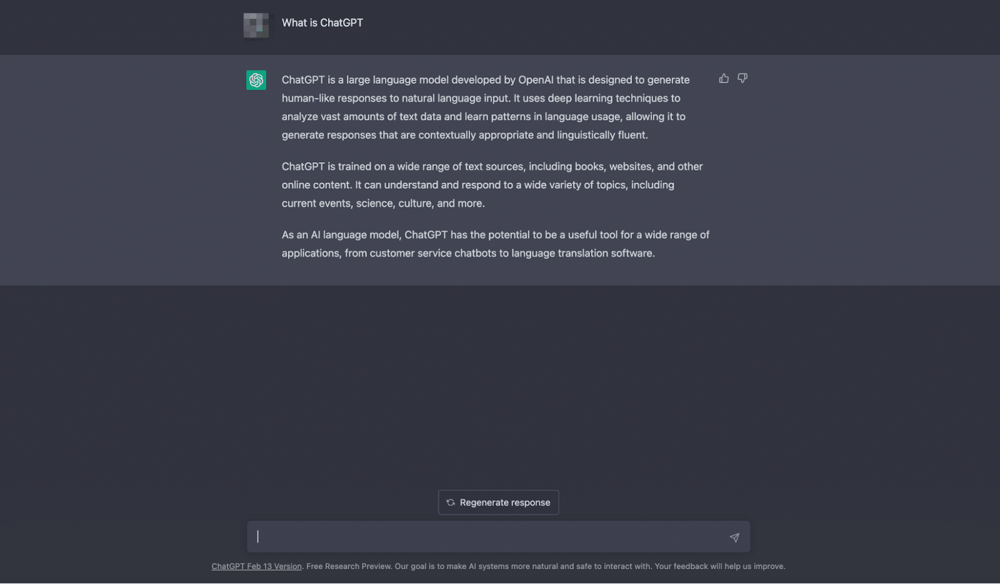Ответ от ChatGPT

Пользователи могут задавать инструментам искусственного интеллекта простые вопросы или поручать им выполнить задание - например, написать статью в блоге. Именно поэтому развитие инструментов искусственного интеллекта оказалось сложной задачей для бизнеса.

Копирайтеры, подрядчики и внештатные авторы могут попытаться использовать инструмент искусственного интеллекта для написания статьи для блога компании. На самом деле более 15 % писателей используют инструменты искусственного интеллекта для улучшения своих статей.

Сгенерированная ИИ статья может оказаться неточной, похожей на все остальные, которые уже были опубликованы, или даже плагиатом. Компании всегда должны быть уверены, что публикуют актуальный, оптимизированный, современный контент с уникальной точкой зрения.

Если фрилансеры компании используют программное обеспечение ИИ для создания своих постов, это может навредить бренду и привести к пустой трате ресурсов компании.

Однако использование ИИ в вашем бизнесе также имеет свои преимущества. В некоторых случаях использование ИИ может повысить производительность штатных сотрудников по созданию контента.

Это позволит вашей команде контента и цифрового маркетинга перераспределить свои ресурсы на другие направления вашей SEO-стратегии или бизнеса. Писатели, использующие искусственный интеллект, могут писать больше постов в блогах быстрее, чем те, кто его не использует.

Около 38 % писателей, не использующих ИИ, считают, что на написание поста у них уходит 3-4 часа, в то время как 38 % писателей, использующих ИИ, считают, что на ту же задачу у них уходит всего 2-3 часа.

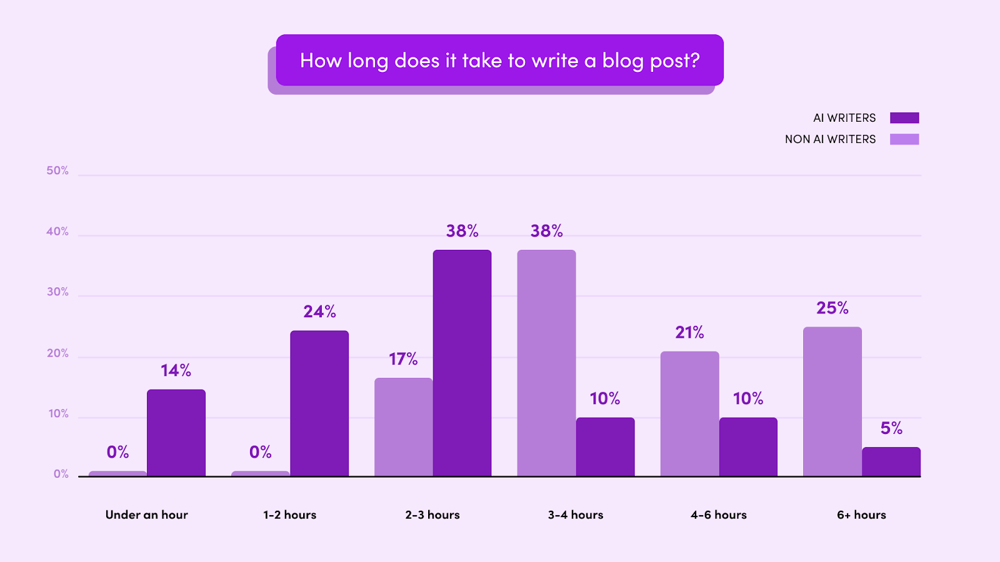Контент, созданный с помощью искусственного интеллекта, можно создавать быстрее

Однако компаниям нужно смотреть на картину в целом и не зацикливаться на том, как снизить затраты и при этом добиться максимального результата. В конце концов, контент, созданный искусственным интеллектом, опубликованный на вашем сайте, может повлиять на рейтинг в поисковых системах.

Давайте разберемся, как он влияет на SEO-показатели вашего сайта.

## Существуют ли штрафы за обнаружение ИИ на вашем сайте?

На протяжении многих лет контент-маркетологи пытались ”обмануть систему" и выяснить, что будет лучше всего работать с алгоритмом Google.

Google учитывает множество положительных и отрицательных факторов, чтобы предоставить пользователям наиболее точный контент для их запросов. Все эти факторы влияют на SEO-рейтинг сайта.

Некоторые из этих факторов включают в себя листинги цитирования, доменные ссылки, мобильные макеты, доступность, безопасность, ключевые слова, метатеги, длину, читабельность и многое другое.

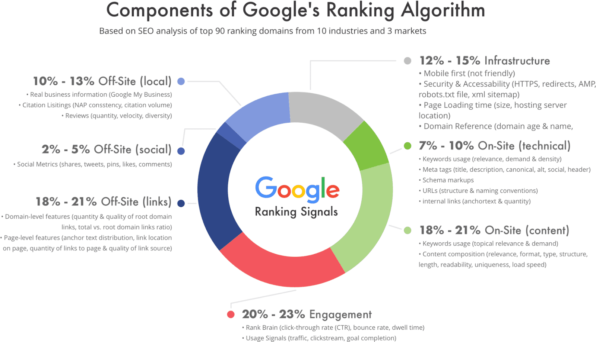Google учитывает множество сигналов ранжирования (Источник: Mike Khorev)

Недавно Google выпустил руководство по подходу к контенту, создаваемому искусственным интеллектом.

Компания заявила, что ”фокусируется на качестве контента, а не на способе его создания". Google указал на свои системы ранжирования и полезного контента как на две разные меры защиты от спамерского контента, созданного ИИ.

Система ранжирования создана для того, чтобы находить и выводить на поверхность высококачественный, оригинальный контент для пользователей Google. Недавно введенная система полезного контента определяет веб-страницы и статьи, которые отвечают на вопросы пользователей, вместо того чтобы выводить на экран оптимизированный контент.

Писатели должны помнить об обеих этих системах при составлении своего контента. Так же должны поступать и компании, которые экспериментируют со способами включения контента, генерируемого искусственным интеллектом, в свою контент-стратегию.

## Может ли Google обнаружить контент, созданный искусственным интеллектом?

Инструменты для создания ИИ являются совершенно новыми и быстро развиваются. Как Google может обнаружить контент, созданный ИИ? Блефуют ли они, илиСможет ли Google создать что-то достаточно быстрое и точное для обнаружения контента, созданного искусственным интеллектом? Если и существует поисковая система, способная комплексно обнаруживать контент, созданный искусственным интеллектом, то это Google.

Несмотря на то что Google хранит в секрете свои внутренние механизмы, компания заявляет, что у нее есть возможность обнаруживать контент, созданный искусственным интеллектом, и предостерегает от этого.

Дуй Нгуен, член команды Google по качеству поиска, сказал: ”Скрапирование контента, даже с некоторыми изменениями, противоречит нашей политике борьбы со спамом". Дуй добавил, что у Google есть "множество алгоритмов, которые отслеживают такое поведение и понижают в выдаче сайты, соскабливающие контент с других сайтов".

У Google есть множество инструментов, включая SpamBrain, для борьбы со спамом в поисковой системе. Однако Google различает контент AI и спам. Если контент полезен для тех, кто его ищет, Google будет относиться к нему благосклонно.

Если же автор скреативил контент или сгенерировал его искусственным интеллектом спамерским способом, Google может отнестись к нему негативно.

## Различные способы обнаружения контента, сгенерированного искусственным интеллектом

Иногда можно обнаружить контент, сгенерированный искусственным интеллектом, даже без использования инструмента обнаружения контента. Существует несколько советов и трюков, которые можно использовать для определения того, что статью создал ИИ.

Поскольку контент, созданный искусственным интеллектом, становится все более доступным для всех писателей, контент-маркетологам нужно быть начеку, чтобы не пропустить его на каждом шагу. Вот несколько лучших способов оценить и определить, является ли контент созданным ИИ:

Ищите повторяющиеся или необычные шаблоны в тексте

Искусственный интеллект не идеален. Иногда в статье, сгенерированной ИИ, можно встретить похожие фразы. ИИ может потребоваться дополнительное обучение, чтобы определить разницу между двумя понятиями.

Например, ChatGPT сгенерировал этот абзац о контент-маркетинге:

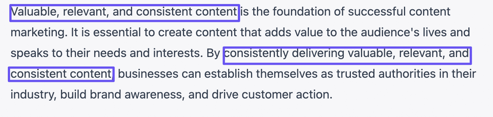Пример ответа ChatGPT

Хотя этот абзац лаконичен, в нем дважды в трех предложениях используется фраза ”ценный, актуальный и последовательный контент".

Выполните быстрый запрос ИИ и сравните

Используйте инструменты, которые доступны каждому. Запустите свой любимый генератор контента AI и напишите конкретный запрос, связанный с вашей статьей.

Уточните тему, объем и структуру. Нажмите кнопку generate и посмотрите, что получится в результате.

Проверьте отсутствие оригинальности

Такие популярные инструменты, как Grammarly и Writer.com, оснащены средствами проверки на плагиат, что позволяет легко определить, не является ли статья плагиатом. Эти инструменты сравнивают содержимое с другими веб-материалами, чтобы убедиться, что никто не дублировал и не украл его из опубликованных материалов.

Проверьте устаревшие неточности

Уточняйте факты. Иногда искусственный интеллект вставляет факты из источников, которые устарели или больше не имеют отношения к контенту.

Ознакомьтесь со статьей и проведите базовое исследование самостоятельно, чтобы убедиться, что все подтвердилось.

Проведите контекстуальный анализ

Люди обладают гораздо более совершенным способом определения переплетения концепций и идей.

Если вы читаете статью и считаете, что в ней не хватает основных частей, возможно, искусственный интеллект не смог соединить точки так, как это сделал бы человек. Это может быть признаком того, что ее создал искусственный интеллект.

Используйте инструмент для обнаружения контента, созданного искусственным интеллектом

Наконец, если вы не хотите делать эту работу самостоятельно, на рынке существует множество инструментов для обнаружения контента ИИ. Инструменты для обнаружения контента ИИ могут определить, написал ли пост искусственный интеллект.

## 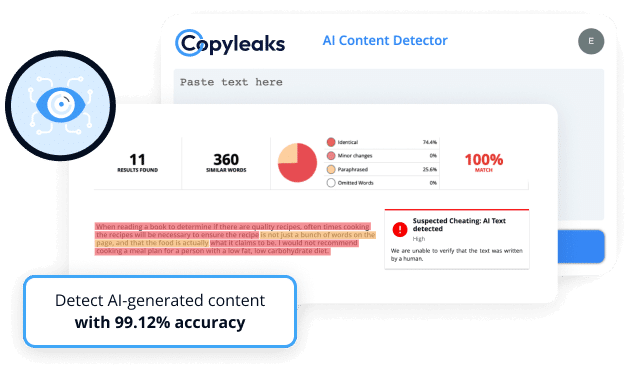Copyleaks

На рынке представлено множество таких инструментов, поэтому вам будет из чего выбрать, чтобы оценить, кто создал конкретный контент - человек или ИИ.

Но как инструмент обнаружения контента ИИ определяет, является ли что-то подлинным?

Как работают бесплатные инструменты для обнаружения контента ИИ?

Для многих людей мир искусственного интеллекта может быть запутанным. Это новая технология, поэтому все коллективно пытаются понять ее в режиме реального времени. Таким образом, вы, возможно, думаете, как эти инструменты настолько умны? Как они узнают, создал ли искусственный интеллект тот или иной контент?

Инструменты обнаружения контента ИИ используют машинное обучение и обработку естественного языка, чтобы определить, создал ли контент человек. Машинное обучение - это компьютерная система, которая становится умнее с каждым выполненным запросом или поиском. Обработка естественного языка - это компьютерная программа, которая понимает человеческие языки.

Разверните свое приложение на Kinsta. Начните прямо сейчас, воспользовавшись бесплатной пробной версией.

Запустите свои приложения на Node.js, Python, Go, PHP, Ruby, Java и Scala (или почти все остальные, если вы используете свои собственные Docker-файлы) за три простых шага!

Кроме того, искусственный интеллект способен в считанные секунды оценить всю информацию в Интернете по конкретной теме контента. Благодаря этому он может определить, является ли контент подлинным или сгенерированным.

Однако на рынке представлено множество инструментов для обнаружения контента без искусственного интеллекта. Какой из них выбрать вам?e? Давайте рассмотрим некоторые из самых популярных на сегодняшний день.

8 лучших инструментов обнаружения ИИ-контента в 2023 году

## 1. Писатель

Writer - это платформа, которая помогает копирайтерам составлять и полировать свои работы с помощью грамматических предложений, рекомендаций по тону, проверки на плагиат и многого другого.

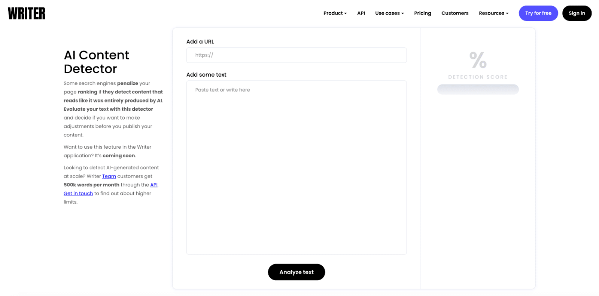Writer

Платформа имеет собственный инструмент обнаружения контента ИИ, который позволяет легко определить, какой контент мог быть создан ИИ.

Пользователи могут добавить URL-адрес или скопировать и вставить текст в окно. После нажатия кнопки ”Проанализировать текст" платформа предоставит процент обнаруженных в статье копий, сгенерированных ИИ.

В скором времени Writer интегрирует этот инструмент в более широкую платформу, что позволит обнаружить искусственный интеллект в статье всего за несколько кликов.

## 2. Copyleaks

Copyleaks предлагает простой в использовании детектор AI-контента на своем сайте.

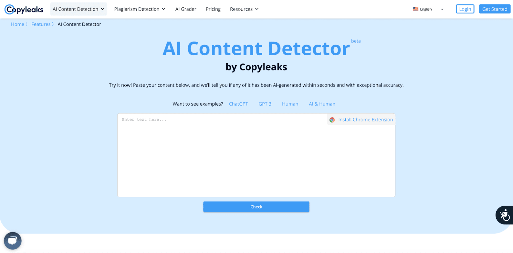Copyleaks

Это бесплатный сервис, который может обнаружить широкий спектр контента, созданного искусственным интеллектом, включая материалы, созданные ChatGPT, GPT3, Human, AI & Human и другие. Вы также можете скачать расширение для Chrome, которое обнаружит его на просматриваемых страницах.

Это пока бета-версия, но она полезна для тех, кому нужно оценить свой контент. Интерфейс прост в использовании, и вы будете точно знать, что делать, когда попадете на страницу.

Хотя Copyleaks предлагает и другие услуги (например, обнаружение плагиата), это не полноценная студия грамматики, как некоторые другие платформы. Однако в ней есть и другие инструменты, например, AI Grader для оценки школьных заданий, которые может создать искусственный интеллект.

## 3. Контент в масштабе

Content at Scale имеет уникальный детектор ИИ, который дополняет ее платформу для написания ИИ. Компания может похвастаться тем, что ее инструмент для написания ИИ может ”создавать необнаруживаемый контент, сгенерированный ИИ".

С таким заявлением можно ожидать, что их детектор ИИ будет первоклассным.

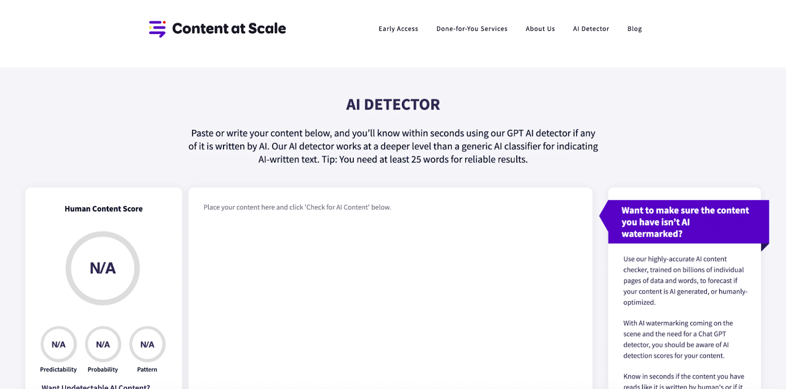Content at Scale

ИИ-детектор выносит вердикт ”в течение нескольких секунд" после отправки контента. Однако эта платформа немного уникальна по сравнению с другими. Платформа демонстрирует "человеческую оценку контента", которая представляет собой смесь оценок "предсказуемости, вероятности и шаблона".

Это немного больше объясняет, почему инструмент считает, что контент был создан искусственным интеллектом. Потому что контент слишком предсказуем, имеет высокую вероятность или повторяющийся шаблон? Эти оценки могут объяснить причину общего рейтинга.

Этот детектор ИИ использует уникальный подход, предоставляя также человеческий аспект - ”оценку контента человеком". В конечном итоге эта платформа предоставляет больше оценок и дает представление о своем видении контента, что делает ее лучшим претендентом на выбор для вашей работы по обнаружению.

## 4. Originality.AI

Originality.AI уникальна тем, что представляет собой расширение для Google Chrome, позволяющее в режиме реального времени проверить, создал ли ИИ ту или иную страницу.

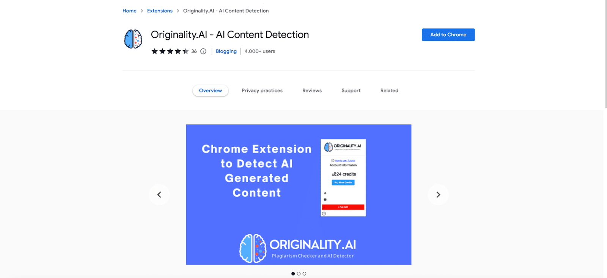Originality.AI

В большинстве положительных отзывов в качестве основного преимущества отмечается скорость работы. В конце концов, вам не нужно копировать и вставлять контент или добавлять URL, чтобы оценить его.

Другим, кто оценил продукт отрицательно, не понравились цены, связанные с ним. Несмотря на наличие бесплатной версии, многие посчитали, что с ней связаны скрытые платежи.

## 4. GPT Zero

GPT Zero обычно используют преподаватели, но он полезен и для бизнеса.

GPT Zero

Более 1 миллиона человек успешно воспользовались этим инструментом, чтобы оценить, генерировал ли ИИ их контент. Интерфейс GPT Zero очень прост в использовании. По ощущениям он почти похож на домашнюю страницу Google, где нет большого количества контента.

Только простой призыв к действию, который гласит: ”Попробуйте", и поле для ввода контента. Все, что вам нужно сделать, - это скопировать и вставить свою статью в поле на экране, и вы сможете увидеть, создал ли ИИ ваш контент.

В целом, это простой и быстрый способ проверить свой контент, но другие платформы предлагают более сложные предложения, чем GPT Zero.

## 5. Sapling

Компания Sapling, известная своим ИИ-моделирующим копилотом, также предлагает инструмент для обнаружения ИИ-контента.

Sapling

Sapling AI content detector может определить, написал ли GPT-3 или ChatGPT статью, оценив всего 50 слов. Это меньшее количество слов, которое требуется по сравнению с большинством других инструментов обнаружения контента.

Самое приятное, что инструмент окрашивает сгенерированный ИИ контент в красный цвет и выдает общий процент поддельного контента. Инструмент разработали бывшие исследователи из Google, Беркли и Стэнфорда.

Компания планирует постоянно совершенствовать функцию обнаружения ИИ, делая ее со временем более интеллектуальной.

## 6. Приложение-корректор

Писатели используют приложение Corrector App для выявления грамматических ошибок в своих статьях. Теперь в приложении ”Корректор" появился новый инструмент обнаружения контента с искусственным интеллектом, который дополняет все остальныевозможности.

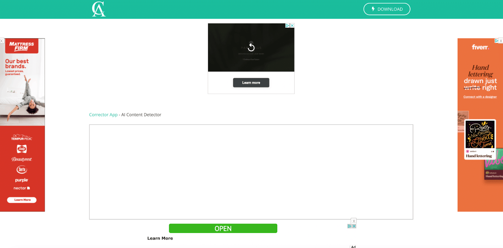Corrector App

Этот малоизвестный инструмент для обнаружения AI-контента бесплатен для всех пользователей. Инструмент требует минимум 300 слов. Это приложение можно использовать для быстрой проверки, но на рынке есть варианты и получше.

Пользовательский опыт Corrector App не самый лучший на рынке. Реклама на странице отвлекает, а общий опыт кажется ограниченным.

## 7. Кроссплаг

Crossplag - это комплексный инструмент для обнаружения ИИ с несколькими уникальными функциями, которые выделяют его среди конкурентов.

Как и другие подобные инструменты, Crossplag предлагает пользователям вставить текст в окно на экране и нажать на синее поле ”Проверить". После этого программа выдаст общую оценку подлинности контента.

Инструмент имеет шкалу термометра, которая показывает, насколько статья является поддельной. Это уникальное по сравнению с другими инструментами и приятное дополнение. Если термометр остается зеленым, значит, статья чистая, и большую ее часть создал человек. Если он отклоняется в красную сторону, это означает, что большую часть статьи создал искусственный интеллект.

Эта полезная функция позволяет легко определить, готов ли контент к публикации.

## 8. Казань SEO

Kazan SEO - один из первых SEO-комплексов полного цикла, предлагающий в своей платформе инструмент обнаружения контента с помощью искусственного интеллекта.

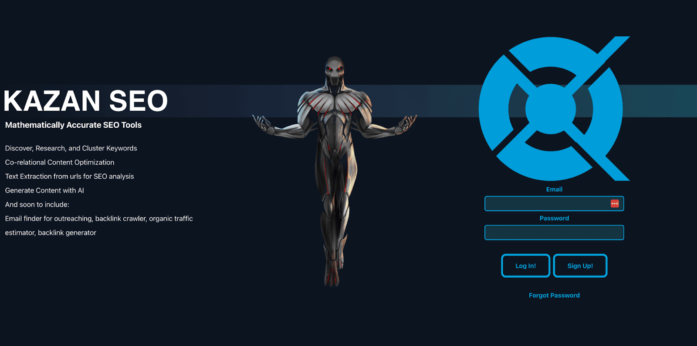Kazan SEO

Если вы ищете базовый SEO-инструмент, а также инструмент для обнаружения контента AI, Kazan SEO - хорошее место для начала.

Это бесплатное программное обеспечение предлагает целый ряд функций, включая кластеры ключевых слов, оптимизацию контента, извлечение текста, генераторы AI-контента и, самое главное, обнаружение AI-контента.

Как и в других платформах, функция обнаружения ИИ-контента бесплатна для использования и быстро определяет общий процент ИИ-генерированных копий в блоке контента. Эта информация бесценна для вашей общей SEO-стратегии, вот почему Kazan SEO предлагает этот инструмент.

Имея под рукой этот инструмент и другие SEO-функции Kazan, вы сможете построить эффективную, подлинную SEO-стратегию, которая выведет вас вперед ваших конкурентов.

Сделайте обнаружение контента AI рутиной - в этом руководстве собраны все лучшие инструменты, которые вам нужны! 🤓Кликните, чтобы твитнуть резюме

Контент, генерируемый искусственным интеллектом, уже здесь, и вы должны быть к этому готовы.

Опережающие конкурентов опытные маркетологи используют инструменты обнаружения контента, созданного искусственным интеллектом, для оценки и анализа своего контента. Как и постоянная оптимизация, обнаружение ИИ-контента должно стать для маркетологов рутинной частью процесса разработки контента.

[Источник](https://kinsta.com/blog/ai-content-detection/)
