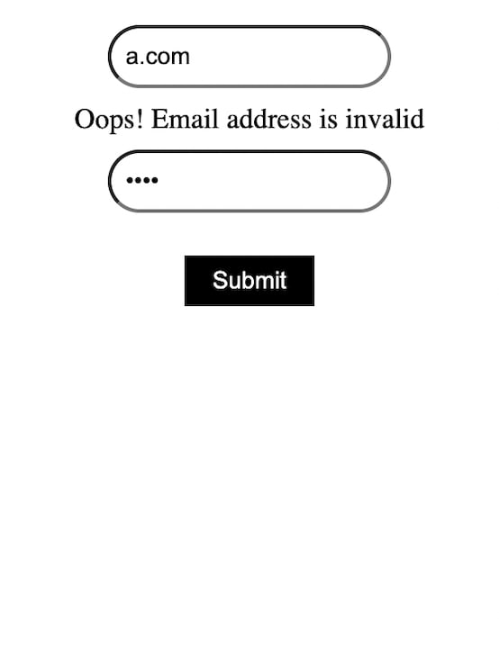

Современные веб-приложения как никогда интерактивны, ориентированы на пользователя и содержат много данных. Поэтому работа с полями ввода, формами и другими подобными элементами является важнейшим аспектом создания и управления динамическими веб-страницами. Эти элементы - просто нативные элементы ввода, используемые для манипулирования данными и взаимодействия. В контексте React ”состояние ввода” означает текущее состояние элементов ввода, включая теги ввода, чекбоксы, радиокнопки и другие подобные элементы нативных форм.

В этой статье мы рассмотрим, как React управляет состояниями ввода и изучим различные стратегии обработки изменений состояний. Вы также узнаете, как React использует концепцию контролируемых и неконтролируемых компонентов для повышения производительности приложений React и уменьшения количества повторных рендерингов.

Вы можете ознакомиться с демонстрацией CodeSandbox, которую мы используем для изучения того, как события `onFocus` и `onBlur` работают с элементами ввода. Но сначала давайте разберемся в разнице между управляемыми и неуправляемыми компонентами.

## Понимание контролируемых и неконтролируемых компонентов

Родные HMTL-элементы ввода, такие как `input`, `select` и другие, поддерживают свое собственное состояние и изменяют его всякий раз, когда пользователь набирает в них текст. Однако с React дело обстоит иначе.

Вместо этого React хранит состояние ввода в самом компоненте, передавая его элементу `input` и изменяя сохраненное состояние с помощью шаблона функции `setter`. Эта функция `setter` обычно представляет собой ленивую функцию обратного вызова, такую как `useState` Hook, которая широко используется для мутации и управления состоянием ввода.

Учитывая это, давайте рассмотрим различия между контролируемыми и неконтролируемыми компонентами в React.

## Что такое контролируемые компоненты?

Если вы определяете состояние компонента как единственный источник истины, а данные поступают от родительского компонента к элементу, мы называем его управляемым компонентом. Обычно вам нужно где-то хранить состояние до того, как оно перейдет к элементу.

Контролируемые компоненты, как правило, легче отлаживать, и команда React рекомендует использовать этот подход в большинстве случаев. В примере ниже ”единственным источником истины” является состояние `name`. Это состояние `name` инициализируется с помощью хука `useState`, затем передается вниз и устанавливается в качестве значения для элемента `input`:

```ts
import React, { useState } from 'react';

function App() {
  const [name, setName] = useState("");

  return (
    <div>
      <h1>Controlled Component</h1>
      <label>Name :</label>
      <input
        name="name"
        type="text"
        value={name}
        onChange={(e) => setName(e.target.value)}
      />
    </div>
  );
}
```

Такой подход обеспечивает сохранение состояния в самом компоненте, но вне элемента. Вы даже можете использовать то же состояние для рендеринга в пользовательском интерфейсе, что невозможно при использовании неконтролируемого компонента.

## Что такое неконтролируемые компоненты?

Альтернативой управляемому компоненту является неуправляемый компонент, в котором состояние управляется внутренним состоянием компонента. Неконтролируемый компонент обновляет свое состояние на основе манипуляций пользователя.

Во многих случаях использования неуправляемый компонент является анти-паттерном и не рекомендуется. Однако если вам нужно сохранить ”источник истины” в самом DOM, не полагаясь на Hooks для управления состоянием, это может быть хорошим вариантом.

Неконтролируемый компонент также может быть полезен для быстрого создания прототипов пользовательского интерфейса и переноса HTML-кода в кодовую базу React.

В примере ниже `input` - это неконтролируемый компонент. Вы можете получить доступ к его значению с помощью свойства `ref`:

```ts
import React, { useRef, useEffect } from 'react';

function App() {
  const inputRef = useRef(null);

  useEffect(() => {
    // Log what the user types in console
    console.log(inputRef.current.value);
  }, [inputRef.current.value]);

  return (
    <div>
      <h1>Uncontrolled Component</h1>
      <label>Name :</label>
      <input name="name" ref={inputRef} type="text" />
    </div>
  );
}
```

Хук `useEffect`, написанный выше, просто регистрирует текущее введенное значение. Чтобы отправить введенные данные в реальный API, можно использовать атрибут `onSubmit`:

```ts
import { useRef } from 'react';

function App() {
  const inputRef = useRef(null);

  const handleSubmit = () => {
    console.log(inputRef.current.value);
  };

  return (
    <form onSubmit={handleSubmit}>
      <h1>Uncontrolled Component</h1>
      <label>Name :</label>
      <input name="name" ref={inputRef} type="text" />
    </form>
  );
}
```

Атрибут `onSubmit` срабатывает только при отправке формы, в то время как атрибут `onChange` срабатывает при каждом нажатии клавиши - другими словами, каждый раз, когда происходит манипуляция с данными.

В целом, вам следует выбрать паттерн управляемого компонента, который упрощает поддержку состояний. Состояния в паре с хуком `useState` делают управляемые компоненты достаточно надежными и поддерживаемыми, и такой подход вносит меньше ошибок по сравнению с неуправляемыми компонентами.

Самое главное - не смешивайте и не сочетайте в форме оба компонента сразу. Если вы используете контролируемый компонент, последовательно следуйте ему во всей форме. В противном случае React выдаст вам предупреждение.

Исследование состояния ввода с помощью событий `onFocus` и `onBlur` в React

Вы видели, как `onChange` и `onSubmit` работают как в контролируемых, так и в неконтролируемых шаблонах компонентов. Существуют и другие атрибуты и события HTML-формы, которые упрощают управление вводом. Давайте рассмотрим два типа: события `onFocus` и `onBlur`.

Понимание того, как события `onFocus` работают с элементами ввода

`onFocus` - это собственное событие HTML, которое срабатывает только тогда, когда целевой элемент находится в фокусе. Вы можете использовать это событие для создания взаимодействий с пользовательским интерфейсом, таких как изменение цвета контура, предоставление пользователям обратной связи в виде всплывающих подсказок, небольшие анимации и взаимодействия, а также многое другое.

В примере ниже пользовательский интерфейс в идеале должен отображать `Focused`, когда элемент `input` находится в фокусе, и `Not Focused`, когда элемент `input` не в фокусе:

```ts
import React, { useState } from "react";

export default function App() {
  const [text, setText] = useState("");
  const [isFocus, setFocus] = useState(false);

  const handleFocus = () => {
    setFocus(true);
  };

  return (
    <div className="App">
      <input
        type="text"
        value={text}
        onFocus={handleFocus}
        onChange={(e) => setText(e.target.value)}
      />
      <div>{isFocus ? "Focused" : "Not Focused"}</div>
    </div>
  );
}
```

Однако при использовании этого кода вы можете заметить, что текст не отображает `Not Focused`, как мы хотим, когда `ввод` не в фокусе. Именно здесь в игру вступает недостающий атрибут события под названием `onBlur`.

Понимание того, как события `onBlur` работают с элементами ввода

`onBlur` работает как аналог события `onFocus` - оно срабатывает, когда элемент выходит из фокуса. Вы можете объединить эти два атрибута событий, чтобы отслеживать, когда элемент находится в фокусе и когда он выходит из фокуса.

Если вы вернетесь к приведенному выше коду и добавите `onBlur`, код будет работать, как и ожидалось. В приведенном ниже примере два атрибута событий работают вместе, чтобы отслеживать состояние элемента `input` - в частности, находится ли элемент в фокусе или нет:

```ts
import { useState } from "react";

export default function App() {
  const [text, setText] = useState("");
  const [isFocus, setFocus] = useState(false);

  const handleFocus = () => {
    setFocus(true);
  };

  const handleBlur = () => {
    setFocus(false);
  };

  return (
    <div className="App">
      <input
        type="text"
        value={text}
        onFocus={handleFocus}
        onBlur={handleBlur}
        onChange={(e) => setText(e.target.value)}
      />
      <div>{isFocus ? "Focus" : "Not Focus"}</div>
    </div>
  );
}
```

Родные события JavaScript, такие как `onBlur` и `onFocus`, помогают при создании форм или даже простых состояний ввода. Эти события срабатывают, когда пользователи взаимодействуют с элементами ввода, обеспечивая визуальную обратную связь, чтобы направить пользователя: 

Такая визуальная обратная связь может помочь во многих ситуациях - например, при возникновении проблем с введенными данными или других подобных проблем с форматированием формы.

Создание таких взаимодействий требует времени и усилий. Если вы новичок в области форм, убедитесь, что вы понимаете, как эти взаимодействия работают в естественных условиях, прежде чем переходить к сторонним решениям.

Однако если вы профессионально работаете над приложениями, предназначенными для организационного или коммерческого использования, гораздо лучше выбрать пакеты сторонних разработчиков и использовать их API. Это сэкономит время и обеспечит использование готовых к производству решений.

Вы можете поиграть с приведенным выше примером кода в Code Sandbox, чтобы попробовать различные идеи использования этих нативных событий в вашем приложении React.

Использование сторонних библиотек для обработки состояния ввода в React

Как я уже говорил, вместо того чтобы изобретать колесо, лучше использовать уже готовое решение для управления формами и вводом данных для более сложной обработки данных.

Популярные библиотеки, такие как React Hook Form, Formik и React Final Form, очень эффективны, когда дело доходит до управления сложными сценариями использования.

Устоявшиеся библиотеки обработки форм обычно предоставляют высокоуровневые API для обработки ошибок и сопоставления шаблонов. Кроме того, они обычно не содержат стилей, поэтому вы можете легко использовать их в паре с вашей любимой библиотекой компонентов.

Давайте посмотрим пример формы, созданной с помощью Formik:

```ts
import React from "react";
import { Formik } from "formik";
import "./styles.css";

const LoginForm = () => (
  <div className="login-container">
    <Formik
      initialValues={{ email: "", password: "" }}
      validate={(values) => {
        const errors = {};
        if (!values.email) {
          errors.email = "Email cannot be empty";
        } else if (!/^[A-Z0-9._%+-]+@[A-Z0-9.-]+\.[A-Z]{2,}$/i.test(values.email)) {
          errors.email = "Oops! Email address is invalid";
        }
        return errors;
      }}
      onSubmit={(values, { setSubmitting }) => {
        // Send values to an API here
        console.log("email sent");
      }}
    >
      {({ values, errors, touched, handleChange, handleBlur, handleSubmit, isSubmitting /* and other goodies */ }) => (
        <form onSubmit={handleSubmit}>
          <input
            placeholder="email"
            type="email"
            name="email"
            onChange={handleChange}
            onBlur={handleBlur}
            value={values.email}
          />
          <br />
          {errors.email && touched.email && errors.email}
          <br />
          <input
            placeholder="password"
            type="password"
            name="password"
            onChange={handleChange}
            onBlur={handleBlur}
            value={values.password}
          />
          {errors.password && touched.password && errors.password}
          <br />
          <button type="submit" disabled={isSubmitting}>Submit</button>
        </form>
      )}
    </Formik>
  </div>
);

export default LoginForm;
```

Как вы можете видеть, выполняя самый минимум, Formik избавляется от проблем, связанных со сложными сценариями обработки входных данных, такими как обработка ошибок, предупреждения и проверка шаблонов. Например:

У вас есть API высокого уровня для управления пользовательскими сообщениями об ошибках Вы можете запускать тексты при касании полей с помощью курсора Вы можете форматировать данные перед отправкой их в API бэкенда.

Посмотрите на результат работы нашей формы Formik ниже:

Все другие библиотеки, такие как React Hook Form и React Final Form, более или менее следуют аналогичному шаблону. Это позволяет вам сосредоточиться на логике, а не создавать формы снова и снова.

Если вы создаете форму с большим количеством движущихся частей, требующую обширного манипулирования данными, использование сторонней библиотеки, такой как Formik, для создания форм и управления состояниями ввода может быть очень хорошей идеей.

## Заключение

Передача состояний ввода в React иногда может быть громоздкой. Но при правильном подходе, соблюдении стандартов, таких как использование контролируемых компонентов, React упрощает работу с данными.

Если ваш проект небольшого или среднего уровня и не требует большого количества форм, возможно, лучше обойтись без библиотек и обрабатывать состояния ввода самостоятельно. Однако для более требовательных к формам потребительских продуктов обычно лучше использовать сторонние библиотеки форм.

React облегчает проблемы, связанные с обработкой ввода, предоставляя такие события, как `onFocus`, `onBlur` и другие, чтобы упростить создание и управление формами и данными. Особенно если использовать React в паре с библиотекой, создание форм может быть очень масштабируемым и легко отлаживаемым.
