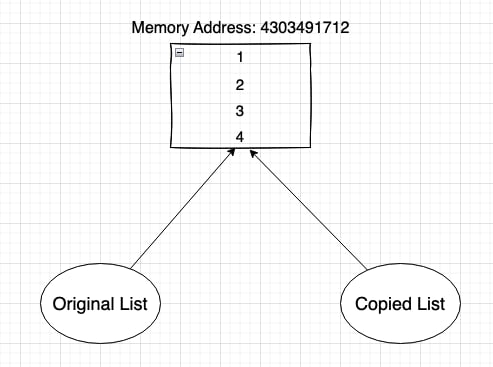
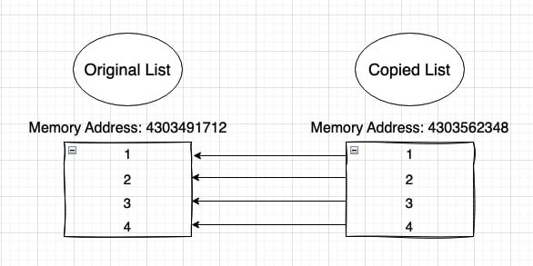
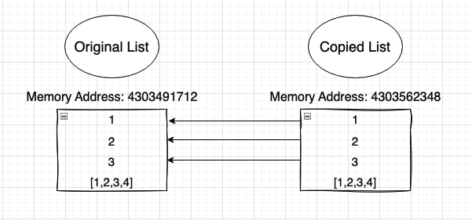

## Мои первые трудности с копированием списков

Когда я начинал свой путь программиста в Python, я столкнулся со сценарием, с которым сталкиваются многие начинающие программисты: копирование списка и передача его в функцию для дальнейшей модификации. Вот подход, который я использовал вначале, и почему он не сработал так, как ожидалось.

```python
def square_nums(nums_list):
    return [num ** 2 for num in nums_list]

original_list = [1, 2, 3, 4, 5]
copied_list = original_list[:]
squared_nums = square_nums(copied_list)
```

Однако вскоре я осознал критическую проблему: любые изменения, внесенные в копируемый*список внутри функции, отражались и в оригинальном*списке. Это озадачило меня и заставило углубиться в документацию Python.

## Откровение: Псевдонимы против реальных копий

Прочитав официальную документацию, я понял, что способ, которым я копировал содержимое original_list, был в корне неверным. На самом деле, согласно семантике Python, я не создавал копию, а просто создавал псевдоним с помощью оператора присваивания. Сколько бы псевдонимов мы ни создали, все они будут указывать на один и тот же объект. Вот почему, когда сам объект изменялся, я получал измененные значения в исходном списке original_list в моем коде.  


## Правильный подход к копированию в Python

Python предоставляет два способа сделать это:

1. Неглубокое копирование
2. Глубокое копирование
   Обе эти функции доступны в модуле копирования, входящем в стандартную библиотеку Python.

## Мелкое копирование

При неглубоком копировании создается новый контейнер/объект, но содержащиеся в нем элементы по-прежнему являются ссылками на исходный контейнер/объект.

В этом можно убедиться, проверив память контейнеров и их отдельных элементов с помощью функции `id()`.

Этот способ копирования лучше всего работает, если у нас неизменяемые элементы.

Это достигается с помощью функции `copy.copy()` модуля copy.



```python
import copy

original_list = [1, 2, 3]  # Creates a shallow copy
copied_list = copy.copy(original_list)

# Will print True
print(id(original_list[0]) == id(copied_list[0]))

original_list[0] = 0

# Will print False
print(id(original_list[0]) == id(copied_list[0]))
```

В приведенном выше коде последний оператор печати все равно будет `False`, потому что целые числа неизменяемы. Поэтому, как только `оригинальному_списку[0]` будет присвоено новое значение, ссылка обновится до нового целочисленного значения, то есть до `0`. Но `copied_list[0]` продолжает ссылаться на исходный целочисленный объект 1. Такое поведение было бы иным, если бы `original_list` содержал изменяемые объекты (например, другие списки, словари и т. д.), где изменение изменяемого объекта внутри `original_list` было бы отражено и в `original_list` из-за общих ссылок.

В связи с потенциальными проблемами, которые могут возникнуть при использовании мутабельных объектов, у модуля copy есть еще одно предложение: deepcopy.

## Глубокое копирование

При неглубоком копировании создается новый контейнер/объект и в него рекурсивно вставляются копии объектов (не всегда, а в зависимости от типа объекта), найденных в оригинале.

```python
import copy

original_list = [1, 2, 3, [2,3,4]]
copied_list = copy.deepcopy(original_list)

# Will print False
print(id(original_list) == id(copied_list))

# Will print True
print(id(original_list[0]) == id(copied_list[0]))

# Will print True
print(id(original_list[1]) == id(copied_list[1]))

# Will print True
print(id(original_list[2]) == id(copied_list[2]))

# Will print False
print(id(original_list[3]) == id(copied_list[3]))
```

В приведенном выше коде мы видим интересную вещь, а именно: когда объекты неизменяемы, как, например, объекты с индексами 0, 1, 2 в `оригинальном_списке`, то и объекты в `копируемом_списке` также ссылаются на тот же объект. Но когда элемент является изменяемым, как `список`, то в `копируемом_списке` сохраняется отдельная копия.



## Роль мемо-словаря в Deepcopy

Избежание избыточных копий:
Когда объект копируется с помощью deepcopy, словарь memo отслеживает объекты, которые уже были скопированы в этом цикле копирования. Это особенно важно для сложных объектов, которые могут ссылаться на один и тот же подобъект несколько раз. Без memo каждая ссылка на один и тот же суб-объект привела бы к созданию новой отдельной копии, что потенциально привело бы к неэффективному дублированию объектов.

Работа с рекурсивными структурами:  
Рекурсивные структуры - это объекты, которые прямо или косвенно ссылаются на самих себя. Например, список, содержащий ссылку на самого себя. deepcopy использует словарь мемов для отслеживания объектов, которые уже встречались в процессе копирования. Если он встречает объект, который уже есть в словаре memo, он использует существующую копию из memo, а не входит в бесконечный цикл, пытаясь скопировать рекурсивную ссылку.

Реализация в классах, определяемых пользователем

Чтобы реализовать функциональность copy и deepcopy, мы можем использовать магические методы copy() и deepcopy() внутри класса.  
Внутренне даже структура данных `list` является классом, и поэтому мы получаем `list.copy()` функция.

Благодаря этому более глубокому пониманию копирования объектов в Python вы теперь лучше подготовлены к тому, чтобы разобраться с нюансами мутабельных и иммутабельных объектов в своих кодинговых приключениях. Счастливого кодинга!
