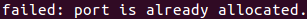
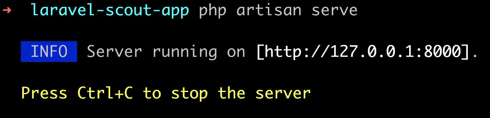
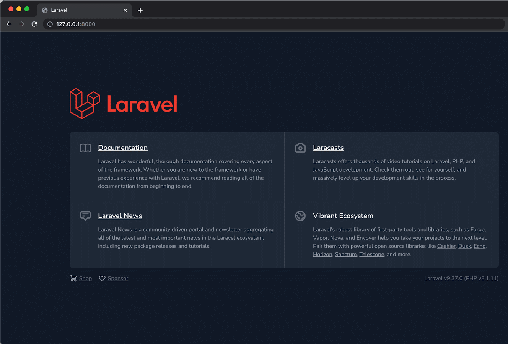
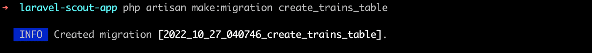
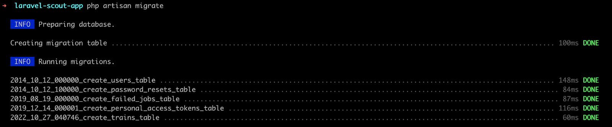
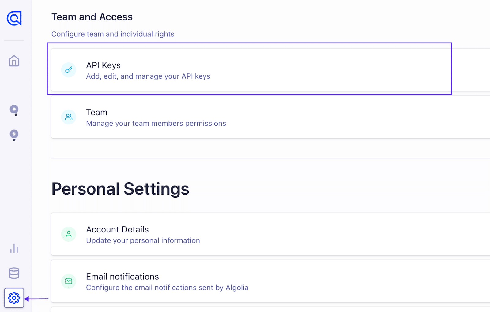
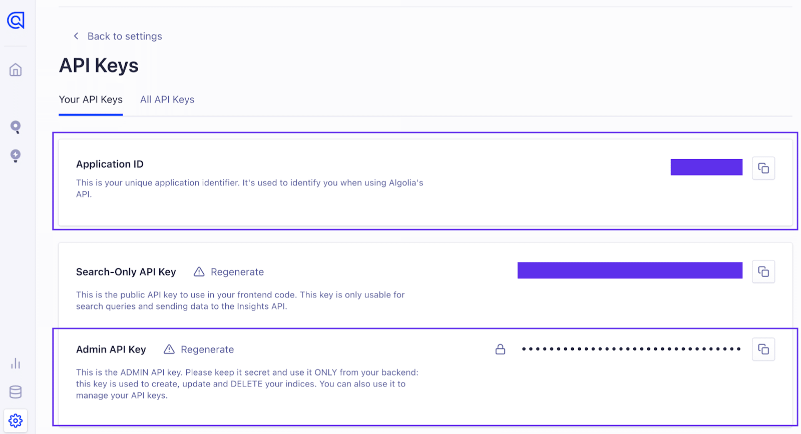
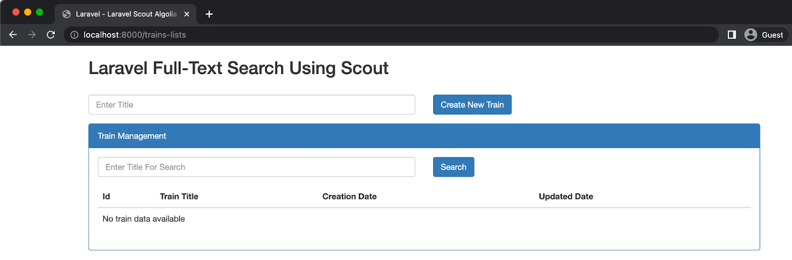
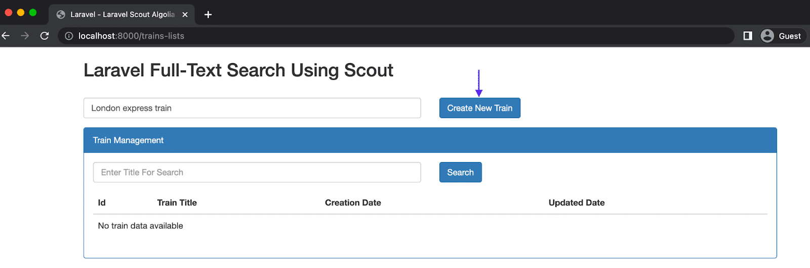

Фреймворк Laravel стал популярным ресурсом для разработчиков, создающих веб-сервисы.

Являясь инструментом с открытым исходным кодом, Laravel предлагает огромное количество готовых функций, которые позволяют разработчикам создавать надежные и функциональные приложения.

Разверните свое приложение на Kinsta. Начните прямо сейчас, воспользовавшись бесплатной пробной версией.

Запустите свои приложения на Node.js, Python, Go, PHP, Ruby, Java и Scala (или почти все остальные, если вы используете свои собственные Docker-файлы) в три простых шага!

Среди предложений - Laravel Scout, библиотека для управления поисковыми индексами вашего приложения. Ее гибкость позволяет разработчикам тонко настраивать конфигурации и выбирать драйверы Algolia, Meilisearch, MySQL или Postgres для хранения индексов.

Здесь мы подробно рассмотрим этот инструмент и научим вас, как добавить поддержку полнотекстового поиска в приложение Laravel с помощью драйвера. Вы смоделируете демо-приложение Laravel для хранения названий макетов поездов, а затем воспользуетесь Laravel Scout для добавления поиска в приложение.

## Необходимые условия

Чтобы следовать этому курсу, у вас должны быть:

На вашем компьютере установлен компилятор PHP. В этом руководстве используется PHP версии 8.1. Движок Docker или Docker Desktop, установленный на вашем компьютере Учетная запись в облаке Algolia, которую вы можете создать бесплатно

Хотите сделать свое приложение более удобным для пользователя? Попробуйте добавить поддержку полнотекстового поиска! Вот как это сделать с помощью Laravel Scout ⬇️Click to Tweet How To Install Scout in a Laravel Project

Чтобы использовать Scout, вам нужно сначала создать приложение Laravel, в которое вы собираетесь добавить функцию поиска. Bash-скрипт Laravel-Scout содержит команды для создания Laravel-приложения в контейнере Docker. Использование Docker означает, что вам не нужно устанавливать дополнительное вспомогательное программное обеспечение, например базу данных MySQL.

Сценарий Laravel-scout использует язык сценариев Bash, поэтому его необходимо выполнять в среде Linux. Если вы используете Windows, убедитесь, что вы настроили Windows Subsystem for Linux (WSL).

Если вы используете WSL, выполните следующую команду в терминале, чтобы установить предпочтительный дистрибутив Linux.

`wsl -s ubuntu`

Далее перейдите в то место на вашем компьютере, куда вы хотите поместить проект. Скрипт Laravel-Scout создаст здесь директорию проекта. В примере ниже скрипт Laravel-Scout создаст каталог в директории рабочего стола.

`cd /desktop`

Выполните приведенную ниже команду, чтобы запустить сценарий Laravel-Scout. Он создаст Dockerized-приложение с необходимым кодом.

`curl -s https://laravel.build/laravel-scout-app | bash`

После выполнения измените директорию с помощью `cd laravel-scout-app`. Затем выполните команду `sail-up` в папке проекта, чтобы запустить Docker-контейнеры для вашего приложения.

Примечание: Во многих дистрибутивах Linux вам может потребоваться выполнить приведенную ниже команду с помощью команды `sudo для получения повышенных привилегий.

`./vendor/bin/sail up`

Вы можете столкнуться с ошибкой:

Ошибка, указывающая, что порт выделен.

Чтобы решить эту проблему, используйте переменную `APP_PORT` для указания порта в команде `sail up`:

`APP_PORT=3001 ./vendor/bin/sail up`.

Далее выполните следующую команду, чтобы запустить приложение через Artisan на PHP-сервере.

`php artisan serve` Обслуживание приложения Laravel с помощью Artisan

В веб-браузере перейдите к запущенному приложению по адресу http://127.0.0.1:8000. Приложение отобразит страницу приветствия Laravel по маршруту по умолчанию.

Страница приветствия приложения Laravel

## Как добавить Laravel Scout в приложение

В терминале введите команду, чтобы включить менеджер пакетов Composer PHP для добавления Laravel Scout в проект.

`composer require laravel/scout`

Затем опубликуйте конфигурационный файл Scout с помощью команды vendor:publish. Команда опубликует файл конфигурации `scout.php` в директории config вашего приложения.

`php artisan vendor:publish --provider="Laravel\Scout\ScoutServiceProvider"`.

Теперь измените шаблонный файл .env, чтобы он содержал булево значение `SCOUT_QUEUE`.

Значение `SCOUT_QUEUE` позволит Scout ставить операции в очередь, обеспечивая лучшее время отклика. Без этого значения драйверы Scout, такие как Meilisearch, не будут сразу отражать новые записи.

`SCOUT_QUEUE=true`

Также измените переменную `DB_HOST` в файле .env, чтобы она указывала на ваш localhost для использования базы данных MySQL в контейнерах Docker.

`DB_HOST=127.0.0.1` Как разметить модель и настроить индекс

По умолчанию Scout не включает модели данных с возможностью поиска. Вы должны явно пометить модель как доступную для поиска с помощью свойства `Laravel\Scout\Searchable`.

Мы начнем с создания модели данных для демонстрационного приложения `Train` и отметим ее как доступную для поиска.

## Как создать модель

Для приложения `Train`лизации, вы захотите хранить имена-заполнители для каждого доступного поезда.

Выполните приведенную ниже команду Artisan для создания миграции и назовите ее `create_trains_table`.

`php artisan make:migration create_trains_table` Создание миграции с именем create_trains_table

Миграция будет сгенерирована в файл, имя которого сочетает в себе указанное имя и текущую метку времени.

Откройте файл миграции, расположенный в каталоге database/migrations/.

Чтобы добавить колонку с заголовком, добавьте следующий код после колонки `id()` в строке 17. Этот код добавит колонку с заголовком.

`$table->string('title');`

Чтобы применить миграцию, выполните следующую команду.

`php artisan migrate` Применение миграции Artisan

После запуска миграции базы данных создайте файл Train.php в директории app/Models/.

## Как добавить признак LaravelScoutSearchable

Пометьте модель `Train` для поиска, добавив к ней признак `Laravel\Scout\Searchable`, как показано ниже.

```php
<?php

namespace App\Models;

use Illuminate\Database\Eloquent\Model;
use Laravel\Scout\Searchable;

class Train extends Model
{
    use Searchable;

    public $fillable = ['title'];
}
```

Также необходимо настроить поисковые индексы, переопределив метод `searchable`. Поведение Scout по умолчанию будет сохранять модель в соответствии с именем таблицы модели.

Поэтому добавьте следующий код в файл Train.php ниже кода из предыдущего блока.

`/** * Получение имени индекса для модели. * * @return string */ public function searchableAs() { return 'trains_index'; } }`

## Как использовать Algolia со Scout

Для первого полнотекстового поиска в Laravel Scout вы будете использовать драйвер Algolia. Algolia - это программное обеспечение как услуга (SaaS), используемое для поиска в больших объемах данных. Она предоставляет разработчикам веб-панель для управления поисковыми индексами и надежный API, доступ к которому можно получить с помощью набора средств разработки программного обеспечения (SDK) на выбранном вами языке программирования.

В приложении Laravel вы будете использовать клиентский пакет Algolia для PHP.

## Как настроить Algolia

Сначала необходимо установить клиентский пакет Algolia PHP для поиска в вашем приложении.

Выполните приведенную ниже команду.

`composer require algolia/algoliasearch-client-php`.

Далее необходимо задать идентификатор приложения и секретный ключ API от Algolia в файле .env.

Используя веб-браузер, перейдите на панель управления Algolia, чтобы получить идентификатор приложения и секретный ключ API.

Нажмите на ”Настройки” в нижней части левой боковой панели, чтобы перейти на страницу ”Настройки”.

Затем нажмите API Keys в разделе Team and Access на странице Settings, чтобы просмотреть ключи для вашей учетной записи Algolia.

Страница API-ключей на Algolia Cloud

На странице API Keys обратите внимание на значения Application ID и Admin API Key. Вы будете использовать эти учетные данные для аутентификации соединения между приложением Laravel и Algolia.

Идентификатор приложения и ключи API администратора

Добавьте приведенный ниже код в ваш файл .env с помощью редактора кода и замените пропуски на соответствующие секреты API Algolia.

`ALGOLIA_APP_ID=APPLICATION_ID ALGOLIA_SECRET=ADMIN_API_KEY`.

Также замените переменную `SCOUT_DRIVER` кодом, приведенным ниже, чтобы изменить значение с `meilisearch` на `algolia`. Изменение этого значения будет указывать Scout на использование драйвера Algolia.

`SCOUT_DRIVER=algolia`

## Как создать контроллеры приложений

В директории app/Http/Controllers/ создайте файл TrainSearchController.php для хранения контроллера приложения. Контроллер будет выводить список и добавлять данные в модель `Train`.

Добавьте следующий блок кода в файл TrainSearchController.php, чтобы создать контроллер.

```php
<?php

namespace App\Http\Controllers;

use Illuminate\Http\Request;
use App\Http\Requests;
use App\Models\Train;

class TrainSearchController extends Controller
{
    /**
     * Получение имени индекса для модели.
     *
     * @return string
     */
    public function index(Request $request)
    {
        if ($request->has('titlesearch')) {
            $trains = Train::search($request->titlesearch)->paginate(6);
        } else {
            $trains = Train::paginate(6);
        }

        return view('Train-search', compact('trains'));
    }

    /**
     * Получение имени индекса для модели.
     *
     * @return string
     */
    public function create(Request $request)
    {
        $this->validate($request, ['title' => 'required']);

        $trains = Train::create($request->all());

        return back();
    }
}
```

## Как создать маршруты приложения

В этом шаге вы создадите маршруты для создания списка и добавления новых поездов в базу данных.

Откройте файл routes/web.php и замените существующий код на блок ниже.

```php
<?php

use Illuminate\Support\Facades\Route;
use App\Http\Controllers\TrainSearchController;

Route::get('/', function () {
    return view('welcome');
});

Route::get('trains-lists', [TrainSearchController::class, 'index'])->name('trains-lists');

Route::post('create-item', [TrainSearchController::class, 'create'])->name('create-item');
```

Приведенный выше код определяет два маршрута в приложении. Запрос `GET` для маршрута `/trains-lists` перечисляет все сохраненные данные о поездах. Запрос `POST` для маршрута `/create-item` создает новые данные о поездах.

## Как создать представления приложения

Создайте файл в директории resources/views/ и назовите его Train-search.blade.php. Этот файл будет отображать пользовательский интерфейс для функции поиска.

Добавьте содержимое приведенного ниже блока кода в файл Train-search.blade.php, чтобы создать единую страницу для функции поиска.

```php
<!DOCTYPE html>
<html>
<head>
    <title>Laravel - Laravel Scout Algolia Search Example</title>
    <link rel="stylesheet" type="text/css" href="https://maxcdn.bootstrapcdn.com/bootstrap/3.3.7/css/bootstrap.min.css">
</head>
<body>
    <div class="container">
        <h2 class="text-bold">Laravel Full-Text Search Using Scout </h2><br/>
        <form method="POST" action="{{ route('create-item') }}" autocomplete="off">
            @if(count($errors))
                <div class="alert alert-danger">
                    <strong>Упс! </strong> При вводе данных произошла ошибка. <br/>
                    <ul>
                        @foreach($errors->all() as $error)
                            <li>{{ $error }}</li>
                        @endforeach
                    </ul>
                </div>
            @endif
            <input type="hidden" name="_token" value="{{ csrf_token() }}">
            <div class="row">
                <div class="col-md-6">
                    <div class="form-group {{ $errors->has('title') ? 'has-error' : '' }}">
                        <input type="text" id="title" name="title" class="form-control" placeholder="Enter Title" value="{{ old('title') }}">
                        <span class="text-danger">{{ $errors->first('title') }}</span>
                    </div>
                </div>
                <div class="col-md-6">
                    <div class="form-group">
                        <button class="btn btn-primary">Создать новый поезд</button>
                    </div>
                </div>
            </div>
        </form>
        <div class="panel panel-primary">
            <div class="panel-heading">Управление поездами</div>
            <div class="panel-body">
                <form method="GET" action="{{ route('trains-lists') }}">
                    <div class="row">
                        <div class="col-md-6">
                            <div class="form-group">
                                <input type="text" name="titlesearch" class="form-control" placeholder="Enter Title For Search" value="{{ old('titlesearch') }}">
                            </div>
                        </div>
                        <div class="col-md-6">
                            <div class="form-group">
                                <button class="btn btn-primary">Search</button>
                            </div>
                        </div>
                    </div>
                </form>
                <table class="table">
                    <thead>
                        <th>Id</th>
                        <th>Train Title</th>
                        <th>Creation Date</th>
                        <th>Updated Date</th>
                    </thead>
                    <tbody>
                        @if($trains->count())
                            @foreach($trains as $key => $item)
                                <tr>
                                    <td>{{ ++$key }}</td>
                                    <td>{{ $item->title }}</td>
                                    <td>{{ $item->created_at }}</td>
                                    <td>{{ $item->updated_at }}</td>
                                </tr>
                            @endforeach
                        @else
                            <tr>
                                <td colspan="4">Нет данных о поездах</td>
                            </tr>
                        @endif
                    </tbody>
                </table>
                {{ $trains->links() }}
            </div>
        </div>
    </div>
</body>
</html>
```

Приведенный выше HTML-код содержит элемент формы с полем ввода и кнопкой для ввода названия поезда перед сохранением его в базе данных. В коде также есть HTML-таблица, в которой отображаются id, название, created_at и updated_at для записи о поезде в базе данных.

## Как использовать поиск в Algolia

Чтобы просмотреть страницу, перейдите на сайт http://127.0.0.1:8000/trains-lists через веб-браузер.

Данные модели поезда

В настоящее время база данных пуста, поэтому вам нужно ввести название демонстрационного поезда в поле ввода и нажать кнопку Создать новый поезд, чтобы сохранить его.

Вставка записи о новом поезде

Чтобы воспользоваться функцией поиска, введите ключевое слово из всех сохраненных названий поездов в поле ввода Enter Title For Search и нажмите Search.

Как показано на рисунке ниже, будут отображены только записи, содержащие ключевое слово в названии.

Использование функции поиска для нахождения записи о поезде Meilisearch with Laravel Scout

## Meilisearch

Meilisearch - это поисковая система с открытым исходным кодом, ориентированная на скорость, производительность и улучшенный опыт разработчиков. Он имеет ряд общих черт с Algolia, использует те же алгоритмы, структуры данных и исследования - но с другим языком программирования.

Разработчики могут создать и самостоятельно разместить экземпляр Meilisearch в своей локальной или облачной инфраструктуре. У Meilisearch также есть бета-версия облачного предложения, аналогичного Algolia, для разработчиков, которые хотят использовать продукт без управления его инфраструктурой.

В этом руководстве у вас уже есть локальный экземпляр Meilisearch, запущенный в ваших Docker-контейнерах. Теперь вы расширите функциональность Laravel Scout, чтобы использовать экземпляр Meilisearch.

Чтобы добавить Meilisearch в приложение Laravel, выполните приведенную ниже команду в терминале проекта.

`composer require meilisearch/meilisearch-php`.

Далее вам нужно изменить переменные Meilisearch в файле .env, чтобы настроить его.

Замените переменные `SCOUT_DRIVER`, `MEILISEARCH_HOST` и `MEILISEARCH_KEY` в файле .env на указанные ниже.

`SCOUT_DRIVER=meiliпоиск MEILISEARCH_HOST=http://127.0.0.1:7700 MEILISEARCH_KEY=LockKey`

Ключ `SCOUT_DRIVER` определяет драйвер, который должен использовать Scout, а `MEILISEARCH_HOST` представляет собой домен, в котором запущен ваш экземпляр Meilisearch. Хотя в процессе разработки добавление `MEILISEARCH_KEY` не требуется, в производстве оно рекомендуется.

Примечание: Закомментируйте идентификатор и секрет Algolia, если вы используете Meilisearch в качестве предпочтительного драйвера.

После завершения настройки .env следует проиндексировать существующие записи с помощью команды Artisan, приведенной ниже.

`php artisan scout:import "App\Models\Train"`

## Laravel Scout with Database Engine

Движок базы данных Scout может быть наиболее подходящим для приложений, которые используют небольшие базы данных или управляют менее интенсивными рабочими нагрузками. В настоящее время движок базы данных поддерживает PostgreSQL и MySQL.

Этот движок использует формулы ”где-как” и полнотекстовые индексы в вашей базе данных, что позволяет ему находить наиболее релевантные результаты поиска. При использовании механизма базы данных вам не нужно индексировать свои записи.

Чтобы использовать механизм базы данных, вы должны установить переменную `SCOUT_DRIVER` .env на базу данных.

Откройте файл .env в приложении Laravel и измените значение переменной `SCOUT_DRIVER`.

`SCOUT_DRIVER = database`

После смены драйвера на базу данных Scout переключится на использование движка базы данных для полнотекстового поиска.

## Движок сбора данных в Laravel Scout

В дополнение к движку базы данных, Scout также предлагает движок коллекции. Этот механизм использует предложения ”где” и фильтрацию коллекций для извлечения наиболее релевантных результатов поиска.

В отличие от движка базы данных, движок коллекции поддерживает все реляционные базы данных, которые поддерживает и Laravel.

Вы можете использовать механизм коллекций, установив переменную окружения `SCOUT_DRIVER` в значение `collection` или вручную указав драйвер коллекции в файле конфигурации Scout.

`SCOUT_DRIVER = collection`

## Explorer с Elasticsearch

Благодаря силе запросов Elasticsearch, Explorer представляет собой современный драйвер Elasticsearch для Laravel Scout. Он предлагает совместимый драйвер Scout и такие преимущества, как хранение, поиск и анализ огромных объемов данных в режиме реального времени. Elasticsearch с Laravel предлагает результаты за миллисекунды.

Чтобы использовать драйвер Elasticsearch Explorer в вашем приложении Laravel, вам нужно настроить шаблонный файл docker-compose.yml, который сгенерировал скрипт Laravel-Scout. Вы добавите дополнительные конфигурации для Elasticsearch и перезапустите контейнеры.

Откройте ваш файл docker-compose.yml и замените его содержимое на следующее.

```yml
# Дополнительная информация: https://laravel.com/docs/sail

version: ‘3’
services:
laravel.test:
build:
context: ./vendor/laravel/sail/runtimes/8.1
dockerfile: Dockerfile
args:
WWWGROUP: ’${WWWGROUP}'
    image: sail-8.1/app
    extra_hosts:
      - ‘host.docker.internal:host-gateway’
    ports:
      - '${APP_PORT:-80}:80’ - '${VITE_PORT:-5173}:${VITE_PORT:-5173}'
environment:
WWWUSER: '${WWWUSER}'
      LARAVEL_SAIL: 1
      XDEBUG_MODE: '${SAIL_XDEBUG_MODE:-off}'
XDEBUG_CONFIG: '${SAIL_XDEBUG_CONFIG:-client_host=host.docker.internal}'
    volumes:
      - '.:/var/www/html’
    networks:
      - sail
    depends_on:
      - mysql
      - redis
      - meilisearch
      - mailhog
      - selenium
      - pgsql
      - elasticsearch
  mysql:
    image: ‘mysql/mysql-server:8.0’
    ports:
      - '${FORWARD_DB_PORT:-3306}:3306’
environment:
MYSQL_ROOT_PASSWORD: '${DB_PASSWORD}'
      MYSQL_ROOT_HOST: ”%”
      MYSQL_DATABASE: '${DB_DATABASE}'
MYSQL_USER: '${DB_USERNAME}'
      MYSQL_PASSWORD: '${DB_PASSWORD}'
MYSQL_ALLOW_EMPTY_PASSWORD: 1
volumes: - ‘sail-mysql:/var/lib/mysql’ - './vendor/laravel/sail/database/mysql/create-testing-database.sh:/docker-entrypoint-initdb.d/10-create-testing-database.sh’
networks: - sail
healthcheck:
test: [“CMD”, “mysqladmin”, “ping”, "-p${DB_PASSWORD}"]
retries: 3
timeout: 5s
elasticsearch:
image: ‘elasticsearch:7.13.4’
environment: - discovery.type=single-node
ports: - ‘9200:9200’ - ‘9300:9300’
volumes: - ‘sailelasticsearch:/usr/share/elasticsearch/data’
networks: - sail
kibana:
image: ‘kibana:7.13.4’
environment: - elasticsearch.hosts=http://elasticsearch:9200
ports: - ‘5601:5601’
networks: - sail
depends_on: - elasticsearch
redis:
image: ‘redis:alpine’
ports: - '${FORWARD_REDIS_PORT:-6379}:6379’
    volumes:
      - ‘sail-redis:/data’
    networks:
      - sail
    healthcheck:
      test: [“CMD”, “redis-cli”, “ping”]
      retries: 3
      timeout: 5s
  pgsql:
    image: ‘postgres:13’
    ports:
      - '${FORWARD_DB_PORT:-5432}:5432’
environment:
PGPASSWORD: '${DB_PASSWORD:-secret}'
      POSTGRES_DB: '${DB_DATABASE}'
POSTGRES_USER: '${DB_USERNAME}'
      POSTGRES_PASSWORD: '${DB_PASSWORD:-secret}'
volumes: - ‘sailpgsql:/var/lib/postgresql/data’
networks: - sail
healthcheck:
test: [“CMD”, “pg_isready”, "-q”, "-d”, "${DB_DATABASE}", "-U”, "${DB_USERNAME}"]
retries: 3
timeout: 5s
meilisearch:
image: ‘getmeili/meilisearch:latest’
ports: - '${FORWARD_MEILISEARCH_PORT:-7700}:7700’
    volumes:
      - ‘sail-meilisearch:/meili_data’
    networks:
      - sail
    healthcheck:
      test: [“CMD”, “wget”, "--no-verbose”, "--spider”, “http://localhost:7700/health”]
      retries: 3
      timeout: 5s
  mailhog:
    image: ‘mailhog/mailhog:latest’
    ports:
      - '${FORWARD_MAILHOG_PORT:-1025}:1025’ - '${FORWARD_MAILHOG_DASHBOARD_PORT:-8025}:8025’
networks: - sail
```

Далее выполните приведенную ниже команду, чтобы извлечь новый образ Elasticsearch, который вы добавили в файл docker-compose.yml.

`docker-compose up`

Затем выполните приведенную ниже команду Composer, чтобы установить Explorer в проект.

`composer require jeroen-g/explorer`

Также необходимо создать файл конфигурации для драйвера Explorer.

Выполните приведенную ниже команду Artisan, чтобы создать файл explorer.config для хранения конфигураций.

`php artisan vendor:publish --tag=explorer.config`

Созданный выше файл конфигурации будет доступен в каталоге /config.

В файле config/explorer.php вы можете ссылаться на свою модель, используя ключ `indexes`.

`indexes` => [ \App\Models\Train::class ]`.

Измените значение переменной `SCOUT_DRIVER` в файле .env на `elastic`, чтобы настроить Scout на использование драйвера Explorer.

`SCOUT_DRIVER = elastic`

На этом этапе вы будете использовать Explorer в модели `Train`, реализовав интерфейс Explorer и переопределив метод `mappableAs()`.

Откройте файл Train.php в директории App > Models и замените существующий код на приведенный ниже.

```php
<?php

namespace App\Models;

use Illuminate\Database\Eloquent\Factories\HasFactory;
use Illuminate\Database\Eloquent\Model;
use JeroenG\Explorer\Application\Explored;
use Laravel\Scout\Searchable;

class Train extends Model implements Explored
{
    use HasFactory, Searchable;

    protected $fillable = ['title'];

    public function mappableAs(): array
    {
        return [
            'id' => $this->Id,
            'title' => $this->title,
        ];
    }
}
```

С помощью кода, который вы добавили выше, вы можете использовать Explorer для поиска текста в модели `Train`.

Laravel + Scout = быстрая, надежная и чистая интеграция полнотекстового поиска. Создайте демо-приложение и попробуйте его с помощью этого руководства ⚡️😎Click to Tweet

Для PHP-разработчиков Laravel и такие дополнения, как Scout, позволяют легко интегрировать быструю и надежную функциональность полнотекстового поиска. Благодаря Database Engine, Collection Engine, а также возможностям Meilisearch и Elasticsearch вы можете взаимодействовать с базой данных вашего приложения и реализовывать продвинутые механизмы поиска за считанные миллисекунды.

Бесперебойное управление и обновление базы данных позволяет вашим пользователям получать оптимальный опыт, а вашему коду оставаться чистым и эффективным.

Благодаря нашим решениям по хостингу приложений и баз данных, Kinsta - это универсальный магазин для всех ваших потребностей в современной разработке на Laravel. Первые 20 долларов - за наш счет.

Разместите все свои приложения, базы данных и сайты WordPress в Интернете под одной крышей. Наша многофункциональная и высокопроизводительная облачная платформа включает в себя:

Простая настройка и управление на панели MyKinsta Круглосуточная экспертная поддержка Лучшее оборудование и сеть Google Cloud Platform на базе Kubernetes для максимальной масштабируемости Интеграция Cloudflare корпоративного уровня для скорости и безопасности Глобальный охват аудитории с 35 центрами обработки данных и 275 точками доступа по всему миру

Начните с бесплатной пробной версии нашего хостинга приложений или хостинга баз данных. Изучите наши тарифные планы или обратитесь в отдел продаж, чтобы подобрать оптимальный вариант.

[Источник](https://kinsta.com/blog/laravel-scout/)
