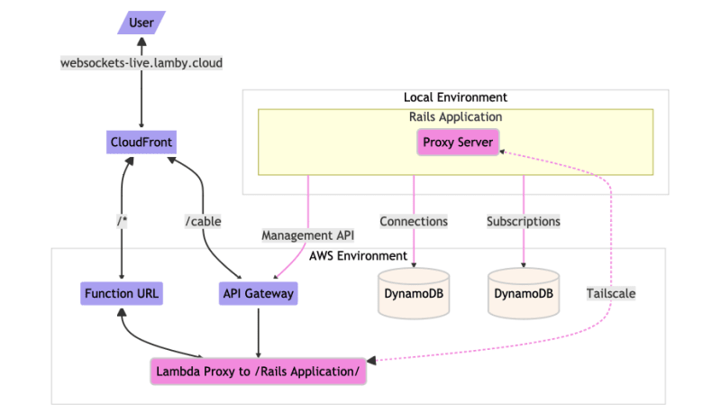

⚠️ DISCLAIMER: Я ни в коем случае не выступаю за использование живых прокси в качестве обычного способа разработки на облачных ресурсах. Однако в некоторых случаях, например при разработке новой системы, живые прокси для разработчиков или общее использование Tailscale в Lambda может оказаться полезным.

## 🐋 Tailscale на Lambda

Tailscale упрощает работу с сетью. Очень просто. Он отлично подходит для ситуаций, когда частные сети не позволяют входящие соединения. Tailscale может соединить ваши устройства и среды разработки для легкого доступа к удаленным ресурсам или позволить этим удаленным системам получить доступ к вашим домашним или офисным сетевым устройствам.

Несколько лет назад Кори Куинн написал лямбда-расширение Tailscale. Оно замечательное и помогло многим людям. Сегодня я хочу поделиться новым проектом, основанным на работе Кори, который еще больше упрощает использование Tailscale в Lambda Container.

В этой новой версии сделана попытка улучшить работу Кори. Инициализация стала стабильной, появилось больше вариантов конфигурации, и у нас даже есть мультиплатформенные пакеты контейнеров Docker для `x86_64` и `arm64`. У нас даже есть варианты Amazon Linux 2 и Debian/Ubuntu. Установка очень проста, просто добавьте одну строку в ваш Dockerfile. Например:

`FROM public.ecr.aws/lambda/ruby:3.2 RUN yum install -y curl COPY --from=ghcr.io/rails-lambda/tailscale-extension-amzn:1 /opt /opt`.

После запуска контейнера доступ к любому устройству в сети tailnet можно получить с помощью локального SOCKS5-прокси. В примере ниже мы используем гем socksify из Ruby.

`require 'socksify/http' Net::HTTP.socks_proxy('localhost', 1055).start(...) do |http| # ваш http-код здесь... end`.

## 🔌 ActionCable на Lambda

Как я использовал Tailscale для работы Rails на Lambda? Несколько месяцев назад я начал работу над последней критической частью экосистемы Rails, которая не работала на Lambda… ActionCable и WebSockets. В частности, я хотел, чтобы Hotwire работал.

Пока что все отлично работает с нашим новым гемом LambdaCable. В конечном итоге он станет адаптером для ActionCable и пополнит ряды других популярных альтернатив, таких как AnyCable. Чтобы быстрее завершить проект, мне нужны были петли обратной связи, которые были бы гораздо быстрее, чем развертывание кода в облаке. Мне нужен был прокси для разработки! Такой, чтобы мое Rails-приложение получало события как от URL-адресов функций Lambda, так и от событий WebSocket от API Gateway. Ниже показано демонстрационное видео.

Если вам интересно узнать больше о том, как Rails и Lambda работают вместе, загляните в наш проект Lamby. Архитектура Lambda-контейнеров так хорошо сочетается с Rails, поскольку наш фреймворк сводит все, начиная с HTTP, заданий, событий и соединений WebSocket, к удивительному контракту `CMD` Docker. Приведенную выше архитектуру на уровне прокси было легко построить и подключить к нашей единственной функции-делегату `Lamby.cmd`. Показано ниже.

Надеюсь, вы найдете причины узнать больше о Tailscale и о том, как использование SOCKS5-прокси из Lambda может помочь вашей разработке или производству. Более того, я надеюсь, что вам понравится наш новый проект Lambda Extension, упрощающий использование контейнерных приложений. Напишите нам в комментариях, если это так.
