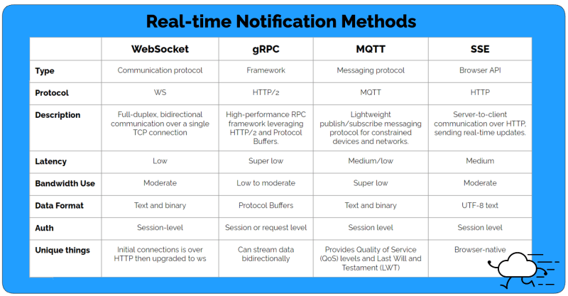
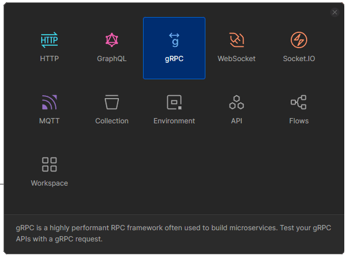
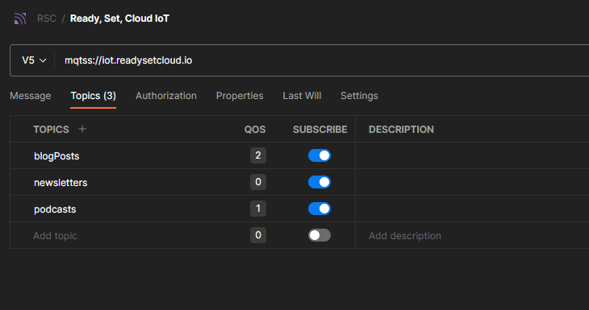

В последнее время я провожу довольно много времени, исследуя мир уведомлений в реальном времени. Наивно полагать, что общение в реальном времени означает одно: WebSockets.

Точнее, я думал, что термин для связи между сервером и браузером - это “WebSocket”. Я думал так годами! Я даже написал серию из 5 частей о WebSockets, думая, что этот термин означает именно это (это хорошая серия, я действительно рекомендую ее).

И только когда я начал изучать этот протокол в рамках своей основной работы, я понял, что ошибался. Очень сильно ошибался. Существует несколько способов получения данных от сервера к браузеру вне WebSockets.

Сегодня мы рассмотрим четыре наиболее популярных механизма передачи данных: WebSockets, gRPC, MQTT и Server-Sent Events (SSE). Каждый из них уникален в том, как они обеспечивают передачу сообщений от сервера к клиенту, и имеет свои плюсы и минусы, которые следует учитывать перед внедрением того или иного решения.

## Методы уведомлений

Как я уже говорил, существует длинный список методов уведомления, но мы остановимся на четырех самых популярных. Я упомянул, что они являются государственными, и стоит описать, что это значит.

Соединение с состоянием - это постоянное соединение между двумя сущностями, которое помнит о предыдущих взаимодействиях. Пока соединение поддерживается, две сущности могут свободно общаться друг с другом, как при телефонном разговоре. Когда одна из сторон вешает трубку, соединение прерывается, и они больше не могут общаться друг с другом.

Сравните это с механизмом связи без статических данных, таким как Amazon SNS или другая реализация Webhook, где соединение не является постоянным и связь односторонняя. Такие механизмы предназначены для использования в качестве реакции на событие и информирования подписчиков без поддержания постоянного соединения или сохранения памяти о предыдущих взаимодействиях.

Вернемся к нашим методам уведомлений:

WebSockets - двунаправленная связь через одно TCP-соединение. Сообщения являются асинхронными и могут быть отправлены от клиента к серверу и от сервера к клиенту одновременно. Этот метод поддерживается большинством браузеров.

gRPC - высокопроизводительная двунаправленная потоковая передача данных. Он не только поддерживает одновременные сообщения клиент/сервер и сервер/клиент, как WebSockets, но и обеспечивает мультиплексирование, то есть одновременную отправку нескольких сообщений в одном направлении без блокировки.

MQTT - минималистичный протокол публикации/подписки. Разработанный для использования в IoT, MQTT предлагает несколько уровней достоверности доставки (Quality of Service) и определяет, что делать при разрыве соединения (Last Will and Testament).

Server-Sent Events (SSE) - простая односторонняя связь от сервера к клиенту по HTTP. Этот механизм, предназначенный в основном для взаимодействия с браузерами, предлагает такие возможности, как автоматическое переподключение и встроенная поддержка браузера.

## Примеры использования

Теперь, когда мы знаем, что представляет собой каждый из этих механизмов, мы должны поговорить о том, когда их следует использовать. Как и на любой другой вопрос в программном обеспечении, ответ, конечно, зависит от ситуации, но в качестве общего руководства давайте рассмотрим некоторые ситуации, в которых каждый из них является наиболее подходящим.

WebSockets - многопользовательские онлайн-игры, чат-приложения, инструменты для совместной работы и т. д.. Обычно используются для синхронизации состояния между несколькими пользователями.

gRPC - взаимодействие между микросервисами, мобильными приложениями и высокопроизводительными системами. Как правило, в таких случаях предъявляются требования к низкой задержке и эффективному использованию полосы пропускания.

MQTT - устройства IoT. Обычно используется в средах, где соединения прерывисты, а клиентами являются устройства, которые часто отправляют данные.

События, отправляемые сервером - новости в прямом эфире, спортивные результаты, панели мониторинга. Применяются для получения данных с сервера без связи с клиентом.

Конечно, вы можете использовать эти механизмы связи и для других случаев, но в целом они лучше всего подходят для вышеупомянутых задач.

## Реализация

Мы все знаем, что я работаю в AWS, поэтому, если у AWS есть управляемый сервис для чего-либо, я обычно использую его (ну, по крайней мере, пробую его для потомков). Ниже приведены варианты, если вы хотите реализовать один из этих механизмов взаимодействия в AWS.

WebSockets - Amazon API Gateway и подписки на AWS AppSync. Популярным вариантом, не относящимся к AWS, является Socket.IO.

gRPC - AWS не предоставляет собственных сервисов для gRPC. Momento Topics - популярный вариант управляемого средства связи на основе gRPC.

MQTT - AWS IoT Core предлагает управляемый брокер сообщений MQTT, предоставляя вам легкий доступ к вашим устройствам. Забавный факт: именно на нем основаны уведомления в Serverlesspresso.

События, отправляемые сервером - AWS не предоставляет собственной службы для управления SSE. Однако многие популярные фреймворки имеют встроенную поддержку, например express-sse для Node.js, Django для Python, rails для Ruby и Spring для Java.

## Тестирование

Тестирование связи между сервером и клиентом обычно является непростой задачей. Лично я создавал серver-side workflows, которые испускают события, и приходилось писать пользовательские скрипты, которые подключались, сидели и ждали, пока клиент выполнит утверждения. Это целая большая штука, и не самый простой способ проверки кода. Тем не менее, я нашел более простую альтернативу для тестирования при разработке.

Postman предлагает поддержку WebSockets, gRPC, MQTT и событий, отправляемых сервером. Он даже предоставляет обертку вокруг Socket.IO, если вы решите использовать его.

Итак, все эти варианты предназначены для ручного тестирования, которое действительно возможно только при активной разработке. Но возможность угадывать и проверять свою работу в процессе сборки - это огромный прирост производительности.

Для WebSockets вы можете добавить конечную точку и заголовки auth, нажать Connect и начать работу. Для меня это был бесценный ресурс для отладки, когда я реализовывал WebSockets через Amazon API Gateway.

Если вы создаете приложение, которое взаимодействует с IoT-устройствами, опция MQTT в Postman позволит вам выбрать темы, на которые нужно подписаться, а также качество обслуживания (QOS) для каждой из них. Вы даже можете настроить последнюю волю и завещание для соединения, чтобы проверить это.

Возможности тестирования запросов gRPC также полны, что позволяет импортировать файл определения .proto для вашей схемы и добавлять метаданные к сообщениям. Вы можете запускать утверждения через сценарий After response, который может проверять такие вещи, как специфические метаданные или трейлеры.

Самый простой вариант, который заставляет задуматься, почему я не подумал об этом, - это события, отправляемые сервером. Поскольку SSE просто использует HTTP-соединение, вы можете использовать стандартный HTTP-запрос в Postman для установки соединения. Он будет управлять соединением и передавать события в секцию ответа по мере их поступления.

Мне еще предстоит найти хорошее управляемое решение для автоматизированного тестирования в CI-конвейере. Пока что я придерживаюсь собственных скриптов, когда это абсолютно необходимо. Это накладные расходы, которые вам придется учитывать при создании механизмов уведомлений.

## Перейти к сборке

Уведомления в реальном времени поддерживаются не просто так: они важны! Эти типы уведомлений быстро становятся стандартом де-факто, и если ваше приложение не реализует один из них, вы, скорее всего, отстаете. Пользователи непроизвольно начинают считать, что это часть основного набора функций. Они не хотят ждать или перезагружать страницы.

Мир стал асинхронным, а уведомления в реальном времени - это инструмент, который связывает все это с вашими пользователями.

Если вы хотите начать, у вас есть множество вариантов:

Не существует правильного или неправильного способа внедрения уведомлений в реальном времени (не надо меня в этом убеждать). У каждого из нас есть свои уникальные потребности бизнеса, которые делают один механизм более выгодным, чем другой. Лучшее, что вы можете сделать, - это пойти и попробовать. Не бойтесь повторяться. Посмотрите, что работает хорошо для вас, удовлетворяет вашим SLA по задержкам и обеспечивает поддерживаемую кодовую базу для ваших разработчиков в течение всего срока службы приложения.

Удачи, и если у вас возникнут вопросы, обращайтесь!

Счастливого кодинга!
