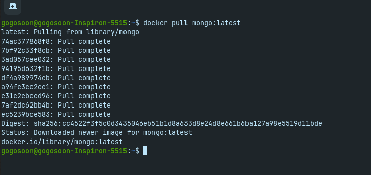
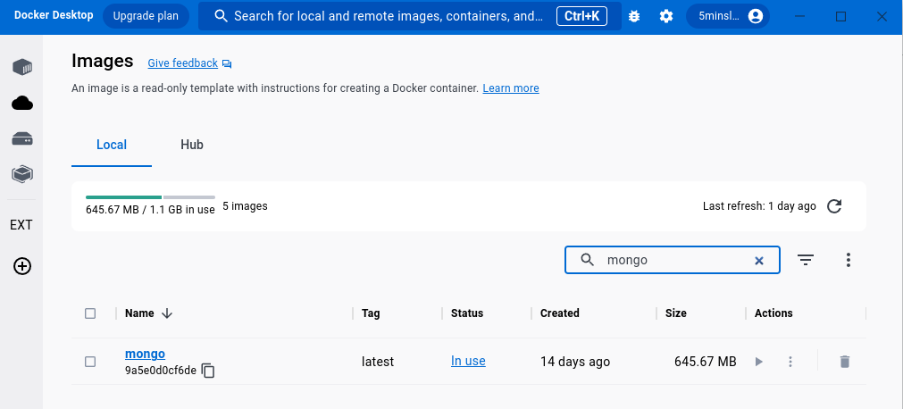
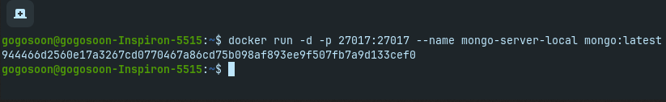
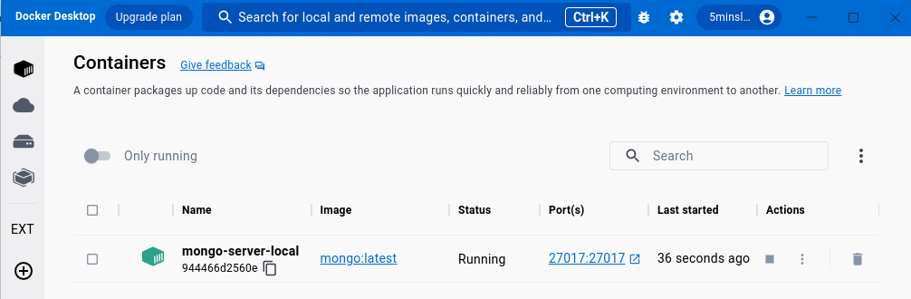
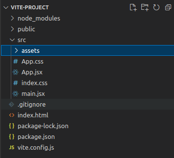
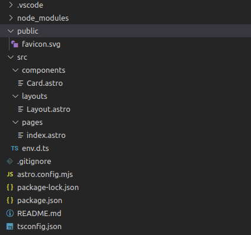
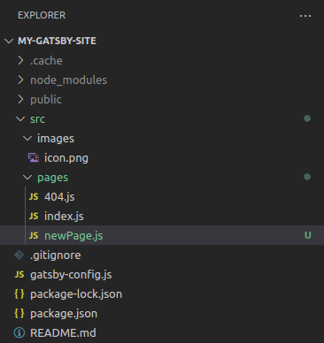
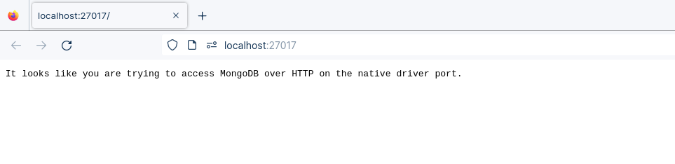
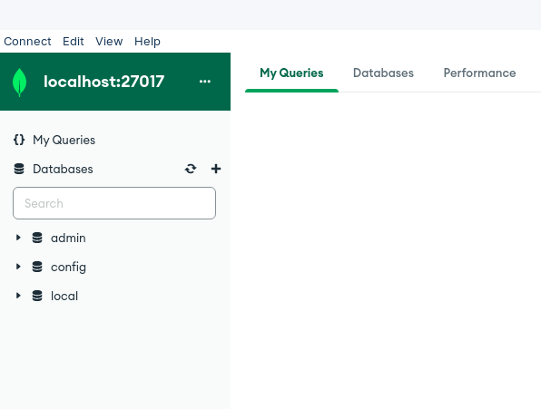

Docker поможет вам быстро создать среду разработки на вашей машине. Весь процесс занимает всего пару минут.

Но предположим, что вам поручили проект, для запуска которого требуется не менее 10 различных сервисов в рабочем состоянии. Допустим, для вашего проекта необходимы Java 8, Node 14, MySQL, MongoDB, Ruby on rails, RabbitMQ и другие.

В таком случае вам придется доставать все эти образы по отдельности из Docker и запускать их все в своих контейнерах. В какой-то момент один процесс может зависеть от другого. Поэтому их нужно упорядочить.

Хорошо, если это будет одноразовый процесс. Но не один раз - каждый день, каждый раз, когда вы начинаете работать над проектом, вам приходится запускать все эти службы.

## Это утомительный процесс, верно?

Чтобы решить эту проблему, Docker ввел концепцию под названием Multi Containers (Docker Compose). Прежде чем узнать о Docker Compose, давайте быстро научимся запускать хост базы данных в Docker.

В примере мы запустим контейнер NodeJS и контейнер MongoDB вместе. Начальное знакомство с MongoDB даст вам хорошее понимание, когда мы перейдем к Docker Compose.

Мы разделим это руководство на 2 части:

Как использовать docker в качестве хоста баз данных (MongoDB)Как работает Docker Compose на примере (NodeJS и MongoDB)Как использовать Docker в качестве хоста баз данных

Если у вас есть опыт разработки бэкенда, вам, возможно, приходилось работать с несколькими базами данных. Например, с такими базами данных, как MySQL/Postgres для работы с реляционными данными и Cassandra/MongoDB для работы с неструктурированными данными.

Хотите узнать секрет? Вы можете работать над разработкой бэкенда, не устанавливая базу данных на свою машину локально. Да, вы можете использовать Docker в качестве хоста базы данных. Он по умолчанию содержит все зависимости в определенном файле образа.

## Зачем нам нужна база данных Docker?

Docker помогает нам поддерживать согласованные версии на разных платформах и в разных средах. Допустим, в вашей команде есть группа людей, работающих над MongoDB версии 5.0. Если к вашей команде присоединится новый сотрудник, ему нужно будет установить ту же версию с точной конфигурацией вручную. А что, если они установят последнюю версию MongoDB (6.0)? Это приведет к конфликтам. Это будет кошмар, если он распространится на все остальные устройства.

Чтобы обойти эту проблему, можно использовать MongoDB в Docker с пользовательской конфигурацией и выкладывать образ MongoDB на Docker Hub внутри компании. Если в компанию приходит новый человек, он может взять образ и начать внедрение без какой-либо ручной настройки.

Давайте рассмотрим преимущества использования базы данных в Docker.

Используя эту реализацию, мы можем гарантировать, что все члены команды будут использовать точное время выполнения и конфигурацию без каких-либо внешних ресурсов. Это очень просто настроить, и мы можем быстро запускать/останавливать сервер с помощью рабочего стола DockerКак настроить MongoDB с помощью Docker

Если вы не знакомы с Docker Hub, вот краткое введение. Docker hub - это платформа, где вы можете найти и поделиться публичными или частными образами Docker. Это довольно похоже на GitHub / GitLab. В двух словах, это репозиторий для образов Docker.

Первым шагом будет извлечение официального образа Docker из Docker Hub.

Образец вывода для извлечения образа Mongo из Docker Hub

После извлечения образа Mongo откройте рабочий стол Docker, и вы сможете увидеть его там.

Образ Mongo доступен в рабочем столе Docker

Давайте запустим наш образ MongoDB с помощью команды `docker run`.

`docker run -d -p 27017:27017 --name mongo-server-local mongo: latest` Команда для запуска mongodb в dockerОбразец вывода для запуска MongoDB в Docker

Мы успешно запустили образ Docker. Теперь мы можем видеть контейнер, запущенный на Docker Desktop.

Контейнер Mongo запущен в Docker Desktop

Итак, сервер MongoDB запущен на вашей машине. Давайте подтвердим это в браузере. Перейдите по адресу http://localhost:27017 в браузере, и вы должны увидеть сообщение, как показано на скриншоте ниже:

Образец вывода ”Похоже, вы пытаетесь получить доступ к MongoDB через HTTP на родном порту драйвера” для запущенного сервера MongoDB с помощью Docker

Интересно, правда?

Мы можем останавливать/запускать сервер MongoDB с помощью Docker, когда нам это необходимо.

Важное замечаниеНе рекомендуется использовать Docker в качестве базы данных для производстваНе используйте базу данных Docker для крупномасштабных приложенийЧто такое docker-compose?

## Давайте вернемся к docker-compose.

Docker Compose - это инструмент, который можно использовать для определения и совместного использования многоконтейнерных приложений. Это означает, что вы можете запускать проект с несколькими контейнерами, используя один источник.

Например, предположим, вы создаете проект с NodeJS и MongoDB вместе. Вы можете создать единый образ, который запустит оба контейнера в качестве сервисаe - вам не нужно начинать каждый из них отдельно.

Интересно, правда? И это решает проблему, о которой я говорил в самом начале этой статьи.

Чтобы добиться этого, нам нужно определить `docker-compose.yml`.

Файл docker-compose.yml

Файл compose - это YML-файл, определяющий сервисы, сети и тома для контейнера Docker. Существует несколько версий формата файла compose - 1, 2, 2.x и 3.x.

Прежде чем продолжить, вот важное замечание от команды Docker Compose.

С конца июня 2023 года Compose V1 больше не будет поддерживаться и будет удален из всех версий Docker Desktop.

В этой статье мы используем версию 3.

```yml
version: '3'
services:
  app:
    image: node:latest
    container_name: app_main
    restart: always
    command: sh -c "yarn install && yarn start"
    ports:
      - 8000:8000
    working_dir: /app
    volumes:
      - ./:/app
    environment:
      MYSQL_HOST: localhost
      MYSQL_USER: root
      MYSQL_PASSWORD:
      MYSQL_DB: test
  mongo:
    image: mongo
    container_name: app_mongo
    restart: always
    ports:
      - 27017:27017
    volumes:
      - ~/mongo:/data/db
    volumes:
      - mongodb:
```

Команды для запуска нескольких контейнеров с помощью docker compose

Давайте разберем приведенный выше код и разберем его по частям:

`version` относится к версии docker-compose (последняя 3) `ervices` определяет сервисы, которые нам нужно запустить `app` - это пользовательское имя для одного из ваших контейнеров `image` образ, который мы должны вытащить. Здесь мы используем `node:latest` и `mongo`.`container_name` - имя каждого контейнера`restart` запускает/перезапускает контейнер с сервисом`port` определяет пользовательский порт для запуска контейнера`working_dir` - текущий рабочий каталог для контейнера с сервисом`environment` определяет переменные окружения, такие как учетные данные БД и т. д.`command` - команда для запуска сервисаКак запустить мультиконтейнер

Нам нужно собрать наш мультиконтейнер с помощью docker build.

`docker compose build` - команда для сборки docker-compose.yml

После успешной сборки мы можем запустить контейнеры с помощью команды `up`.

`docker compose up`Команда для запуска нескольких контейнеров с помощью docker-compose

Если вы хотите запустить контейнер в отсоединенном режиме, просто используйте флаг `-d`.

`docker compose up -d` Команда для запуска нескольких контейнеров с помощью docker-compose в отсоединенном режимеОбразец вывода для запуска нескольких контейнеров с помощью docker-compose в отсоединенном режиме

Отлично, мы готовы к работе. Контейнеры запущены. Давайте проверим список контейнеров.

`docker compose ps` Команда для вывода списка запущенных контейнерных сервисовОбразец вывода списка запущенных контейнерных сервисов

Ура, мы видим, что одновременно запущены два контейнера.

Образец вывода для запуска службы mongodb с помощью docker

Чтобы посмотреть на данные в вашей MongoDB, необходимо установить MongoDB Compass.

Вот его скриншот.

Вид сервера MongoDB в mongodb compassЗаключение

В этой статье вы узнали, как работает Docker Compose на примере. Используя несколько контейнеров, вы можете запустить любой тип сервиса, например RabbitMQ или Apache Kafka, и работать с ним в одном источнике. Надеюсь, вам понравилось читать эту статью.

Если вы хотите узнать больше о Docker, подпишитесь на мои статьи на моем сайте (https://5minslearn.gogosoon.com), где есть сводный список всех моих блогов.

[Источник](https://www.freecodecamp.org/news/what-is-docker-compose-how-to-use-it/)
