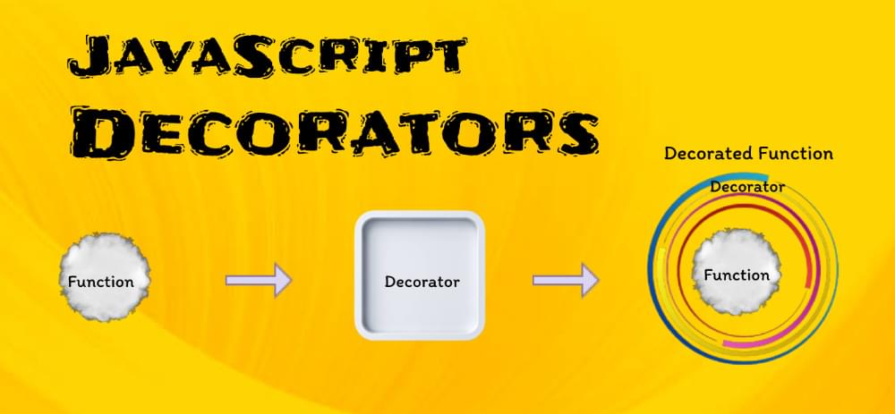

В этой статье мы рассмотрим декораторы в JavaScript: что это такое, как они работают, для чего они полезны и как их использовать. Мы рассмотрим композицию декораторов, декораторы параметров, асинхронные декораторы, создание пользовательских декораторов, использование декораторов в различных фреймворках, фабрики декораторов, а также плюсы и минусы декораторов JavaScript.

## Что такое декораторы в JavaScript?

Декоратор - это функция, которая добавляет некоторые дополнительные возможности к существующему методу. Она позволяет изменять поведение объекта, не меняя его исходный код, но расширяя его функциональность.



Декораторы отлично подходят для повышения читаемости, удобства сопровождения и повторного использования кода. В JavaScript декораторы - это функции, которые могут изменять классы, методы, свойства или даже параметры. Они позволяют добавить поведение или метаданные в различные части кода, не изменяя исходный код.

Декораторы обычно используются с классами и имеют префикс в виде символа `@`:

```javascript
function log(target, key, descriptor) {
	console.log(`Logging ${key} function`);
	return descriptor;
}

class Example {
	@log
	greet() {
		console.log('Hello, world!');
	}
}

const example = new Example();
example.greet();
```

Приведенный выше код демонстрирует, как декоратор может изменять поведение метода класса, регистрируя сообщение перед выполнением метода.

## Декоративная композиция

Декораторы обладают такими мощными свойствами, как компоновка и вложенность. Это означает, что мы можем применить несколько декораторов к одному и тому же фрагменту кода, и они будут выполняться в определенном порядке. Это помогает создавать сложные и модульные приложения.

### Пример композиции декораторов

Давайте рассмотрим случай, когда несколько декораторов применяются к одному и тому же коду. Рассмотрим веб-приложение, в котором мы хотим ограничить доступ к определенным маршрутам на основе уровней аутентификации и авторизации пользователей. Мы можем добиться этого, комбинируя декораторы следующим образом:

`@requireAuth @requireAdmin class AdminDashboard { }`

Здесь `requireAuth` и `requireAdmin` являются декораторами, которые обеспечивают аутентификацию пользователя и наличие у него привилегий администратора перед доступом к `AdminDashboard`.

## Декораторы параметров

Декораторы параметров позволяют изменять параметры методов. Они встречаются реже, чем другие типы декораторов, но могут быть полезны в определенных ситуациях, например при проверке или преобразовании аргументов функции.

### Пример декоратора параметров

Вот пример декоратора параметров, который гарантирует, что параметр функции находится в заданном диапазоне:

```js
function validateParam(min, max) {
	return function (target, key, index) {
		const originalMethod = target[key];
		target[key] = function (...args) {
			const arg = args[index];
			if (arg < min || arg > max) {
				throw new Error(`Argument at index ${index} is out of range.`);
			}
			return originalMethod.apply(this, args);
		};
	};
}

class MathOperations {
	@validateParam(0, 10)
	multiply(a, b) {
		return a * b;
	}
}

const math = new MathOperations();
math.multiply(5, 12);
```

Код определяет декоратор с именем `validateParam`, применяемый к методу `multiply` в классе `MathOperations`. Декоратор `validateParam` проверяет, попадают ли параметры метода multiply в указанный диапазон (от 0 до 10). Когда метод multiply вызывается с аргументами `5` и `12`, декоратор обнаруживает, что `12` выходит за пределы диапазона, и выбрасывает ошибку.

## Асинхронные декораторы

Асинхронные декораторы обрабатывают асинхронные операции в современных приложениях JavaScript. Они полезны при работе с async/await и обещаниями.

### Пример асинхронного декоратора

Рассмотрим сценарий, в котором мы хотим ограничить частоту вызовов определенного метода. Мы можем создать декоратор `@throttle`:

```js
function throttle(delay) {
	let lastExecution = 0;
	return function (target, key, descriptor) {
		const originalMethod = descriptor.value;
		descriptor.value = async function (...args) {
			const now = Date.now();
			if (now - lastExecution >= delay) {
				lastExecution = now;
				return originalMethod.apply(this, args);
			} else {
				console.log(`Method ${key} throttled.`);
			}
		};
	};
}

class DataService {
	@throttle(1000)
	async fetchData() {}
}

const dataService = new DataService();
dataService.fetchData();
```

Здесь определенный декоратор `throttle` применяется к методу `fetchData` в классе `DataService`. Декоратор throttle гарантирует, что метод `fetchData` будет выполняться только один раз в секунду. Если он вызывается чаще, декоратор регистрирует сообщение о том, что метод был дросселирован.

Этот код демонстрирует, как декораторы могут контролировать скорость вызова метода, что может быть полезно в таких сценариях, как ограничение скорости запросов API.

## Создание пользовательских декораторов

Хотя JavaScript предоставляет некоторые встроенные декораторы, такие как `@deprecated` или `@readonly`, бывают случаи, когда нам необходимо создать собственные декораторы, отвечающие требованиям конкретного проекта.

Пользовательские декораторы - это определяемые пользователем функции, которые изменяют поведение или свойства классов, методов, свойств или параметров в коде JavaScript. Эти декораторы инкапсулируют и повторно используют определенную функциональность или обеспечивают соблюдение определенных соглашений в нашей кодовой базе.

### Примеры пользовательских декораторов

Декораторы обозначаются символом `@`. Давайте создадим пользовательский декоратор, который будет записывать в журнал сообщение до и после выполнения метода. Этот декоратор поможет проиллюстрировать базовую структуру пользовательских декораторов:

```js
function logMethod(target, key, descriptor) {
	const originalMethod = descriptor.value;
	descriptor.value = function (...args) {
		console.log(`Before ${key} is called`);
		const result = originalMethod.apply(this, args);
		console.log(`After ${key} is called`);
		return result;
	};
	return descriptor;
}

class Example {
	@logMethod
	greet() {
		console.log('Hello, world!');
	}
}

const example = new Example();
example.greet();
```

В этом примере мы определили декоратор `logMethod`, который оборачивает метод greet класса `Example`. Декоратор записывает в журнал сообщение до и после выполнения метода, улучшая поведение метода greet без изменения его исходного кода.

Рассмотрим другой пример - пользовательский декоратор `@measureTime`, который регистрирует время выполнения метода:

```js
function measureTime(target, key, descriptor) {
	const originalMethod = descriptor.value;
	descriptor.value = function (...args) {
		const start = performance.now();
		const result = originalMethod.apply(this, args);
		const end = performance.now();
		console.log(`Execution time for ${key}: ${end - start} milliseconds`);
		return result;
	};
	return descriptor;
}

class Timer {
	@measureTime
	heavyComputation() {
		for (let i = 0; i < 1000000000; i++) {}
	}
}

const timer = new Timer();
timer.heavyComputation();
```

Приведенный выше код определяет пользовательский декоратор `measureTime` и применяет его к методу класса `Timer`. Этот декоратор измеряет время выполнения декорированного метода. Когда мы вызываем метод `heavyComputation`, декоратор фиксирует время начала, запускает вычисления, фиксирует время окончания, вычисляет прошедшее время и записывает его в консоль.

Этот код демонстрирует, как декораторы добавляют в методы функции мониторинга производительности и синхронизации, которые могут быть полезны для оптимизации кода и выявления узких мест.

### Примеры использования функций пользовательских декораторов

Пользовательские декораторы могут предоставлять различные функциональные возможности, такие как проверка, аутентификация, ведение журнала или измерение производительности. Вот некоторые примеры использования:

- Валидация. Мы можем создавать декораторы для проверки аргументов метода на соответствие определенным критериям, как это было показано в предыдущем примере с проверкой параметров. - Аутентификация и авторизация. Декораторы можно использовать для применения правил контроля доступа и авторизации, что позволяет нам защитить маршруты или методы.
- Кэширование. Декораторы могут реализовать механизмы кэширования для эффективного хранения и получения данных, сокращая ненужные вычисления.
- Ведение журнала. Декораторы могут записывать в журнал вызовы методов, показатели производительности или ошибки, помогая отладке и мониторингу.
- Мемоизация. Декораторы Memoization могут кэшировать результаты функций для определенных входов, повышая производительность повторяющихся вычислений.
- Механизм повтора. Мы можем создавать декораторы, которые автоматически повторяют метод определенное количество раз в случае сбоев.
- Обработка событий. Декораторы могут вызывать события до и после выполнения метода, что позволяет создавать архитектуры, управляемые событиями.

## Декораторы в различных фреймворках

Фреймворки и библиотеки JavaScript, такие как Angular, React и Vue.js, имеют свои соглашения по использованию декораторов. Понимание того, как декораторы работают в этих фреймворках, помогает нам создавать лучшие приложения.

### Angular: широкое использование декораторов

Angular, комплексный фронтенд-фреймворк, в значительной степени опирается на декораторы для определения различных областей компонентов, сервисов и прочего. Вот некоторые декораторы в Angular:

`@Component`. Используется для определения компонента, указывая метаданные, такие как селектор, шаблон и стили компонента:

`@Component({ selector: "app-example", template: "Example component", }) class ExampleComponent {}`

`@Injectable`. Помечает класс как сервис, который можно инжектировать в другие компоненты и сервисы:

`@Injectable() class ExampleService {}`

`@Input` и `@Output`. Эти декораторы позволяют нам определять входные и выходные свойства компонентов, облегчая взаимодействие между родительскими и дочерними компонентами:

`@Input() title: string; @Output() notify: EventEmitter<string> = new EventEmitter();`

Декораторы Angular улучшают организацию кода, облегчая создание сложных приложений с четкой и структурированной архитектурой.

### React: компоненты высшего порядка

React - популярная библиотека JavaScript. В ней нет встроенных декораторов, как в Angular. Однако в React появилась концепция, известная как компоненты высшего порядка (HOC), которые выступают в качестве разновидности декораторов. HOCs - это функции, которые берут компонент и возвращают новый улучшенный компонент. Они позволяют повторно использовать код, абстрагировать состояние и манипулировать реквизитами.

Вот пример HOC, который ведет журнал при рендеринге компонента:

```js
function withLogger(WrappedComponent) {
	return class extends React.Component {
		render() {
			console.log('Rendering', WrappedComponent.name);
			return <WrappedComponent {...this.props} />;
		}
	};
}

const EnhancedComponent = withLogger(MyComponent);
```

В данном примере `withLogger` - это компонент высшего порядка, который ведет журнал рендеринга любого компонента, который он оборачивает. Это способ расширить компоненты дополнительным поведением, не изменяя их исходный код.

### Vue.js: параметры компонентов с помощью декораторов

Vue.js - еще один популярный JavaScript-фреймворк для создания пользовательских интерфейсов. Хотя Vue.js не поддерживает декораторы, некоторые проекты и библиотеки позволяют нам использовать декораторы для определения параметров компонентов.

Вот пример определения компонента Vue с помощью библиотеки `vue-class-component` с декораторами:

```js
import { Component, Prop, Vue } from 'vue-class-component';

@Component
class MyComponent extends Vue {
  @Prop() title: string;

  data() {
    return {
      message: 'Hello, world!'
    };
  }
}
```

В этом примере декоратор `@Component` используется для определения компонента Vue, а декоратор `@Prop` - для создания реквизита компонента.

## Фабрики декораторов

Фабрики декораторов - это функции, которые возвращают функции декораторов. Вместо того чтобы определять декоратор напрямую, мы создаем функцию, которая генерирует декораторы на основе переданных аргументов. Это позволяет настраивать поведение декораторов, делая их очень универсальными и многократно используемыми.

Общая структура фабрики декораторов выглядит следующим образом:

`function decoratorFactory(config) { return function decorator(target, key, descriptor) { }; }`

Здесь `decoratorFactory` - это функция фабрики декораторов, принимающая аргумент `config`. Она возвращает функцию декоратора, которая может изменять цель, ключ или дескриптор на основе предоставленной конфигурации.

Попробуем другой пример - фабрику-декоратор, которая регистрирует сообщения с разными уровнями серьезности:

```js
function logWithSeverity(severity) {
	return function (target, key, descriptor) {
		const originalMethod = descriptor.value;
		descriptor.value = function (...args) {
			console.log(`[${severity}] ${key} called`);
			return originalMethod.apply(this, args);
		};
	};
}

class Logger {
	@logWithSeverity('INFO')
	info() {}

	@logWithSeverity('ERROR')
	error() {}
}

const logger = new Logger();
logger.info();
logger.error();
```

В приведенном выше коде пользовательские декораторы используются для улучшения методов в классе `Logger`. Эти декораторы создаются фабрикой декораторов под названием `logWithSeverity`. Применяясь к методам, они регистрируют сообщения с определенным уровнем серьезности перед выполнением исходного метода. В данном случае методы `info` и `error` класса `Logger` декорируются для регистрации сообщений с уровнями серьезности `INFO` и `ERROR` соответственно. Когда мы вызываем эти методы, декоратор регистрирует сообщения, указывающие на вызов метода и их уровень серьезности.

Этот код демонстрирует, как фабрики декораторов позволяют создавать настраиваемые декораторы для добавления поведения в методы, например, ведения журнала, без внесения изменений в исходный код.

### Практические примеры использования фабрик декораторов

Фабрики декораторов особенно полезны для создания декораторов с различными настройками, условиями или поведением. Вот несколько практических примеров использования фабрик декораторов:

Декораторы проверки. Мы можем создать фабрику декораторов проверки, чтобы генерировать декораторы, которые проверяют определенные условия для параметров метода. Например, фабрика декораторов `@validateParam` может применять различные правила для разных параметров, например, минимальные и максимальные значения:

```js
function validateParam(min, max) {
	return function (target, key, descriptor) {};
}

class MathOperations {
	@validateParam(0, 10)
	multiply(a, b) {
		return a * b;
	}
}
```

Декораторы протоколирования. Фабрики-декораторы могут генерировать декораторы протоколирования с различными уровнями регистрации или назначениями. Например, мы можем создать фабрику декораторов `@logWithSeverity`, которая регистрирует сообщения с разным уровнем серьезности:

```javascript
function logWithSeverity(severity) {
	return function (target, key, descriptor) {};
}

class Logger {
	@logWithSeverity('INFO')
	info() {}

	@logWithSeverity('ERROR')
	error() {}
}
```

Условные декораторы. Фабрики декораторов позволяют нам создавать условные декораторы, которые применяют декорированное поведение только при определенных обстоятельствах. Например, мы можем создать фабрику декораторов `@conditionallyExecute`, которая проверяет условие перед выполнением метода:

```js
function conditionallyExecute(shouldExecute) {
	return function (target, key, descriptor) {
		if (shouldExecute) {
			// do something
		} else {
			// do something else
		}
	};
}

class Example {
	@conditionallyExecute(false)
	someMethod() {
		// method body
	}
}
```

## Преимущества фабрик-декораторов

### К числу преимуществ фабрик-декораторов относятся:

- Конфигурируемость. Фабрики декораторов позволяют нам определять декораторы с различными конфигурациями, адаптируя их к различным случаям использования. Возможность повторного использования. Создав фабрику декораторов, мы можем повторно использовать ее во всей нашей кодовой базе, создавая согласованное поведение.
- Чистый код. Фабрики декораторов помогают поддерживать чистоту кода, инкапсулируя специфическое поведение и способствуя созданию более модульной структуры.
- Динамичность. Динамическая природа фабрик-декораторов позволяет адаптировать их к сложным приложениям с изменяющимися требованиями.

## Плюсы и минусы декораторов в JavaScript

Декораторы JavaScript, хотя и являются мощными, имеют свой собственный набор плюсов и минусов оптимизации, о которых разработчики должны знать.

### Плюсы оптимизации декораторов JavaScript

Возможность повторного использования кода. Декораторы способствуют повторному использованию кода для решения общих сквозных задач. Вместо того чтобы писать одну и ту же логику в нескольких местах, мы можем инкапсулировать ее в декораторе и применять везде, где это необходимо. Это уменьшает дублирование кода, упрощая сопровождение и обновление. Читабельность. Декораторы могут улучшить читаемость кода за счет разделения проблем. Когда декораторы используются для управления логированием, валидацией или другой неосновной функциональностью, становится проще сосредоточиться на основной логике класса или метода. Модульность. Декораторы способствуют модульности нашей кодовой базы. Мы легко создаем и независимо поддерживаем декораторы и можем добавлять или удалять функциональность, не затрагивая основную реализацию. Оптимизация производительности. Декораторы могут оптимизировать производительность, позволяя нам кэшировать вызовы дорогих функций, как это видно на примере декораторов мемоизации. Это может значительно сократить время выполнения, когда одни и те же входные данные приводят к одним и тем же выходным. Тестирование и отладка. Декораторы могут быть полезны для тестирования и отладки. Мы можем создавать декораторы, которые записывают в журнал вызовы методов и их аргументы, что помогает выявлять и исправлять проблемы во время разработки и устранять неполадки в производстве.

### Минусы оптимизации декораторов JavaScript

Накладные расходы. Использование декораторов может привнести накладные расходы в нашу кодовую базу, если мы применяем несколько декораторов к одной и той же функции или классу. Каждый декоратор может принести дополнительный код, который выполняется до или после исходной функции. Это может повлиять на производительность, особенно в приложениях, критичных к времени. Сложность. По мере роста кодовой базы использование декораторов может усложнить работу. Декораторы часто включают в себя цепочку из нескольких функций, и понимание порядка их выполнения может стать сложной задачей. Отладка такого кода также может стать более сложной. Обслуживание. Хотя декораторы могут способствовать многократному использованию кода, их чрезмерное применение может усложнить сопровождение кодовой базы. Разработчики должны быть осторожны, чтобы не создавать чрезмерное количество декораторов, что может привести к путанице и сложностям с отслеживанием изменений поведения. Ограниченная поддержка браузеров. Декораторы JavaScript все еще являются предложением и не полностью поддерживаются во всех браузерах. Чтобы использовать декораторы в производстве, нам, возможно, придется полагаться на транспиляторы вроде Babel, которые могут добавить дополнительные сложности в процесс сборки.

## Заключение

В этой статье мы подробно рассмотрели декораторы в JavaScript. Декораторы - это функции, которые улучшают поведение существующих методов, классов, свойств или параметров чистым/модульным способом. Они используются для добавления функциональности или метаданных в код без изменения его исходного текста.

Благодаря полученным здесь знаниям, используйте декораторы в разработке JavaScript с умом.

Вы можете узнать больше о текущей разработке декораторов в JavaScript, прочитав TC39 Decorators Proposal на GitHub.
