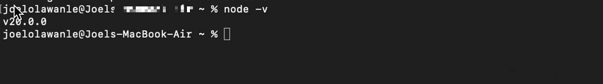

Node.js v20 уже доступен! 18 апреля 2023 года она была обнародована и теперь может использоваться всеми желающими. С этим выпуском Node.js должен стать намного безопаснее и работать лучше.

Важно знать, что поскольку это четный выпуск, он должен стать версией долгосрочной поддержки (LTS) в октябре 2023 года и будет поддерживаться до апреля 2026 года. Однако команда Node.js активно ищет отзывы сообщества, чтобы выявить и устранить любые проблемы до того, как она будет переведена в разряд LTS.

В новом выпуске Node.js появились такие интересные обновления и функции, которые наверняка оценят разработчики, как экспериментальная модель разрешений, синхронный `import.meta.resolve`, стабильный прогон тестов, обновление движка V8 JavaScript до версии 11.3, улучшение производительности и исправление ошибок, а также многое другое.

В этой статье вы познакомитесь с изменениями, внесенными в Node.js v20, и подробно рассмотрите ее новые функции и возможности.

## Начало работы с Node.js v20

Установка Node.js v20 довольно похожа на установку других версий Node.js. Все, что вам нужно сделать, это:

Загрузить пакет установщика с официального сайта Node.js. После загрузки программы установки запустите ее и следуйте инструкциям, чтобы завершить процесс установки. Этот процесс довольно прост, и вам просто нужно согласиться с лицензионным соглашением и нажать кнопку ”Далее”. Перезагрузите систему/машину после завершения процесса установки, чтобы убедиться, что все изменения вступили в силу. Проверьте установку Node.js, выполнив следующую команду:

`node -v`  Установка Node.js v20

Если вы видите номер версии (v20.0.0), это означает, что Node.js установлен правильно, и вы готовы начать работу с Node.js v20.

Node.js v20 прибыл! Ознакомьтесь с Permission Model, синхронным import.meta.resolve, стабильным тестовым бегуном и другими интересными функциями и обновлениями здесь ⬇️Click to Tweet Что нового в Node.js v20?

Давайте рассмотрим 5 основных обновлений, представленных в этом выпуске Node.js. К ним относятся:

## Экспериментальная модель разрешений

Введение экспериментальной модели разрешений в Node.js v20 - это значительное дополнение, которое дает разработчикам больше контроля над доступом к определенным ресурсам во время выполнения.

Эта новая возможность полезна, когда безопасность и использование ресурсов критически важны, например, в производственной среде.

Модель разрешений включает в себя несколько возможностей, в том числе ограничение доступа к файловой системе, child_process, worker_threads и родным аддонам.

Разработчики могут использовать такие флаги, как `--allow-fs-read`, `--allow-fs-write` и `--allow-child-process`, чтобы указать, какие ресурсы доступны. Чтобы активировать эти флаги, разработчикам необходимо использовать флаг `--experimental-permission` в сочетании с необходимыми разрешениями.

Вот пример использования модели разрешений для разрешения доступа на чтение и запись ко всей файловой системе:

`$ node --experimental-permission --allow-fs-read=* --allow-fs-write=* index.js`.

Разработчики также могут использовать модель разрешений для указания доступа к определенным папкам и файлам. Например, следующая команда разрешает доступ на запись в папку /tmp/:

`$ node --experimental-permission --allow-fs-write=/tmp/ --allow-fs-read=/home/index.js index.js`.

Одним из существенных преимуществ модели разрешений является возможность более детального контроля над доступом к файловой системе. Например, разработчики могут указывать пути и шаблоны подстановочных знаков, чтобы разрешить доступ к определенным папкам или файлам.

`$ node --experimental-permission --allow-fs-read=/home/user/* index.js`

Приведенная выше команда предоставляет доступ на чтение ко всем папкам внутри каталога /home/user/.

Свойство permission объекта процесса также можно использовать для проверки того, было ли предоставлено определенное разрешение во время выполнения. Например, если вы хотите проверить, имеет ли ваш процесс Node.js доступ на чтение к определенной папке, /home/user/documents, вы можете использовать следующий код:

```javascript
if (process.permission.has('fs.read', '/home/user/documents')) {
	console.log('Read access granted to /home/user/documents');
} else {
	console.log('Read access not granted to /home/user/documents');
}
```

Используя модель разрешений, вы получаете более тонкий контроль над доступом процессов Node.js к файловой системе, что может привести к повышению безопасности и более эффективному использованию ресурсов.

Важно отметить, что модель разрешений все еще является экспериментальной и может измениться в будущих выпусках Node.js. Рекомендуется постоянно обновлять документацию по модели разрешений и проявлять осторожность при использовании этих экспериментальных возможностей.

## Стабильный прогонщик тестов

Node.js v20 включает стабильную версию модуля test_runner, который позволяет разработчикам быстро и легко создавать и запускать наборы тестов JavaScript без установки дополнительных зависимостей.

Стабильная версия test runner теперь включает несколько строительных блоков, таких как `describe`, `it`/`test` и hooks, для создания и структурирования тестовых файлов, а также mocking, watch mode и возможность параллельного запуска нескольких тестовых файлов с помощью команды `node --test`.

Вот пример использования бегуна тестов:

```javascript
import { test, mock } from 'node:test';
import assert from 'node:assert';
import fs from 'node:fs';

mock.method(fs, 'readFile', async () => 'Hello World');

test('synchronous passing test', async (t) => {
	// Этот тест проходит, потому что не выбрасывает исключение.
	assert.strictEqual(await fs.readFile('a.txt'), 'Hello World');
});
```

Бегунок тестирования предлагает настраиваемые и пользовательские отчеты о тестах с помощью флага `--test-reporter`, экспериментальное покрытие тестов с помощью флага `--experimental-test-coverage` и возможности мокинга.

Хотя он не предназначен для замены полнофункциональных тестовых фреймворков, таких как Jest или Mocha, стабильный тестовый прогон предлагает простой и быстрый способ создания тестовых наборов. Он был значительно улучшен с момента своего появления в Node.js v19, и благодаря тестированию и обратной связи с конечными пользователями теперь отмечен как стабильный в Node.js v20.

Более подробную информацию можно найти в этом объединенном запросе.

## Движок V8 JavaScript обновлен до версии 11.3

Движок V8 JavaScript, на котором работает Node.js, был обновлен до версии 11.3 в Node.js v20. Это повышает производительность и вводит новые возможности языка. Некоторые из новых возможностей этого обновления включают:

`String.prototype.isWellFormed` и `toWellFormed`: Эти методы особенно полезны для обеспечения правильного формата строк. Они помогают убедиться в том, что вводимые пользователем строки имеют правильный формат UTF-16, что уменьшает количество ошибок в эпоху эмодзи. Методы, изменяющие Array и TypedArray путем копирования: Это может быть полезно для создания измененных копий массивов, не затрагивая исходные данные, что особенно актуально в случаях, когда необходимо сохранить исходные данные для сравнения или других целей. Изменяемый `ArrayBuffer` и увеличиваемый `SharedArrayBuffer`: обеспечивает большую гибкость, позволяя эффективнее распределять память. Флаг RegExp v с нотацией множеств и свойствами строк: добавляет функциональность для регулярных выражений. Вызов хвоста WebAssembly: предоставляет возможность оптимизировать определенные типы вызовов функций.

Эти обновления демонстрируют постоянное стремление сообщества разработчиков Node.js к повышению производительности и функциональности.

## Синхронный импорт.meta.resolve()

В Node.js v20 появилась функция `import.meta.resolve()`, которая упрощает написание скриптов, не чувствительных к местоположению. Эта функция возвращается синхронно, аналогично поведению браузера, что обеспечивает более эффективное выполнение.

Крючки resolve загрузчика пользователя по-прежнему могут быть определены как асинхронные функции, но `import.meta.resolve()` все равно будет возвращаться синхронно для кода приложения, даже если загружены асинхронные крючки resolve.

Синхронное поведение `import.meta.resolve()` позволяет более эффективно выполнять код, особенно при работе с большими объемами данных. Автор может определить хуки resolve как асинхронные или синхронные функции, в зависимости от ваших предпочтений. Код приложения все равно будет выполняться синхронно, независимо от того, загружены ли асинхронные resolve hooks.

## Экспериментальные одноисполняемые приложения (SEA)

Experimental Single Executable Applications (SEA) - это новая возможность, представленная в Node.js v20, которая позволяет упаковывать ваше приложение с бинарным файлом Node.js, позволяя конечным пользователям распространять и запускать его как один исполняемый файл.

Это была давняя просьба сообщества, и команда дорабатывала подход в течение последнего года.

В Node.js v20 создание единого исполняемого приложения требует инъекции блоба, подготовленного Node.js из конфигурации JSON, а не инъекции необработанного JS-файла.

Блоб - это файл, содержащий двоичные данные, в данном случае подготовленные Node.js, и он внедряется в двоичный файл. Это изменение было сделано для того, чтобы сделать возможным встраивание нескольких сосуществующих ресурсов в SEA, что открывает новые возможности использования.

Вот пример файла sea-config.json:

`{ "main": "myscript.js", "output": "sea-prep.blob" }`

При выполнении команды `node --experimental-sea-config sea-config.json`, блоб записывается в файл sea-prep.blob, который затем можно внедрить в бинарник.

Функция SEA позволяет разработчикам распространять приложения Node.js, не требуя от пользователей установки Node.js. Функциональность была создана Даршаном Сеном, который получил награду ”Выдающийся вклад нового участника” в рамках JavaScriptLandia Awards на OpenJS World.

Microsoft, член OpenJS Foundation, изучает эту функцию как способ уменьшить количество векторных атак и расширить возможности архитектуры Node.js для более удобной работы. Пока функция SEA находится в стадии разработки.Экспериментальный, он представляет собой новое захватывающее развитие для сообщества Node.js.

## Производительность

Node.js v20 поставляется со значительными улучшениями в среде выполнения, при этом вновь сформированная команда Node.js по производительности уделяет особое внимание производительности. Улучшения включают в себя оптимизацию основных частей среды выполнения, таких как URL, `fetch()` и `EventTarget`.

Одним из заметных улучшений является снижение стоимости инициализации `EventTarget`, которая была сокращена вдвое, что привело к ускорению доступа ко всем использующим его подсистемам. Кроме того, вызовы V8 Fast API были использованы для повышения производительности в таких API, как `URL.canParse()` и таймеры.

Еще одно специфическое изменение - включение обновленной версии 2.0 Ada, быстрого и соответствующего спецификациям парсера URL, написанного на C++.

Знаете ли вы, что в Node.js v20 появился стабильный нативный прогонщик тестов? Пора тестировать свой код более эффективно! Проверьте это ⬇️Click to Tweet Summary

В этой статье вы узнали о некоторых основных возможностях (экспериментальных и стабильных) и улучшениях Node.js v20, таких как улучшения движка V8 JavaScript, производительность, тестовая программа и введение экспериментальной модели разрешений, а также приложения с одним исполнением.

Важно знать, что Node.js v14 выйдет из эксплуатации в апреле 2023 года, поэтому рекомендуется начать планировать обновление до Node.js v18 (LTS) или vNode.js 20 (скоро будет LTS).

Хотите попробовать последнюю версию Node.js? Вы можете сделать это, развернув свое Node.js-приложение на Kinsta и получив свои первые $20. Мы уже поддерживаем Node.js v20, а это значит, что вы можете протестировать ее новые функции и возможности уже сегодня.

Теперь ваша очередь! Какие функции или улучшения в Node.js v20 кажутся вам наиболее интересными? Может быть, мы упустили из виду какие-то значимые из них? Сообщите нам об этом в комментариях.

Соберите все свои приложения, базы данных и сайты WordPress под одной крышей. Наша многофункциональная и высокопроизводительная облачная платформа включает в себя:

Простая настройка и управление на панели MyKinsta Круглосуточная экспертная поддержка Лучшее оборудование и сеть Google Cloud Platform на базе Kubernetes для максимальной масштабируемости Интеграция Cloudflare корпоративного уровня для скорости и безопасности Глобальный охват аудитории с 35 центрами обработки данных и 275 точками доступа по всему миру

Начните с бесплатной пробной версии нашего хостинга приложений или хостинга баз данных. Изучите наши тарифные планы или обратитесь в отдел продаж, чтобы подобрать оптимальный вариант.

[Источник](https://kinsta.com/blog/node-js-20/)
