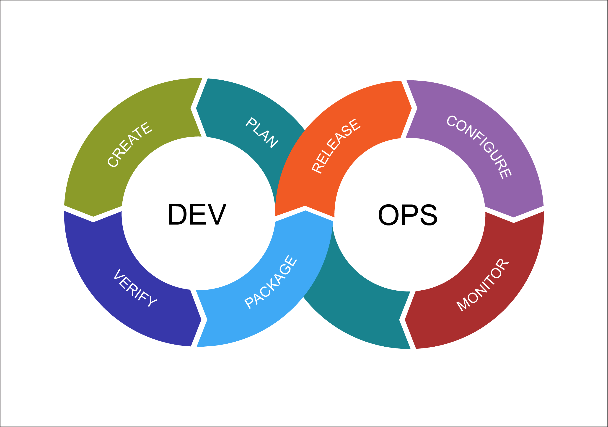
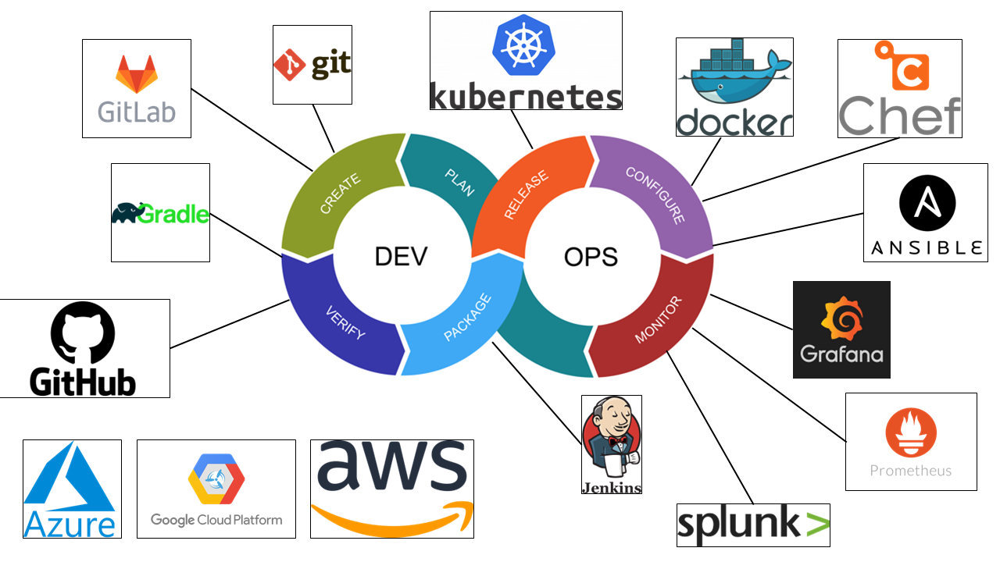
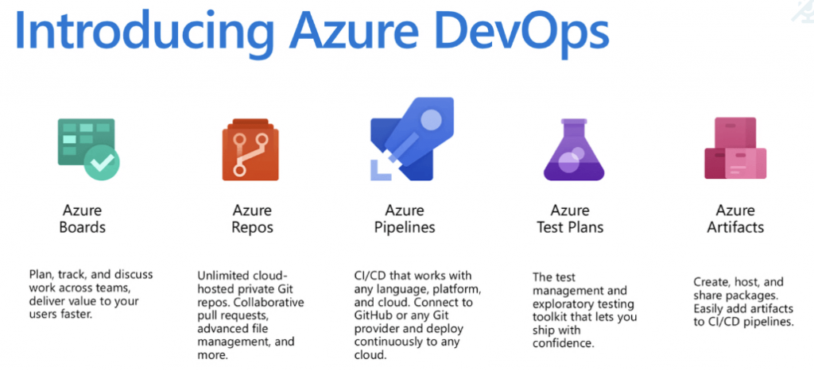
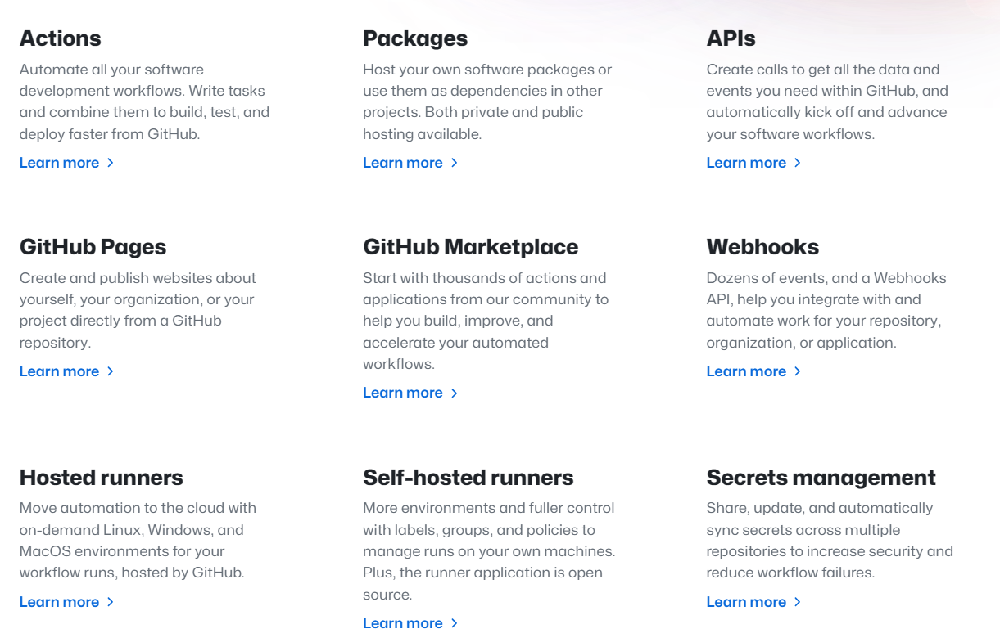
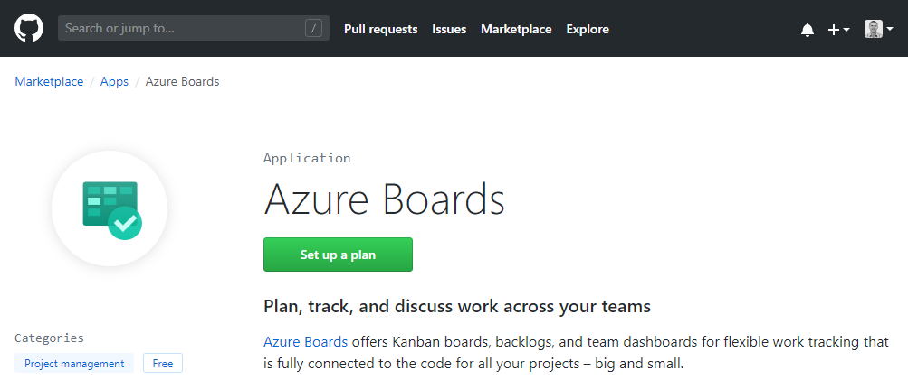
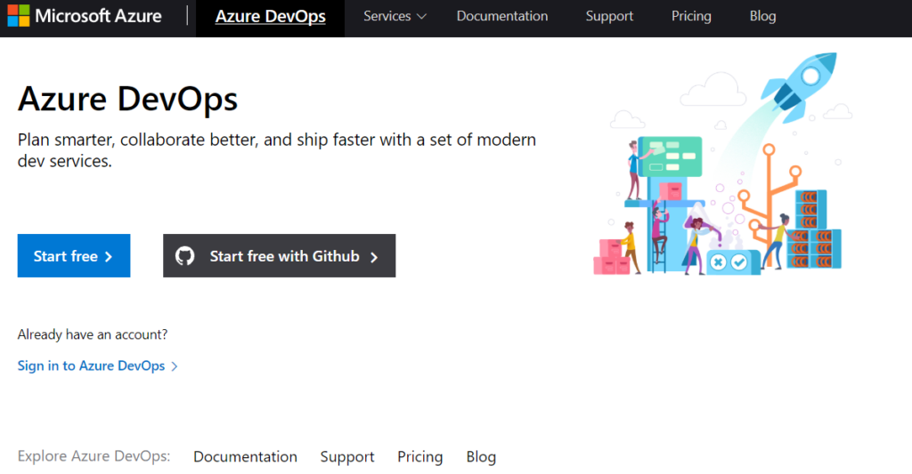

В этой статье мы сравним две популярные платформы, предлагающие решения DevOps: Azure DevOps и GitHub. Мы выделим их основные функции, сильные и слабые стороны, а также дадим некоторые рекомендации по выбору наиболее подходящей для вашей организации.

## Почему DevOps?

DevOps - это набор практик, направленных на улучшение взаимодействия и повышение эффективности команд по разработке программного обеспечения и ИТ-операций. Он позволяет ускорить доставку ценностей клиентам, повысить качество программного обеспечения и создать более надежные и безопасные системы. DevOps также способствует формированию культуры непрерывного обучения и совершенствования, когда команды могут экспериментировать, учиться на неудачах и адаптироваться к меняющимся требованиям и обратной связи.

Одним из ключевых аспектов DevOps является поддержка бизнеса на различных этапах жизненного цикла разработки программного обеспечения, таких как планирование, кодирование, тестирование, развертывание и мониторинг.

DevOps становится все более популярным при развертывании публичных облачных сред, позволяя не только управлять жизненным циклом рабочих нагрузок приложений, но и внедрять инфраструктуру как код, а также конфигурацию как код. DevOps объединяет команды разработчиков (работающих над приложениями) и команды операторов (работающих над инфраструктурой). Он охватывает полный цикл - от развертывания базовых вычислительных ресурсов и конфигурирования платформы до выпуска приложений, работающих на ней.

Хотя DevOps получил распространение в мире облачных вычислений, его концепции можно распространить и на гибридные среды или чисто локальные центры обработки данных. Благодаря DevOps организации могут быстрее выпускать программное обеспечение, быстрее исправлять ошибки, выпускать новые функции и возможности - независимо от того, где работает базовая инфраструктура или какая архитектура платформы используется, например виртуальные машины, платформа как сервис или контейнерные рабочие нагрузки, такие как Kubernetes.

## Фазы управления жизненным циклом программного обеспечения DevOps

Как только организация решает внедрить DevOps, следующее решение, которое необходимо принять, - это выбор инструментов DevOps. Эти инструменты помогают автоматизировать и упорядочить рабочие процессы, сократить количество ошибок и узких мест, а также обеспечить видимость и обратную связь с командами. Однако выбор правильных инструментов для решения задач DevOps может оказаться непростой задачей, поскольку на рынке представлено множество вариантов.

## Лучшие инструменты DevOps в 2023 году

В следующих разделах мы сравним Azure DevOps и GitHub. Хотя оба продукта принадлежат Microsoft (Microsoft приобрела GitHub в 2018 году), они рассматриваются как два отдельных продукта - хотя на самом деле между ними существует довольно много возможностей для интеграции.

### Azure DevOps

Azure DevOps - это облачная платформа, предоставляющая набор сервисов и инструментов для команд DevOps. Она включает в себя:

Azure Boards: инструмент управления проектами, позволяющий отслеживать рабочие элементы, такие как пользовательские истории, задачи, ошибки и функции. Вы можете использовать такие agile-методы, как Scrum или Kanban, создавать собственные рабочие процессы и информационные панели, а также интегрироваться с другими инструментами, такими как GitHub или Jira. Azure Repos: система контроля версий, поддерживающая Git и Team Foundation Version Control (TFVC). Вы можете размещать свои репозитории кода в облаке или в локальной сети, управлять ветвями и запросами на выгрузку, а также применять политики и разрешения. Azure Pipelines: инструмент непрерывной интеграции и непрерывной доставки (CI/CD), который позволяет собирать, тестировать и развертывать код на любой платформе или в облаке. Вы можете использовать предопределенные шаблоны или создавать собственные конвейеры с помощью YAML или графического редактора. Также можно интегрировать с другими инструментами, такими как Jenkins или SonarQube. Azure Test Plans: инструмент тестирования, позволяющий планировать, выполнять и отслеживать ручные и автоматизированные тесты. Вы можете создавать тестовые случаи и наборы, запускать тесты в различных браузерах и устройствах, а также генерировать отчеты и аналитические данные. Azure Artifacts: инструмент управления пакетами, позволяющий создавать, размещать и делиться пакетами со своей командой или с общественностью. Вы можете использовать различные форматы пакетов, такие как NuGet, npm, Maven или Python.

Обзор компонентов Azure DevOps Преимущества Azure DevOps

Это комплексное и интегрированное решение для всех ваших потребностей в DevOps. Вы можете получить доступ ко всем службам с единого портала и использовать общую модель идентификации и безопасности, поддерживаемую Microsoft Azure Active Directory (теперь Microsoft Entra ID). Он легко интегрируется с другими службами Azure и продуктами Microsoft, такими как Visual Studio, Office 365 или Power BI. Вы также можете использовать экосистему партнеров и расширений Azure для расширения возможностей DevOps с помощью Visual Studio Marketplace. Поддерживаются гибридные и мультиоблачные сценарии. Вы можете развернуть свой код в Azure или в других облаках, таких как Amazon AWS или Google Cloud Platform. Вы также можете использовать Azure DevOps Server для запуска некоторых или всех служб на предварительном этапе.мизы. Он обеспечивает масштабируемость и надежность. Вы можете увеличивать или уменьшать ресурсы по мере необходимости и платить только за то, что используете. Вы также можете положиться на высокую доступность и безопасность Azure.

Недостатки Azure DevOps

Для новичков или небольших команд она может быть слишком сложной. Возможно, вам не нужны все функции или услуги, которые предлагает Azure DevOps, или вы можете предпочесть более простые или специализированные инструменты для решения некоторых задач. Это может быть дорого для больших команд или проектов. Модель ценообразования Azure DevOps основана на количестве пользователей, конвейеров, агентов, места для хранения и т. д. В итоге вы можете заплатить больше, чем при использовании других платформ или инструментов. Она может быть менее гибкой или настраиваемой, чем другие платформы или инструменты. Возможно, вы не сможете использовать некоторые функции или интеграции, которые доступны в других платформах, или вам придется следовать некоторым соглашениям или ограничениям, налагаемым Azure DevOps.

### GitHub

GitHub - это веб-платформа, предоставляющая хостинг для разработки программного обеспечения с использованием системы контроля версий Git. Она также предлагает различные функции и инструменты для совместной работы и автоматизации. Она включает в себя:

Репозитории GitHub: система контроля версий, позволяющая размещать репозитории кода в Интернете. Вы можете управлять ветвями и запросами на перетяжку, просматривать изменения кода, применять политики и разрешения, а также интегрироваться с другими инструментами, такими как Azure DevOps или Slack. GitHub Actions: инструмент непрерывной интеграции и непрерывной доставки (CI/CD), позволяющий автоматизировать рабочие процессы с помощью файлов YAML. Вы можете собирать, тестировать и развертывать свой код на любой платформе или в облаке. Вы также можете использовать предопределенные рабочие процессы или создавать собственные действия с помощью контейнеров Docker. GitHub Packages: инструмент управления пакетами, позволяющий создавать, размещать и делиться пакетами со своей командой или публично. Вы можете использовать различные форматы пакетов, такие как npm, RubyGems, Docker или NuGet. GitHub Pages: сервис хостинга статических сайтов, позволяющий публиковать веб-страницы непосредственно из репозиториев GitHub. Вы можете использовать Jekyll, генератор статических сайтов, или любые файлы HTML, CSS или JavaScript. Вы также можете использовать собственное доменное имя для своего сайта. GitHub Discussions: форум сообщества, который позволяет вам начинать и присоединяться к беседам с другими пользователями GitHub. Вы можете задавать вопросы, делиться идеями, оставлять отзывы или обращаться за помощью по различным темам, связанным с вашими проектами или функциями GitHub. GitHub Code Scanning: инструмент анализа кода, позволяющий находить и устранять уязвимости безопасности и проблемы с качеством кода в вашем коде. Вы можете использовать CodeQL, мощный язык запросов, или другие инструменты, такие как ESLint или Bandit, для сканирования вашего кода и генерации предупреждений.

Основные компоненты и сервисы GitHub Преимущества использования GitHub

Это самая популярная и широко используемая платформа для размещения кода и совместной работы над ним. Вы можете получить доступ к миллионам проектов с открытым исходным кодом и их участникам, изучить лучшие практики и примеры, а также внести свой вклад в развитие сообщества. Она проста и удобна в использовании для новичков и небольших команд. Вы можете быстро начать работу с бесплатной учетной записью и базовым рабочим процессом Git. Для взаимодействия с GitHub можно также использовать GitHub Desktop - графический интерфейс пользователя - или GitHub CLI - инструмент командной строки. Это гибкий и настраиваемый инструмент для опытных пользователей и больших команд. Вы можете использовать GitHub Enterprise, самостоятельную версию GitHub, чтобы запустить ее на собственных серверах или в облаке. Вы также можете использовать GitHub Apps, фреймворк для создания интеграций, или GitHub API, программный интерфейс, для расширения и автоматизации функциональности GitHub. Это инновационный и постоянно развивающийся продукт. Вы можете воспользоваться новейшими функциями и улучшениями, которые GitHub регулярно выпускает. Вы также можете принять участие в бета-тестировании или оставить отзыв о новых идеях и экспериментах.

Недостатки использования GitHub

Он в основном ориентирован на контроль версий Git и хостинг кода. Возможно, вам придется использовать другие платформы или инструменты для решения некоторых задач DevOps, таких как управление проектами, тестирование или мониторинг. Зависимость от доступности и производительности GitHub. Вы можете столкнуться с простоем или замедлением работы из-за технического обслуживания, сбоев или инцидентов. Вам также придется соблюдать условия предоставления услуг и политику конфиденциальности GitHub. Ограничения связаны с ценовой моделью и квотами GitHub. Бесплатный тарифный план имеет некоторые ограничения на количество участников, частных репозиториев, минут действий и места в хранилище. Платные тарифные планы основаны на количестве мест, что может не отражать реальное использование или ценность GitHub.

## Как выбрать между Azure DevOps и GitHub

Azure DevOps и GitHub - обе мощные платформы, предлагающие решения DevOps для команд разработчиков программного обеспечения. Однако они не идентичны и имеют ряд существенных различий, которые могут повлиять на ваш выбор. В этом разделе мы рассмотрим некоторые из основных факторов, которые следует учитывать при сравнении и сопоставлении Azure DevOps и GitHub, а также дадим несколько советов по принятию обоснованного решения.

Область применения и интеграция

Одним из первых моментов, на который следует обратить внимание, являетсярассмотрим объем и интеграцию платформ. Azure DevOps - это комплексное и интегрированное решение, которое покрывает все ваши потребности в DevOps, от планирования до мониторинга. Оно также легко интегрируется с другими службами Azure и продуктами Microsoft, такими как Visual Studio, Office 365 или Power BI. Это означает, что вы можете получить доступ ко всем функциям и службам с единого портала, использовать общую модель идентификации и безопасности, а также задействовать экосистему партнеров и расширений Azure.

GitHub, с другой стороны, в основном ориентирован на контроль версий Git и хостинг кода. Он предлагает некоторые дополнительные функции и инструменты, такие как GitHub Actions, GitHub Packages или GitHub Pages, но они не столь обширны и интегрированы, как Azure DevOps. Для решения некоторых задач DevOps, таких как управление проектами, тестирование или мониторинг, вам могут понадобиться другие платформы или инструменты. Вы также можете интегрировать GitHub с другими инструментами и службами, такими как Azure DevOps, Slack или Jenkins, но при этом вам придется иметь дело с несколькими интерфейсами, идентификаторами и моделями безопасности.

Поэтому, если вы ищете комплексное и целостное решение, которое хорошо работает с другими службами Azure и продуктами Microsoft, вам стоит отдать предпочтение Azure DevOps. Если вы ищете простое и целенаправленное решение, которое хорошо работает с системой контроля версий Git и хостингом кода, вам лучше отдать предпочтение GitHub.

## Простота и сложность

Еще один фактор, который следует учитывать, - это простота и сложность платформ. GitHub прост и удобен в использовании для новичков и небольших команд. Вы можете быстро начать работу с бесплатной учетной записью и базовым рабочим процессом Git. Вы также можете использовать GitHub Desktop или GitHub CLI для взаимодействия с GitHub со своего рабочего стола или терминала. GitHub имеет удобный интерфейс и понятную документацию, которая поможет вам разобраться с функциями и инструментами.

Azure DevOps более сложна и непосильна для новичков и небольших команд. Возможно, вам не понадобятся все функции или службы, которые предлагает Azure DevOps, или вы предпочтете более простые или специализированные инструменты для решения некоторых задач. У Azure DevOps более загроможденный интерфейс и менее интуитивно понятная документация, которая может запутать вас или заставить пропустить некоторые важные детали.

Поэтому, если вы ищете простое и легкое решение, не требующее долгого обучения или настройки, вы можете предпочесть GitHub. Если же вы ищете сложное и комплексное решение, предлагающее больше функциональности и возможностей для настройки, вам лучше отдать предпочтение Azure DevOps.

## Гибкость и настройка

Еще один фактор, который следует учитывать, - это гибкость и настраиваемость платформ. GitHub отличается гибкостью и настраиваемостью для опытных пользователей и больших команд. Вы можете использовать GitHub Enterprise, самостоятельную версию GitHub, чтобы запустить ее на собственных серверах или в облаке. Вы также можете использовать GitHub Apps, фреймворк для создания интеграций, или GitHub API, программный интерфейс, для расширения и автоматизации функциональности GitHub. Вы также можете создавать собственные действия, пакеты или страницы и делиться ими со своей командой или публикой.

Azure DevOps менее гибкий и настраиваемый, чем GitHub. Возможно, вы не сможете использовать некоторые функции или интеграции, которые доступны в других местах, или вам придется следовать некоторым соглашениям или ограничениям, налагаемым Azure DevOps. Вы можете использовать Azure DevOps Server для запуска некоторых или всех служб на месте, но он может не иметь всех функций и обновлений облачной версии. Для взаимодействия с Azure DevOps можно также использовать REST API или сценарии PowerShell, но они могут быть не такими мощными и удобными, как GitHub Apps или API.

Поэтому, если вы ищете гибкое и настраиваемое решение, позволяющее сочетать различные функции и инструменты в соответствии с вашими потребностями и предпочтениями, вы можете предпочесть GitHub.

Если же вы ищете менее гибкое или настраиваемое решение, которое следует более стандартизированному и последовательному подходу, вы можете предпочесть Azure DevOps.

## Ценообразование и стоимость

Еще один фактор, который следует учитывать, - это цена и стоимость платформ.

У GitHub есть бесплатный тарифный план, который предлагает неограниченное количество публичных репозиториев, неограниченное количество коллабораторов, неограниченное количество минут действий и 500 МБ пространства для хранения. Также есть платные тарифные планы, которые предлагают неограниченное количество приватных репозиториев, больше минут действий, больше места для хранения, а также дополнительные функции, такие как сканирование кода, обсуждения или корпоративные аккаунты. Платные планы основаны на количестве мест, что означает, что вы платите за каждого пользователя в месяц.

Для получения более подробной информации ознакомьтесь с этой страницей, посвященной ценам на GitHub.

В Azure DevOps есть бесплатный план, который предлагает неограниченное количество публичных проектов, пять бесплатных пользователей, одно бесплатное параллельное задание и 2 ГБ пространства для хранения данных. Также есть платные тарифные планы, которые предлагают неограниченное количество частных проектов, больше пользователей, больше параллельных заданий, больше места для хранения данных, а также дополнительные функции, такие как планы тестирования, артефакты или самостоятельное размещение агентов. Платные планы основаны на количестве пользователей, конвейеров, агентов, места для хранения и так далее, что означает, что вы платите за ресурс в месяц.

Для получения более подробной информации ознакомьтесь с этой страницей, посвященной ценам на Azure DevOps.

Итак, если вы ищетебесплатное или недорогое решение, предлагающее неограниченное количество публичных репозиториев и коллабораторов, вы можете предпочесть GitHub. Если вы ищете более дорогое, но более комплексное решение, предлагающее неограниченное количество частных проектов и больше функций и сервисов, вам подойдет Azure DevOps.

## Как интегрировать Azure DevOps и GitHub?

Как уже упоминалось, оба продукта принадлежат Microsoft, и у них есть общие функции, такие как контроль версий, CI/CD и управление пакетами. Однако у них есть и уникальные функции, которые могут дополнять друг друга, например управление проектами, тестирование или форумы сообществ.

Вот несколько примеров того, как можно интегрировать Azure DevOps и GitHub, чтобы использовать лучшее из двух миров:

Вы можете подключить свой проект Azure Boards к репозиториям GitHub и связать рабочие элементы с фиксациями, запросами на исправление и проблемами GitHub. Таким образом, вы можете использовать GitHub для разработки программного обеспечения, а Azure Boards - для планирования и отслеживания своей работы. Вы также можете добавить значки состояния Azure Boards в файл README репозитория GitHub и просматривать связанные рабочие элементы на странице Release summary в Azure DevOps.

## Использование Azure Boards из GitHub

Вы можете использовать конвейеры Azure для автоматической сборки, тестирования, упаковки, выпуска и развертывания кода в репозитории GitHub. Вы можете использовать предопределенные шаблоны или создавать собственные конвейеры с помощью YAML или графического редактора. Можно также интегрировать их с другими инструментами, такими как Jenkins или SonarQube.

Из Azure Pipelines можно создать GitHub Release и опубликовать артефакты в GitHub Packages. Таким образом, вы можете использовать Azure Pipelines для CI/CD, а GitHub - для управления и распространения пакетов. Вы также можете использовать GitHub Actions для запуска рабочих процессов на основе событий в Azure DevOps.

Вы можете войти в Azure DevOps, используя учетные данные GitHub, и пригласить соавторов GitHub в свой проект Azure DevOps. Таким образом, вы можете упростить процесс аутентификации и авторизации и сотрудничать с членами команды на обеих платформах.

Использование учетных данных GitHub для аутентификации в Azure DevOps

## Резюме

Azure DevOps и GitHub - обе мощные платформы, предлагающие решения DevOps для команд разработчиков программного обеспечения. Они имеют ряд общих функций, таких как контроль версий, CI/CD и управление пакетами, но у них есть и существенные различия, которые могут повлиять на ваш выбор.

Выбор между Azure DevOps и GitHub зависит от различных факторов, таких как размер вашей команды, сложность проекта, бюджет, предпочтения и требования. Универсального ответа не существует, поскольку у каждой платформы есть свои плюсы и минусы. Как уже говорилось, вполне можно использовать и Azure DevOps, и GitHub вместе.

Интегрируя Azure DevOps и GitHub, вы сможете воспользоваться комплексными и интегрированными функциями Azure DevOps, а также простыми и удобными функциями GitHub. Вы также сможете насладиться бесшовной интеграцией с другими службами Azure и продуктами Microsoft, а также связью с сообществом разработчиков открытого кода. Вы также можете оптимизировать свои расходы, используя бесплатные или недорогие тарифные планы обеих платформ.

Таким образом, выбор между Azure DevOps и GitHub - это не бинарное решение. Вы можете использовать обе платформы вместе, чтобы расширить свои возможности DevOps и предоставлять ценности своим клиентам быстрее, лучше и безопаснее.

Раз уж вы заинтересовались DevOps и находитесь здесь, ознакомьтесь с нашей библиотекой обучающих ресурсов по облачным технологиям и DevOps.

Также ознакомьтесь с нашей статьей DevOps на примере: Инструменты, плюсы и минусы культуры DevOps для ознакомления с DevOps.
