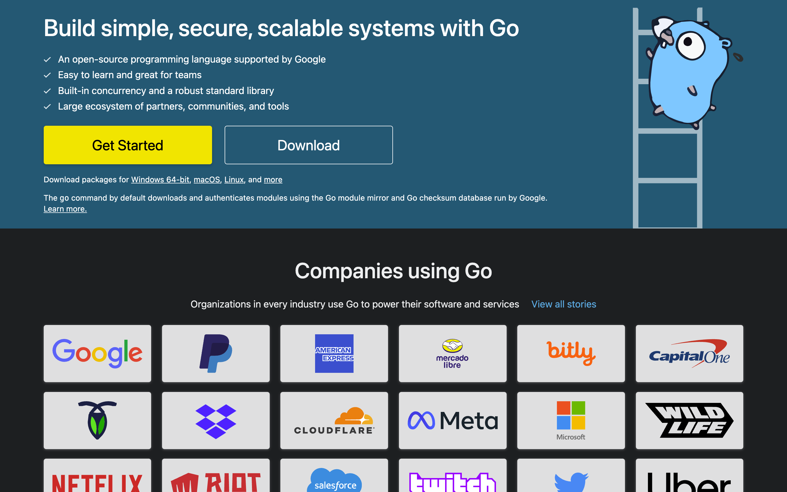
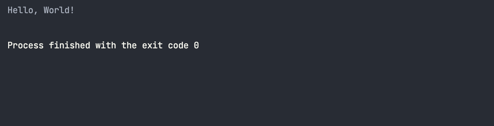
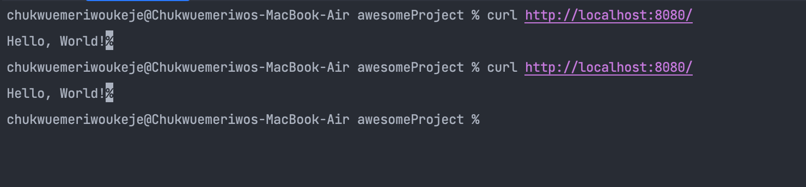

Front-end-разработчики находятся в постоянном поиске инструментов и способов повышения производительности и масштабируемости своих приложений. Одним из языков, который с годами приобрел популярность для создания приложений на стороне сервера, является язык программирования Go (он же Golang).

Go был разработан и выпущен компанией Google в 2009 году и стал популярным выбором для создания масштабируемых, высокопроизводительных веб-приложений. Go - это статически типизированный, компилируемый язык, который прост в изучении и использовании, что делает его отличным выбором для разработчиков любого уровня подготовки.



Вы должны рассмотреть возможность использования Go в качестве бэкенда для вашего фронтенд-приложения. От поддержки параллелизма до скорости, минимальных требований к ресурсам и постоянно растущего сообщества и экосистемы пакетов.

Цель этой статьи - рассказать вам о языке программирования Go и помочь понять, почему Go - идеальный язык программирования для бэкенда вашего фронтенд-приложения. Вы узнаете об особенностях языка программирования Go и о том, как легко создать сервер с конечными точками API на Go.

## Производительность и масштабируемость Go

Программы на Go отличаются высокой скоростью компиляции, поскольку они компилируются в нативный машинный код, в отличие от интерпретируемых языков, таких как Python и Ruby. По слухам, скорость компиляции Go выше, чем у C++, что делает его хорошим выбором для крупномасштабных проектов.

Встроенный в Go сборщик мусора без генерации, трехцветной метки и развертки помогает управлять памятью и оптимизировать ее, сокращая накладные расходы, связанные с ручным управлением памятью.

Функции параллелизма в Go обеспечивают впечатляющую производительность при большом трафике данных, поскольку Go позволяет программам использовать преимущества современных многоядерных процессоров, которые позволяют приложениям горизонтально масштабироваться на серверах, в отличие от других языков, ограничивающих параллелизм.

Наконец, язык имеет легкую и эффективную среду выполнения с минимальными накладными расходами и зависимостью от внешних библиотек, что приводит к более быстрому запуску и меньшему использованию памяти.

Эти особенности делают его производительным, высокомасштабируемым и хорошим выбором для создания веб-приложений.

## Кросс-совместимость

Одной из ключевых особенностей Go является его кросс-совместимость с другими языками. Кросс-совместимость обусловлена тем, что язык может работать в различных средах и на разных платформах. Вы можете выполнять кросс-компиляцию с такими языками, как C, C++, WebAssembly и другими, чтобы использовать существующие пакеты в их экосистемах.

## Простота и удобство использования

Go славится своей простотой и легкостью в использовании. В нем всего 25 ключевых слов и понятный синтаксис, что делает язык легким для освоения как начинающими, так и опытными программистами.

Вот пример программы “Hello, World” (вы можете скачать и установить Go с официальной страницы загрузок, чтобы следовать стандартам).

```go
package main

import "fmt"

func main() {
    fmt.Println("Hello, World!")
}
```

Этот код определяет функцию `main`, точку входа в программу на Go. Как и было импортировано, пакет `fmt` предоставляет функциональность для форматирования и печати вывода, а приведенный выше метод `Println` печатает строку в новой строке на консоли.

Для запуска программ можно использовать команду `run` с помощью инструмента командной строки.

`go run hello.go`

Вот результат выполнения программы.



В Go также есть полезные инструменты, которые делают разработку быстрой и легкой. В Go есть встроенный менеджер пакетов для загрузки и установки сторонних пакетов. Встроенный фреймворк тестирования позволяет писать и запускать модульные тесты с помощью всего нескольких строк кода и стандартной библиотеки полезных пакетов.

Вот как можно создать сервер с одной конечной точкой API с помощью нескольких строк кода.

```go
package main

import (
  "fmt"
  "net/http"
)

func main() {
  http.HandleFunc("/", func(w http.ResponseWriter, r *http.Request) {
    // Check if the request method is GET
    if r.Method == http.MethodGet {
      // Write response to the client
      fmt.Fprint(w, "Hello, World!")
    } else {
      // Return "Method Not Allowed" error
      w.WriteHeader(http.StatusMethodNotAllowed)
    }
  })

  // Start the server on port 8080
  err := http.ListenAndServe(":8080", nil)
  if err != nil {
    return
  }
}
```

Вы импортировали пакеты `http` и `fmt`. Пакет `http` предоставляет функциональность для операций на основе HTTP. В функции `main` метод `HandleFunc` подключает функцию-обработчик к маршруту `/`, а затем оператор `if` проверяет, является ли входящий запрос запросом `GET` и возвращает строку “Hello, World!” или выдает ошибку “Method Not Allowed”.

Метод `ListenAndServe` позволяет серверу прослушивать порт `8080` на вашей хост-машине.

Вот результат запроса CURL на конечной точке.

`$ curl http://localhost:8080/`



В целом, Go - это универсальный и простой в использовании язык программирования, подходящий для решения различных задач. Независимо от того, новичок ли вы в программировании или опытный разработчик, ищущий быстрый и эффективный язык, Go заслуживает внимания.

## Безопасность и надежность

Безопасность типов - одна из ключевых особенностей, обеспечивающих безопасность Go. Все переменные имеют тип, проверяемый во время компиляции, что помогает предотвратить такие уязвимости безопасности, как переполнение буфера.

В язык встроена поддержка шифрования и безопасных алгоритмов хеширования, которые можно использовать для защиты конфиденциальных данных, а также поддержка протокола TLS для безопасного взаимодействия между клиентами и серверами.

Поддержка параллелизма и параллелизма в Go значительно повышает его надежность. Модель параллелизма основана на концепции ”горутин”, что упрощает написание распределенных систем и повышает масштабируемость программ.

## Заключение

Вы узнали о языке программирования Go, о прекрасных возможностях, которые вы можете получить, используя его в качестве бэкенда вашего фронтенд-приложения, узнали о простой программе на Go, о том, как можно запускать программы на Go, и о том, как создать простой API с одной конечной точкой на Go.

Использование этого языка в бэкенде вашего приложения позволит получить преимущества производительности и масштабируемости языка, не жертвуя при этом большинством любимых вами функций.
