В этой статье вы узнаете, как создать полностековый клон Amazon с помощью Amplication.

## Особенности клона Amazon

Построен с помощью Next.js Стилизован с помощью Tailwind CSS Бэкэнд сгенерирован с помощью Amplication Управление состояниями с помощью Zustand Typescript для безопасности типов Вход Регистрация с помощью JWT-токенов API-вызовы с помощью Axios Recharts для графиков Next UI для удивительных готовых компонентов React Pro Sidebar для готовой удивительной боковой панели. Пагинация таблицы панели администратора

## Функциональные возможности клона Amazon

Категории CRUD (создание/чтение/обновление/удаление) Продукты CRUD (создание/чтение/обновление/удаление) Управление заказами Dashbord для администратора Admin Login User Login & Signup User view products User search products User add products to cart User place order And many more features that you can watch it from the video below

Этот пост в блоге является частью моего видео на Youtube. Посмотрите удивительное видео.

Раскрытие потенциала Amplication: Оптимизация усилий по разработке программного обеспечения

Amplication - это мощный инструмент разработки бэкенда с открытым исходным кодом, предназначенный для оптимизации и ускорения создания веб-приложений. Он обладает удобным интерфейсом и широким набором функций, что делает его ценным ресурсом для разработчиков и организаций, стремящихся быстро создавать надежные, масштабируемые приложения, экономя при этом время и ресурсы.

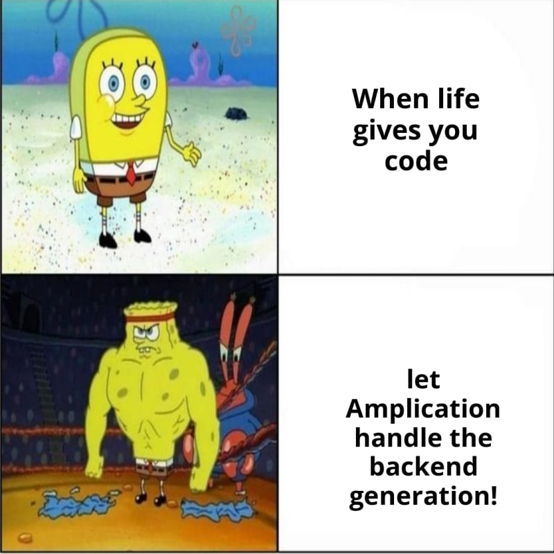

В основе Amplication лежит концепция среды разработки бэкенда с низким кодом. Этот инновационный подход позволяет разработчикам создавать приложения путем конфигурирования и соединения готовых строительных блоков, устраняя необходимость в обширном ручном кодировании. Таким образом, команды разработчиков могут направить свои усилия на разработку бизнес-логики и создание отполированного конечного продукта с большей эффективностью.

## Шаг 1: Создайте новый репозиторий на github

Amplication подключается к нашему репозиторию на github, переносит код в ветку и создает запрос на потянуть.

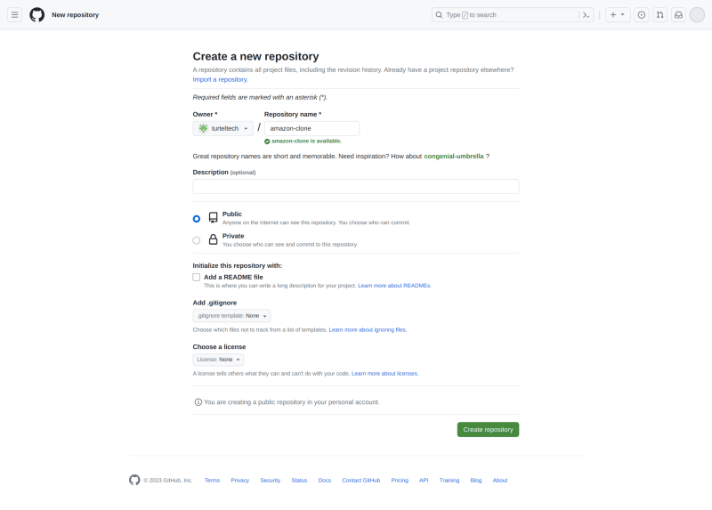

## Шаг 2: Перейдите в amplication и нажмите на кнопку Start Now.


## Шаг 3: Продолжите работу с аккаунтом Github

На этом шаге нажмите на кнопку continue with Github, чтобы начать подключение amplication к вашему аккаунту Github.

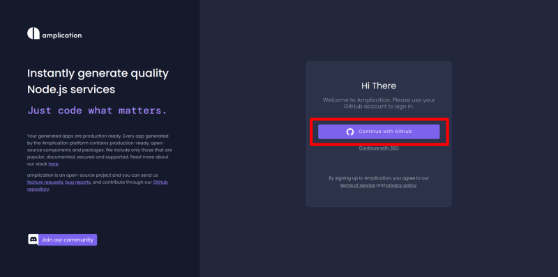

## Шаг 4: Создайте свой первый сервис

Теперь вам нужно создать сервис для amplication, который, в свою очередь, будет генерировать код вашего бэкенда. Дайте ему осмысленное имя.

Мы назовем его amazon-backend и нажмем кнопку continue.

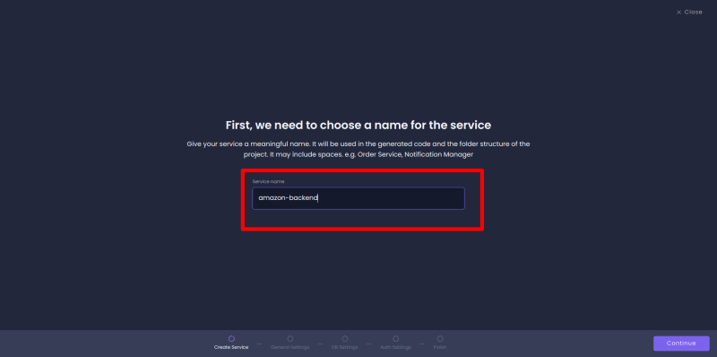

## Шаг 5: Подключитесь к Github и выберите репозиторий

Теперь вам нужно подключиться к Git. Существуют различные варианты, но мы будем использовать Github для нашего git-провайдера.

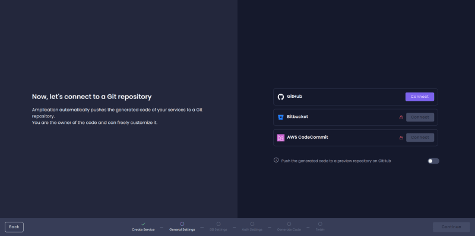

После подключения к github вам нужно выбрать репозиторий. Выберите репозиторий amazon-clone.

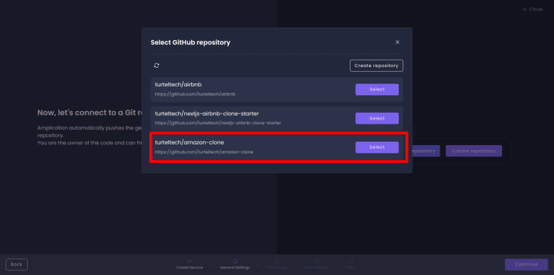

Теперь репозиторий будет выбран.

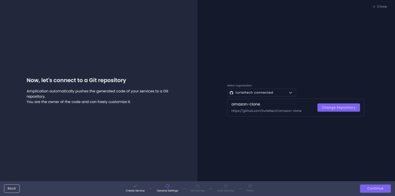

Теперь нажмите кнопку continue.

## Шаг 6: Выбор GraphQL / RestAPI & Swagger UI / Admin UI

На этом шаге вы можете включить опции поддержки GraphQL API, REST API & Swagger UI и Admin UI, предоставляемые Amplication.


Здесь мы включим все опции. Хотя мы не будем использовать GraphQL API в приложении, но для демонстрации мы включим его.

Мы будем использовать REST API во всем клоне Amazon. Также мы будем использовать Swagger для тестирования API.

## Шаг 7: Выбор типа бэкенд-структуры, создаваемой Amplication.

Amplication предоставляет два типа структуры для генерируемого кода.

Полирепо
Если вы используете полирепо, Amplication поместит код в корень репо в отдельных папках для сервера и администраторского интерфейса.

Монорепо
Если вы используете монорепо, вы можете выбрать папку, в которую хотите сохранить код сервиса. “apps”, “packages”, “ee/packages” - все они подходят.

Для этого проекта мы будем использовать вариант Polyrepo.

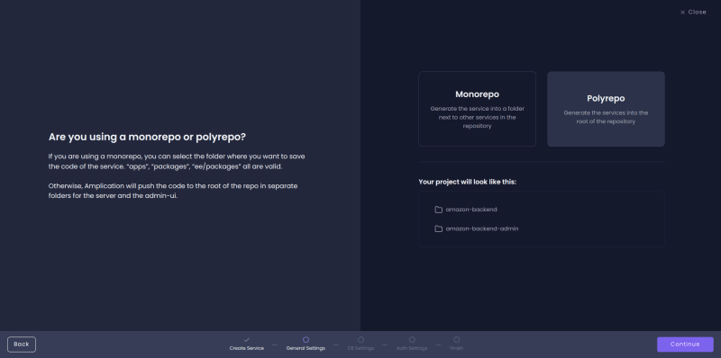

## Шаг 8: Выберите базу данных.

На данный момент Amplication предоставляет три типа баз данных.

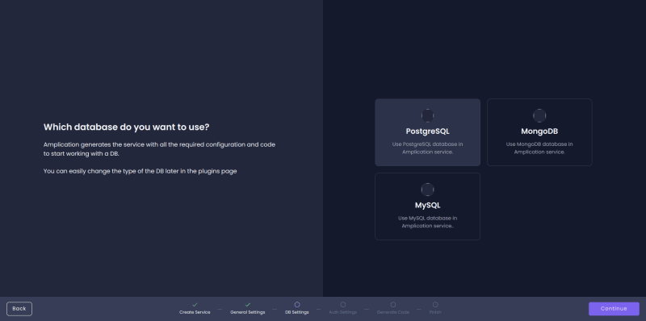

Amplication генерирует сервис со всей необходимой конфигурацией и кодом для начала работы с БД.

Вы можете легко изменить тип БД позже на странице плагинов

Для этого Amazon Clone мы будем использовать БД PostrgreSQL.

Теперь нажмите кнопку ”Продолжить".

## Шаг 9: Выбор шаблонов для вашего проекта

Amplication предоставляет две опции для ваших сущностей.

Пустой
Ручное определение собственных сущностей и полей

Использовать шаблон
Предварительно определенный набор сущностей и полей Адрес, Заказы, Пользователь

Вы можете начать с нуля или выбрать демонстрационный шаблон.

Мы выберем пустой вариант.

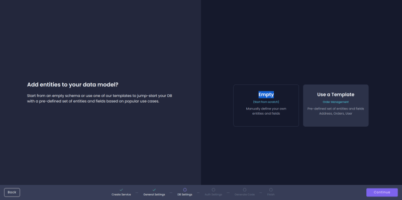

Нажимаем продолжить.

## Шаг 10: SelИктирование служб авторизации

Amplication предоставляет встроенный модуль авторизации, который предварительно генерирует код для авторизации и аутентификации.

Для этого Amplication предоставляет две опции

Для нашего клона Amazon мы будем использовать модуль авторизации, предоставляемый Amplication, поэтому мы выберем опцию Include Auth Module Option.

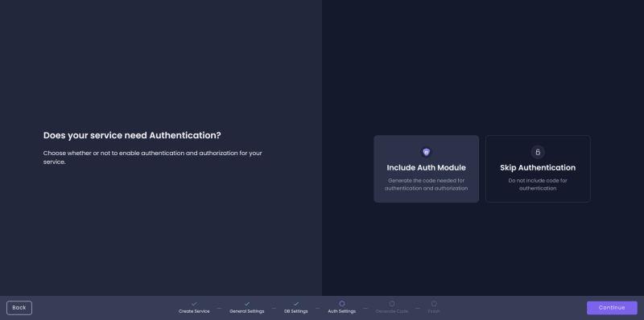

Теперь нажмите кнопку продолжить

Все начальные настройки выполнены, и теперь Amplication сгенерирует код. Подождите, пока он сгенерируется. Это может занять минуту или две.

Вы увидите страницу успеха.

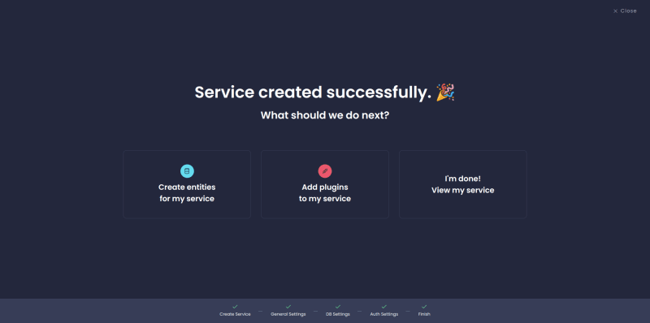

Вы успешно настроили свое приложение Amplication.

Теперь нажмите на опцию создания сущностей, чтобы создать сущности.

Сущности похожи на таблицы в БД.

Теперь здесь есть предопределенная сущность, которая предназначена для пользователей вашего приложения.

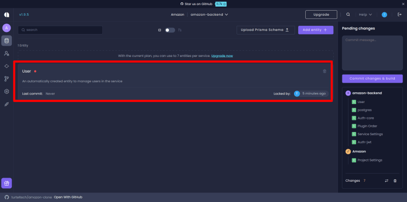

Настройка сущностей амплификации

Мы будем использовать четыре сущности в нашем клоне Amazon

пользователь: Управляет всеми пользователями с их данными.

продукты: Здесь хранятся все продукты, созданные администратором.

категория: Здесь хранятся все категории товаров.

отзывы: После того как пользователь покупает товар, он может добавить к нему отзывы. Эта сущность будет хранить отзывы о товарах.

заказы: Здесь хранятся заказы продуктов.

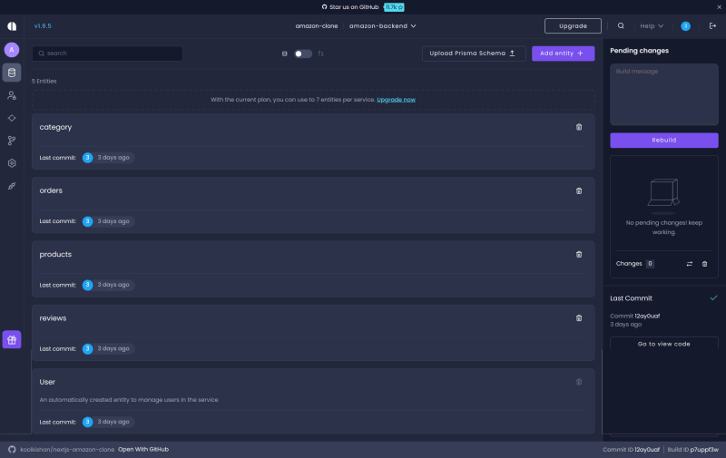

Настройка пользователей

Сущность пользователя уже создана. Нажмите на нее, чтобы просмотреть поля пользователя.

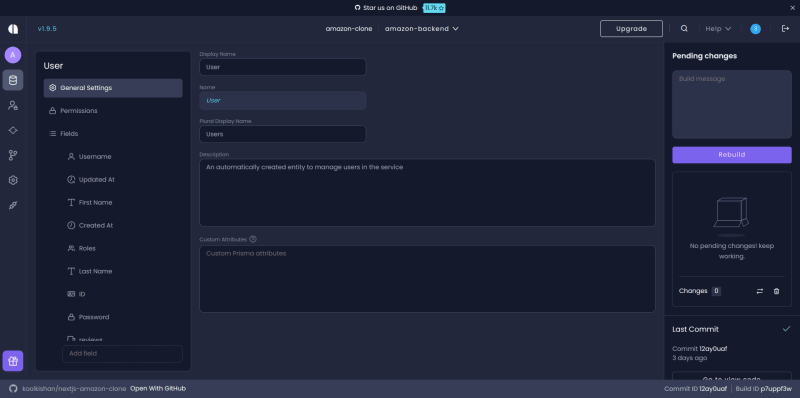

поле `isAdmin`

Теперь мы хотим добавить новое поле с именем `isAdmin`.

Нажмите на кнопку Добавить поле на левой боковой панели.

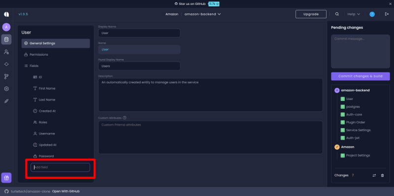

Теперь введите название сущности и нажмите на значок плюса рядом с ним, что приведет к созданию сущности.

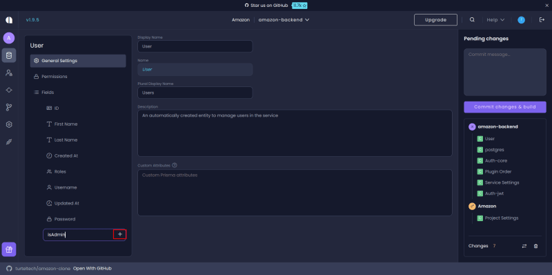

После нажатия на кнопку поле будет создано, и вы сможете настроить его в настройках поля справа.

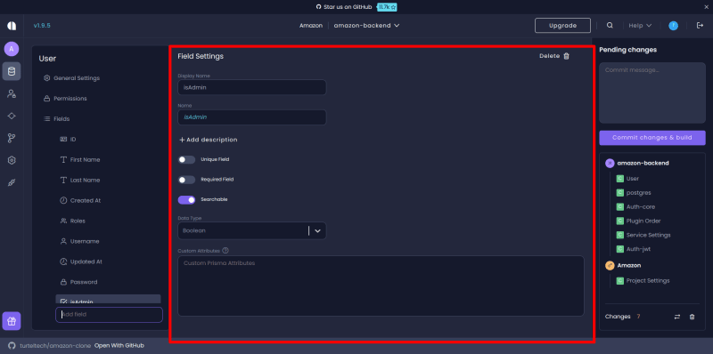

Это поле позволит нам узнать, является ли текущий залогиненный пользователь администратором. Тип данных - `boolean`.

Теперь нажмите кнопку ”Назад", и настройка пользовательской сущности будет завершена.

Сущность Products

В этой сущности будут храниться все товары с их подробной информацией

Теперь давайте создадим новую сущность для продуктов.

Нажмите на кнопку Add Entity (Добавить сущность).

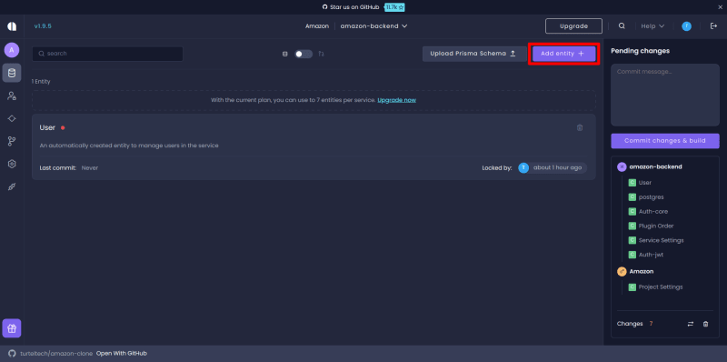

Откроется модальное окно. Введите название сущности `products` и нажмите кнопку create entity.

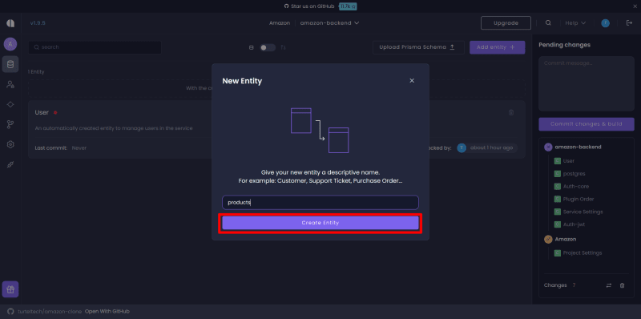

Это создаст новую сущность. Теперь давайте добавим все необходимые поля.

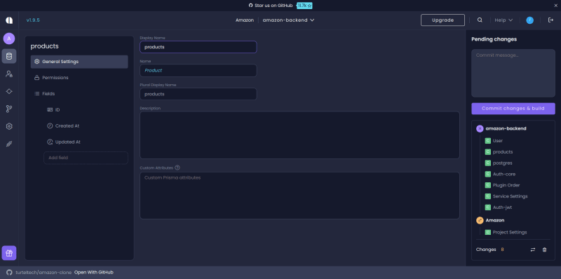

поле `title`

Напишите название и нажмите на + рядом с ним.

Вы видите, что новое поле создано и в нем появились различные опции для настройки.

Мы собираемся отметить это поле как `обязательное`.

Также мы выберем тип данных `Однострочный текст` из выпадающего списка.

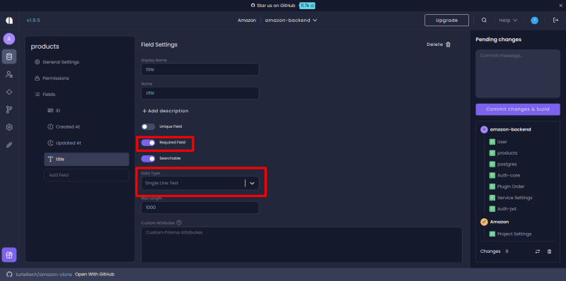

Amplication предоставляет различные типы данных в соответствии с вашими потребностями и заботится об ограничениях вашего кода в соответствии с типом данных.

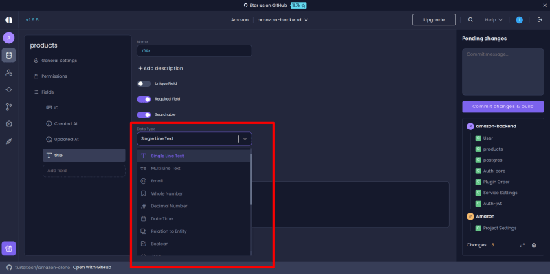

Теперь amplication автоматически сохраняет все после каждого изменения, так что ваш выбор уже выбран

поле `description`

Проделайте те же действия с описанием, но тип данных измените на `Json`, потому что у нас будет несколько описаний для продукта.

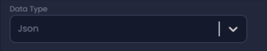

Поле `SalePrice`

Здесь будет храниться первоначальная цена товара. Тип данных этого поля будет `Decimal Number`.

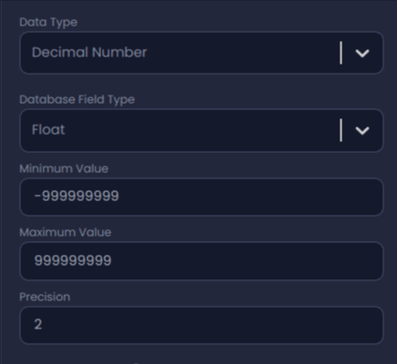

Поле `discountPrice`

Здесь будет храниться цена товара со скидкой. Тип данных этого поля - `Decimal Number`.

поле `colors

Здесь будут храниться цвета товаров. Мы сможем хранить несколько цветов, поэтому мы будем использовать тип данных `Json` для этого поля.

поле `варианты

В этом поле будут храниться все различные варианты товара. Например, размер одежды, объем памяти цифровых устройств и т.д. Мы сможем хранить несколько значений для вариантов, поэтому для этого поля мы также используем тип данных `Json`.

Поле `images`

Мы загрузим изображения на cloudinary. Cloudinary вернет нам URL-адреса загруженных изображений. У нас будет массив изображений; мы также будем использовать тип данных `Json` для поля `images`.

Вот и все для сущности products.

Сущность категории

Эта сущность будет хранить категории всех товаров.

поле `имя`

В этом поле будет храниться название категории. Тип данных для этого поля будет `Однострочный текст`.

поле `products`

В этом поле хранятся все продукты, связанные с категорией.

Мы назовем это поле `products`.

Тип данных этого поля будет `Relation to Entity`.

В раскрывающемся списке связанных сущностей выберите `products`.

А для отношения выберите опцию `Одна "категория" может быть связана со многими "продуктами"`.

Это означает.что в одной категории может быть несколько товаров.

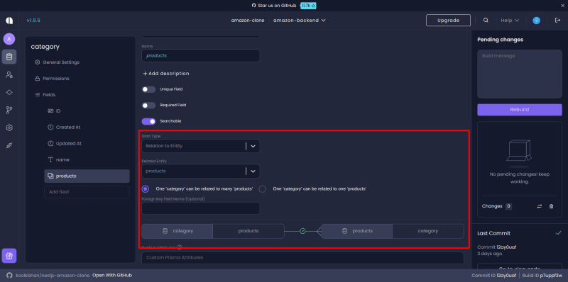

Это все для сущности категории.

Сущность ”Отзывы

Здесь будут храниться отзывы о товарах.

поле `рейтинг`

В этом поле хранится количество оценок, которые имеет отзыв.

Тип данных для поля `rating` будет `Whole Number`.

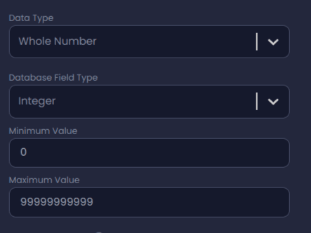

Поле `описание

В этом поле будет храниться текст отзыва.

Тип данных поля `description` будет `Multi Line Text`.

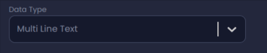

поле `продукты

В этом поле хранятся все товары, связанные с обзором.

Мы назовем это поле `products`.

Тип данных этого поля будет `Relation to Entity`.

В раскрывающемся списке связанных сущностей выберите `products`.

А для отношения выберите опцию `Один "отзыв" может быть связан с одним "товаром"`.

Это означает, что один продукт может иметь более одного отзыва.

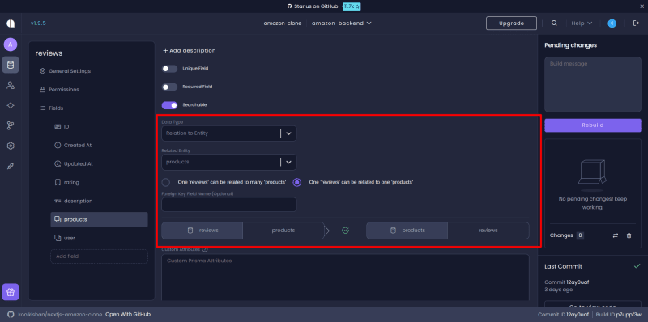

поле `пользователь`

В этом поле будет храниться пользователь, связанный с отзывом.

Назовем это поле `user`.

Тип данных этого поля будет `Relation to Entity`.

В раскрывающемся списке связанных сущностей выберите `users`.

А для отношения выберите опцию `Один "отзыв" может быть связан с одним "пользователем"`.

Это означает, что с одним отзывом может быть связан только один пользователь.

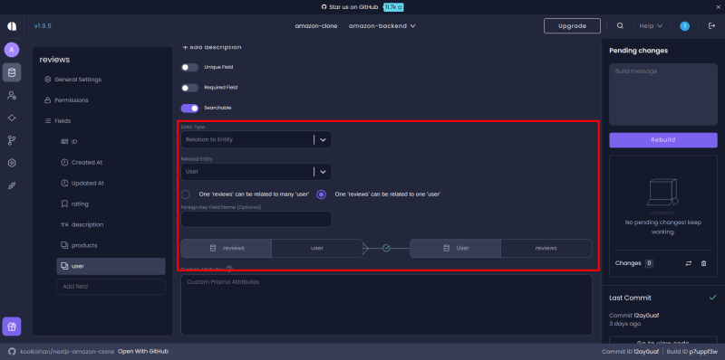

Вот и все для сущности отзывов.

сущность заказов

Здесь хранятся все заказы, которые были созданы пользователем.

поле `user`

В этом поле хранится пользователь, связанный с заказом.

Назовем это поле `user`.

Тип данных этого поля будет `Relation to Entity`.

В раскрывающемся списке связанных сущностей выберите `users`.

А для отношения выберите опцию `Один "заказ" может быть связан с одним "пользователем"`.

Это означает, что один заказ может иметь только одного пользователя, связанного с ним.

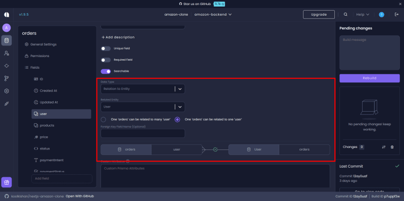

поле `продукты`

В этом поле будут храниться все товары, связанные с заказом.

Мы назовем это поле `products`.

Тип данных этого поля будет `Relation to Entity`.

В раскрывающемся списке связанных сущностей выберите `products`.

А для отношения выберите опцию `Один "заказ" может быть связан со многими "продуктами"`.

Это означает, что один товар может иметь несколько отзывов.

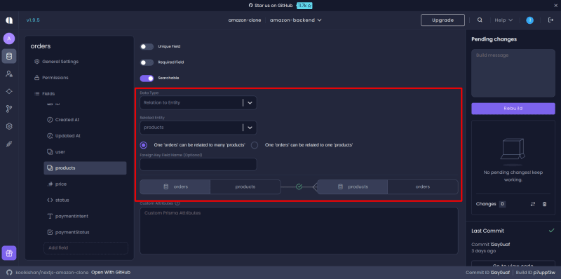

поле `цена`

В этом поле будет храниться общая сумма всех товаров в заказе.

Тип данных для поля `price` будет `Decimal Number`.

поле `статус`

В этом поле хранится статус заказа.

Тип данных для этого поля будет `Json`.

поле `paymentIntent`

В этом поле хранятся данные о платежах через платежный шлюз.

Тип данных для этого поля будет `Однострочный текст`.

Поле `paymentStatus`

Это поле позволяет узнать статус платежа.

Тип данных для этого поля будет `Boolean`.

Это все для сущности ”Заказы".

Теперь мы создали все необходимые сущности и можем собирать наше приложение и отправлять код на github.

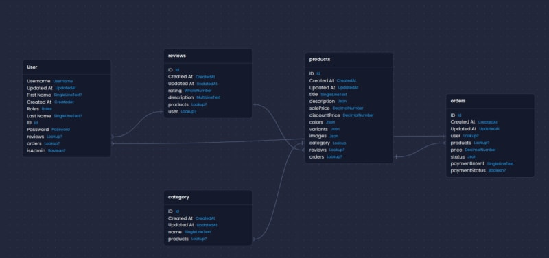

## Сборка и публикация кода на Github

Вы можете видеть, что в правой боковой панели у нас есть несколько ожидающих изменений. Нам нужно опубликовать эти изменения на github, чтобы интегрировать их в наше приложение.

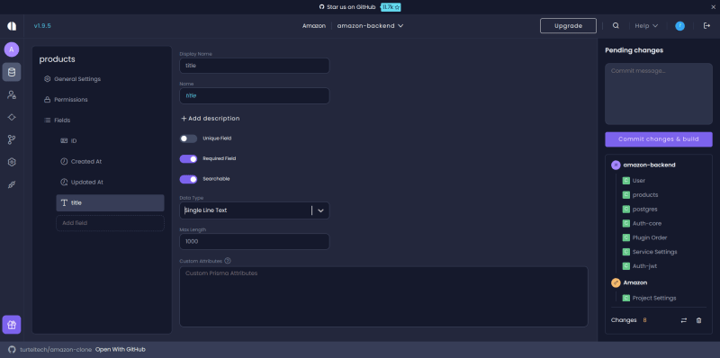

Нажмите на кнопку `Commit Changes & build`.

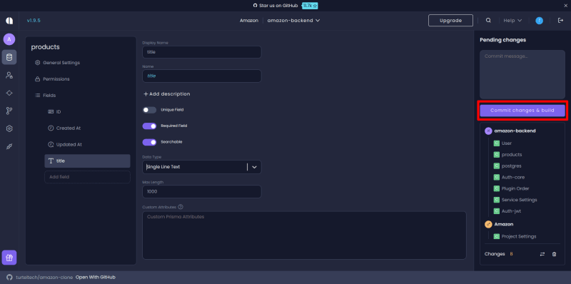

После этого Amplication начнет сборку вашего кода.

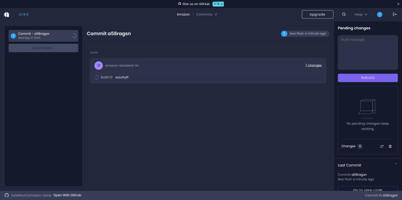

Как только сборка будет завершена успешно, код будет выложен на Github.

Теперь перейдите в свой репозиторий github.

Теперь нажмите на Pull requests

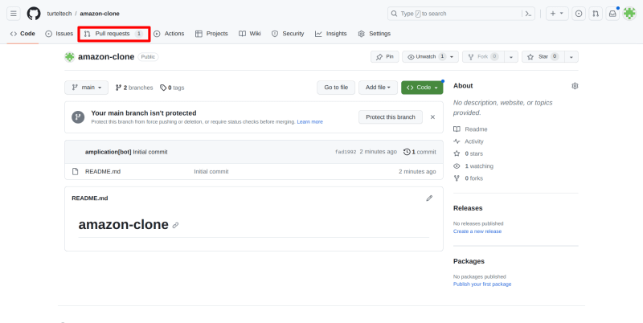

Щелкните на ожидающем запросе, который генерируется ботом Amplication.

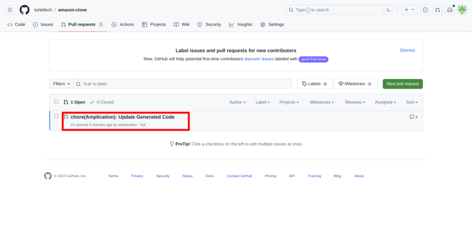

Теперь вы увидите страницу запроса. Вы можете либо проверить код, либо объединить запрос, чтобы слить его с основным исходным кодом.

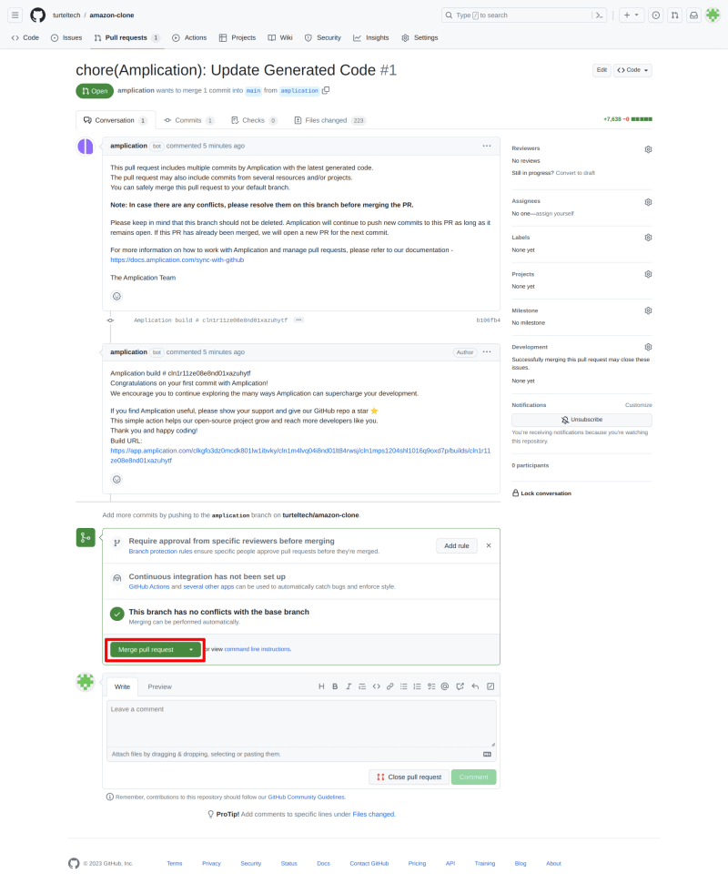

Теперь мы успешно сгенерировали код бэкенда с помощью Amplication.

## Настройка локального приложения

Теперь нам нужно настроить приложение на локальной машине.

Для этого клонируйте репозиторий или извлеките исходный код из git.

Теперь, чтобы настроить приложение, нам нужно установить зависимости.

Давайте создадим файл `package.json` в корне вашего приложения и вставим в него следующий код.

```json
{
  "name": "amazon-clone",
  "version": "1.0.0",
  "description": "",
  "main": "index.js",
  "scripts": {
    "start:admin": "npm --prefix admin-ui start",
    "start:backend": "npm --prefix server start",
    "postinstall": "npm i --prefix admin-ui && npm i --prefix server"
  },
  "devDependencies": {
    "cross-env": "^7.0.3",
    "npm-run-all": "^4.1.5"
  },
  "repository": {
    "type": "git",
    "url": "git+https://github.com/koolkishan/nextjs-amazon-clone.git"
  },
  "author": "",
  "license": "ISC",
  "bugs": {
    "url": "https://github.com/koolkishan/nextjs-amazon-clone/issues"
  },
  "homepage": "https://github.com/koolkishan/n".extjs-amazon-clone#readme",
  "dependencies": {
    "qs": "^6.11.2"
  }
}
```

Теперь вам нужно запустить `npm install`.

Это приведет к установке корневых зависимостей.

После этого нужно запустить скрипт `npm run postinstall` для установки фронтенда, бэкенда и зависимостей admin-ui.

После завершения процесса ваше приложение будет успешно настроено с кодом бэкенда, сгенерированным с помощью Amplication.

Теперь для запуска приложения вы можете запустить `npm run start`.

## REST API Amplication с помощью Swagger

Если вы хотите проверить API, созданные Amplication, перейдите по ссылке `http://localhost:3000/api`.

Откроется пользовательский интерфейс Swagger со всеми API. Вы можете протестировать API здесь.

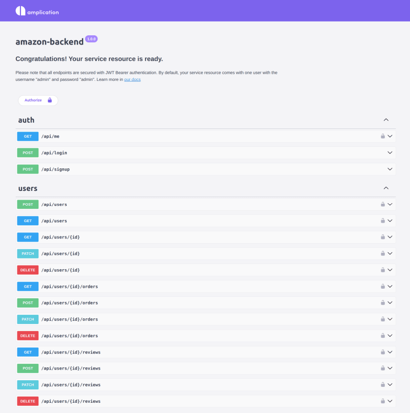

Дискорд-сервер Amplication

Если вы застряли в процессе или у вас возникли какие-либо вопросы по поводу Amplication или просто хотите поучаствовать в их ежемесячных розыгрышах, присоединяйтесь к их дискорд-серверу.

🟣 Присоединяйтесь к Amplication Discord 🟣

## Заключение

В этом блоге вы найдете исчерпывающее руководство по созданию Full Stack Amazon Clone с помощью Amplication, мощного инструмента разработки бэкенда с открытым исходным кодом. Клон Amazon обладает целым рядом функциональных возможностей и технологий, включая Next.js, Tailwind CSS, Zustand для управления состояниями, TypeScript для безопасности типов, аутентификацию на основе токенов JWT, Axios для вызовов API, Recharts для графиков, Next UI для готовых компонентов и React Pro Sidebar для боковой панели. Также в состав входят панель администратора и пагинация таблиц.

Был отмечен потенциал Amplication в оптимизации усилий по разработке программного обеспечения. Она предлагает среду разработки бэкенда с низким уровнем кодирования, которая позволяет разработчикам создавать приложения путем настройки и подключения готовых строительных блоков, экономя время и ресурсы.

В пошаговом руководстве рассказывается о настройке репозитория GitHub, подключении Amplication к GitHub, создании сервиса, выборе базы данных и определении сущностей для клона Amazon. Объясняется, как настроить различные поля для таких сущностей, как пользователи, товары, категории, отзывы и заказы.

В блоге также описывается процесс создания и публикации кода на GitHub и настройка локального приложения для разработки. Он предоставляет файл package.json для управления зависимостями и предлагает инструкции по запуску приложения.

Наконец, в блоге говорится о том, как можно изучить и протестировать REST API, созданные Amplication, с помощью Swagger UI.

В целом, это исчерпывающее руководство позволяет разработчикам эффективно создавать многофункциональный клон Amazon с помощью Amplication, демонстрируя возможности инструмента по упрощению разработки бэкенда для веб-приложений.


