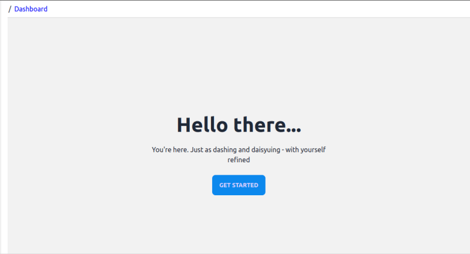

В этом посте мы рассмотрим процесс разработки админ-панели React с использованием refine и daisyUI.

refine - это фреймворк на основе React, который помогает быстро создавать приложения с большим объемом данных, такие как информационные панели, панели администратора и витрины магазинов. Он поставляется с безголовым пакетом ядра, который интегрируется с любым фреймворком пользовательского интерфейса и системой дизайна.

daisyUI - это библиотека шаблонов компонентов, построенная поверх TailwindCSS. Она предоставляет нам короткие семантические классы, созданные на основе утилит TailwindCSS, и растущую коллекцию удобных шаблонов компонентов, которые помогают быстро создавать компоненты React для нашего приложения.

daisyUI можно легко интегрировать с refine, и в этом посте мы рассмотрим, как это сделать, создавая приборную панель и панель администратора с помощью API Fine Foods от refine.

Полный исходный код этого обучающего приложения вы можете получить отсюда => <https://github.com/refinedev/refine/tree/master/examples/blog-refine-daisyui>.

## Обзор

Панель администратора на React, которую мы собираемся построить, использует refine hosted Fine Foods API для отображения приборной панели с данными KPI, а также CRUD-страниц для ресурсов `products` и `categories`. Приборная панель будет представлять различные данные в виде карточек, графиков и таблиц. А ресурсы `products` и `categories` будут иметь страницы `list`, `create`, `show` и `edit`.

Мы начинаем этот пост с краткого обсуждения архитектуры refine - в частности, как она работает под капотом с контекстами React, поддерживаемыми провайдерами, хуками и компонентами. Мы также поговорим о daisyUI, коротких семантических классах, таких как `btn`, `menu`, `tab` и т. д., и их вариантах, и о том, как они способствуют быстрому созданию компонентов React с помощью растущей библиотеки шаблонов daisyUI.

Затем мы инициализируем приложение refine, интегрируем и настраиваем daisyUI. После этого мы переходим к созданию функций панели администратора.

Сначала мы создаем страницу приборной панели, на которой в виде карточек, графиков и таблиц представлена статистика по соответствующим KPI. Для отображения данных мы используем библиотеку Recharts, основанную на React.

Во второй половине поста мы добавляем CRUD-страницы для ресурсов `products` и `categories`. Мы определяем реквизит `resources` на компоненте `<Refine />`, пути действия ресурсов и определения маршрутов. CRUD-действия для обоих ресурсов включают в себя `list`, `create`, `show`, `update` и `delete`. Затем мы используем уточняющие хуки, такие как `useTable()` и `useForm()` для ввода, получения и представления данных из API. Мы создаем пользовательский интерфейс с помощью предопределенных шаблонов daisyUI для кнопок, меню, вкладок, статистики и т. д.

В конце мы посмотрим, как настроить макет приложения refine. Мы заменяем стандартную левостороннюю навигацию на верхнюю, используя хуки `useMenu()`, `useNavigation()` и `useBreadcrumb()`.

## Что такое refine?

refine - это мощный фреймворк React для создания корпоративных веб-приложений. Он особенно ориентирован на создание приложений с большим объемом данных, таких как приборные панели, панели администратора и внутренние инструменты. Он поставляется с основным пакетом headless, который предоставляет различные наборы хуков и компонентов для решения таких задач, как получение данных, аутентификация, авторизация и т. д. Также есть дополнительные пакеты, которые позволяют быстро разрабатывать React-приложения за счет интеграции с различными бэкэнд-сервисами, такими как Airtable, Supabase и Strapi, а также с такими фреймворками пользовательского интерфейса, как Ant Design, Material UI, Chakra UI и Mantine.

### Архитектура

refine разделяет задачи приложения, такие как получение данных, аутентификация, контроль доступа и т. д., на слои контекстов React, каждый из которых поддерживается объектом-провайдером, набором соответствующих хуков, а также соответствующими компонентами. Например, слой данных представляет собой контекст, зависящий от объекта `dataProvider` с набором методов для обработки CRUD-действий. Доступ к слою данных осуществляется с помощью набора крючков данных, которые помогают вызывать методы CRUD из компонентов пользовательского интерфейса.

Это означает, что все методы CRUD, такие как `getList()`, `create()`, `show()`, `update()` и `delete()`, находятся внутри объекта `dataProvider`, и мы можем получить к ним доступ из UI-компонента с помощью крючков данных `useList()`, `useCreate()` и т. д. Хуки данных, в свою очередь, используют React Query для получения данных, управления состоянием кэширования и обработки ошибок.

Уточненные хуки данных, упомянутые выше, по сути, являются базовыми хуками. Существуют хуки более высокого уровня, которые строятся поверх этих хуков, например, хук `useTable()`, предоставляемый пакетом поддержки `@refinedev/react-table`, который интегрирует React Table в ядро refine. Хуки более высокого уровня добавляют дополнительные возможности, повышающие эффективность разработки. Например, хук `useList()` используется хуком `useTable()`, который помогает представить данные в таблице, используя все возможности React Table. Аналогично, хук `useCreate()` для основных данных используется в высокоуровневом хуке `useForm()`, предоставляемом пакетом `@refinedev/react-hook-form`, который дополняет CRUD-действия, связанные с формой, с помощью React Hook Form.

### Определения ресурсов

Определения ресурсов refine задаются внутри объекта `resources`. Объект `resources` передаетсяo свойство `resources` компонента `<Refine />`. Определения ресурсов, в сочетании с определениями маршрутов, задают пункты навигационного меню приложения refine, их навигационные URL, а также хлебные крошки, и помогают определить имя ресурса по умолчанию для CRUD-страницы на маршруте.

### Маршрутизация

Маршрутизация в refine поддерживается пакетом `react-router-dom`. refine`v4` поддерживает явную маршрутизацию, делегируя все, что связано с маршрутизацией, API React Router.

### Inferencer

Inferencer в refine - это мощный инструмент для быстрого создания CRUD-страниц и автоматической генерации кода для страницы ресурса. Inferencer работает, сначала опрашивая определенную конечную точку API, чтобы получить форму данных, а затем размещая все крючки и элементы пользовательского интерфейса, необходимые для получения и представления данных на странице.

### Интеграция с UI Framework

Основной пакет refine разработан как ”безголовый”, что дает возможность интегрировать его с любой библиотекой компонентов пользовательского интерфейса или фреймворком.

## Что такое daisyUI?


daisyUI - это библиотека пользовательского интерфейса с открытым исходным кодом, построенная поверх TailwindCSS. Она предоставляет короткие, ориентированные на компоненты, семантические классы, составленные из обычных, более длинных строк классов Tailwind, которые обычно приводят к неуклюжей разметке в приложении. daisyUI содержит растущую коллекцию предварительно стилизованных шаблонов для таких компонентов, как кнопки, меню и вкладки, с возможностью реагирования, изменения размера, формы и цвета.

Составлять классы с отзывчивостью, цветом, размером и формой вручную с помощью директивы `@apply` практически неэффективно при использовании обычных классов TailwindCSS. daisyUI делает это из коробки. Кроме того, эти стили компонентов можно переопределить или расширить с помощью обычных утилит TailwindCSS. В результате daisyUI предлагает удобство использования меньших имен классов, меньший размер CSS-файла, настраиваемое количество вариантов и большую степень кастомизации без существенного снижения качества кода.

Не стесняйтесь ознакомиться с документацией по daisyUI, чтобы узнать больше.

## Инициализация приложения refine App

Для этого приложения мы начнем с безголового ядра refine, используя `create refine-app` для создания лесов наших страниц и генерации начального кода страницы. Затем мы внесем необходимые изменения в логику и пользовательский интерфейс, а затем применим классы daisyUI к нашим компонентам.

Итак, давайте сначала приступим к инициализации приложения refine.

Мы создадим локальный репозиторий с помощью скаффолдера `create refine-app` на основе CLI. Запустите следующую команду `npm` из выбранной вами директории, чтобы интерактивно инициализировать проект.

`npm create refine-app@latest refine-daisyui`

При появлении запроса выберите следующие опции:

`✔ Выберите шаблон проекта - refine-react ✔ Как бы вы хотели назвать свой проект? - refine-daisyui ✔ Выберите бэкэнд-сервис для подключения: - REST API ✔ Хотите ли вы использовать UI Framework? - Headless ✔ Хотите ли вы добавить примеры страниц? - нет ✔ Нужна ли вам поддержка i18n (интернационализации)? - Нет ✔ Выберите менеджер пакетов: - npm ✔ Не могли бы вы прислать нам свои варианты, чтобы мы могли улучшить создание refine-app? - yes`

Обратите внимание на выбор `Headless`. Мы просим прислать основной пакет refine с простой JSX-разметкой.

После завершения инициализации приложения перейдем в папку проекта и запустим наше приложение:

`npm run dev`.

Нас должна встретить страница приветствия приложения.

## Chores

Заменим Fake REST API на Fine Foods URL в реквизите `dataProvider`. Обновите файл `App.tsx` до следующего вида:

```js
// "src/App.tsx"
import { ErrorComponent, GitHubBanner, Refine } from '@refinedev/core';
import { RefineKbar, RefineKbarProvider } from '@refinedev/kbar';
import routerBindings, {
	DocumentTitleHandler,
	NavigateToResource,
	UnsavedChangesNotifier,
} from '@refinedev/react-router-v6';
import dataProvider from '@refinedev/simple-rest';
import { BrowserRouter, Outlet, Route, Routes } from 'react-router-dom';
import './App.css';
import { Layout } from './components/layout';
function App() {
	return (
		<BrowserRouter>
			{' '}
			<GitHubBanner /> <RefineKbarProvider>
				{' '}
				<Refine
					//highlight-next-line
					dataProvider={dataProvider('https://api.finefoods.refine.dev')}
					routerProvider={routerBindings}
					options={{
						syncWithLocation: true,
						warnWhenUnsavedChanges: true,
						projectId: '4kWrnz-AJZzOW-qq7MXL',
					}}
				>
					{' '}
					<Routes>
						{' '}
						{/*highlight-start*/} <Route
							element={
								<Layout>
									{' '}
									<Outlet />{' '}
								</Layout>
							}
						>
							{' '}
							<Route path="*" element={<ErrorComponent />} />{' '}
						</Route> {/*highlight-end*/}{' '}
					</Routes> <RefineKbar /> <UnsavedChangesNotifier /> <DocumentTitleHandler />{' '}
				</Refine>{' '}
			</RefineKbarProvider>{' '}
		</BrowserRouter>
	);
}
export default App;
```

С этими изменениями мы начнем сначала создавать страницу приборной панели, а затем перейдем к CRUD-страницам для ресурсов `products` и `categories`. На данный момент у нас нет ни ресурсов, ни их страниц.

Обратите внимание, что теперь мы используем REST API Fine Foods в параметре `dataProvider` в `<Refine />`.

API Fine Foods - это пример REST API, размещенного в refine, с набором конечных точек. В этом приложении мы будем мы будем обращаться к конечным точкам `/dailyRevenue`, `/dailyOrders`, `/newCustomers` и `/orders` для получения данных для нашей страницы приборной панели. Позже мы также будем обращаться к конечным точкам `/products` и `/catgories` для страниц наших ресурсов.

## Установка daisyUI

В качестве библиотеки пользовательского интерфейса мы используем daisyUI. Чтобы интегрировать daisyUI в наше приложение refine, мы должны сначала выполнить установку TailwindCSS, его зависимостей и настроить их конфигурацию в Vite.

Выполните следующие шаги, чтобы сначала добавить пакеты TailwindCSS, PostCSS и Autoprefixer, а затем инициализировать `tailwind.config.js`:

### Установка TailwindCSS и сопутствующих пакетов

Выполните следующие команды:

`npm install -D tailwindcss postcss autoprefixer npx tailwindcss init -p`.

Внутри файла `tailwind.config.js` добавьте пути к файлам для сканирования и применения классов TailwindCSS:

```js
// tailwind.config.js
/** @type {import('tailwindcss').Config} */
export default { //highlight-next-line content:
["./index.html", "./src/**/*.{js,ts,jsx,tsx}"], theme: { extend: {}, }, plugins: [], };
```

Измените `App.css`, чтобы добавить директивы TailwindCSS. Важно, чтобы они были добавлены сверху, перед декларациями стилей Tailwind. Скопируйте приведенный ниже CSS:

```css
* {
	margin: 0;
	padding: 0;
	box-sizing: border-box;
}
body {
	margin: 0px;
} /* Слои TailwindCSS располагаются сверху */
@tailwind base;
@tailwind components;
@tailwind utilities;
.layout {
	display: flex;
	gap: 16px;
}
@media screen and (max-width: 751px) {
	.layout {
		display: block;
	}
}
.layout .content {
	display: flex;
	flex-direction: column;
	flex-grow: 1;
}
.breadcrumb {
	display: flex;
	gap: 24px;
	list-style-type: 'https://dev.to/';
	padding: 8px 16px;
	border-bottom: 1px solid lightgray;
}
.breadcrumb a {
	color: blue;
	text-decoration: none;
}
.menu {
	flex-shrink: 0;
	padding: 8px 16px;
	border-right: 1px solid lightgray;
}
.menu a {
	цвет: черный;
}
.menu .active {
	font-weight: bold;
}
@media screen and (max-width: 751px) {
	.menu {
		border-right: none;
		border-bottom: 1px solid lightgray;
	}
}
.menu ul {
	padding-left: 16px;
}
.page-container {
	@apply mx-auto my-2 rounded border bg-slate-50 px-4 py-2 drop-shadow-md;
}
.page-title {
	@apply font-bold text-xl;
}
.page-header {
	@apply mb-6 flex items-center justify-between py-4;
}
```

Мы будем использовать пользовательские классы в этом `App.css`, так что смело копируйте его.

Если вам нужна помощь в установке TailwindCSS, пожалуйста, следуйте этому руководству по установке TailwindCSS с помощью Vite

## Установка и настройка daisyUI

После того как TailwindCSS установлен должным образом, настала очередь установить и настроить daisyUI.

Установите daisyUI с помощью следующей команды:

`npm install -D daisyui@latest`.

Затем добавьте daisyUI как плагин в `tailwind.config.js`. Расширьте тему daisyUI `light` и обновите `основной` цвет:

```js
// tailwind.config.js
/** @type {import('tailwindcss').Config} */
export default {
	content: ['./index.html', './src/**/*.{js,ts,jsx,tsx}'],
	daisyui: {
		themes: [
			{
				light: {
					...require('daisyui/src/theming/themes')['[data-theme=light]'],
					основной: '#0d89ec',
				},
			},
		],
	},
	тема: { extend: {} },
	плагины: [require('daisyui')],
};
```

Более подробную информацию о настройке темы daisyUI можно найти в документации здесь

После этих изменений, при запущенном сервере, TailwindCSS следит за использованием классов daisyUI и TailwindCSS и автоматически компилирует обновленные стили.

### Другие пакеты

Мы должны установить пакеты поддержки React Table и React Hook Form от refine. Мы используем Tailwind Heroicons для наших иконок, библиотеку Day.js для расчета времени и библиотеку Recharts для построения графиков для данных KPI. Итак, выполните следующие действия, и все готово:

`npm install @refinedev/react-table @refinedev/react-hook-form @heroicons/react dayjs recharts`.

## Интерфейсы

Мы будем использовать следующие интерфейсы во всем приложении. Поэтому смело копируйте и вставляйте их в `src/interfaces/index.ts` или в другое подобное место.

```js
// src/interfaces/index.ts
export interface IOrder { id: number; user: IUser; createdAt: string; status: IOrderStatus; adress: IAddress; amount: number; } export interface IUser { id: number; fullName: string; gender: string; gsm: string; createdAt: string; addresses: IAddress[]; } export interface IOrderStatus { id: number; text: "Pending" | "Ready" | "On The Way" | "Delivered" | "Cancelled"; } export interface IAddress { text: string; coordinate: [string, string]; } export interface IChartDatum { date: string; value: string; } export interface IChart { data: IChartDatum[]; total: number; trend: number; } export interface IProduct { id: number; name: string; isActive: boolean; description: string; createdAt: string; price: number; category: ICategory; stock: number; } export interface ICategory { id: number; title: string; isActive: boolean; } export type TTab = { id: number; label: string; content: JSX.Element; };
```

## Создание панели инструментов

Теперь, когда у нас готовы все настройки и пакеты, пора приступить к созданию страницы приборной панели. Страница приборной панели будет отображаться на индексном маршруте и содержат статистику KPI, графики и таблицу данных.

### Компонент `<Dashboard />`

Мы добавим директорию `/dashboard` в `src/pages` и добавим компонент `<Dashboard />` в файл `index.tsx` под ним.

Изначально он будет возвращать фиктивный компонент героя. Мы обновим его в следующих разделах.

```js
// src/pages/dashboard/index.tsx
import React from "react"; export const Dashboard: React.FC = () => { return ( <div className="hero min-h-screen bg-base-200"> <div className="hero-content text-center"> <div className="max-w-md"> <h1 className="text-5xl font-bold">Здравствуйте...</h1> <p className="py-6"> Вы здесь. Дэва такая же лихая и маргаритка - как и вы сами, изысканная  <button className="btn btn-primary">Пристегнитесь</button> </div> </div> </div> ); };
```

Мы отобразим страницу приборной панели по пути `/dashboard` и сделаем ее индексным маршрутом. Итак, давайте добавим необходимые ресурсы и маршруты в компонент `<Refine />` в файле `App.tsx`.

Обновите `App.tsx`, как показано ниже:

```js
// src/App.tsx
import { ErrorComponent, GitHubBanner, Refine } from '@refinedev/core';
import { RefineKbar, RefineKbarProvider } from '@refinedev/kbar';
import routerBindings, {
	DocumentTitleHandler,
	NavigateToResource,
	UnsavedChangesNotifier,
} from '@refinedev/react-router-v6';
import dataProvider from '@refinedev/simple-rest';
//highlight-next-line
import { BrowserRouter, Navigate, Outlet, Route, Routes } from 'react-router-dom';
import './App.css';
import { Layout } from './components/layout';
//highlight-next-line
import { Dashboard } from './pages/dashboard';
function App() {
	return (
		<BrowserRouter>
			{' '}
			<GitHubBanner /> <RefineKbarProvider>
				{' '}
				<Refine
					dataProvider={dataProvider('https://api.finefoods.refine.dev')}
					routerProvider={routerBindings}
					//highlight-start
					resources={[{ name: 'dashboard', list: '/dashboard' }]}
					//highlight-end
					options={{
						syncWithLocation: true,
						warnWhenUnsavedChanges: true,
						projectId: '4kWrnz-AJZzOW-qq7MXL',
					}}
				>
					{' '}
					<Routes>
						{' '}
						<Route
							element={
								<Layout>
									{' '}
									<Outlet />{' '}
								</Layout>
							}
						>
							{' '}
							{/*highlight-start*/} <Route index element={<Navigate to="/dashboard" />} /> <Route path="/dashboard">
								{' '}
								<Route index element={<Dashboard />} />{' '}
							</Route> {/*highlight-end*/} <Route path="*" element={<ErrorComponent />} />{' '}
						</Route>{' '}
					</Routes> <RefineKbar /> <UnsavedChangesNotifier /> <DocumentTitleHandler />{' '}
				</Refine>{' '}
			</RefineKbarProvider>{' '}
		</BrowserRouter>
	);
}
export default App;
```

Мы обновили наш импорт и передали свойство `resources` в `<Refine />`. Мы определили ресурс `dashboard` с одной страницей: `list`. В определениях маршрутов, в качестве дочерних элементов `<Routes />`, мы назначили страницу `<Dashboard />` маршруту `/dashboard` и установили ее в качестве индексного маршрута.

Благодаря этим дополнениям и изменениям, при переходе по адресу `/` или `/dashboard` мы должны увидеть страницу приборной панели. Выглядит это примерно так:



### Компонент `<Stats />`

Теперь давайте сосредоточимся на реализации функций приборной панели. Внутри нее у нас будет компонент `<Stats />`, который принимает данные о KPI и возвращает компонент `<KpiCard />` для каждого из них. Мы создадим компонент `<Stats />` внутри `src/components/dashboard`. И используем следующий код:

``// src/components/dashboard/Stats.tsx import React from "react"; import { KpiCard } from "./KpiCard"; import { IChartDatum } from "../.../interfaces"; import { CurrencyDollarIcon, ShoppingCartIcon, UserGroupIcon, } from "@heroicons/react/24/outline"; import { GetListResponse } from "@refinedev/core"; type TStats = { dailyRevenue?: GetListResponse<IChartDatum>; dailyOrders? GetListResponse<IChartDatum>; newCustomers? GetListResponse<IChartDatum>; }; const Stats = ({ dailyRevenue, dailyOrders, newCustomers }: TStats) => { return ( <div className="w-full mx-auto mb-4 flex flex-col justify-center items-stretch md:flex-row md:justify-between drop-shadow-md"> <div className="w-full mx-auto md:flex-1 md:mr-2"> <KpiCard title="Еженедельная выручка" data={dailyRevenue} formatTotal={(value: number | string) => `$ ${value}`} icon={<CurrencyDollarIcon className="h-32 w-32" />} colors={{ stroke: "rgb(54, 162, 235)", fill: "rgba(54, 162, 235, 0.2)", }} /> </div> <div className="w-full mx-auto md:flex-1"> <KpiCard title="Еженедельные заказы" data={dailyOrders} icon={<ShoppingCartIcon className="h-32 w-32" />} colors={{ stroke: "rgb(255, 159, 64)", fill: "rgba(255, 159, 64, 0.2)", }} /> </div> <div className="w-full mx-auto md:flex-1 md:ml-2"> <KpiCard title="Новые клиенты" data={newCustomers} icon={<UserGroupIcon className="h-32 w-32" />} colors={{ stroke: "rgb(76, 175, 80)", fill: "rgba(76, 175, 80, 0.2)", }} /> </div> </div> ); }; export default Stats;``

Компонент `<Stats />` передает и отображает данные KPI внутри компонента `<KpiCard />`, так что давайте поработаем над этим.

### Компонент `<KpiCard />`

Создадим компонент `<KpiCard />` в директории `src/components/dashboard`. Компонент `<KpiCard />` представляет собой отдельный элемент статистики. Он принимает в себя рядf реквизит и отображает данные KPI с помощью иконки. Выглядит это следующим образом:

```js
// src/components/dashboard/KpiCard.tsx
import React from "react"; type TKpiCardProps = { title: string; data: any; icon: JSX.Element; colors: { stroke: string; fill: string; }; formatTotal?: (value: number | string) => typeof value; }; export const KpiCard = ({ title, data, icon, colors, formatTotal = (value) => value, }: TKpiCardProps) => { const total = data?.data?.total; const trend = data?.data?.trend; const calc = Math.round((trend / total) * 100); const percent = total > trend ? `+ ${calc}%` : `- ${calc}%`; const textColor = total > trend ? "seagreen" : "crimson"; return ( <div className="stat my-2 py-4 flex-1 bg-zinc-50 border-l-4 rounded" style={ borderColor: colors?.stroke }} > <div className="stat-figure text-secondary" style={{ color: colors?.fill }} > {icon} </div> <div className="stat-title text-l">{title}</div> <div className="stat-value" style={ color: colors?.stroke }}> {formatTotal(total ?? "...")} </div> <div className="stat-desc my-2"> <span className="mx-1 text-l font-bold" style={{ color: textColor }} > {процент} </span> с прошлой недели </div> </div> ); };
```

Обратите внимание, что мы начали использовать классы daisyUI в компоненте `<KpiCard />`. `stat`, `stat-figure`, `stat-title`, `stat-value`, `stat-desc` - классы, предоставляемые шаблоном daisyUI `Stats`.

Когда компоненты `<Stats />` и `<KpiCard />` завершены, мы готовы обновить компонент `<Dashboard />`. Внутри него мы запросим несколько конечных точек Fine Foods, чтобы собрать данные о выручке, заказах и клиентах, а затем преобразуем их. Преобразованные данные мы будем передавать дочерним компонентам по очереди, по мере их создания.

На данный момент мы импортируем и отобразим компонент `<Stats />` и передадим ему три набора данных KPI, чтобы отобразить карточки KPI в верхней части страницы приборной панели.

Замените код внутри компонента `<Dashboard />` следующим образом:

```js
// src/pages/dashboard/index.tsx
import React, { useMemo } from "react"; import { CrudFilter, useList } from "@refinedev/core"; import dayjs from "dayjs"; import Stats from "../../components/dashboard/Stats"; import { IChartDatum, TTab } from "../../interfaces"; const filters: CrudFilter[] = [ { поле: "start", operator: "eq", значение: dayjs()?.subtract(7, "days")?.startOf("day"), }, { поле: "end", оператор: "eq", value: dayjs().startOf("day"), }, ]; export const Dashboard: React.FC = () => { const { data: dailyRevenue } = useList<IChartDatum>({ resource: "dailyRevenue", filters, }); const { data: dailyOrders } = useList<IChartDatum>({ resource: "dailyOrders", filters, }); const { data: newCustomers } = useList<IChartDatum>({ resource: "newCustomers", filters, }); return ( <> <Stats dailyRevenue={dailyRevenue} dailyOrders={dailyOrders} newCustomers={newCustomers} /> </> ); };
```

Обратите внимание, что мы получаем данные из трех конечных точек API Fine Foods: `/dailyRevenue`, `/dailyOrders` и `/newCustomers`. Мы получаем их с помощью хука ядра `useList()` refine. Мы запрашиваем их как ресурсы, хотя в нашем приложении для админ-панели refine они таковыми не являются. Объект `filters` используется для получения данных за последние 7 дней.

Более подробную информацию вы можете найти в документации refine `useList()` здесь.

С этими изменениями на странице нашей панели управления в верхней части отображаются три карточки KPI:


## Компоненты вкладок

Теперь мы хотим отобразить три графика на панели вкладок под карточками KPI. Поэтому мы создадим компоненты `<TabItem />`, `<TabPanel />` и `<TabView />` в директории `src/components/dashboard`. Мы также создадим два компонента диаграмм, `<ResponsiveAreaChart />` и `<ResponsiveBarChart />` для отображения данных KPI. Когда все компоненты будут готовы, мы добавим компонент `<TabView />` в `<Dashboard />`.

Компонент `<TabView />` будет содержать два других компонента вкладок, поэтому, чтобы избежать ошибок линтера и браузера, мы начнем с дочерних компонентов.

### Компонент `<TabItem />`

Нам нужна кнопка `<TabItem />` для доступа к панели вкладок. Поэтому создайте компонент `<TabItem />`, как показано ниже:

```js
// src/components/TabItem/tsx
import React from "react"; type TTabItem = { label: string; isActive: Boolean; clickHandler: () => void; }; export const TabItem = ({ label, isActive, clickHandler }: TTabItem) => { return ( <a className={`text-l font-bold tab tab-bordered${ isActive ? "tab-active" : ""}`} onClick={clickHandler} > {label} </a> ); };
```

### `<TabPanel />` Компонент

Компонент `<TabPanel />` будет содержать график, доступ к которому можно получить, нажав на `<TabItem />`. Давайте создадим компонент `<TabPanel />` с помощью следующего кода:

```js
import React from "react";

type TTabPanelProps = {
  isActive: Boolean;
  children: JSX.Element;
};

export const TabPanel = ({ isActive, children }: TTabPanelProps) => {
  return isActive ? (
    <div className="mx-auto py-6">{children}</div>
  ) : null;
};
```

### `<TabView />` Компонент

Компонент `<TabView />` будет содержать логику и состояние представления вкладок. It будет принимать объект `tabs` и отображать `<TabItem />` и `<TabPanel >` в качестве дочерних элементов для каждого элемента в объекте `tabs`. Давайте создадим компонент `<TabView />` с помощью приведенного ниже кода:

```js
// src/components/dashboard/TabView.tsx
import React, { useState } from "react";
import { TabItem } from "./TabItem";
import { TabPanel } from "./TabPanel";
import { TTab } from "../../interfaces";

type TTabViewProps = {
  tabs: TTab[];
};

export const TabView = ({ tabs }: TTabViewProps) => {
  const [activeTab, setActiveTab] = useState(0);

  console.log("activeTab:", activeTab);
  console.log("tabs:", tabs);

  return (
    <div className="mx-auto py-4 bg-slate-50 border rounded-lg drop-shadow-md">
      <div className="tabs">
        {tabs?.map((tab: TTab, index: number) => (
          <TabItem
            key={tab?.id}
            label={tab?.label}
            isActive={index === activeTab}
            clickHandler={() => {
              console.log("Tab clicked:", tab);
              setActiveTab(index);
            }}
          />
        ))}
      </div>
      <div className="mx-auto">
        {tabs?.map((tab: TTab, index: number) => (
          <TabPanel key={tab?.id} isActive={index === activeTab}>
            {tab?.content}
          </TabPanel>
        ))}
      </div>
    </div>
  );
};
```

## Графики Recharts

Когда компоненты вкладок готовы, нам нужно создать три графика, которые будут отображаться внутри `<TabView />` путем отображения через объект `tabs`. Мы хотим реализовать их с помощью Recharts. Один `<ResponsiveAreaChart />` и один `<ResponsiveBarChart />`.

Для построения данных `<ResponsiveAreaChart />` будет использовать API `<AreaChart />` библиотеки Recharts, а `<ResponsiveBarChart />` будет использовать API `<BarChart />`. Оба они будут использовать `<ResponsiveContainer />` для отзывчивости.

При необходимости вы можете найти все подробности в документах Rechats `<AreaChart />`, `<BarChart />` и `<ResponsiveContainer />`.

Мы построим графики в директории `src/components/dashboard.

### Диаграмма области

Создайте компонент `<ResponsiveAreaChart />` с помощью приведенного ниже кода:

```js
import React from "react";
import { ResponsiveContainer, AreaChart, CartesianGrid, XAxis, YAxis, Tooltip, Area } from "recharts";
import { ChartTooltip } from "../../components/dashboard/ChartTooltip";
import { IChartDatum } from "../../interfaces";

type TResponsiveAreaChartProps = {
  kpi: string;
  data: IChartDatum[];
  colors: {
    stroke: string;
    fill: string;
  };
};

export const ResponsiveAreaChart = ({ kpi, data, colors }: TResponsiveAreaChartProps) => {
  console.log("kpi:", kpi); // Logging kpi value
  console.log("data:", data); // Logging data array
  console.log("colors:", colors); // Logging colors object

  return (
    <ResponsiveContainer height={400}>
      <AreaChart
        data={data}
        height={400}
        margin={{ top: 10, right: 30, left: 0, bottom: 0 }}
      >
        <CartesianGrid strokeDasharray="0 0 0" />

        <XAxis
          dataKey="date"
          tickCount={data?.length ?? 0}
          tick={{ stroke: "light-grey", strokeWidth: 0.5, fontSize: "12px" }}
        />

        <YAxis
          tickCount={13}
          tick={{ stroke: "light-grey", strokeWidth: 0.5, fontSize: "12px" }}
          interval="preserveStartEnd"
          domain={[0, "dataMax + 10"]}
        />

        <Tooltip
          content={<ChartTooltip kpi={kpi} colors={colors} />}
          wrapperStyle={{
            backgroundColor: "rgba(0, 0, 0, 0, 0.7)",
            border: "0 solid #000",
            borderRadius: "10px"
          }}
        />

        <Area
          type="monotone"
          dataKey="value"
          stroke={colors?.stroke}
          strokeWidth={3}
          fill={colors?.fill}
          dot={{ stroke: colors?.stroke, strokeWidth: 3 }}
        />
      </AreaChart>
    </ResponsiveContainer>
  );
};
```

Внутри `<ResponsiveAreaChart />` мы получаем `data` вместе с другими реквизитами и передаем их в `<AreaChart />` с его реквизитом `data={data}`. Мы используем `<XAxis />`, `<YAxis />` для тиков и меток осей. Мы рисуем область и монотонную линию с помощью компонента `<Area />` и его реквизитов. `<CartesianGrid />` рисует сетку в фоновом режиме. Также у нас есть пользовательская подсказка, отображаемая внутри `<ToolTip />`.

### Гистограмма

Аналогичным образом создайте компонент `<ResponsiveBarChart />` с помощью приведенного ниже кода:

```js
// src/components/dashboard/ResponsiveBarChart.tsx

import React from "react";
import { ResponsiveContainer, BarChart, CartesianGrid, XAxis, YAxis, Tooltip, Bar } from "recharts";
import { ChartTooltip } from "../../components/dashboard/ChartTooltip";
import { IChartDatum } from "../../interfaces";

type TResponsiveBarChartProps = {
  kpi: string;
  data: IChartDatum[];
  colors: { stroke: string; fill: string; };
};

export const ResponsiveBarChart = ({ kpi, data, colors }: TResponsiveBarChartProps) => {
  console.log("kpi:", kpi); // Logging kpi variable
  console.log("data:", data); // Logging data variable
  console.log("colors:", colors); // Logging colors variable

  return (
    <ResponsiveContainer height={400}>
      <BarChart data={data} width={1200} height={400} margin={{ top: 10, right: 30, left: 0, bottom: 0 }}>
        <CartesianGrid strokeDasharray="0 0" />
        <XAxis
          dataKey="date"
          tickCount={data?.length ?? 0}
          tick={{
            stroke: "light-grey",
            strokeWidth: 0.5,
            fontSize: "12px",
          }}
        />
        <YAxis
          domain={[0, "dataMax"]}
          tickCount={13}
          tick={{
            stroke: "light-grey",
            strokeWidth: 0.5,
            fontSize: "12px",
          }}
        />
        <Tooltip
          content={<ChartTooltip colors={colors} kpi={kpi} />}
          wrapperStyle={{
            backgroundColor: "rgba(0, 0, 0, 0, 0.7)",
            border: "0 solid #000",
            borderRadius: "10px",
          }}
        />
        <Bar
          type="monotone"
          dataKey="value"
          stroke="rgb(255, 207, 159)"
          strokeWidth={1}
          fill="rgba(255, 207, 159, 0.7)"
        />
      </BarChart>
    </ResponsiveContainer>
  );
};
```

`<ResponsiveBarChart />` делает то же самое, что и `<ResponsiveAreaChart />`, за исключением того, что он рисует гистограмму с Recхарт компонента `<BarChart />`.

### Пользовательская всплывающая подсказка

На графиках выше используется пользовательская всплывающая подсказка, компонент `<ChartTooltip />`, чтобы показать детали точки данных в зависимости от положения мыши.

Давайте создадим компонент `<ChartTooltip />` с помощью следующего кода:

```js
// src/components/dashboard/ChartTooltip.tsx
import React from "react";

export const ChartTooltip = ({ active, payload, label, coordinate, colors, kpi }: any) => {
  if (active && payload && payload.length) {
    const dataPoint = payload[0].payload;
    const tooltipStyle = {
      left: coordinate.x, // Adjust positioning
      top: coordinate.y, // Adjust positioning
    };

    console.log("Active:", active);
    console.log("Payload:", payload);
    console.log("Label:", label);
    console.log("Coordinate:", coordinate);
    console.log("Colors:", colors);
    console.log("KPI:", kpi);
    console.log("Data Point:", dataPoint);

    return (
      <div className="p-1 flex flex-col justify-center items-start border border-black rounded-lg text-zinc-50" style={tooltipStyle}>
        <div
          style={{
            position: "absolute",
            width: "0",
            height: "0",
            borderTop: "10px solid transparent",
            borderBottom: "10px solid transparent",
            borderRight: "10px solid rgba(0, 0, 0, 0, 0.7)",
            left: "-10px",
          }}
        />
        <p className="flex text-xs font-semibold">{label}
        <p className="text-xs">
          <span
            className="mr-1"
            style={{
              width: "0.5px",
              height: "0.5px",
              border: `1px solid ${colors?.stroke}`,
              backgroundColor: colors?.fill,
            }}
          >
            &nbsp;&nbsp;&nbsp;&nbsp;&nbsp;
          </span>
          {`${kpi}: ${dataPoint.value}`}

      </div>
    );
  }

  return null;
};
```

Теперь у нас готовы все компоненты для отображения `<TabView />`. Поэтому мы импортируем и отобразим его внутри приборной панели под `<Stats />`. Давайте обновим компонент `<Dashboard />` с помощью приведенного ниже кода:

```js
// src/pages/dashboard/index.tsx
import React, { useMemo } from "react";
import { CrudFilter, useList } from "@refinedev/core";
import dayjs from "dayjs";
import Stats from "../../components/dashboard/Stats";
import { ResponsiveAreaChart } from "../../components/dashboard/ResponsiveAreaChart";
import { ResponsiveBarChart } from "../../components/dashboard/ResponsiveBarChart";
import { TabView } from "../../components/dashboard/TabView";
import { IChartDatum, TTab } from "../../interfaces";

const filters: CrudFilter[] = [
  { поле: "start", operator: "eq", значение: dayjs()?.subtract(7, "days")?.startOf("day") },
  { поле: "end", оператор: "eq", value: dayjs().startOf("day") }
];

export const Dashboard: React.FC = () => {
  const { data: dailyRevenue } = useList<IChartDatum>({ resource: "dailyRevenue", filters });
  const { data: dailyOrders } = useList<IChartDatum>({ resource: "dailyOrders", filters });
  const { data: newCustomers } = useList<IChartDatum>({ ресурс: "newCustomers", фильтры });

  const useMemoizedChartData = (d: any) => {
    console.log("Data:", d); // Log the value of 'd'
    return useMemo(() => {
      return d?.data?.data?.map((item: IChartDatum) => ({
        date: new Intl.DateTimeFormat("en-US", { month: "short", year: "numeric", day: "numeric" }).format(new Date(item.date)),
        value: item?.value
      }));
    }, [d]);
  };

  const memoizedRevenueData = useMemoizedChartData(dailyRevenue);
  const memoizedOrdersData = useMemoizedChartData(dailyOrders);
  const memoizedNewCustomersData = useMemoizedChartData(newCustomers);

  const tabs: TTab[] = [
    {
      id: 1,
      label: "Ежедневная выручка",
      content: (
        <ResponsiveAreaChart
          kpi="Ежедневная выручка"
          data={memoizedRevenueData}
          colors={{ stroke: "rgb(54, 162, 235)", fill: "rgba(54, 162, 235, 0.2)" }}
        />
      )
    },
    {
      id: 2,
      label: "Daily Orders",
      content: (
        <ResponsiveBarChart
          kpi="Daily orders"
          data={memoizedOrdersData}
          colors={{ stroke: "rgb(255, 159, 64)", fill: "rgba(255, 159, 64, 0.7)" }}
        />
      )
    },
    {
      id: 3,
      label: "Новые клиенты",
      content: (
        <ResponsiveAreaChart
          kpi="Новые клиенты"
          data={memoizedNewCustomersData}
          colors={{ stroke: "rgb(76, 175, 80)", fill: "rgba(54, 162, 235, 0.2)" }}
        />
      )
    }
  ];

  console.log("Daily Revenue:", dailyRevenue); // Log the value of 'dailyRevenue'
  console.log("Daily Orders:", dailyOrders); // Log the value of 'dailyOrders'
  console.log("New Customers:", newCustomers); // Log the value of 'newCustomers'

  return (
    <>
      <Stats dailyRevenue={dailyRevenue} dailyOrders={dailyOrders} new
```

Обратите внимание, что мы определяем хук `useMemoizedChartData()` для преобразования полученных данных и их мемоизации, чтобы сделать их готовыми к отображению на графике. Затем мы устанавливаем объект `tabs` из данных, графиков и других свойств. В итоге мы передаем объект `tabs` компоненту `<TabView />`.

После этих изменений наша страница приборной панели отображает панель графиков, доступных из верхнего меню с вкладками:


## Компонент `<RecentSales />`

Наконец, мы хотим отобразить данные о последних продажах в таблице под графиками. У нас есть компонент `<RecentSales />`, который выводит список последних заказов в виде таблицы с функциями фильтрации и сортировки. Давайте создадим компонент `<RecentSales />` с помощью следующего кода:

```js
// src/components/dashboard/RecentSales.tsx
import React, { useMemo, useRef } from "react";
import { getDefaultFilter } from "@refinedev/core";
import { useTable } from "@refinedev/react-table";
import { ColumnDef, flexRender } from "@tanstack/react-table";
import { FunnelIcon, BarsArrowDownIcon, BarsArrowUpIcon } from "@heroicons/react/24/outline";

export const RecentSales = () => {
  const filterForm: any = useRef(null);

  const columns = useMemo<ColumnDef<any>[]>(
    () => [
      {
        id: "id",
        accessorKey: "id",
        заголовок: "Id",
      },
      {
        id: "amount",
        accessorKey: "amount",
        header: "Сумма",
        cell: function render({ getValue }) {
          const amountCur = new Intl.NumberFormat("en-US", {
            style: "currency",
            currency: "USD",
          }).format(getValue() as number);
          console.log("Amount:", amountCur); // Logging statement
          return <div>{amountCur}</div>;
        },
      },
      // ...rest of the columns
    ],
    []
  );

  const {
    refineCore: { filters, setCurrent, setFilters },
    getHeaderGroups,
    getRowModel,
  } = useTable({
    refineCoreProps: {
      resource: "orders",
      pagination: {
        pageSize: 5,
      },
    },
    столбцы: columns, // Updated here
  });

  console.log("Filters:", filters); // Logging statement

  // ...rest of the code

  return (
    <div className="w-full mx-auto my-8 drop-shadow-md">
      {/* ...rest of the JSX */}
    </div>
  );
};
```

В компоненте `<RecentSales />` мы используем хук `useTable()`, который является высокоуровневым хуком, предоставляемым пакетом refine’s React Table, поддерживающим `@refinedev/react-table`. Он запрашивает конечную точку `/orders` и реализует таблицу с функциями фильтрации и сортировки.

К деталям `useTable()` мы перейдем, когда будем создавать страницы `списков` для ресурсов `products` и `categories`.

Когда компонент `<RecentSales />` готов, давайте импортируем его и отобразим внутри `<Dashboard />`. Обновите его с помощью следующего кода:

```js
// src/pages/dashboard.tsx
import React, { useMemo } from "react";
import { CrudFilter, useList } from "@refinedev/core";
import dayjs from "dayjs";
import Stats from "../../components/dashboard/Stats";
import { ResponsiveAreaChart } from "../../components/dashboard/ResponsiveAreaChart";
import { ResponsiveBarChart } from "../../components/dashboard/ResponsiveBarChart";
import { TabView } from "../../components/dashboard/TabView";
import { RecentSales } from "../../components/dashboard/RecentSales";
import { IChartDatum, TTab } from "../../interfaces";

const filters: CrudFilter[] = [
  {
    поле: "start",
    operator: "eq",
    значение: dayjs()?.subtract(7, "days")?.startOf("day"),
  },
  {
    поле: "end",
    оператор: "eq",
    value: dayjs().startOf("day"),
  },
];

export const Dashboard: React.FC = () => {
  const { data: dailyRevenue } = useList<IChartDatum>({
    resource: "dailyRevenue",
    filters,
  });
  const { data: dailyOrders } = useList<IChartDatum>({
    resource: "dailyOrders",
    filters,
  });
  const { data: newCustomers } = useList<IChartDatum>({
    resource: "newCustomers",
    filters,
  });

  const useMemoizedChartData = (d: any) => {
    return useMemo(() => {
      return d?.data?.data?.map((item: IChartDatum) => ({
        date: new Intl.DateTimeFormat("en-US", {
          month: "short",
          year: "numeric",
          day: "numeric",
        }).format(new Date(item.date)),
        value: item?.value,
      }));
    }, [d]);
  };

  const memoizedRevenueData = useMemoizedChartData(dailyRevenue);
  const memoizedOrdersData = useMemoizedChartData(dailyOrders);
  const memoizedNewCustomersData = useMemoizedChartData(newCustomers);

  const tabs: TTab[] = [
    {
      id: 1,
      label: "Ежедневная выручка",
      content: (
        <ResponsiveAreaChart
          kpi="Ежедневная выручка"
          data={memoizedRevenueData}
          colors={{ stroke: "rgb(54, 162, 235)", fill: "rgba(54, 162, 235, 0.2)" }}
        />
      ),
    },
    {
      id: 2,
      label: "Daily Orders",
      content: (
        <ResponsiveBarChart
          kpi="Daily orders"
          data={memoizedOrdersData}
          colors={{ stroke: "rgb(255, 159, 64)", fill: "rgba(255, 159, 64, 0.7)" }}
        />
      ),
    },
    {
      id: 3,
      label: "Новые клиенты",
      content: (
        <ResponsiveAreaChart
          kpi="Новые клиенты"
          data={memoizedNewCustomersData}
          colors={{ stroke: "rgb(76, 175, 80)", fill: "rgba(54, 162, 235, 0.2)" }}
        />
      ),
    },
  ];

  console.log("dailyRevenue:", dailyRevenue);
  console.log("dailyOrders:", dailyOrders);
  console.log("newCustomers:", newCustomers);
  console.log("memoizedRevenueData:", memoizedRevenueData);
  console.log("memoizedOrdersData:", memoizedOrdersData);
  console.log("memoizedNewCustomersData:", memo
```

Со всеми этими обновлениями мы завершили реализацию страницы приборной панели. Теперь она выглядит следующим образом:


## Добавление CRUD-страниц

Завершив работу над страницей приборной панели, в этом разделе мы добавим CRUD-страницы для ресурсов `products` и `categories`. Сначала мы начнем реализовывать страницы для ресурса `products`.

### Страницы продуктов

Нам нужны страницы `list`, `create`, `edit` и `show` для `products`. Поскольку мы используем refine’s headless core без какой-либо поддерживаемой библиотеки UI, нам поможет Inferencer, который сгенерирует страницы для нас. Мы будем использовать возможности компонента refine `<HeadlessInferencer />` в CRUD-страницах.

Чтобы получить сгенерированный Inferencer код страницы, нужно выполнить два шага:

Создайте CRUD-страницы, запустив Inferencer для реализации всех страниц `products` с помощью `<HeadlessInferencer />`. Затем `<HeadlessInferencer />` генерирует для нас фактический код, который мы можем получить из страницы в браузере.

Перейдите по пути `/products` к маршруту действия в браузере и получите код со страницы, нажав на кнопку `Показать автогенерируемый код`. Он любезно предоставлен нам компанией refine 😄.

Сначала мы создадим страницы с помощью следующей команды Inferencer:

`npm run refine create-resource product`.

В результате будут созданы страницы `<ProductList />`, `<ProductCreate />`, `<ProductEdit />` и `<ProductShow />`. Вы можете найти их в директории `/products` во множественном числе внутри `src/pages`.

Это также автоматически генерирует определение ресурса для `products` и добавляет его в массив `resources` в файле `App.tsx`. Указаны пути к ресурсам `list`, `create`, `show` и `edit`:

```js
// src/App.tsx

/**
 * The resources object contains information about various endpoints related to products.
 * Each property represents a different action that can be performed on the products endpoint.
 */
const resources = {
	/**
	 * Get the list of products.
	 */
	list: '/product',

	/**
	 * Create a new product.
	 */
	create: '/product/create',

	/**
	 * Edit an existing product.
	 * Use the :id parameter to specify the ID of the product to be edited.
	 */
	edit: '/product/edit/:id',

	/**
	 * Show the details of a specific product.
	 * Use the :id parameter to specify the ID of the product to be shown.
	 */
	show: '/product/show/:id',
};
```

Нам придется вручную добавить определения маршрутов для каждого действия по отдельности в файл `App.tsx`. Итак, обновленный `App.tsx` должен иметь следующие изменения с добавлением `resources` и определений маршрутов для `products`:

```js
// src/App.tsx
import { ErrorComponent, GitHubBanner, Refine } from '@refinedev/core';
import { RefineKbar, RefineKbarProvider } from '@refinedev/kbar';
import routerBindings, {
	DocumentTitleHandler,
	NavigateToResource,
	UnsavedChangesNotifier,
} from '@refinedev/react-router-v6';
import dataProvider from '@refinedev/simple-rest';
import { BrowserRouter, Navigate, Outlet, Route, Routes } from 'react-router-dom';
import './App.css';
import { Layout } from './components/layout';
import { Dashboard } from './pages/dashboard';
import { ProductList, ProductCreate, ProductEdit, ProductShow } from './pages/products';

function App() {
	console.log('App component rendering'); // logging statement

	return (
		<BrowserRouter>
			<GitHubBanner />
			<RefineKbarProvider>
				<Refine
					dataProvider={dataProvider('https://api.finefoods.refine.dev')}
					routerProvider={routerBindings}
					resources={[
						{ name: 'dashboard', list: '/dashboard' },
						{
							name: 'products',
							list: '/products',
							create: '/products/create',
							edit: '/products/edit/:id',
							show: '/products/show/:id',
							meta: { canDelete: true },
						},
					]}
					options={{
						syncWithLocation: true,
						warnWhenUnsavedChanges: true,
						projectId: '4kWrnz-AJZzOW-qq7MXL',
					}}
				>
					<Routes>
						<Route
							element={
								<Layout>
									<Outlet />
								</Layout>
							}
						>
							<Route index element={<Navigate to="/dashboard" />} />
							<Route path="/dashboard">
								<Route index element={<Dashboard />} />
							</Route>
							{/*highlight-start*/}
							<Route path="/products">
								<Route index element={<ProductList />} />
								<Route path="create" element={<ProductCreate />} />
								<Route path="edit/:id" element={<ProductEdit />} />
								<Route path="show/:id" element={<ProductShow />} />
							</Route>
							{/*highlight-end*/}
						</Route>
					</Routes>
				</Refine>
			</RefineKbarProvider>
		</BrowserRouter>
	);
}

export default App;
```

Сгенерированный код реализует несколько функций, включая получение данных, действия с кнопками, пагинацию и JSX-разметку с минимальными стилями для представления данных в таблице. Это практически скелет того, что мы хотим видеть в таблице данных, которые мы хотим улучшить с помощью daisyUI.

Он использует хук `useTable()`, предоставляемый пакетом `@refinedev/react-table`, который дополняет основной хук refine `useTable()` хуком React Table `useReactTable()`. Подробнее об этом ниже.

Мы хотим сохранить большую часть этого пакета и добавить функциональность фильтров в верхней части, изменить пагинацию и применить классы daisyUI для таблиц, кнопок и групп.

Поэтому мы будем строить поверх него и вносить необходимые изменения в логику, разметку и стиль. Заменив старые, мы в конечном итоге примем следующий код `<ProductList />`:

```js
// src/pages/products/list.tsx
import React, { useRef } from "react";
import {
  IResourceComponentsProps,
  getDefaultFilter,
  useDelete,
  useNavigation,
} from "@refinedev/core";
import { useTable } from "@refinedev/react-table";
import { ColumnDef, flexRender } from "@tanstack/react-table";
import {
  PlusIcon,
  FunnelIcon,
  PencilSquareIcon,
  EyeIcon,
  TrashIcon,
  BarsArrowDownIcon,
  BarsArrowUpIcon,
} from "@heroicons/react/24/outline";

export const ProductList: React.FC<IResourceComponentsProps> = () => {
  const filterForm: any = useRef(null);

  const { mutate: deleteProduct } = useDelete();

  const columns = React.useMemo<ColumnDef<any>[]>(
    () => [
      { id: "id", accessorKey: "id", header: "Id" },
      { id: "name", accessorKey: "name", header: "Name" },
      { id: "price", accessorKey: "price", header: "Price" },
      {
        id: "category",
        header: "Category",
        enableSorting: false,
        accessorKey: "category.title",
      },
      {
        id: "description",
        accessorKey: "description",
        enableSorting: false,
        header: "Description",
      },
      {
        id: "actions",
        accessorKey: "id",
        header: "Actions",
        enableSorting: false,
        cell: function render({ getValue }) {
          console.log("Inside cell render");
          return (
            <div className="flex justify-around items-center">
              <button
                className="btn btn-xs btn-circle btn-ghost m-1"
                onClick={() => {
                  console.log("Edit button clicked");
                  edit("products", getValue() as string);
                }}
              >
                <PencilSquareIcon className="h-4 w-4" />
              </button>
              <button
                className="btn btn-xs btn-circle btn-ghost m-1"
                onClick={() => {
                  console.log("Show button clicked");
                  show("products", getValue() as string);
                }}
              >
                <EyeIcon className="h-4 w-4" />
              </button>
              <button
                className="btn btn-xs btn-circle btn-ghost m-1"
                onClick={() => {
                  console.log("Delete button clicked");
                  deleteProduct({
                    resource: "products",
                    id: getValue() as string,
                  });
                }}
              >
                <TrashIcon className="h-4 w-4 text-error" />
              </button>
            </div>
          );
        },
      },
    ],
    []
  );

  const { edit, show, create } = useNavigation();

  const {
    getHeaderGroups,
    getRowModel,
    refineCore: { filters, setCurrent, setFilters },
    getState,
    setPageIndex,
    getCanPreviousPage,
    getPageCount,
    getCanNextPage,
    nextPage,
    previousPage,
    setPageSize,
  } = useTable({ columns });

  console.log("Before returning JSX");

  return (
    <div className="page-container">
      <div className="page-header">
        <h1 className="page-title">Products</h1>
        <button
          className="btn btn-sm btn-primary normal-case font-normal text-zinc-50"
          onClick={() => create("products")}
        >
          <PlusIcon className="h-5 w-5" /> Create
        </button>
      </div>
      {/* Rest of the JSX
```

Определенно можно рефакторить компоненты на более мелкие, пригодные для тестирования. Однако для целей учебника мы постараемся сохранить все на одной странице, насколько это возможно. Как показано ниже, это даст нам возможность сосредоточиться на простом объяснении кода по частям.

1. Получение и обработка данных

Хук `useTable()` из пакета `@refinedev/react-table` используется для получения данных из конечной точки Fine Foods `/products`. Хук `useTable()` пакета refine-React Table - это хук более высокого уровня, построенный поверх основного хука `useTable()` пакета refine, предоставляемого пакетом `@refinedev/core`. Он сочетает в себе возможности основного хука `useTable()` и API React Table `useReactTable()`:

```js
// Внутри компонента ProductList
const {
	getHeaderGroups,
	getRowModel,
	setOptions,
	refineCore: { filters, setCurrent, setFilters },
	getState,
	setPageIndex,
	getCanPreviousPage,
	getPageCount,
	getCanNextPage,
	nextPage,
	previousPage,
	setPageSize,
} = useTable({ columns });
```

Обратите внимание, что мы передаем определения колонок React Table, объект `columns`, в хук `useTable()` и захватываем все необходимые реквизиты таблицы. Мы деструктурируем данные, связанные с таблицей, с помощью методов `getRowModel` и `getHeaderGroups` и представляем их внутри таблицы.

Мы используем реквизиты пагинации, такие как `setPageIndex`, `getPageCount` и `previousPage`, возвращаемые `useReactTable()`, для построения полосы пагинации на стороне клиента.

Утилиты фильтрации, такие как `filters`, `setCurrent`, `setFilters`, доступны из объекта `refineCore`, возвращаемого из запроса. Внутри JSX мы используем их для создания функции фильтрации по ключевым словам.

Обратите внимание, нам не нужно указывать аргумент `resource` для `useTable()`. Он уже выведен из текущего URL благодаря определениям ресурсов и маршрутов в файле `App.tsx`.

2. Представление данных

В таблице мы заполняем заголовки столбцов, перебирая массив `getHeaderGroups()`, и представляем данные строк внутри таблицы, делая то же самое с массивом, возвращаемым из `getRowModel().rows`.

Внутри объекта определения React Table `columns`, используя свойство `cell`, мы настраиваем содержимое столбца `Actions`, чтобы добавить кнопки `show`, `edit` и `delete`:

```js
{
  id: "actions", // ID of the action
  accessorKey: "id", // Key used to access the value
  заголовок: "Actions", // Title of the actions
  cell: function render({ getValue }) {
    // Render function for the cell
    return (
      <div className="flex justify-around items-center">
        {/* Edit button */}
        <button
          className="btn btn-xs btn-circle btn-ghost m-1"
          onClick={() => {
            edit("products", getValue() as string);
          }}
        >
          <EditIcon />
        </button>

        {/* Show button */}
        <button
          className="btn btn-xs btn-circle btn-ghost m-1"
          onClick={() => {
            show("products", getValue() as string);
          }}
        >
          <ShowIcon />
        </button>

        {/* Delete button */}
        <button
          className="btn btn-xs btn-circle btn-ghost m-1"
          onClick={() => {
            deleteProduct({ resource: "products", id: getValue() as string });
          }}
        >
          <DeleteIcon />
        </button>
      </div>
    );
  },
}
```

Notice also, we are using the `useNavigation()` core hook to pick the `show()` and `edit()` methods and use them inside the buttons to navigate to their respective routes:

`const { edit, show, create } = useNavigation();`

Near the top, we’re using the `create()` method inside the `Create` button that leads to the `<ProductCreate />` page.

3. daisyUI Styles

Throughout the component, we are using short daisyUI classes that come in handy for styling our components. We are using `btn` and its derived classes such as `btn-sm`, `btn-primary`, `btn-ghost`, `btn-circle` and `btn-outline` to style our buttons. For the table, we are using `table` and `table-zebra`. Для группировки элементов мы используем `join` и `join-items`.

Обратите внимание, что во всей разметке мы можем легко применять обычные классы Tailwind Flex, responsive и spacing. Мы также можем использовать их для настройки стилей элементов, которые уже используют классы компонентов.

Благодаря этим изменениям, когда мы переходим по маршруту `/products`, наша страница со списком товаров выглядит следующим образом:


## Страница `<ProductCreate />`

Мы уже создали компонент `<ProductCreate />` с помощью Inferencer. Следуя тому же процессу, который был описан для `<ProductList />`, мы можем получить код компонента `<ProductCreate />` со страницы по адресу `/products/create`. Мы не будем вдаваться в подробности, поскольку, двигаясь вперед, вы можете повторить процесс получения кода страницы из модала на всех маршрутах действия. Затем вы можете внести необходимые изменения и получить окончательный код.

В `<HeadlessInferencer />` используется API refine `@refinedev/react-hook-form` для создания форм для страниц `create` и `edit`. Пакет refine-React Hook Form интегрирует основной хук `useForm()` с функциями хука `useForm()` от React Hook Form.

Модифицированный компонент `<ProductCreate />` выглядит так, как показано ниже, поэтому замените код в `src/pages/products/create.tsx` на этот:

```js
// src/pages/products/create.tsx
import React from "react";
import { useNavigation, IResourceComponentsProps, useSelect } from "@refinedev/core";
import { useForm } from "@refinedev/react-hook-form";
import { ArrowLeftIcon } from "@heroicons/react/24/outline";

export const ProductCreate: React.FC<IResourceComponentsProps> = () => {
  const { list } = useNavigation();

  const {
    refineCore: { onFinish },
    register,
    handleSubmit,
    formState: { errors },
  } = useForm();

  const { options: categoryOptions } = useSelect({ resource: "categories" });

  // Logging statement
  console.log("ProductCreate component rendered");

  return (
    <div className="page-container">
      <div className="flex justify-start items-center">
        <div>
          <button
            className="mr-2 btn btn-primary btn-sm btn-ghost"
            onClick={() => {
              list("products");
            }}
          >
            <ArrowLeftIcon className="h-5 w-5" />
          </button>
        </div>
        <h1 className="page-title">Create a Product</h1>
      </div>
      <form className="mx-2" onSubmit={handleSubmit(onFinish)}>
        <div className="form-control my-4">
          <label className="m-1">Name</label>
          <input
            className="input input-sm input-bordered"
            type="text"
            {...register("name", { required: "This field is required" })}
          />
          <span style={{ color: "red" }}>{(errors as any)?.name?.message as string}</span>
        </div>
        <div className="form-control my-4">
          <label className="m-1">Price</label>
          <input
            className="input input-sm input-bordered"
            type="number"
            {...register("price", { required: "This field is required", valueAsNumber: true })}
          />
          <span style={{ color: "red" }}>{(errors as any)?.price?.message as string}</span>
        </div>
        <div className="form-control my-4">
          <label className="m-1" htmlFor="category">
            Category
          </label>
          <select
            className="input input-sm input-bordered"
            placeholder="Select category"
            {...register("category.id", { required: "This field is required" })}
          >
            {categoryOptions?.map((option) => (
              <option value={option.value} key={option.value}>
                {option.label}
              </option>
            ))}
          </select>
          <span style={{ color: "red" }}>{(errors as any)?.category?.id?.message as string}</span>
        </div>
        <div className="form-control my-4">
          <label className="m-1">Description</label>
          <textarea
            className="textarea textarea-bordered"
            rows={5}
            style={{ verticalAlign: "top" }}
            {...register("description", { required: "This field is required" })}
          />
          <span style={{ color: "red" }}>{(errors as any)?.description?.message as string}</span>
        </div>
        <div className="flex justify-end items-center my-6">
          <input
            className="btn btn-primary btn-sm normal-case text-xl text-zinc-50 font-normal"
            type="submit"
            value="Save"
          />
        </div>
      </form>
    </div>
  );
};
```

Here’s the break down of the component:

1. Data Fetching and Form Management

The most significant part of the product `create` page lies in the use of the `useForm()` hook imported from `@refinedev/react-hook-form` supplementary package. The refine-React Hook Form `useForm()` hook combines the power of the `useForm()` refine core hook that primarily handles form submission, data fetching, caching, state management and serverside error handling. Integrating `react-hook-form` augments form features to include better form fields state management and error handling.

```js
const {
	refineCore: { onFinish },
	register,
	handleSubmit,
	formState: { errors },
} = useForm();
```

We are grabbing the `onFinish` object returned from the refine core and passing it to React Hook Form’s `handleSubmit()` submission handler which upon submission passes the field values to the `dataProvider.create()` method under the hood. Notice we are registering the fields with React Hook Form’s `register()` method for controlling the fields and emitting error messages.

Notice that we are not passing any resource name to `useForm()`. Like `useTable()`, it is inferred from the current URL.

We are also using the `useSelect()` core hook to fetch and populate `categories` items to present inside `<select />` fields.

Подробнее о хуке `useSelect()` в документации по refine здесь.

2. Стиль daisyUI

Мы используем связанные с формой классы стилей daisyUI, такие как `form-control`, `input`, `textarea` и их вариации, такие как `input-sm`, `input-bordered`, `textarea-bordered` и т.д.

Внутри файла `App.css` мы по-прежнему можем составлять более мелкие имена классов из более длинных. Например, `page-container` и `page-title` - это пользовательские классы многоразового использования, которые помогают сократить количество спагетти-строк в Tailwind.

На приведенной выше странице `<ProductCreate />` при переходе к маршруту `/products/create` должна появиться форма для создания продукта:


## Страница `<ProductEdit />`

Страница редактирования продукта будет иметь ту же функциональность формы, что и страница создания. Кроме того, сначала будет отправлен запрос `GET` для загрузки полей формы с существующими данными. Автогенерируемая страница `<ProductEdit />` использует тот же хук `useForm()` refine-React Hook Form. Мы можем модифицировать его, чтобы реализовать описанные выше функции. Итак, скопируйте и замените код в `src/pages/products/edit.tsx на этот последний:

```js
// src/pages/products/edit.tsx
import React from "react";
import { useNavigation, IResourceComponentsProps, useSelect } from "@refinedev/core";
import { useForm } from "@refinedev/react-hook-form";
import { ArrowLeftIcon, ArrowPathIcon } from "@heroicons/react/24/outline";

export const ProductEdit: React.FC<IResourceComponentsProps> = () => {
  const { list } = useNavigation();

  const {
    refineCore: { onFinish, queryResult },
    register,
    handleSubmit,
    setValue,
    formState: { errors },
  } = useForm();

  const productsData = queryResult?.data?.data;

  const { options: categoryOptions } = useSelect({
    resource: "categories",
    defaultValue: productsData?.category?.id,
  });

  React.useEffect(() => {
    setValue("category.id", productsData?.category?.id);
    console.log("Category ID:", productsData?.category?.id); // Logging statement
  }, [productsData, categoryOptions]);

  return (
    <div className="page-container">
      <div className="flex justify-between items-center">
        <div className="flex justify-start items-center">
          <button
            className="mr-2 btn btn-primary btn-sm btn-ghost"
            onClick={() => {
              list("products");
              console.log("Clicked on List Products"); // Logging statement
            }}
          >
            <ArrowLeftIcon className="h-5 w-5" />
          </button>
          <h1 className="page-title">Edit Product</h1>
        </div>
        <div>
          <button
            className="flex justify-center items-center btn btn-sm btn-primary btn-outline normal-case font-normal"
            onClick={() => queryResult?.refetch()}
          >
            <ArrowPathIcon className="h-5 w-5" />
            Refresh
          </button>
        </div>
      </div>
      <form className="mx-2" onSubmit={handleSubmit(onFinish)}>
        <div className="form-control my-4">
          <label className="label">Name</label>
          <input
            className="input input-sm input-bordered"
            type="text"
            {...register("name", { required: "This field is required" })}
          />
          <span style={{ color: "red" }}>
            {(errors as any)?.name?.message as string}
          </span>
        </div>
        <div className="form-control my-4">
          <label className="label">Price</label>
          <input
            className="input input-sm input-bordered"
            type="number"
            {...register("price", {
              required: "This field is required",
              valueAsNumber: true,
            })}
          />
          <span style={{ color: "red" }}>
            {(errors as any)?.price?.message as string}
          </span>
        </div>
        <div className="form-control my-4">
          <label className="label">Category</label>
          <select
            className="input input-sm input-bordered"
            placeholder="Select category"
            {...register("category.id", { required: "This field is required" })}
          >
            {categoryOptions?.map((option) => (
              <option value={option.value} key={option.value}>
                {option.label}
              </option>
            ))}
          </select>
          <span style={{ color: "red" }}>
            {(errors as any)?.category?.id?.message as string}
          </span>
        </div>
        <div className="form-control my-4">
          <label className="label">Description</label
```

In the final version of `<ProductEdit />` component, we are implementing the same form field control, state management, submission and error handling functionalities as the `<ProductCreate />` component implemnted above. We’re doing them with the `onFinish` object, `register()` and `handleSubmit()` methods. We are accessing the errors with the `formState.errors` object. We are also using more or less the same daisyUI classes for buttons and form fields.

Additionally, we are setting the current option of the `<select />` dropdown with `setValue()` method destructured from `useForm()` hook.

With the `<ProductEdit />` component worked out, the page at `/product/edit/:id` looks like this:


### `<ProductShow />` Page

The `<ProductShow />` component is more straight forward and the final adopted version looks like this:

```js
// src/pages/products/show.tsx
import React from "react";
import {
  useShow,
  useNavigation,
  IResourceComponentsProps,
} from "@refinedev/core";
import { ArrowLeftIcon, PencilSquareIcon } from "@heroicons/react/24/outline";
import { IProduct } from "../../interfaces";

export const ProductShow: React.FC<IResourceComponentsProps> = () => {
  const { edit, list } = useNavigation();
  const { queryResult: { data }, } = useShow<IProduct>();

  const record = data?.data;
  const id = record?.id;

  console.log("record:", record);
  console.log("id:", id);

  return (
    <div className="page-container">
      <div className="page-header">
        <div className="flex justify-start items-center">
          <button
            className="mr-2 btn btn-primary btn-sm btn-ghost"
            onClick={() => list("products")}
          >
            <ArrowLeftIcon className="h-5 w-5" />
          </button>
          <h1 className="page-title">Product Details</h1>
        </div>
        <div className="flex justify-between items-center">
          <button
            className="flex justify-center items-center btn btn-primary btn-sm text-zinc-50 normal-case font-normal"
            onClick={() => edit("products", id ?? "")}
          >
            <PencilSquareIcon className="h-5 w-5" />
            Edit
          </button>
        </div>
      </div>
      <div className="card">
        <div className="card-body">
          <div className="text-xl font-bold">{record?.name ?? "Loading..."}</div>
          <div className="divider p-0 m-0"></div>
          <div className="mb-2">
            <h5 className="mb-1 font-bold">Price</h5>
            <div>{record?.price ? `$ ${record?.price}` : "Loading..."}</div>
          </div>
          <div className="mb-2">
            <h5 className="mb-1 font-bold">Category</h5>
            <div>{record?.category?.title ?? "Loading..."}</div>
          </div>
          <div className="mb-2">
            <h5 className="mb-1 font-bold">Description</h5>
            <div>{record?.description ?? "Loading..."}</div>
          </div>
        </div>
      </div>
    </div>
  );
};
```

В приведенном выше коде мы используем хук `useShow()` и захватываем детали продукта из объекта `queryResult` для отображения деталей в JSX.

Мы также вызываем знакомый хук `useNavigation()` для доступа к методам `edit()` и `list()` и вызываем их из кнопок `Edit` и `back` соответственно.

Когда страница `<ProductShow />` завершена, при переходе по пути `/products/show/:id` мы можем увидеть подробную информацию о продукте, как показано ниже:


Это также означает, что мы можем перемещаться назад и вперед, чтобы редактировать и показывать страницы товара со страницы списка. Или открыть страницу `create` для создания новых продуктов.

## Страницы категорий

Страницы категорий очень похожи на страницы товаров. Поэтому я быстро добавлю их окончательные версии. Вы можете скопировать и вставить их напрямую и использовать в своих файлах.

Или, наоборот, если вы хотите проделать путь через генерацию кода с помощью Inferencer, пожалуйста, не стесняйтесь.

Выполните следующую команду Inferencer, чтобы создать страницы-скаффолды в директории `src/pages/categories/`:

`npm run refine create-resource category`.

В конечном итоге вам нужно будет обновить `resources` и маршруты в `App.tsx` до этого:

```js
// src/App.tsx
import { ErrorComponent, GitHubBanner, Refine } from '@refinedev/core';
import { RefineKbar, RefineKbarProvider } from '@refinedev/kbar';
import routerBindings, {
	DocumentTitleHandler,
	NavigateToResource,
	UnsavedChangesNotifier,
} from '@refinedev/react-router-v6';
import dataProvider from '@refinedev/simple-rest';
import { BrowserRouter, Navigate, Outlet, Route, Routes } from 'react-router-dom';
import './App.css';
import { Layout } from './components/layout';
import { Dashboard } from './pages/dashboard';
import { ProductList, ProductCreate, ProductEdit, ProductShow } from './pages/products';
import { CategoryList, CategoryCreate, CategoryEdit, CategoryShow } from './pages/categories';

function App() {
	console.log('App component rendered'); // Logging statement

	return (
		<BrowserRouter>
			<GitHubBanner />
			<RefineKbarProvider>
				<Refine
					dataProvider={dataProvider('https://api.finefoods.refine.dev')}
					routerProvider={routerBindings}
					resources={[
						{ name: 'dashboard', list: '/dashboard' },
						{
							name: 'products',
							list: '/products',
							create: '/products/create',
							edit: '/products/edit/:id',
							show: '/products/show/:id',
							meta: { canDelete: true },
						},
						// ...
					]}
					options={{
						syncWithLocation: true,
						warnWhenUnsavedChanges: true,
						projectId: '4kWrnz-AJZzOW-qq7MXL',
					}}
				>
					<Routes>
						<Route
							element={
								<Layout>
									<Outlet />
								</Layout>
							}
						>
							<Route index element={<Navigate to="/dashboard" />} />
							<Route path="/dashboard">
								<Route index element={<Dashboard />} />
							</Route>
							<Route path="/products">
								<Route index element={<ProductList />} />
								{/* ... */}
							</Route>
							{/* ... */}
							<Route path="*" element={<ErrorComponent />} />
						</Route>
					</Routes>
					<RefineKbar />
					<UnsavedChangesNotifier />
					<DocumentTitleHandler />
				</Refine>
			</RefineKbarProvider>
		</BrowserRouter>
	);
}

export default App;
```

### `<CategoryList />` Page

For the final version of `<CategoryList />`, adopt the following code.

```js
export const CategoryList: React.FC<IResourceComponentsProps> = () => {
  const filterForm: any = useRef(null);

  const { mutate: deleteCategory } = useDelete<ICategory>();

  const columns = React.useMemo<ColumnDef<any>[]>(
    () => [
      {
        id: "id",
        accessorKey: "id",
        header: "Id",
      },
      {
        id: "title",
        accessorKey: "title",
        header: "Name",
        cell: function render({ getValue }) {
          console.log("Inside cell render");
          return (
            <div className="w-24 md:w-60 lg:w-96 text-center">
              {getValue() as string}
            </div>
          );
        },
      },
      {
        id: "actions",
        accessorKey: "id",
        header: "Actions",
        enableSorting: false,
        cell: function render({ getValue }) {
          console.log("Inside actions cell render");
          return (
            <div className="flex justify-around items-center">
              <button
                className="btn btn-xs btn-circle btn-ghost m-1"
                onClick={() => {
                  console.log("Edit button clicked");
                  edit("categories", getValue() as string);
                }}
              >
                <PencilSquareIcon className="h-4 w-4" />
              </button>
              <button
                className="btn btn-xs btn-circle btn-ghost m-1"
                onClick={() => {
                  console.log("Show button clicked");
                  show("categories", getValue() as string);
                }}
              >
                <EyeIcon className="h-4 w-4" />
              </button>
              <button
                className="btn btn-xs btn-circle btn-ghost m-1"
                onClick={() => {
                  console.log("Delete button clicked");
                  deleteCategory({
                    resource: "categories",
                    id: getValue() as string,
                  });
                }}
              >
                <TrashIcon className="h-4 w-4 text-error" />
              </button>
            </div>
          );
        },
      },
    ],
    []
  );

  const {
    edit,
    show,
    create,
    refineCore: { setCurrent, filters, setFilters },
    getState,
    setPageIndex,
    getCanPreviousPage,
    getPageCount,
    getCanNextPage,
    nextPage,
    previousPage,
    setPageSize,
  } = useTable({ columns });

  console.log("CategoryList component rendered");

  return (
    // ...
  );
};
```

### `<CategoryCreate />` Page

For the final version of the `<CategoryCreate />` component, adopt this code:

```js
// src/pages/categories/create.tsx
import React from "react";
import { useNavigation, IResourceComponentsProps } from "@refinedev/core";
import { useForm } from "@refinedev/react-hook-form";
import { ArrowLeftIcon } from "@heroicons/react/24/outline";

export const CategoryCreate: React.FC<IResourceComponentsProps> = () => {
  const { list } = useNavigation();
  const {
    refineCore: { onFinish },
    register,
    handleSubmit,
    formState: { errors },
  } = useForm();

  console.log("CategoryCreate component rendered"); // Logging statement

  const onSubmit = (data: any) => {
    console.log("Form submitted", data); // Logging statement
    onFinish(data);
  };

  return (
    <div className="page-container">
      <div className="flex justify-start items-center">
        <div>
          <button
            className="mr-2 btn btn-primary btn-sm btn-ghost"
            onClick={() => {
              list("categories");
            }}
          >
            <ArrowLeftIcon className="h-4 w-4" />
          </button>
        </div>
        <h1 className="page-title">Create a Category</h1>
      </div>
      <form className="mx-2" onSubmit={handleSubmit(onSubmit)}>
        <div className="form-control my-4">
          <label className="label">Name</label>
          <input
            className="input input-sm input-bordered"
            type="text"
            {...register("title", { required: "This field is required" })}
          />
          <span style={{ color: "red" }}>
            {(errors as any)?.title?.message as string}
          </span>
          <div className="flex justify-end items-center my-6">
            <input
              className="btn btn-primary btn-sm normal-case text-xl text-zinc-50 font-normal"
              type="submit"
              value="Save"
            />
          </div>
        </div>
      </form>
    </div>
  );
};
```

### `<CategoryEdit />` Page

For the final version of the `<CategoryEdit />` component, adopt this code:

```js
import React from "react";
import { useNavigation, IResourceComponentsProps } from "@refinedev/core";
import { useForm } from "@refinedev/react-hook-form";
import { ArrowLeftIcon, ArrowPathIcon } from "@heroicons/react/24/outline";

export const CategoryEdit: React.FC<IResourceComponentsProps> = () => {
  const { list } = useNavigation();

  const {
    refineCore: { onFinish, queryResult },
    register,
    handleSubmit,
    formState: { errors },
  } = useForm();

  console.log("queryResult:", queryResult); // Logging queryResult

  const onSubmit = (data: any) => {
    console.log("Form submitted with data:", data); // Logging form data
    onFinish(data);
  };

  return (
    <div className="page-container">
      <div className="flex justify-between items-center">
        <div className="flex justify-start items-center">
          <button
            className="mr-2 btn btn-primary btn-sm btn-ghost"
            onClick={() => {
              list("categories");
            }}
          >
            <ArrowLeftIcon className="h-5 w-5" />
          </button>
          <h1 className="page-title">Edit Category</h1>
        </div>
        <div>
          <button
            className="flex justify-center items-center btn btn-sm btn-primary btn-outline normal-case font-normal"
            onClick={() => queryResult?.refetch()}
          >
            <ArrowPathIcon className="h-5 w-5" />
            Refresh
          </button>
        </div>
      </div>
      <form onSubmit={handleSubmit(onSubmit)}>
        <div className="form-control my-4">
          <label className="label">Name</label>
          <input
            className="input input-sm input-bordered"
            type="text"
            {...register("title", { required: "This field is required" })}
          />
          <span style={{ color: "red" }}>
            {(errors as any)?.title?.message as string}
          </span>
        </div>
        <div className="flex justify-end items-center">
          <input
            className="btn btn-primary btn-sm normal-case text-xl text-zinc-50 font-normal"
            type="submit"
            value="Save"
          />
        </div>
      </form>
    </div>
  );
};
```

### `<CategoryShow />` Page

For the final version of the `<CategoryShow />` page, adopt this code:

```js
// src/pages/categories/show.tsx
import React from "react";
import { useShow, useNavigation, IResourceComponentsProps } from "@refinedev/core";
import { ArrowLeftIcon, PencilSquareIcon } from "@heroicons/react/24/outline";
import { ICategory } from "../../interfaces";

export const CategoryShow: React.FC<IResourceComponentsProps> = () => {
  const { edit, list } = useNavigation();
  const { queryResult: { data }, } = useShow<ICategory>();

  const record = data?.data;

  console.log("record:", record); // Add logging statement

  return (
    <div className="page-container">
      <div className="page-header">
        <div className="flex justify-between items-center">
          <button className="mr-2 btn btn-primary btn-sm btn-ghost" onClick={() => list("categories")}>
            <ArrowLeftIcon className="h-5 w-5" />
          </button>
          <h1 className="page-title">Category Details</h1>
        </div>
        <div className="flex justify-start items-center">
          <button className="flex justify-center items-center btn btn-primary btn-sm text-zinc-50 normal-case font-normal" onClick={() => edit("categories", record?.id ?? "")}>
            <PencilSquareIcon className="h-5 w-5" />
            Edit
          </button>
        </div>
      </div>
      <div className="card">
        <div className="card-body">
          <div className="mb-2">
            <h5 className="text-xl font-bold">Id</h5>
            <div>{record?.id ?? "Loading..."}</div>
          </div>
          <div className="mb-2">
            <h5 className="text-xl font-bold">Name</h5>
            <div>{record?.title ?? "Loading..."}</div>
          </div>
        </div>
      </div>
    </div>
  );
};
```

После всех этих изменений для ресурса `category` мы должны иметь возможность перемещаться по страницам категорий, как показано ниже:


## Обновление макета

В этом разделе мы настроим макет приложения для верхнего меню на панели навигации с иконками для каждого элемента. В refine компонент `<Layout />` передается в самый верхний элемент `<Route />`, то есть он становится общим для всех страниц:

```js
// App.tsx
<Refine>
	<Routes>
		{/*highlight-start*/}
		<Route
			element={
				<Layout>
					{console.log('Inside Layout')}
					<Outlet />
				</Layout>
			}
		>
			{/*highlight-end*/}
			<Route path="*" element={<ErrorComponent />} />
		</Route>
	</Routes>
</Refine>
```

## Компонент макета

В настоящее время макет размещает навигационное меню в левой части страницы. Мы хотим переместить его в верхнюю часть в виде навбара.

Для начала мы удалим класс `layout` из refine и добавим несколько классов Tailwind, чтобы переместить элементы наверх. В `src/components/layout/index.tsx` сделайте так:

```js
// src/components/layout/index.tsx
import { PropsWithChildren } from "react";
import { Breadcrumb } from "../breadcrumb";
import { Menu } from "../menu";

export const Layout: React.FC<PropsWithChildren> = ({ children }) => {
  console.log("Layout component rendered"); // Logging statement added

  return (
    <div>
      <Menu />
      <div className="p-4 bg-zinc-100">
        <Breadcrumb />
        <div>{children}</div>
      </div>
    </div>
  );
};
```

Обратите внимание, что он отображает компоненты `<Menu />` и `<Breadcrumb />`. Мы их тоже обновим, но сначала добавим иконки к каждому ресурсу в определении `resources` в файле `App.tsx`. Обновите массив `resources` иконками и необходимыми импортами:

```js
// src/App.tsx
import { ErrorComponent, GitHubBanner, Refine } from '@refinedev/core';
import { RefineKbar, RefineKbarProvider } from '@refinedev/kbar';
import routerBindings, {
	DocumentTitleHandler,
	UnsavedChangesNotifier,
} from '@refinedev/react-router-v6';
import dataProvider from '@refinedev/simple-rest';
import { BrowserRouter, Navigate, Outlet, Route, Routes } from 'react-router-dom';
import './App.css';
import { Layout } from './components/layout';
import { ProductCreate, ProductEdit, ProductList, ProductShow } from './pages/products';
import { CategoryCreate, CategoryEdit, CategoryList, CategoryShow } from './pages/categories';
import { Dashboard } from './pages/dashboard';
import { HomeIcon, ShoppingCartIcon, TagIcon } from '@heroicons/react/20/solid';

function App() {
	console.log('App component rendering'); // Logging statement

	return (
		<BrowserRouter>
			<GitHubBanner />
			<RefineKbarProvider>
				<Refine
					dataProvider={dataProvider('https://api.finefoods.refine.dev')}
					routerProvider={routerBindings}
					resources={[
						{
							name: 'dashboard',
							list: '/dashboard',
							meta: {
								icon: <HomeIcon className="h-4 w-4" />,
							},
						},
						{
							name: 'products',
							list: '/products',
							create: '/products/create',
							edit: '/products/edit/:id',
							show: '/products/show/:id',
							meta: {
								icon: <ShoppingCartIcon className="h-4 w-4" />,
								canDelete: true,
							},
						},
						{
							name: 'categories',
							list: '/categories',
							create: '/categories/create',
							edit: '/categories/edit/:id',
							show: '/categories/show/:id',
							meta: {
								icon: <TagIcon className="h-4 w-4" />,
								canDelete: true,
							},
						},
					]}
					options={{
						syncWithLocation: true,
						warnWhenUnsavedChanges: true,
						projectId: 'wl4d1W-RmKWNN-721Z9X',
					}}
				>
					<Routes>
						<Route
							element={
								<Layout>
									<Outlet />
								</Layout>
							}
						>
							<Route index element={<Navigate to="/dashboard" />} />
							<Route path="/dashboard">
								<Route index element={<Dashboard />} />
							</Route>
							<Route path="/products">
								<Route index element={<ProductList />} />
								<Route path="create" element={<ProductCreate />} />
								<Route path="edit/:id" element={<ProductEdit />} />
								<Route path="show/:id" element={<ProductShow />} />
							</Route>
							<Route path="/categories">
								<Route index element={<CategoryList />} />
								<Route path="create" element={<CategoryCreate />} />
								<Route path="edit/:id" element={<CategoryEdit />} />
								<Route path="show/:id" element={<CategoryShow />} />
							</Route>
							<Route path="*" element={<ErrorComponent />} />
						</Route>
					</Routes>
					<RefineKbar />
					<UnsavedChangesNotifier />
					<DocumentTitleHandler />
				</Refine>
			</RefineKbarProvider>
		</BrowserRouter>
	);
}

export default App;
```

Добавление иконок в `resources` делает их доступными как для пунктов меню, так и для хлебных крошек. Итак, теперь мы обновим компоненты `<Menu />` и `<Breadcrumb />` с помощью иконок и стилей daisyUI.

## Компонент меню

Измените компонент `<Menu />` на приведенный ниже код:

```js
// src/components/menu/index.tsx
import { useMenu } from '@refinedev/core';
import { NavLink } from 'react-router-dom';

export const Menu = () => {
	const { menuItems } = useMenu();

	console.log('menuItems:', menuItems); // Logging the menuItems array

	return (
		<nav className="menu sticky top-0 z-50 mx-0 bg-white">
			<ul className="mx-0 flex items-center justify-start">
				{menuItems.map((item) => (
					<li key={item?.key} className="mx-0 flex items-center justify-start">
						<div className="text-gray-600">
							<NavLink className="flex items-center text-lg" to={item?.route}>
								<span className="mr-2">{item?.icon}</span> {item?.label}
							</NavLink>
						</div>
					</li>
				))}
			</ul>
		</nav>
	);
};
```

Notice now that we are displaying an icon beside each menu item and we are also using the daisyUI `menu` class to style the menu.

### Breadcrumb Component

Then update `<Breadcrumb />` component to look like below:

```js
export const Breadcrumb = () => {
	const { breadcrumbs } = useBreadcrumb();

	console.log('breadcrumbs:', breadcrumbs);

	if (breadcrumbs.length == 1) {
		console.log('No breadcrumbs to display');
		return null;
	}

	return (
		<div className="breadcrumbs text-sm">
			<ul className="my-2">
				{breadcrumbs?.map((breadcrumb) => {
					console.log('Rendering breadcrumb:', breadcrumb);

					return (
						<li key={`breadcrumb-${breadcrumb?.label}`}>
							<span className="mx-2">{breadcrumb?.icon}</span>
							{breadcrumb?.href ? (
								<Link to={breadcrumb?.href}>{breadcrumb?.label}</Link>
							) : (
								<span>{breadcrumb?.label}</span>
							)}
						</li>
					);
				})}
			</ul>
		</div>
	);
};
```

Обратите внимание, что мы отображаем значки рядом с названием ресурса в каждой хлебной крошке. Для стилизации элементов мы используем класс daisyUI `breadcrumbs`.

Благодаря этим изменениям у нас должна появиться липкая верхняя панель навигации с элементами, открывающими доступ ко всем страницам списка ресурсов. Также должны появиться хлебные крошки по пути следования ресурса:

Вот путь ко всем страницам списка ресурсов:


## Резюме

В этом посте мы познакомились с тем, как построить React-панель и панель администратора с помощью refine и daisyUI. Мы увидели, как легко интегрировать daisyUI с безголовым ядром refine и дополнительными пакетами для React Table и React Hook Form.

Для нашего приложения мы использовали API Fine Foods. Сначала мы создали страницу дашборда для представления нескольких данных KPI в виде карточек, графиков и таблицы. При этом мы узнали, как использовать основной хук refine `useList()` и его отличную поддержку для представления данных в таблицах с помощью `useTable()` путем интеграции с React Table. Мы использовали библиотеку построения графиков Recharts для создания графиков данных KPI. Для оформления карточек и таблиц мы использовали шаблоны daisyUI с престайлинговыми классами компонентов.

Мы сгенерировали CRUD-страницы с помощью инструмента Inferencer и далее настроили их в соответствии с нашими потребностями. Мы удобно стилизовали их с помощью коротких, семантических, готовых классов компонентов, предлагаемых daisyUI. Мы также почувствовали необходимость в использовании обычных классов Tailwind Flex, классов цвета, размера, формы и отзывчивости, и обнаружили, что daisyUI предлагает такую гибкость из коробки.

Мы увидели, что refine использует возможности React Hook Form на своих страницах благодаря дополнительному пакету `@refinedev/react-form-hook`, который помогает легко управлять получением данных, состоянием формы, кэшированием и обработкой ошибок в CRUD-приложении с помощью хука `useForm()`. Мы обнаружили, что daisyUI прекрасно подходит для создания приложений корпоративного уровня с большим объемом данных, таких как панели администратора, приборные панели и другие внутренние инструменты.

Поначалу мы долго решались, часто ошарашивались и, наконец, создали административную панель, получив refine.d.
