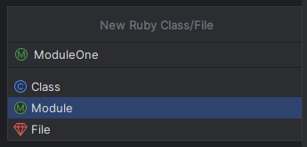
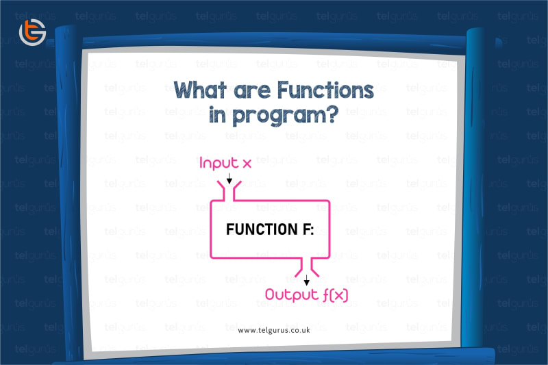
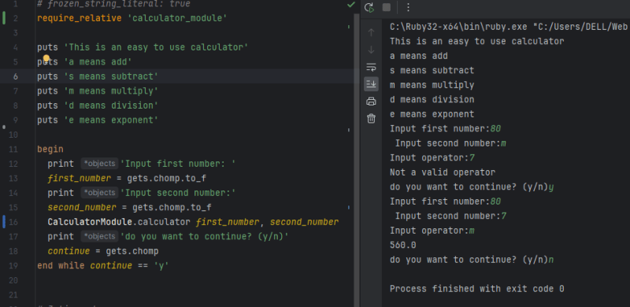

В сегодняшней статье мы рассмотрим, как создавать и вызывать методы или функции в Ruby на решенном примере.

## Модули в Ruby

Я пришел из JavaScript и React. Вы можете думать о модулях в Ruby так же, как о компонентах в React: независимые и многократно используемые куски кода. В случае с модулями они хранятся в отдельном файле от основного используемого файла. В модуле можно хранить метод или функцию, которая может быть вызвана или использована несколько раз в вашем скрипте.  
Это помогает создать более чистую и понятную кодовую базу.

## Как создавать модули в Ruby

Как было описано ранее, модули хранятся в отдельном файле от основного файла кода.  
В RubyMine по


модули отличаются от обычных рубиновых файлов наличием символа ‘M’. Хотя файлы ruby и модули заканчиваются расширением файла, в RubyMine их можно отличить визуально.



Модули инициализируются ключевым словом `module`, за которым следует название модуля, написанное заглавными буквами, и закрываются оператором `end`.

`module ModuleA end`

Теперь вы можете перейти к определению функций или сообщений, которые вы хотите сохранить в модуле между определением модуля и оператором `end`.

```ruby
module ModuleA MESSAGE = 'This is a module!!!'
def ModuleA.exponent(num1, num2) num1 ** num2 end
end
```

О методах и функциях мы поговорим позже.

Как получить доступ к модулю в файле Ruby

Существуют различные методы доступа к содержимому модуля в файле Ruby.

Использование ключевого слова `require`: В верхней части вашего Ruby-файла вы используете `require` с относительным путем к файлу модуля для доступа к нему.  
`require './modules/module_a'`.
Расширение не является обязательным.

Использование ключевого слова require `require_relative`: В верхней части вашего Ruby-файла вы используете `require_relative` с именем файла модуля.  
`require_relative 'module_a'`

Использование глобальной переменной `$LOAD_PATH`: В верхней части файла Ruby вы используете переменную `$LOAD_PATH` вместе с ключевым словом `require`, чтобы указать путь, по которому находится файл модуля.

`$LOAD_PATH << '.' require 'module_a.rb'`

## Блоки в Ruby

Из этой статьи,
Блок похож на метод в Ruby. В отличие от некоторых методов, которые состоят из имени, с блоками нам не нужно писать имя, и мы всегда переходим к вызову метода. Блоки - это удобная и мощная функция в Ruby, и мы можем использовать их где угодно. Блоки - это анонимные фрагменты кода, которые принимают входные данные от аргументов и возвращают значение.

### Методы и функции в Ruby



Согласно Википедии,

В компьютерном программировании функция или подпрограмма - это последовательность программных инструкций, выполняющих определённую задачу, упакованная как единое целое. Эта единица может быть использована в программах везде, где необходимо выполнить эту конкретную задачу.

Другими словами, это означает, что функция или метод в Ruby - это ”контейнер”, состоящий из одной или нескольких строк кода, направленных на выполнение определенной задачи или цели.

## Типы методов в Ruby

Именованные методы: эти типы методов или функций инициализируются ключевым словом `def` и закрываются ключевым словом `end`.

```ruby
def this_is_a_function 5+5 end
#вызов метода
this_is_a_function #output=> 10
```

_Чтобы вывести или использовать именованные методы, мы вызываем его вне области видимости метода._

Методы с параметрами: они похожи на именованные функции, только у них есть параметры. Параметры заключаются в круглые скобки после имени функции.

```ruby
def parameter_method(num1, num2) num1 + num2 end
#method call
parameter_method(5, 6) #output=> 11
```

Параметры похожи на переменные тем, что хранят значение. Эти значения называются аргументами и передаются при вызове метода.

Методы с параметрами по умолчанию: В этом типе определения метода значения присваиваются параметрам по умолчанию, чтобы избежать ошибки при вызове метода без указания аргументов.

```ruby
def parameter_method(num1 = 5, num2 = 5) num1 + num2 end #method call
parameter_method()
#output=> 11
```

Мы видим, что в приведенном выше вызове метода мы не задавали значения параметрам, потому что им уже было присвоено значение по умолчанию. Мы можем прекрасно выполнить этот код безбез возникновения ошибок. Эти значения по умолчанию всегда можно переопределить при вызове метода, присвоив значения параметрам.

Аргументы с ключевыми словами Допустим, у нас есть метод:

```ruby
def greetings(salutation, name) puts "#{salutation}, меня зовут #{name}." end
#method call
greetings("Hello", "Dumebi")
#output=>"Hello, my name is Dumebi."

```

А теперь представьте ситуацию, когда разработчику пришлось вызывать этот метод гораздо позже в кодовой базе и он забыл, в каком порядке были расположены параметры: `'приветствие'',`’имя’' или наоборот. А для такого метода, как этот, порядок имеет большое значение, чтобы утверждение имело смысл.  
Чтобы предотвратить подобные случаи, в Ruby есть способ зафиксировать параметры, чтобы они отображались в том порядке, в котором они были записаны.

```ruby
def greetings(salutaion:, name:) puts "#{salutation}, my name is #{name}." end
#method call
greetings(name: 'Dumebi', salutation: 'Hello')
#output=>"Hello, my name is Dumebi."
```

В приведенном примере мы видим, что порядок не имеет значения, лишь бы каждому ключу соответствовала пара значений. Мы также можем дать параметрам ключевого слова аргументы по умолчанию
`parameter_method(salutation: 'Hello', name: 'Dumebi')`

Лямбда-функции в Ruby: они эквивалентны анонимным функциям в JavaScript. Это методы без имени, которые обозначаются ключевым словом `lambda`.

`lambda {|x| puts x * 8}.call(8)`.

Лямбда-методы хранятся в блоках.  
Метод `.call()` используется для вызова лямбда-функций или анонимных функций.  
Анонимные функции могут храниться в переменной и обозначаются `стрелкой`.

`square = -> (x) { puts x * x}.call(8)`

## Практический пример

В этом решенном примере мы создадим простой калькулятор на Ruby.

## Построение простого калькулятора в Ruby

В этом решении мы объединим все, чему научились до сих пор в Ruby, и используем методы.

### Шаг 1

Сначала мы определим, как работает калькулятор для наших пользователей.

```ruby
puts 'Это простой в использовании калькулятор' puts 'a означает сложение' puts 's означает вычитание' puts 'm означает умножение' puts 'd означает деление' puts 'e означает экспоненту'
```

### Шаг 2

Создадим модуль и определим в нем нашу функцию или метод.

```ruby
module CalculatorModule MESSAGE = 'This is a calculator module' def CalculatorModule.calculator(first_number, second_number) print 'Input operator:' operator = gets.chomp result = case (operator) when 'a' then puts first_number + second_number when 's' then puts first_number - second_number when 'm' then puts first_number * second_number when 'd' then puts first_number / second_number when 'e' then puts first_number ** second_number else puts 'Not a valid operator' end end
```

### Шаг 3

Вернувшись в наш основной файл Ruby, мы продолжим собирать все воедино.  
Теперь, поскольку мы не хотим, чтобы наш метод калькулятора выполнялся только один раз, и хотим дать пользователю возможность выйти по своему желанию, мы включим это в нашу отделку, заключив наш код в блок `begin...end while`.

```ruby
begin print 'Введите первое число:' first_number = gets.chomp.to_f print 'Введите второе число:' second_number = gets.chomp.to_f CalculatorModule.calculator first_number, second_number print 'Вы хотите продолжить? (y/n)' continue = gets.chomp end while continue == 'y'
```

Полный файл будет выглядеть так:

```ruby
require_relative 'calculator_module' puts 'Это простой в использовании калькулятор' puts 'a означает сложение' puts 's означает вычитание' puts 'm означает умножение' puts 'd означает деление' puts 'e означает экспоненту' begin print 'Введите первое число: ' first_number = gets.chomp.to_f print 'Введите второе число:' second_number = gets.chomp.to_f CalculatorModule.calculator first_number, second_number print 'Вы хотите продолжить? (y/n)' continue = gets.chomp end while continue == 'y'
```



Это все для сегодняшней статьи.
