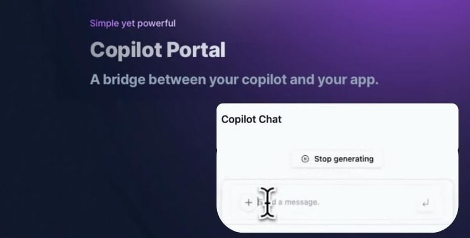
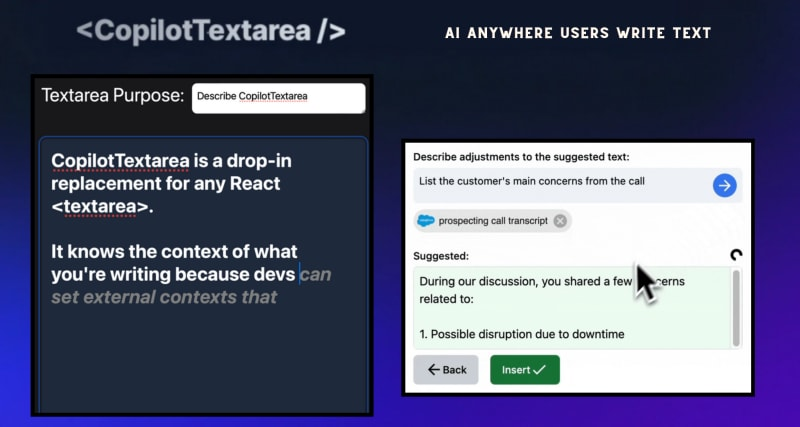
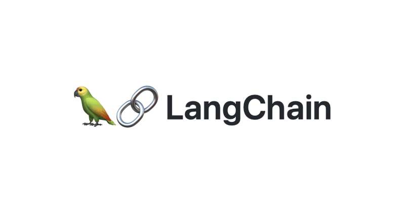
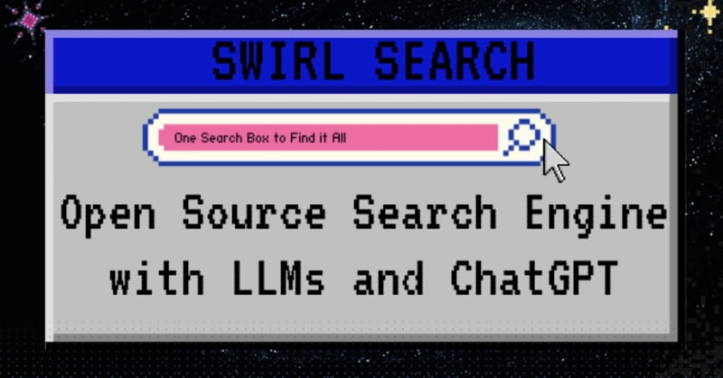

TL;DR

Список лучших простых в построении интеграций AI-продуктов.

Они могут придать вашему проекту магическую силу, так что не забудьте выразить им поддержку 🌟

А теперь давайте отправимся на дорогу ИИ 👨‍🌾.


## 1. CopilotPortal: Внедрите чатбота LLM в ваше приложение



Контекстно-ориентированный LLM-чатбот внутри вашего приложения, который отвечает на вопросы и выполняет действия.

Получите работающий чат-бот с помощью нескольких строк кода, а затем настраивайте и внедряйте его так глубоко, как вам нужно.

```js
import "@copilotkit/react-ui/styles.css";
import { CopilotProvider } from "@copilotkit/react-core";
import { CopilotSidebarUIProvider } from "@copilotkit/react-ui";

export default function App(): JSX.Element {
  return (
    <CopilotProvider chatApiEndpoint="/api/copilotkit/chat">
      <CopilotSidebarUIProvider>
        <YourContent />
      </CopilotSidebarUIProvider>
    </CopilotProvider>
  );
}
```

## 2. LinguiJS - автоматическая и простая интернационализация


Простая и мощная библиотека интернационализации с открытым исходным кодом.

Легко интегрируемый фреймворк для создания многоязычных реактивных приложений.

```js
import { Trans } from '@lingui/macro';

function App() {
	return (
		<Trans id="msg.docs">
			Читайте <a href="https://lingui.dev">документацию</a> для получения дополнительной информации.
		</Trans>
	);
}
```

## 3. Pezzo.ai - наблюдаемость, стоимость и оперативность инженерной платформы


Централизованная платформа для управления вашими вызовами OpenAI.

Оптимизируйте ваши подсказки и использование токенов. Следите за использованием искусственного интеллекта.

Бесплатно и легко интегрируется.

```js
const prompt = await pezzo.getPrompt('AnalyzeSentiment');
const response = await openai.chat.completions.create(prompt);
```

## 4. CopilotTextarea - написание текста с помощью искусственного интеллекта в приложениях React



Замена для любого react `<textarea>` с возможностями Github CopilotX.

Автозавершение, вставка, редактирование.

Может получать любой контекст в реальном времени или от разработчика заранее.

```js
import { CopilotTextarea } from '@copilotkit/react-textarea';
import { CopilotProvider } from '@copilotkit/react-core';

// Remove comments and unused imports
// Standardize variable names
// Improve readability by adding proper indentation
// Remove debugging statements
function MyComponent() {
	return (
		<CopilotProvider>
			<CopilotTextarea />
		</CopilotProvider>
	);
}
```

## 5. LangChain - собирает AI в цепочки



Простой в использовании API и библиотека для добавления LLM в приложения.

Свяжите вместе различные компоненты и модели ИИ.

Легко встраивайте контекст и семантические данные для мощных интеграций.

## 6. SwirlSearch - поиск с использованием искусственного интеллекта



Поиск на основе LLM, резюме и вывод.

Одновременный поиск по нескольким источникам контента в интегрированном виде.

Мощный инструмент для индивидуальной интеграции различных источников данных в приложении.

## 7. ReactAgent - экспериментальный LLM-агент для генерации компонентов react из пользовательских историй


Экспериментальный инструмент, использующий GPT-4 для превращения пользовательских историй в работающие компоненты React.

Вводим в него локальные дизайны, чтобы добиться последовательного вывода и языка дизайна.

Спасибо всем!
