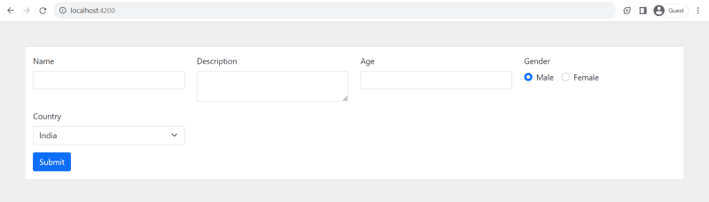

Angular - это мощный и популярный фронтенд-фреймворк, позволяющий разработчикам создавать динамичные и интерактивные веб-приложения. Одной из ключевых особенностей Angular является его способность беспрепятственно обрабатывать модули. В этой статье мы рассмотрим концепцию динамических форм в Angular и узнаем, как можно использовать JSON для создания динамических и гибких форм.

## Что такое динамические формы?

Динамические формы в Angular - это формы, которые генерируются динамически во время выполнения на основе определенных условий или данных. В отличие от статических форм, где структура предопределена в HTML, динамические формы более гибкие и могут адаптироваться к изменяющимся требованиям. Это особенно полезно в сценариях, где структура формы должна определяться динамически на основе пользовательского ввода, ответов API или других динамических источников данных.

## Создание простой динамической формы

Давайте рассмотрим базовый пример создания динамической формы с помощью Angular и JSON.

## Шаг 1: Настройте проект Angular

Предполагая, что у вас установлен Angular CLI, создайте новый проект Angular:

`ng new dynamic-forms cd dynamic-forms`.

## Шаг 2: Установка необходимых зависимостей

Установите модуль Angular Reactive Forms, который будет использоваться для создания и управления динамическими формами:

`ng generate module dynamic-form`.

## Шаг 3: Определите интерфейс

Создайте файл `form.interface.ts` для определения структуры интерфейса вашей динамической формы:

```js
export interface IFormStructure {
  type: string;
  label: string;
  name: string;
  value: string | number | boolean;
  options?: { label: string; value: number | string | boolean }[];
  validations?: { name: string; validator: string; message: string }[];
}
```

## Шаг 4: Определите структуру формы в JSON

Создайте файл `form-config.ts` для определения структуры вашей динамической формы:

```js
import { IFormStructure } from './form.interface';

export const formConfig: IFormStructure[] = [
  {
    type: 'text',
    label: 'Name',
    name: 'name',
    value: '',
    validations: [
      {
        name: 'required',
        validator: 'required',
        message: 'Name is required',
      },
    ],
  },
  {
    type: 'textarea',
    label: 'Description',
    name: 'description',
    value: '',
    validations: [
      {
        name: 'required',
        validator: 'required',
        message: 'Description is required',
      },
    ],
  },
  {
    type: 'number',
    label: 'Age',
    name: 'age',
    value: '',
    validations: [],
  },
  {
    type: 'radio',
    label: 'Gender',
    name: 'gender',
    value: true,
    options: [
      {
        label: 'Male',
        value: true,
      },
      {
        label: 'Female',
        value: false,
      },
    ],
    validations: [],
  },
  {
    type: 'select',
    label: 'Country',
    name: 'country',
    value: 1,
    options: [
      {
        label: 'India',
        value: 1,
      },
      {
        label: 'USA',
        value: 2,
      },
      {
        label: 'Canada',
        value: 3,
      },
    ],
    validations: [
      {
        name: 'required',
        validator: 'required',
        message: 'Address is required',
      },
    ],
  },
];
```

## Шаг 5: Создание компонента динамической формы

Создайте новый компонент для работы с динамической формой:

`ng generate component dynamic-form`.

## Шаг 6: Динамическая генерация формы

Обновите файл `dynamic-form.component.ts`, чтобы динамически генерировать форму на основе конфигурации JSON:

```js
import { Component, OnInit } from '@angular/core';
import { FormBuilder, FormGroup, Validators } from '@angular/forms';
import { IFormStructure } from './form.interface';
import { formConfig } from './form-config';

@Component({
  selector: 'app-dynamic-form',
  templateUrl: './dynamic-form.component.html',
  styleUrls: ['./dynamic-form.component.scss'],
})
export class DynamicFormComponent implements OnInit {
  formStructure: IFormStructure[] = formConfig;
  dynamicForm: FormGroup = this.fb.group({});

  constructor(private fb: FormBuilder) {}

  ngOnInit() {
    this.buildForm();
  }

  private buildForm() {
    const formGroup: Record<string, any> = {};
    this.formStructure.forEach((control) => {
      const controlValidators: Validators[] = [];
      if (control.validations) {
        control.validations.forEach((validation) => {
          if (validation.validator === 'required') {
            controlValidators.push(Validators.required);
          }
          if (validation.validator === 'email') {
            controlValidators.push(Validators.email);
          }
          // Add additional built-in validators as needed
        });
      }
      formGroup[control.name] = [control.value || '', controlValidators];
    });
    this.dynamicForm = this.fb.group(formGroup);
  }

  getErrorMessage(control: any) {
    const formControl = this.dynamicForm.get(control.name);
    if (!formControl) {
      return '';
    }
    for (let validation of control.validations) {
      if (formControl.hasError(validation.name)) {
        return validation.message;
      }
    }
    return '';
  }

  onSubmit() {
    if (!this.dynamicForm.valid) {
      this.dynamicForm.markAllAsTouched();
      return;
    }
    console.log(this.dynamicForm.value);
  }
}
```

## Шаг 7: Импортируйте `bootstrap.css` в файл `style.css/scss`

`@import "https://cdn.jsdelivr.net/npm/bootstrap@5.0.2/dist/css/bootstrap.min.css";`

## Шаг 8: Отображение формы в шаблоне

Обновите файл `dynamic-form.component.html`, чтобы отобразить динамическую форму:

```js
<div class="card">
  <div class="card-body">
    <form [formGroup]="form" (ngSubmit)="onSubmit()">
      <div class="row">
        <div *ngFor="let control of formStructure" class="col-3">
          <!-- Text, Textarea & Number -->
          <div class="mb-3" *ngIf="textTypes.includes(control.type)">
            <label for="exampleFormControlInput1" class="form-label">{{ control.label }}</label>
            <input [type]="control.type" class="form-control" [formControlName]="control.name" *ngIf="control.type !== 'textarea'" />
            <textarea class="form-control" [formControlName]="control.name" *ngIf="control.type === 'textarea'"></textarea>
            <span class="error" *ngIf="form.controls[control.name]?.invalid && form.controls[control.name]?.touched">{{ getErrorMessage(control) }}</span>
          </div>

          <!-- Radio button -->
          <div class="mb-3" *ngIf="radioTypes.includes(control.type)">
            <div>
              <label for="exampleFormControlInput1" class="form-label">{{ control.label }}</label>
            </div>
            <div class="form-check form-check-inline" *ngFor="let option of control.options">
              <input class="form-check-input" type="radio" [formControlName]="control.name" id="inlineRadio1" [value]="option.value" />
              <label class="form-check-label" for="inlineRadio1">{{ option.label }}</label>
            </div>
          </div>

          <!-- Select -->
          <div class="mb-3" *ngIf="selectTypes.includes(control.type)">
            <label for="exampleFormControlInput1" class="form-label">{{ control.label }}</label>
            <select class="form-select" aria-label="Пример выбора по умолчанию" [formControlName]="control.name">
              <option selected>-Select-</option>
              <option *ngFor="let option of control.options" [value]="option.value">{{ option.label }}</option>
            </select>
            <span class="error" *ngIf="form.controls[control.name]?.invalid && form.controls[control.name]?.touched">{{ getErrorMessage(control) }}</span>
          </div>
        </div>
      </div>
      <button type="submit" class="btn btn-primary">Submit</button>
    </form>
  </div>
</div>
```

## Шаг 9: Интеграция компонента динамической формы

Интегрируйте DynamicFormComponent в ваше основное приложение, добавив его в файл `app.component.html` или в любое другое удобное место.

`<app-dynamic-form></app-dynamic-form>`

## Шаг 10: Запустите ваше приложение Angular

Запустите ваше приложение Angular, чтобы увидеть динамически созданную форму в действии:

`ng serve`

Посетите `http://localhost:4200/` в браузере, чтобы взаимодействовать с динамической формой.

Вывод



## Заключение

В этой статье мы рассмотрели концепцию динамических форм в Angular и то, как можно использовать JSON для определения структуры этих форм. Используя Angular Reactive Forms и динамически генерируя элементы управления формой на основе конфигурации JSON, разработчики могут создавать гибкие и адаптивные формы, отвечающие различным требованиям. Такой подход повышает удобство обслуживания и упрощает работу с динамическими формами в приложениях Angular.
